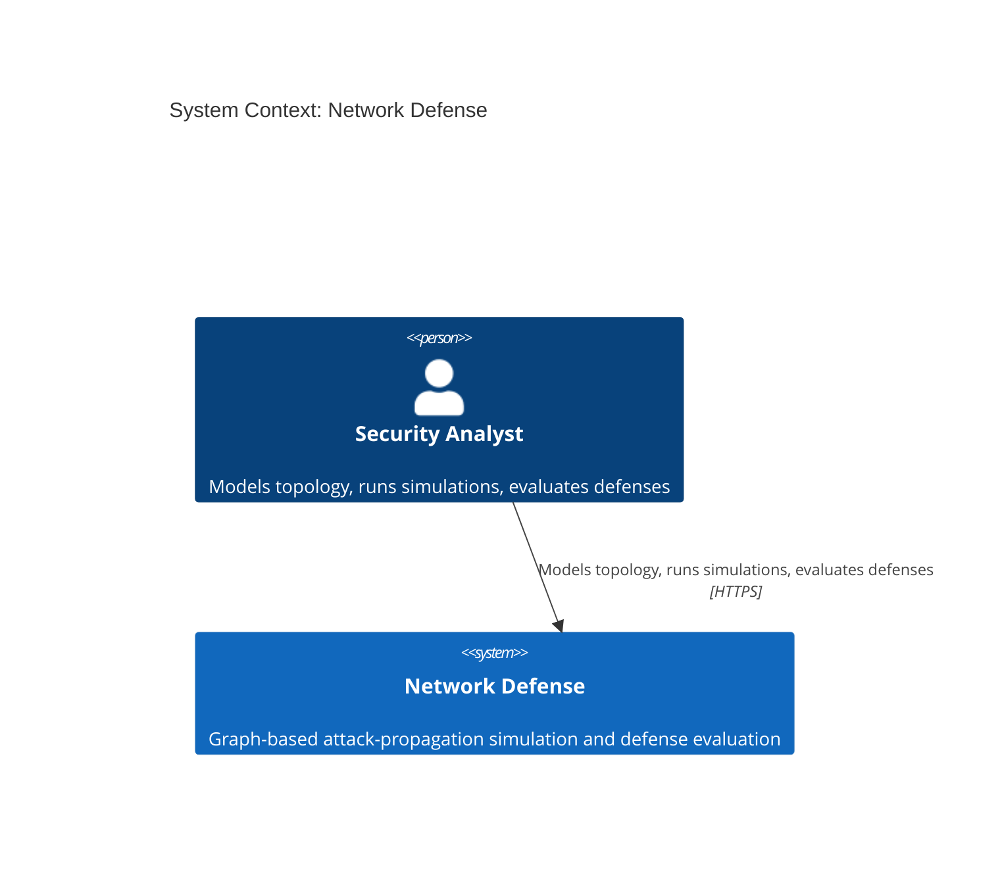
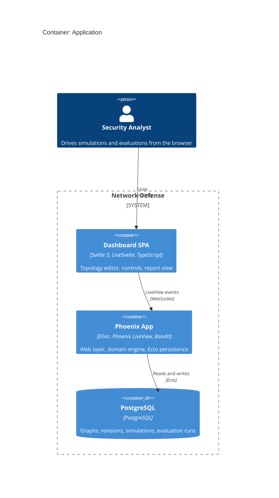
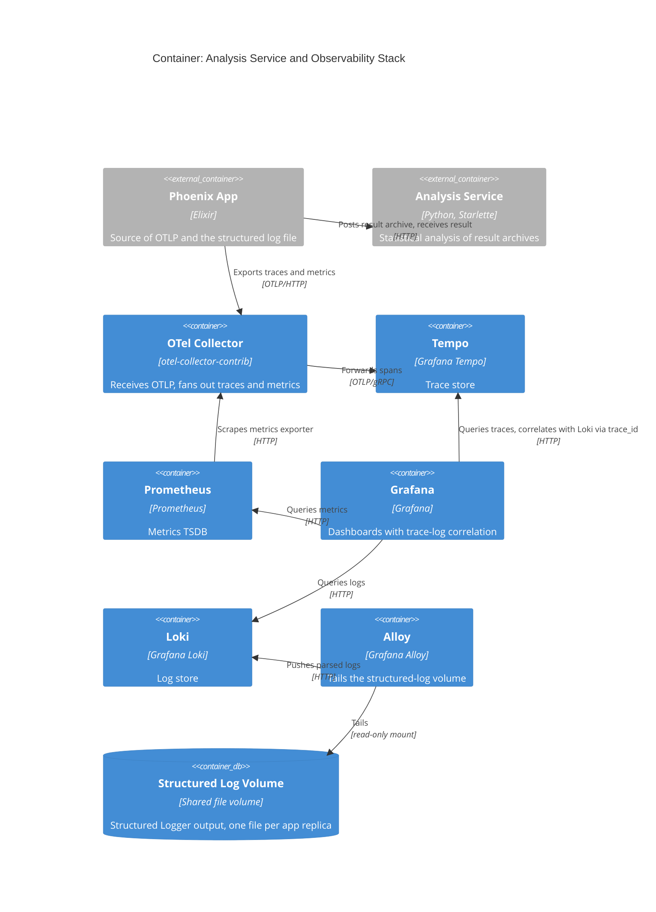
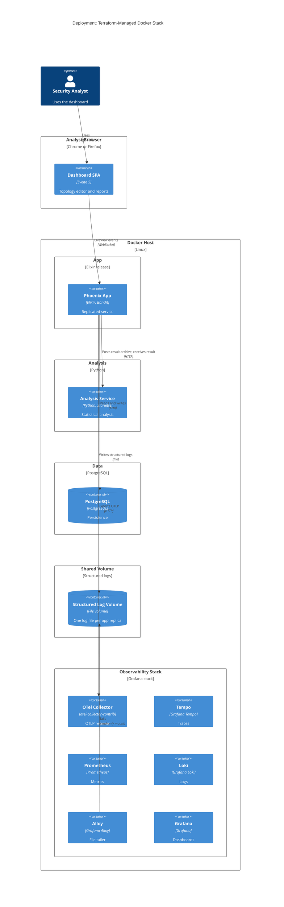

# Architecture

This page describes the current system architecture with the C4 model. It uses
Mermaid diagrams. Element aliases stay consistent across diagrams so the same
node resolves from one level to the next.

Container ports, image tags, and versions live in Terraform and Docker
configuration. The prose points to those files instead of restating values
(see [infrastructure.md](infrastructure.md) and the modules listed there).

## Level 1: System Context

NVD ingestion is deferred and no runtime fetch occurs (see
[scope.md](concepts/scope.md)). The built-in catalog contains synthetic entries.
The baseline scenario can also use a reviewed static NVD subset. Both sources
are local data. The system has no runtime network dependency on an external
vulnerability source.

## Level 2: Container, Application

The application is a single OTP application
([`src/lib/network_defense/application.ex`](../src/lib/network_defense/application.ex)).
It hosts the Phoenix web layer, the domain engine (graph, simulation,
defense, evaluation), and Ecto persistence. Svelte 5 renders through
LiveSvelte. The browser talks to the LiveView over a WebSocket.

### Backend-to-frontend contract generation

The frontend gets its data model from the backend. Backend contract types are
the single source; `mix gen.contracts`
([`src/lib/mix/tasks/gen.contracts.ex`](../src/lib/mix/tasks/gen.contracts.ex))
parses their typespecs and writes generated TypeScript to
`src/assets/svelte/contracts.generated.ts`. Svelte components import those
generated types. This keeps the frontend types in sync with the backend.

## Level 2: Container, Analysis Service and Observability Stack

Statistical analysis runs in a separate local Python service. The app hands a
completed evaluation result archive to it over HTTP and receives a result
archive back. Analysis follows a completed evaluation or export; it is a
follow-on step, not part of the run itself. The detailed methods are described
in the [analysis README](../evaluation/analysis/README.md), not here.

The observability services store telemetry. Traces and metrics leave the app
by OTLP through the collector. Logs bypass the collector: Alloy tails the
shared structured-log volume and pushes parsed logs to Loki, which keeps
compile noise out of Loki (see the Alloy configuration in
`infra/modules/local/observability/config`). Grafana correlates traces with
logs.

## Deployment

The system runs as a Terraform-managed Docker stack. The stack shows a
production-like placement: a replicated app service, the database, the Python
analysis service, the observability services, and the shared structured-log
volume.

The setup applies in development. In production, a one-shot migration job runs
`/app/bin/migrate` before the app starts instead of the development setup step.

The app service scales by configured replicas; each replica writes its own
structured log file to the shared application-log volume, and Alloy tails that
directory. The replication count and other sizes are Terraform inputs in
`infra/environments/local`.

## Engineering rationale

The reasons below cover only non-obvious boundaries.

- **One application.** A single OTP app hosts the web layer, the domain
  engine, and Ecto persistence. The domain shares LiveView context and read
  models with no separate service boundary.
- **Separate analysis service.** Statistical analysis is heavy numeric work
  with its own toolchain. A separate Python service keeps that toolchain out
  of the Elixir release and isolates its failure mode from the app.
- **Logs by file tail.** Logs bypass the collector and reach Loki through Alloy
  tailing the shared volume. This keeps framework banners and compile noise
  out of Loki and keeps the app log-write path simple.
