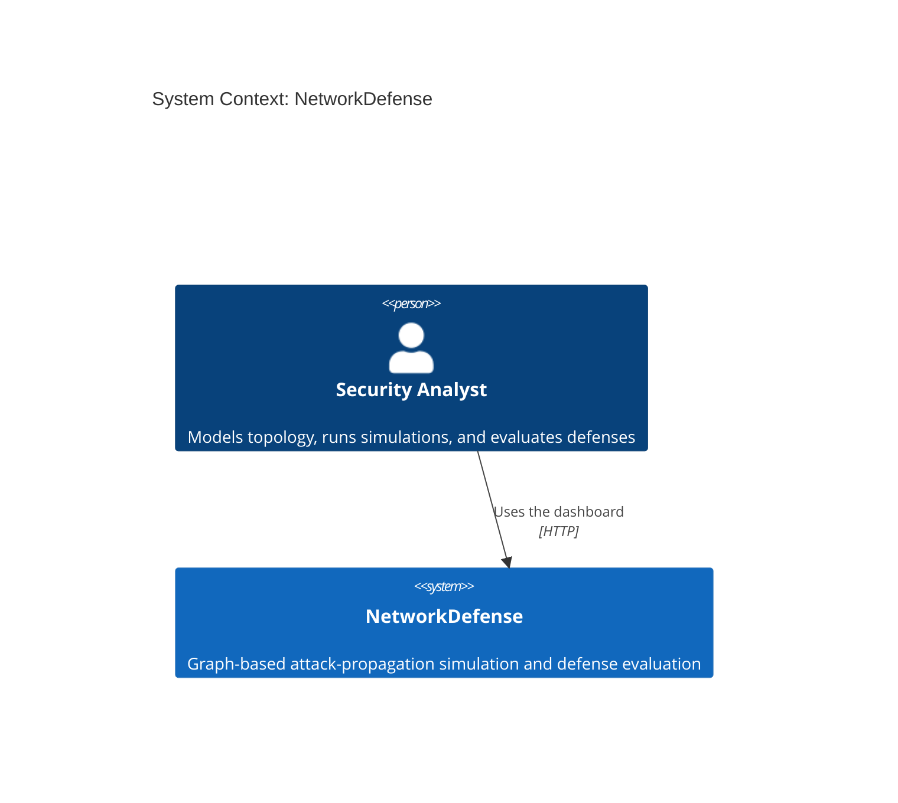
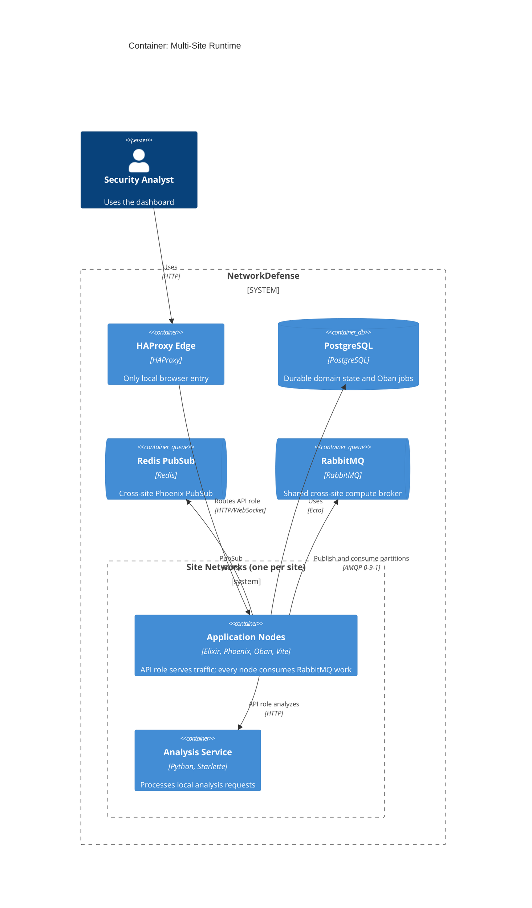
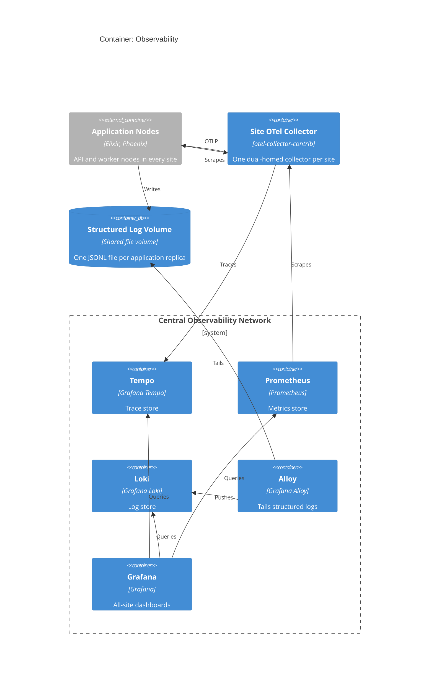
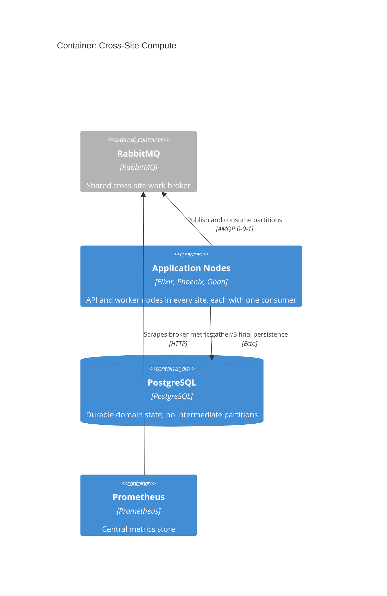

# Architecture

This page describes the current local simulator with C4 views. Terraform is the
source of truth for configurable ports, images, and sizes. See
[infrastructure.md](infrastructure.md) and `infra/environments/local`.

## Level 1: System Context

NVD ingestion is deferred and no runtime fetch occurs (see
[scope.md](concepts/scope.md)). The built-in catalog contains synthetic entries.
The baseline scenario can also use a reviewed static NVD subset. Both sources
are local data. The system has no runtime network dependency on an external
vulnerability source.

## Level 2: Container, Multi-Site Runtime

Each configured site runs the same OTP application in two roles. Replica zero
is an API node. It serves Phoenix, LiveView, and Vite traffic. Other replicas
are worker nodes and receive no browser route. Every node consumes RabbitMQ
scatter-gather work. HAProxy is the only local browser entry and routes traffic
to ready API nodes in every site.

Each site has its own Docker network and Erlang cookie. DNS discovery therefore
forms a BEAM mesh only inside that site. Redis carries Phoenix PubSub broadcasts
between sites. PostgreSQL stores durable state and Oban jobs. RabbitMQ carries
cross-site scatter-gather work and results.

### Backend-to-frontend contract generation

The frontend gets its data model from the backend. Backend contract types are
the single source; `mix gen.contracts`
([`src/lib/mix/tasks/gen.contracts.ex`](../src/lib/mix/tasks/gen.contracts.ex))
parses their typespecs and writes two generated TypeScript outputs:

- `src/assets/svelte/contracts.generated.ts`, one module holding every
  generated type;
- `src/assets/svelte/contracts.generated/`, alias modules that re-export those
  types per namespace.

Svelte components import from the alias modules, not from the generated root
module. This keeps the frontend types in sync with the backend.

## Level 2: Container, Observability

Each site collector receives OTLP from its site application nodes and scrapes
their metrics endpoints. The collector exports traces to Tempo and exposes
metrics for central Prometheus. Application logs bypass the collector. Alloy
tails the shared structured-log volume and pushes parsed logs to Loki. Grafana
queries all three stores and correlates traces with logs.

## Deployment

Terraform creates the local Docker stack. The deployment view expands the
checked-in two-site configuration. HAProxy and shared services attach to the
site networks that they need. Each collector also joins the central
observability network.

```mermaid
C4Deployment
  title Deployment: Local Two-Site Docker Stack

  UpdateLayoutConfig($c4ShapeInRow="3", $c4BoundaryInRow="1")

  Person(securityAnalyst, "Security Analyst", "Uses the dashboard")

  Deployment_Node(host, "Local Docker Host", "Linux") {
    Deployment_Node(edge, "Edge", "Docker container") {
      Container(haproxy, "HAProxy Edge", "HAProxy", "Browser entry")
    }
    Deployment_Node(siteWest, "site-west network", "Docker network") {
      Container(westApi, "API Application Node", "Elixir, Phoenix LiveView, Vite", "API role")
      Container(westWorker, "Worker Application Node", "Elixir, Phoenix, Oban", "Worker role")
      Container(westAnalysis, "Analysis Service", "Python, Starlette", "Site-local analysis")
      Container(westCollector, "Site OTel Collector", "otel-collector-contrib", "Site and observability networks")
    }
    Deployment_Node(siteEast, "site-east network", "Docker network") {
      Container(eastApi, "API Application Node", "Elixir, Phoenix LiveView, Vite", "API role")
      Container(eastWorker, "Worker Application Node", "Elixir, Phoenix, Oban", "Worker role")
      Container(eastAnalysis, "Analysis Service", "Python, Starlette", "Site-local analysis")
      Container(eastCollector, "Site OTel Collector", "otel-collector-contrib", "Site and observability networks")
    }
    Deployment_Node(shared, "Shared Containers", "Docker containers") {
      ContainerDb(postgres, "PostgreSQL", "PostgreSQL", "Durable state and Oban jobs")
      ContainerQueue(redis, "Redis PubSub", "Redis", "Cross-site broadcasts")
    }
    Deployment_Node(logs, "Shared Log Volume", "Docker volume") {
      ContainerDb(jsonlLogs, "Structured Log Volume", "File volume", "Per-replica JSONL logs")
    }
    Deployment_Node(observability, "Observability Network", "Docker network") {
      Container(tempo, "Tempo", "Grafana Tempo", "Traces")
      Container(prometheus, "Prometheus", "Prometheus", "Metrics")
      Container(loki, "Loki", "Grafana Loki", "Logs")
      Container(alloy, "Alloy", "Grafana Alloy", "Log tailer")
      Container(grafana, "Grafana", "Grafana", "Dashboards")
      Container(supportServices, "Support Services", "pgAdmin and exporters", "Database administration and infrastructure metrics")
    }
  }

  Rel(securityAnalyst, haproxy, "Uses", "HTTP")
  Rel(haproxy, westApi, "Routes")
  Rel(haproxy, eastApi, "Routes")
  Rel(westApi, postgres, "Uses")
  Rel(westWorker, postgres, "Uses")
  Rel(eastApi, postgres, "Uses")
  Rel(eastWorker, postgres, "Uses")
  Rel(westWorker, redis, "PubSub")
  Rel(eastWorker, redis, "PubSub")
  Rel(westApi, westAnalysis, "Analyzes")
  Rel(eastApi, eastAnalysis, "Analyzes")
  Rel(westApi, jsonlLogs, "Writes")
  Rel(westWorker, jsonlLogs, "Writes")
  Rel(eastApi, jsonlLogs, "Writes")
  Rel(eastWorker, jsonlLogs, "Writes")
  Rel(alloy, jsonlLogs, "Tails")

  UpdateRelStyle(haproxy, westApi, $offsetY="-20")
  UpdateRelStyle(haproxy, eastApi, $offsetY="20")
  UpdateRelStyle(westApi, postgres, $offsetY="-20")
  UpdateRelStyle(westWorker, postgres, $offsetY="20")
  UpdateRelStyle(eastApi, postgres, $offsetY="20")
  UpdateRelStyle(eastWorker, postgres, $offsetY="-20")
```

## Cross-Site Compute (RabbitMQ)

The scatter-gather executor distributes partitions across application nodes in
all site-local BEAM clusters. One shared RabbitMQ broker joins every site
network and the central observability network. It carries cross-site work
delivery and result transport.

Erlang distribution remains site-local. Application nodes connect only to the
shared broker and their site-local Erlang distribution mesh. No application node
joins another site's BEAM mesh.

The shared queue makes every connected consumer eligible. It does not guarantee
that a run uses every site. Durable coordinator recovery is future work. See
[the design page](design/rabbitmq-distributed-executor.md) for flow, failure
semantics, and security.

A task exit produces a compact terminal error. The worker acknowledges that
message. Only worker node, channel, or connection loss leaves work for broker
redelivery.

## Availability Limits

| Condition | Effect |
|---|---|
| One API node fails | HAProxy removes it after its readiness check fails. New connections use another ready API. Existing LiveViews reconnect. |
| One worker node fails | Remaining workers can claim new available jobs. The result of an interrupted job is not guaranteed. |
| One analysis service fails | Requests that reach its local API fail. The API stays ready. |
| Redis fails | APIs stay ready. Transient progress broadcasts can be lost and are not replayed. |
| PostgreSQL fails | APIs become unready. Durable state and Oban stop. |
| HAProxy fails | Browser traffic stops. The local stack has no edge redundancy. |

HAProxy uses no affinity and does not retry a backend request. The stack has no
automatic interrupted-job recovery policy.

## Engineering Rationale

- **One application.** Every API and worker node runs the same OTP application.
  Roles separate browser traffic from workload execution without a new service
  boundary.
- **Site-local BEAM meshes.** Separate site networks and cookies contain Erlang
  distribution. Redis provides only cross-site Phoenix PubSub.
- **Separate analysis service.** Statistical analysis uses a separate Python
  toolchain and fails independently from the API readiness check.
- **Logs by file tail.** Alloy reads the shared structured-log volume. This
  keeps framework output out of Loki and keeps the application log-write path
  simple.
