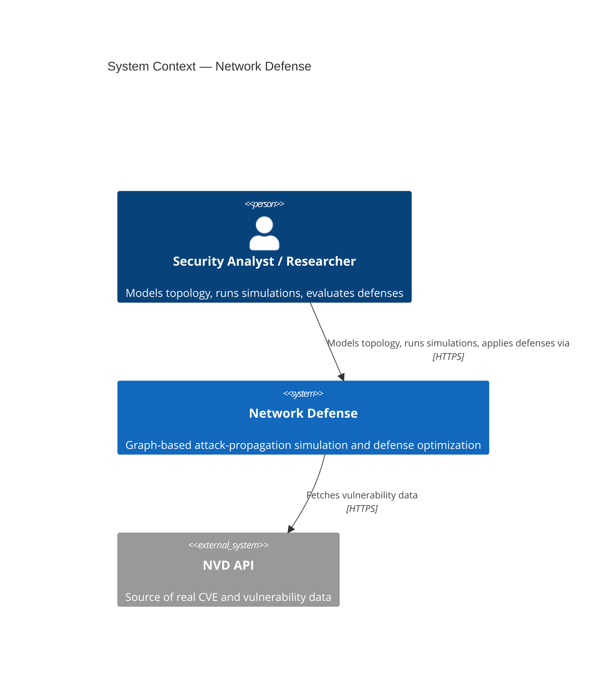
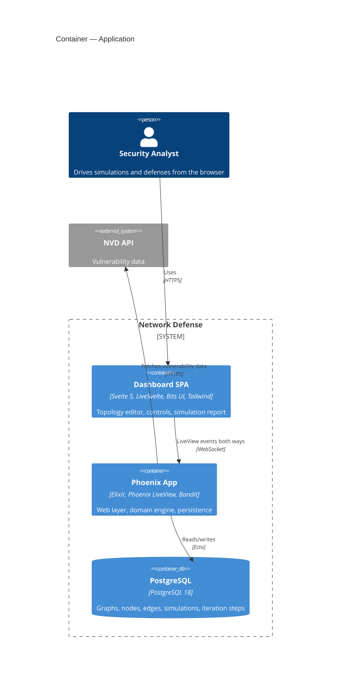
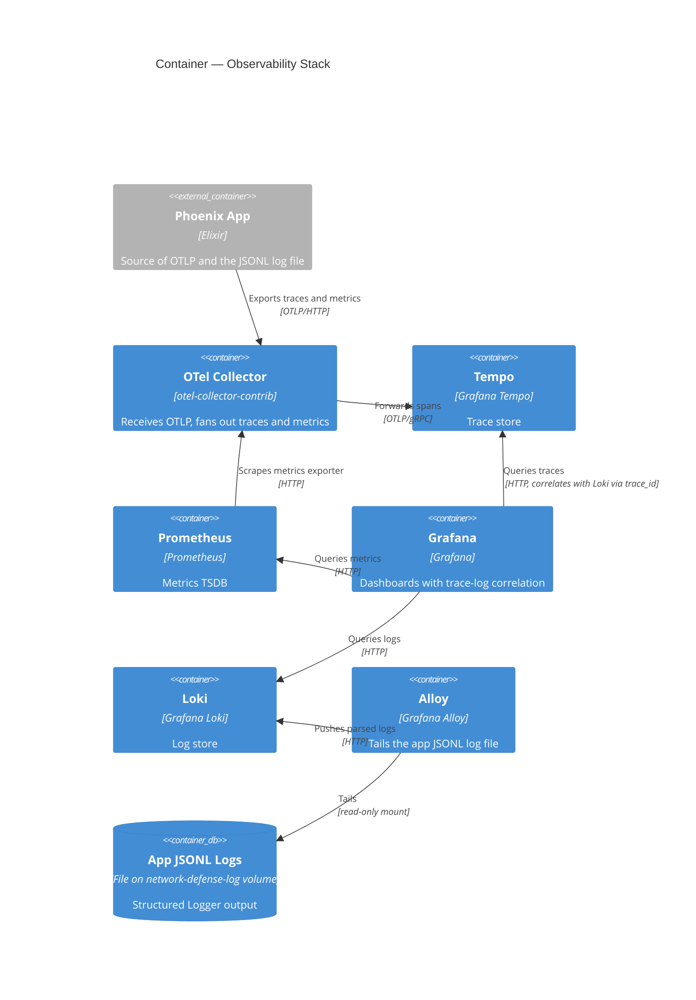
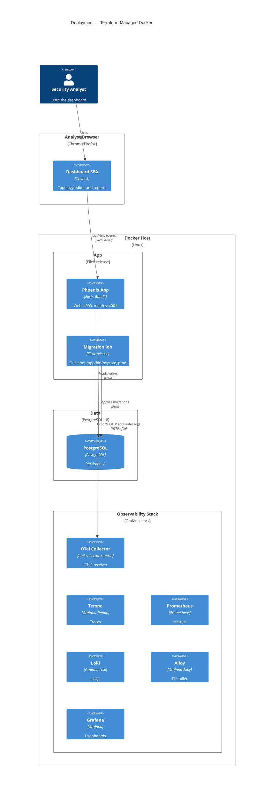
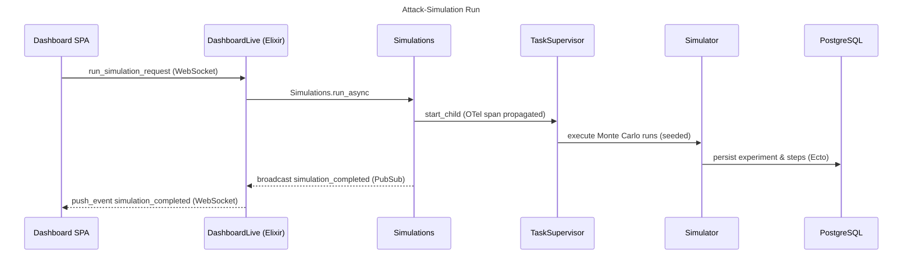
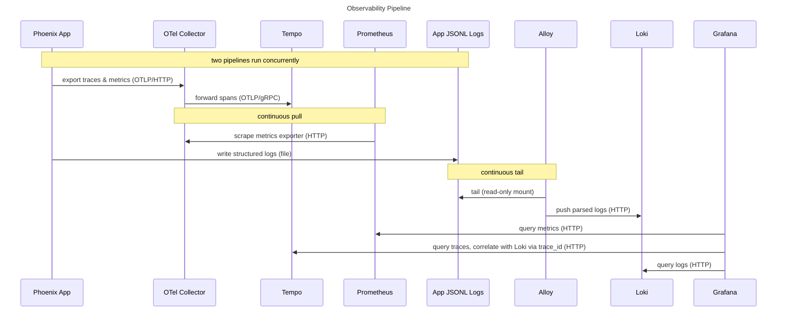

# Overview

System architecture described with the C4 model (Mermaid). Levels: System Context, two Container diagrams (application and observability), and Deployment. Two Mermaid sequence diagrams cover the flows a static topology cannot show — an attack-simulation run and the observability pipeline.

Element aliases stay consistent across diagrams so the same node resolves from one level to the next. Ports, image tags, and versions live in Terraform and Docker configuration; the prose points to them instead of restating values.

Flows use `sequenceDiagram` rather than `C4Dynamic`: the simulation run loops back through the same boxes, and the observability pipeline runs concurrently, both of which `C4Dynamic` renders with overlapping labels in Mermaid. Sequence diagrams handle returns and parallel notes without stacking.

## Level 1 — System Context

The analyst drives everything; NVD is the only external system the application depends on.

NVD integration is declared in the technology stack (see `README.md`); no fetcher client exists in `src/lib` yet, so this is the intended external dependency for real CVE data.

## Level 2 — Container, Application

The application boundary only. A single OTP application (`src/lib/network_defense/application.ex`) hosts the Phoenix web layer, the domain engine (graph, simulation, optimization), and Ecto persistence; Svelte 5 renders through LiveSvelte.

## Level 2 — Container, Observability Stack

The observability wiring in isolation. Traces and metrics leave the app by OTLP through the collector; logs bypass the collector and reach Loki via Alloy tailing the shared JSONL file, which keeps compile noise and framework banners out of Loki (see `infra/modules/local/observability/config/alloy-config.alloy` and `docs/infrastructure.md`). Grafana correlates traces with logs through `trace_id` structured metadata. `node-exporter`, `cadvisor`, and `postgres-exporter` are also scraped by Prometheus but omitted here as generic or peripheral infrastructure. The app's log-write path is shown in the Deployment and Observability Pipeline diagrams; here `jsonlLogs` is the file Alloy tails.

## Deployment

A Terraform-managed Docker deployment. Dev publishes everything to loopback, migrates and seeds before app startup, and backs secrets with files. Internal observability wiring, the shared log volume, and exporter scrape targets are shown in the Container — Observability diagram; here the stack is drawn only for placement with the app-to-stack feed.

## Flow — Attack-Simulation Run

The user triggers a run from the SPA; the LiveView accepts it, hands work to a supervised task that runs Monte Carlo iterations with propagated OTel context, persists results, and pushes a contract-validated completion event back over PubSub. See `dashboard_live.ex` and `Simulations.run_async/1`.

## Flow — Observability Pipeline

Two pipelines run concurrently: traces and metrics go OTLP through the collector; logs reach Loki via Alloy tailing the shared JSONL file. Grafana correlates traces with logs through `trace_id` structured metadata. Pull-based operations (Prometheus scraping, Alloy tailing) are continuous, noted below.

