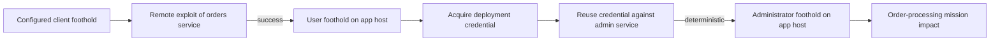

# Attack Simulation and Mission Impact

This page states the current model of attack propagation and mission impact. It
uses the canonical terms in [vocabulary.md](vocabulary.md). See
[model-example.md](model-example.md) for a concrete path under these rules.

## Configured initial foothold

An experiment declares one initial foothold node. The simulation starts with an
attacker state that holds that node as a foothold with user privilege. The
attacker model is identical for every trial; only the random seed differs per
trial. The declared foothold is validated at run time; an unknown node is
rejected.

The parameter contract and the configured default live in the simulation
parameter schema.

## Attacker state

The attacker state tracks four sets during one trial:

| Field | Meaning |
| --- | --- |
| Footholds | Hosts the attacker controls. |
| Credentials | Credentials the attacker owns. |
| Privileges | The privilege the attacker holds on each foothold. |
| Attempted actions | Past action attempts and their attempt counts. |

The state changes only through action execution:

- Exploitation success adds a foothold.
- Credential acquisition adds a credential.
- Credential reuse adds or upgrades a privilege on a foothold.
- Every selection records an attempted action, whether it succeeded or not.

### Privilege transitions

A privilege is one of `none`, `user`, or `administrator`. Privilege upgrades are
monotonic: a privilege never decreases. Adding a lower or equal privilege does
not change the current one.

| From | To | Allowed |
| --- | --- | --- |
| `none` | `user` | yes |
| `none` | `administrator` | yes |
| `user` | `administrator` | yes |
| `user` | `user` | no change |
| `administrator` | `user` | no, monotonic |
| `administrator` | `none` | no, monotonic |

The attacker state module stores the privilege on each foothold and exposes the
privilege checks rules use.

## Rules and actions

Four rules generate candidate actions. They collapse into three action types.

| Rule | Action produced | Conditions | Effect |
| --- | --- | --- | --- |
| Remote service exploitation | `ExploitVulnerability` | Foothold on source host; directed reachability to a service the target host runs; the service has an applicable vulnerability; the attacker holds the required privilege. | Exploit success adds the target host as a foothold with the granted privilege. |
| Local vulnerability exploitation | `ExploitVulnerability` | Foothold on a host; the host itself carries an applicable vulnerability; the attacker holds the required privilege. | Exploit success upgrades the privilege on the same host. |
| Credential acquisition | `AcquireCredential` | Foothold on a host; the host stores a credential; the attacker holds the required privilege. | Adds the credential to the attacker's credentials. |
| Credential reuse | `ReuseCredential` | Foothold on a source host; directed reachability to a service; the attacker owns a credential that authenticates to that service. | Adds the target host as a foothold with the granted privilege. |

Remote and local exploitation share the `ExploitVulnerability` action. Remote
exploitation targets a reachable service; local exploitation targets a
vulnerability present on the foothold host itself.

| Action | Produced by | Outcome probability | Effect |
| --- | --- | --- | --- |
| `ExploitVulnerability` | Remote and local exploitation | The vulnerability's stylized exploit probability | Add a foothold or upgrade a privilege. |
| `AcquireCredential` | Credential acquisition | Deterministic (probability `1`) | Add a credential. |
| `ReuseCredential` | Credential reuse | Deterministic (probability `1`) | Add or upgrade a privilege. |

Credential acquisition and reuse are deterministic. Only exploitation samples
its outcome. The sampling uses the vulnerability's stylized success probability,
which is a scenario parameter, not a measured exploit rate.

The protocol definitions for rules and actions decide conditions and effects.

## Simulation loop

Each trial runs this loop:

1. Build the eligible candidate actions by evaluating all four rules against the
   current attacker state.
2. If no candidate remains, stop the trial.
3. Choose one candidate uniformly at random.
4. Sample the chosen action's outcome against its probability.
5. If the sample exceeds the probability, the action fails and changes nothing.
6. If the sample is below or equal, apply the action's effect to the attacker
   state.
7. Record the attempted action whatever the outcome, then move to the next
   iteration.

The simulator does not estimate real-world exploit likelihood. It selects
uniformly from eligible actions and then samples the selected action's outcome.

### Stopping rules

An experiment declares an iteration limit and a maximum attempt count. The
default maximum attempt count is `1`. In each trial, the count applies per
distinct action. It is not rule-specific and no action has its own retry count.

A trial stops when either condition holds:

- the current iteration exceeds the iteration limit, or
- no eligible action remains for the current attacker state.

The maximum attempt count is stored with the experiment.

## Mission impact

At the end of a trial, each mission capability is either operational or
disrupted. A capability is disrupted when any of these conditions holds:

- a required flow is unavailable, so it no longer materializes;
- a required target host is compromised;
- the remaining uncompromised support hosts fall below the capability's
  minimum operational support.

Mission impact is the sum of the impact weights of the disrupted capabilities.
Blast radius is the number of compromised compute resources, a separate outcome.

The mission impact module computes the final status and impact from the graph
and the trial's footholds.

## Example progression

The shared example does not use local exploitation. It progresses through remote
exploitation and credential reuse only.

The state progression matches [model-example.md](model-example.md).

## Source references

Behavior at the attacker state, simulation loop, default rule set, and mission
impact is established in the simulation implementation:

- attacker state: `src/lib/network_defense/attacker_state/attacker_state.ex`;
- simulation loop and stopping rules:
  `src/lib/network_defense/simulation/simulator.ex`;
- configured initial foothold and default attempt count:
  `src/lib/network_defense/simulation/contracts/simulation_params.ex` and
  `src/lib/network_defense/simulation/experiment.ex`;
- default rule set and rule modules: `src/lib/network_defense/simulations.ex` and
  `src/lib/network_defense/rules/`;
- mission impact: `src/lib/network_defense/simulation/mission_impact.ex`.
