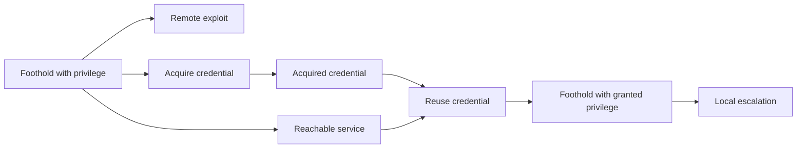

# Credential and Privilege Model Plan

Status: Approved implementation plan.

## Purpose

Model credential-based lateral movement and local privilege escalation in the pre-attack, monotonic simulator. The graph describes environment facts. The attacker state records acquired access.

## Graph Types

| Type | Direction | Data | Meaning |
|---|---|---|---|
| Credential node | — | `identifier`, `credential_type` | A non-secret reference to reusable credential material. |
| StoresCredential | Host → Credential | `required_privilege` | The host exposes the credential at the stated privilege. |
| AuthenticatesTo | Credential → Service | `granted_privilege` | The credential can authenticate to the service. |
| SegmentReachability | NetworkSegment → NetworkSegment | `protocol`, `port_start`, `port_end` | One allowed segment policy rule. |
| HasVulnerability | Service → Vulnerability | `required_privilege`, `granted_privilege` | A remote exploit. |
| HasVulnerability | Host → Vulnerability | `required_privilege`, `granted_privilege` | A local privilege escalation. |

`none < user < administrator` defines the privilege order. Credential nodes never contain passwords, keys, tokens, or hashes.

Reachability is segment policy, not authored host/service flows. `SegmentReachability` is the canonical, persisted edge. `NetworkReachability` is an empty, deterministic `Host -> Service` marker derived in memory by materialization; it is never authored or persisted. See `../plans/reachability-modeling.md`.

## Simulation

- Remote exploitation receives an already matching effective flow: materialization filters by protocol and port range against segment policy before the rule runs.
- Credential acquisition and reuse are deterministic once their prerequisites hold.
- Exploitation retains the vulnerability's configured success probability.
- Every iteration evaluates all currently eligible actions. Newly acquired access becomes available in the next iteration.
- A run stops when it has no eligible actions.

## Defensive Actions

- Patch one `HasVulnerability` relationship.
- Remove one `SegmentReachability` policy rule. A segmentation action removes the rule, not individual host/service flows.
- Revoke a credential by removing its `AuthenticatesTo` relationships.

## Delivery Scope

- Implement domain schemas, validation, contracts, simulation rules and actions, seed data, and tests.
- Add read-only credential node and relationship styles, icons, and inspectors.
- Do not add graph authoring, connection workflows, mission impact, authenticated exploits, password hashes, cracking, adjacent-network exploits, or runtime response behavior.
