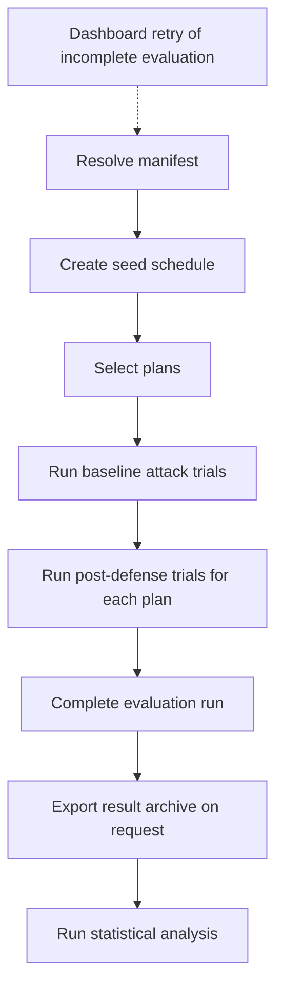

# Evaluation Lifecycle

The evaluation runner executes a saved manifest. It compares how defense
strategies reduce modeled attack impact. It produces deterministic result
artifacts for later statistical analysis.

This page describes the runner and its manual replication commands. See the
[topology-scale study protocol](../inprogress/topology-scale-study.md) for the
study procedure.

## Manifest inputs

A manifest declares everything the runner needs for one evaluation. Validation
and schema live in
[`Contracts.EvaluationManifest`](../../src/lib/network_defense/evaluation/contracts/evaluation_manifest.ex).
Inputs fall into these categories:

- **Scenario source.** The source graph to attack. It is either a persisted
  graph revision or a generated topology.
- **Attacker.** The initial foothold, the host the attack starts from, and the
  maximum attacker attempts per step.
- **Model variants.** The objectives and pre-attack feasibility rules used by
  optimization. Each variant fixes an objective and whether a plan must keep
  mission capability feasible before the attack.
- **Strategies and plans.** The defense strategies to run, each under a
  budget. A plan is one strategy under one budget for one selection seed.
- **Budget.** The maximum number of defense actions a plan may apply. Current
  defensive actions have unit cost, so budget and action count are equal.
- **Trials and iterations.** The attack-trial count per experiment and the
  optional optimizer trials and iterations for simulation-based strategies.
- **Objectives.** The analyzed outcomes, such as blast radius and mission
  impact, plus the comparisons declared for later analysis.
- **Seeds.** Deterministic random inputs for the evaluation.

The authoritative field set, defaults, and allowed values live in the
`EvaluationManifest` contract. Do not read them from this page.

## Scenario setup

Two Mix tasks prepare scenario sources:

- `mix generate.enterprise_topology --title TITLE --hosts N --seed S`
  generates a deterministic, deny-by-default enterprise topology and persists
  it as a new graph revision.
- `mix seed.fixed_order_fulfilment` idempotently seeds the fixed
  order-fulfilment scenario graph and its local evaluation manifests, and
  prints the persisted revision and manifest ids.

A generated topology source needs `mix evaluate.freeze` before measured runs
(see [Resumability and runner commands](#resumability-and-runner-commands)).

## Seeds for repeatability

A manifest declares seeds so that a run is repeatable. The same declared
inputs produce the same plans and trials. The
[`SeedSchedule`](../../src/lib/network_defense/evaluation/seed_schedule.ex)
derives named child seeds for the distinct streams, so changing one stream
does not disturb another. The entry host for the source graph comes from the
attacker declaration.

## Lifecycle

The runner lifecycle ends when an evaluation run completes. The
[`Evaluator`](../../src/lib/network_defense/evaluation/evaluator.ex) drives the
execution. Export and statistical analysis are explicit follow-on steps.

The runner resolves the manifest source into a graph revision and builds one
seed schedule. It selects every plan before baseline trials begin. It then
runs the baseline attack trials on the source graph, followed by post-defense
trials on each optimized graph revision. The run completes only after every
experiment completes. On request, the system exports a completed run as an
evaluation archive; the
[analysis archive-file list](../../evaluation/analysis/README.md#evaluation-archive-files) lists
the archive files. A separate command starts statistical analysis.

## Resumability and runner commands

The dashboard worker can continue an incomplete run. It reuses completed plans
and trials instead of redoing them. `mix evaluate.manifest` does not continue a
run. It starts a new run on every invocation. You can run a saved manifest
with:

- `mix evaluate.manifest --manifest-id ID --output evaluation.zip`

Use `mix evaluate.import --file manifest.json` to save a versioned JSON
manifest. The manifest `id` becomes the saved manifest id. The command reuses
identical content and rejects changed content with the same id.

For a generated topology, use `mix evaluate.freeze --manifest-id SOURCE
--frozen-manifest-id TARGET` before measured runs. The command generates and
persists the source graph once. It saves `TARGET` with that immutable graph
revision and the resolved entry-host ID. Use `TARGET` for warm-up and measured
runs. The target id must be new.

Use `mix evaluate.warmup --manifest-id ID` for one unmeasured run. Warm-up is
manual today; requesting it automatically once per frozen manifest is planned
tooling (see the
[cloud evaluation tooling plan](../inprogress/cloud-evaluation-tooling-plan.md)).
A warm-up run cannot be exported or analyzed.

The [analysis archive-file list](../../evaluation/analysis/README.md#evaluation-archive-files)
describes the archive contents. For analysis:

- `mix evaluate.analyze --run-id RUN_ID --mode analyze --output analysis.zip`

The [`evaluate.optimization`](../../src/lib/mix/tasks/evaluate.optimization.ex)
task runs a single optimization synchronously and prints a JSON record. The
[`evaluate.manifest`](../../src/lib/mix/tasks/evaluate.manifest.ex) task runs
a whole saved manifest. The
[`evaluate.analyze`](../../src/lib/mix/tasks/evaluate.analyze.ex) task sends a
completed archive to the analysis service.

## Comparable experiments

The shared example in [model-example.md](model-example.md) describes the model
with one client zone, one service zone, one vulnerable service, one credential,
and one mission capability. Use it to reason about one comparable baseline and
one equal-budget post-defense experiment.

The two experiments declare the same inputs: the same scenario source, the
same attacker entry, the same trial count, and the same evaluation seed. The
baseline runs attack trials on the source graph with no defense action. The
post-defense run first selects one plan under the equal action budget, applies
its defense action to form an optimized graph, then runs attack trials on that
graph with the same declared inputs. The two outcomes are comparable because
only the applied plan differs.

Terminology follows [vocabulary.md](vocabulary.md). Statistical analysis,
including comparisons and uncertainty, is described in the
[evaluation analysis README](../../evaluation/analysis/README.md).

## Relationship to the topology-scale study

The topology-scale protocol uses the commands above. It defines which manifests
to run, when to warm up, how many timing replicas to collect, and how to compare
them.
