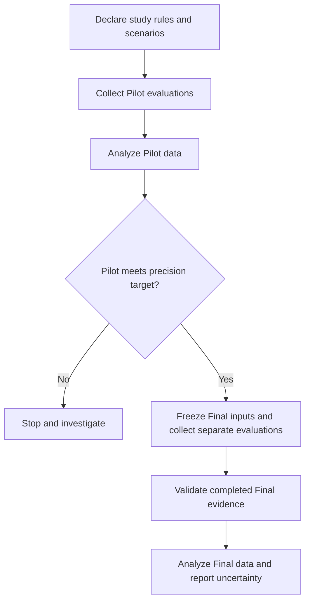

# Evaluation and Study Lifecycle

Does a defense reduce simulated damage, or did it merely get favorable attacks?
Evaluation collects comparable measurements. Analysis estimates differences
between defenses and how uncertain those differences are.

## Evaluation, analysis, and a study

An **evaluation run** is a batch of attack simulations on one network scenario.
A **strategy** selects defenses; a **plan** is the actions it selects for one
budget and selection seed. A **trial** is one simulated attacker path. The run
records plans, outcomes, and execution times.

**Analysis** reads completed runs; it does not collect new simulations. The
primary outcome is **mission impact**: a weighted score for disruption to the
business functions represented in the model. A **study** combines evaluations to answer a broader
question, such as how defenses perform as networks grow. A **tier** is one
group in that comparison, such as one network size.

For example, compare plans that restrict network connections with plans
selected by **CVSS prioritization**, which uses vulnerability severity scores.
Keep the network, attacker inputs, and action budget comparable. Otherwise,
less damage might reflect an easier scenario rather than a better defense.
Equal action counts do not imply equal deployment costs.

The runner also simulates the network without defense. This **no-defense
baseline** describes the undefended scenario; it is not CVSS, the reference
strategy for the study's primary comparisons.

A **manifest** is the recipe for one evaluation. A **study specification** fixes
the comparisons and statistical rules. Saved specifications are immutable so
results remain tied to the rules that produced them. See the
[shared model example](model-example.md) for the network and attack model.

## Why simulations repeat

Two sources of variation matter:

- **Plan selection:** some strategies choose different actions on the same
  network. Several plans prevent one fortunate choice from representing the
  whole strategy.
- **Attack outcomes:** different attacker paths produce different damage
  against one plan. Several trials prevent one fortunate outcome from
  determining the result.

Analysis accounts for both; more attacks cannot replace missing variation
between plans. Shared attack seeds keep comparison inputs comparable. A
**seed** makes a random sequence reproducible. Fixed inputs reproduce modeled
outcomes, not wall-clock execution time.

Runtime has separate repeats. A **warm-up** prepares the environment and is
excluded from evidence. **Timing replicas** repeat fixed inputs to measure
execution-time variation; they do not add new plan or attack samples. The
[study protocol](../inprogress/topology-scale-study.md) defines their acceptance
rules.

## Lifecycle: collection, Pilot, and Final

Each evaluation resolves the network, selects plans, runs no-defense trials,
and runs trials with each plan applied. Only completed, non-warm-up runs can
supply analysis archives. Completing an evaluation does not automatically
produce a statistical report.

**Pilot analysis** checks how much data the study needs. It reads completed
Pilot evaluations and tests combinations of plan counts and attacks per plan.
It recommends common counts that meet the precision target across the study's
comparisons. The target limits how wide the range around each estimated
difference may be. Candidates cannot exceed the available data.

**Final analysis** reports comparisons from separately collected Final runs.
Their seeds are disjoint from Pilot seeds: data used to choose sample sizes
must not also become the Final evidence.

```mermaid
flowchart TD
    S[Declare study rules and scenarios] --> P[Collect Pilot evaluations]
    P --> A[Analyze Pilot data]
    A --> G{Pilot meets precision target?}
    G -->|No| X[Stop and investigate]
    G -->|Yes| F[Freeze Final inputs and collect separate evaluations]
    F --> V[Validate completed Final evidence]
    V --> R[Analyze Final data and report uncertainty]
```

Collection uses the evaluation workflow. The Study dialog only analyzes
existing runs: select Pilot evidence first, then separate Final evidence after
an eligible Pilot. It does not generate networks or collect those runs.

An **insufficient Pilot** finds no candidate that meets the precision target.
A **non-informative comparison** has zero estimated difference and a zero-width
interval; it stops the Pilot rather than proving precision. Investigate the
inputs and model behavior instead of treating it as success. Neither unlocks
Final. Identical reruns do not bypass these conditions. See the
[statistical rules](../../evaluation/analysis/README.md#pilot-correction-and-conservative-coverage)
and [freeze timeline](../inprogress/topology-scale-methodology.md#freeze-timeline).

## Failures and saved results

Incomplete evaluations cannot supply evidence. Resuming reuses finished work,
but an interrupted timing replica needs a fresh replacement: resuming would
change what its duration measures. Retry a failed analysis with the same
completed inputs only after resolving its cause. Invalid evidence must be
corrected first.

Evaluation records and specifications are saved. Dashboard study results are
temporary: closing cancels running analysis, and the session ends when its
LiveView terminates. Download results before closing. Reopening a ZIP is
read-only and does not restore the live Pilot gate. See the
[dashboard workflow](../design/dashboard.md#study-analysis).

## What the results mean

Results are conditional on the simulated network, attacker, and model. Their
uncertainty covers plans and attacks, not different generated networks or
environments. Contrasts with CVSS do not establish a universal defense ranking.
Local runs validate the workflow and select parameters, not the planned cloud
study's final claims. See the [research scope](scope.md).

For execution commands and file formats, use the
[collection procedure](../inprogress/topology-scale-study.md#manual-replication-process)
and [analysis guide](../../evaluation/analysis/README.md#single-archive-and-study-analysis).
