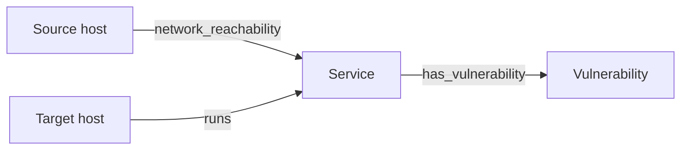
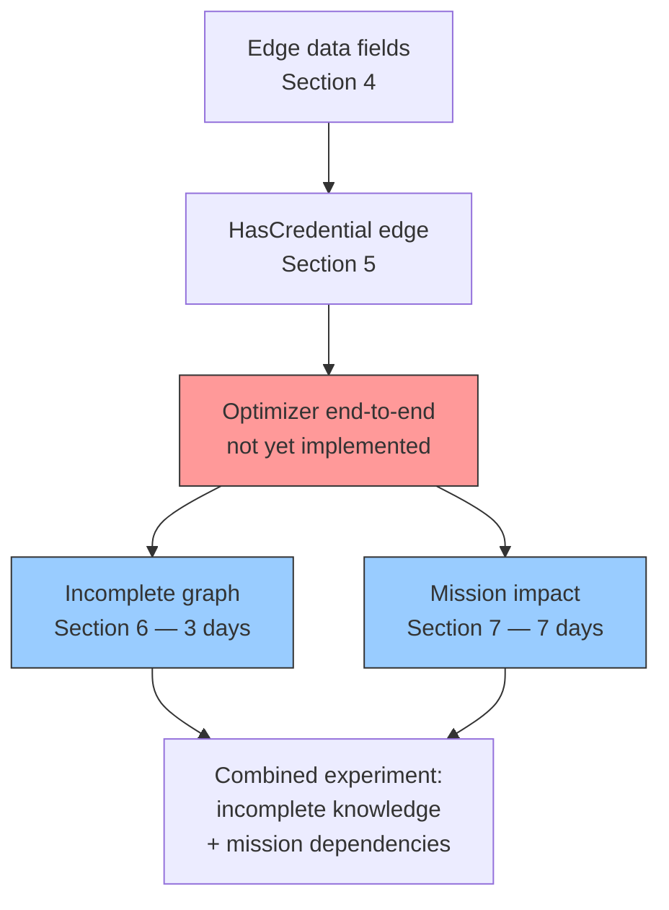

# Context Graph Model — Critical Evaluation and Extension Analysis

Status: Current baseline (3 node types, 3 edge types, zero edge data fields).
Source files: `src/lib/network_defense/graph/`, `src/lib/network_defense/nodes/`, `src/lib/network_defense/relationships/`.
Contracts: `src/lib/network_defense/graph/contracts/`.
Primary documentation: `docs/concepts/model.md`.

---

## 1. Current Model

### Node Types

| Type | Fields | Module |
|------|--------|--------|
| Host | `name: string` | `NetworkDefense.Nodes.Host` |
| Service | `name: string`, `protocol: tcp\|udp`, `port: integer 1-65535`, `version?: string` | `NetworkDefense.Nodes.Service` |
| Vulnerability | `identifier: string`, `cvss_score: float 0-10`, `exploit_probability: float 0-1` | `NetworkDefense.Nodes.Vulnerability` |

### Edge Types

| Type | Direction | Semantics | Data | Module |
|------|-----------|-----------|------|--------|
| Runs | Host → Service | The host runs the service | (none) | `Relationships.Runs` |
| NetworkReachability | Source Host → Service | Foothold on source can contact the service | (none) | `Relationships.NetworkReachability` |
| HasVulnerability | Service → Vulnerability | The service exposes the vulnerability | (none) | `Relationships.HasVulnerability` |

All three edge types carry **zero data fields**. The embedded schemas are empty. They function as pure markers.

### Graph Topology



### Database Representation

- `graphs`: `id`, `title`, `lock_version`
- `nodes`: `id`, `graph_id` (FK), `type` (full module name string), `data` (JSONB), `view_data` (JSONB: `{x_pos, y_pos, radius}`)
- `edges`: `id`, `graph_id` (FK), `from_id` (FK to nodes, scoped to graph), `to_id` (FK to nodes, scoped to graph), `type` (string), `data` (JSONB)

The `data` JSONB column supports new fields without migrations. In-memory, the graph is an immutable Elixir struct with a `virtual: true` adjacency list built via `Graph.hydrate/3`.

### Simulation Usage

```
Simulator.run_experiment(graph: graph, ...)
  └── Rule.evaluate(:remote_service_exploitation, state)
      └── Query.match(graph, pattern)
          ├── Start: Host nodes matching current footholds
          ├── Hop 1: NetworkReachability edge → Service node
          ├── Hop 2: HasVulnerability edge → Vulnerability node
          └── Join: Runs edge backward → target Host
```

The graph is **never mutated** during simulation. Only `AttackerState` evolves. The explosion rule is `ExploitVulnerability` — the only action type. If the RNG sample ≤ `exploit_probability`, the target host is added to footholds.

---

## 2. Comparison Against Current Literature

The project's bibliography (`thesis/refs.bib`, 18 references) includes the canonical attack-graph works: Phillips & Swiler (1998), Sheyner et al. (2002), Ammann et al. (2002), Ou/MulVAL (2005), Ingols/MP graphs (2006/2009), Noel & Jajodia (2003), Wang et al. (2006), Frigault et al. (2008), Poolsappasit et al. (2012), Albanese et al. (2012), Homer/NetSPA (2009), Matthews et al. (2021), Kaynar survey (2016), Allodi & Massacci (2014), Lippmann & Ingols (2005).

| Aspect | This Model | Literature Standard |
|--------|-----------|---------------------|
| Edge data | None — pure markers | Protocol, port, privilege requirements, exploit pre/post-conditions |
| Attacker model | Single `exploit_probability` float, collapsed from CVSS | Multi-dimensional: skill tier, tool access, persistence, patience |
| Exploit types | One (`ExploitVulnerability` — remote service exploit) | Multiple: remote exploit, local privilege escalation, credential theft, phishing, supply chain |
| Privilege levels | None — foothold = full host control | User vs root, credential rings, trust domains |
| Credential propagation | Not modeled — only exploitation-based lateral movement | Shared passwords, SSH keys, LDAP trust, token theft (Sheyner, Ou, Ammann) |
| Pre/post-conditions | Hardcoded in Elixir rule, not in graph | Explicit condition/exploit/consequence nodes (MulVAL, MP graphs, NetSPA) |
| Temporal dynamics | None — instantaneous exploit, no detection delay, no patching-during-attack | Time windows, detection delays, attacker dwell time, recovery during attack |
| Network segmentation | Implicit — reachability edges are binary on/off | Firewall rule nodes, zone membership, ACL edges |
| Monotonicity | Implicit — attacker never loses foothold | Explicitly stated and discussed as a trade-off (Ammann et al. 2002) |
| Validation | No mapping to real attack patterns | ATT&CK technique chains, empirical exploit data (Allodi) |
| Trust/domain relationships | Absent | Active Directory trust, domain admin propagation |

### What the Literature Gap Actually Is

The thesis identifies the gap as: "no existing system combines stochastic simulation + automated defense optimization under budget constraints." This is accurate — existing work either uses closed-form Bayesian propagation (Frigault, Poolsappasit) or single-shot hardening (Noel, Wang, Albanese), never both Monte Carlo simulation AND incremental budget-constrained optimization.

But the gap is **narrower than it reads**. Many of the listed differences are intentional (not defects):
- Simple graph = tractable optimization comparisons
- Single exploit type = controlled experiment variable
- No credential propagation = scope boundary

The danger is that a reviewer may read the literature review (which surveys MulVAL, NetSPA, MP graphs in detail), then look at the implementation and ask: "Your model is 3 node types and 3 empty edges. How does this relate to the systems you reviewed, which were all more expressive 10-20 years ago?"

The answer must be: "The model is deliberately minimal — the research question is about optimization strategy comparison, not graph expressiveness. The thesis demonstrates that even a simple model benefits from simulation-informed optimization. Adding expressiveness is future work." But this argument needs to be made **explicitly** in the design chapter, not left implicit.

---

## 3. Critical Gaps — What a Reviewer Will Flag

### 3.1 Undefended Monotonicity Assumption

The current model assumes: once a host is compromised, it stays compromised forever. This is Ammann's monotonicity assumption (2002), which every major attack-graph paper discusses explicitly. The thesis uses it implicitly — no citation, no trade-off discussion.

**Risk:** A reviewer reading the design chapter will ask: "You cite Ammann (2002) in your literature review, which introduced this assumption. Why don't you discuss it in your design?"

**Fix:** Add a paragraph in the design chapter that:
1. States the monotonicity assumption explicitly
2. Cites Ammann et al. (2002)
3. Discusses what is lost: modeling of patching-during-attack, defender cleanup, attacker losing footholds, and non-persistent access
4. Argues why it's acceptable: the research question compares defense strategies applied pre-attack, not mid-attack responses
5. Notes that the assumption matches the optimizer's model (pre-attack hardening decisions)

### 3.2 Exploit Probability Conflates Attacker Skill with Vulnerability Exploitability

CVSS exploitability sub-scores (Attack Vector, Attack Complexity, Privileges Required, User Interaction) are collapsed into a single `exploit_probability` float. Attacker skill level is not separately parameterized. Allodi & Massacci (2014) — already in the bibliography — demonstrated that CVSS alone is a poor predictor of real-world exploitation.

**Risk:** A reviewer will ask: "You cite Allodi (2014), which shows CVSS is a weak predictor. Why would an optimizer based on this data produce useful recommendations? Are your results robust to probability miscalibration?"

**Fix:** Acknowledge the limitation explicitly. Add a sensitivity analysis: vary the `exploit_probability` values by ±20% and check whether the strategy ranking changes. If the ranking is stable, argue that the optimization is robust to probability calibration errors. If not, discuss what additional data would be needed.

### 3.3 Pre/Post-Conditions Are Hardcoded, Not Modeled

The `RemoteServiceExploitation` rule in `src/lib/network_defense/rules/remote_service_exploitation.ex` bakes all exploit logic into an Elixir module. The graph itself has no way to express:

- "This vulnerability requires local access" vs "this one is remotely exploitable"
- "This exploit requires root on host A AND network access to port 445 on host B"
- "This CVE only affects Apache versions < 2.4.50" — no version matching logic

The graph carries topology but not exploit semantics. Adding a new exploit type means writing a new Elixir rule, not adding graph data.

**Risk:** The optimizer's job is to decide which vulnerabilities to patch and which reachability to block. But without pre/post-condition data on the graph, every vulnerability and every reachability edge looks identical to the optimizer — only probability and CVSS score differentiate them. The optimizer can't reason about "patching this CVE-7.2 requires a server reboot, so it costs more than patching three CVE-5.0s that don't."

**Fix:** The optimal balance depends on whether you plan more exploit types:
- If only one exploit type stays → document the limitation and argue it's a controlled experiment variable
- If adding exploit types → add `access_vector` and `privileges_required` fields to `Vulnerability` nodes; the rule then filters based on these instead of treating all vulns identically

### 3.4 All Edges Carry Zero Data

This is the most concrete deficiency. Every edge type is a pure marker — it says "there exists a relationship" but carries no properties. This has cascading effects:

| Missing Edge Data | Consequence |
|---|---|
| `NetworkReachability` has no protocol/port | Any reachability = access to every service on the target host. Unrealistic. |
| `NetworkReachability` has no segmentation attribute | Optimizer can only cut entire edges, not selectively block ports. |
| `HasVulnerability` has no access requirements | A local privilege escalation is treated identically to a remote RCE. |
| `Runs` has no relationship type | Bare metal, container, VM — all indistinguishable. Compromise semantics identical. |

**Fix:** See Section 4.

---

## 4. Recommended Edge Data Additions (Low Effort, High Impact)

The `nodes.data` and `edges.data` JSONB columns already support adding fields. No database migration needed. The polymorphic registry pattern and discriminated union contracts handle new fields automatically.

### NetworkReachability

Add to `src/lib/network_defense/relationships/network_reachability.ex`:

```elixir
embedded_schema do
  field :protocol, Ecto.Enum, values: [:tcp, :udp, :any], default: :any
  field :port, :integer              # nil = any port
  field :port_range, {:array, :integer}  # nil = single port
end
```

Impact on simulation: the rule can now match "reachability to this specific service's port" instead of "reachability to any service on this host." Impact on optimization: the segmentation optimizer can model "block TCP port 445 between DMZ and internal" instead of "sever all communication."

### HasVulnerability

Add to `src/lib/network_defense/relationships/has_vulnerability.ex`:

```elixir
embedded_schema do
  field :access_vector, Ecto.Enum, values: [:remote, :adjacent, :local], default: :remote
  field :privileges_required, Ecto.Enum, values: [:none, :low, :high], default: :none
  field :authentication_required, :boolean, default: false
end
```

Impact on simulation: the rule skips local-only vulns when the attacker has no foothold on the target host, and skips high-privilege vulns when the attacker has only user access. This makes the attack graph more realistic without adding exploit types.

### Host

Add to `src/lib/network_defense/nodes/host.ex`:

```elixir
embedded_schema do
  field :name, :string
  field :zone, :string              # e.g., "dmz", "internal", "database"
  field :criticality, :float, default: 0.0  # placeholder for later mission weighting
end
```

Impact: zone-based reasoning in the optimizer (e.g., "prioritize blocking edges crossing DMZ → internal"). The `criticality` field is a placeholder that mission impact (Section 6) would consume.

### Service

Add version-matching capability:

```elixir
embedded_schema do
  field :name, :string
  field :protocol, Ecto.Enum, values: [:tcp, :udp]
  field :port, :integer
  field :version, :string
  field :version_range, :string     # nil = exact match on :version
end
```

Impact: if a vulnerability affects "Apache 2.4.x < 2.4.50" and the service runs 2.4.49, the rule can match. Without `version_range`, every vulnerability on a service with `version: nil` is a false positive.

---

## 5. Recommended New Edge Type: HasCredential

The single largest missing attack vector in the current model is credential-based lateral movement. Real attackers reuse stolen credentials, SSH keys, and tokens to move between hosts without exploiting any vulnerability.

### Definition

```elixir
# New file: src/lib/network_defense/relationships/has_credential.ex
defmodule NetworkDefense.Relationships.HasCredential do
  use Ecto.Schema

  embedded_schema do
    field :credential_type, Ecto.Enum, values: [:password, :ssh_key, :token, :hash]
    field :source, :string     # where the credential was obtained from (optional context)
  end
end
```

Direction: `Source Host → Target Host` or `Source Host → Service` (auto-login to a specific service).

### Required Work

| Area | Files to Create/Modify |
|------|----------------------|
| Domain module | `src/lib/network_defense/relationships/has_credential.ex` (new) |
| Relationship registry | `src/lib/network_defense/relationships/registry.ex` — add to `@types` |
| Data contract | `src/lib/network_defense/graph/contracts/data/has_credential_data.ex` (new) |
| Edge contract | `src/lib/network_defense/graph/contracts/edge.ex` — add variant |
| Graph query | No changes needed — `Query.match` traverses all edge types generically |
| New rule | `src/lib/network_defense/rules/credential_reuse.ex` (new) — matches reachability + has_credential → add target host to footholds |
| New action | `src/lib/network_defense/actions/reuse_credential.ex` (new) |
| TypeScript | Auto-generated via `mix gen.contracts` |
| Frontend palette | `src/assets/svelte/dashboard/graph/presentation/edges/HasCredentialEdge.ts` (new) |
| Frontend registry | `src/assets/svelte/dashboard/graph/presentation/registry.ts` — add entry |

Effort: ~1 day. The polymorphic registry + discriminated union pattern makes adding edge types mechanical.

---

## 6. Extension Analysis: Incomplete Defender Knowledge

**Thesis claim tested:** "The proposed strategy retains value when the defender has incomplete knowledge of the environment" (claim 4 in thesis-scope-roadmap).

**Research question:** If the defender sees only X% of the ground truth graph, how much worse are the defense decisions? Does the simulation-informed optimizer degrade more gracefully than CVSS prioritization?

### Architectural Fit

The architecture already supports this cleanly. Key facts from the code:

1. `Graph` is an immutable Elixir struct — no destructive updates
2. `Simulator.run_experiment(graph: graph, ...)` receives the graph as a parameter
3. `Graph.hydrate/3` builds an in-memory adjacency list from arbitrary node/edge lists — creating a filtered copy is trivial
4. The experiment stores `graph_id` and `lock_version` — can store a second graph ID for the observed graph
5. Graph is read-only during simulation — no risk of the optimizer accidentally modifying the ground truth

### Implementation Plan

**Step 1: Graph projection function** (~2 hours)

```elixir
# New function in NetworkDefense.Graph.Projection
def project(%Graph{} = ground_truth, coverage: coverage) when coverage in 0.0..1.0 do
  nodes = ground_truth |> Graph.nodes() |> Enum.shuffle()
  edges = ground_truth |> Graph.edges() |> Enum.shuffle()

  node_count = round(length(nodes) * coverage)
  edge_count = round(length(edges) * coverage)

  # Ensure edges only reference surviving nodes
  surviving_node_ids = nodes |> Enum.take(node_count) |> MapSet.new(& &1.id)
  surviving_edges = edges
    |> Enum.take(edge_count)
    |> Enum.filter(fn e ->
      MapSet.member?(surviving_node_ids, e.from_id) and
        MapSet.member?(surviving_node_ids, e.to_id)
    end)

  Graph.hydrate(
    %Graph{id: ground_truth.id, title: "#{ground_truth.title} (defender view)", lock_version: ground_truth.lock_version},
    Enum.take(nodes, node_count),
    surviving_edges
  )
end
```

Variants worth implementing:
- `coverage: 1.0` → complete knowledge (control)
- `coverage: 0.75, 0.50, 0.25` → parameter sweep
- `mode: :edges_only` → defender knows all hosts but not all edges (stale reachability data)
- `mode: :nodes_only` → defender knows only a subset of hosts (incomplete reconnaissance)

**Step 2: Database storage** (optional, ~2 hours)

Two approaches:
- **On-the-fly (simpler):** Generate the observed graph from ground truth using the projection function. Store only `coverage` and `mode` as experiment metadata. Compute observed graph at experiment start.
- **Persisted (more realistic):** The observed graph gets its own `graphs` row. This models a real deployment where the defender has a separate asset management system with its own data. More realistic but adds complexity.

Recommendation: use on-the-fly for initial experiments, switch to persisted only if the thesis needs to model "stale data with a specific timestamp" scenarios.

**Step 3: Optimizer integration** (~2 hours)

The optimizer currently receives one graph. Split into two parameters:

```elixir
# In the optimization loop:
def evaluate_candidate(ground_truth, observed, candidate_defense, params) do
  # 1. Apply candidate defense to observed graph (what the defender thinks)
  defended_observed = DefenseAction.apply(candidate_defense, observed)

  # 2. Map the defense decision to ground truth actions
  ground_truth_defended = translate_defense(candidate_defense, observed, ground_truth)

  # 3. Simulate attack on ground truth
  result = Simulator.run_experiment(graph: ground_truth_defended, ...)

  # 4. Compare with what defender expected
  expected_result = Simulator.run_experiment(graph: defended_observed, ...)

  %{ground_truth: result, defender_expected: expected_result}
end
```

**Step 4: Experiment orchestration** (~3 hours)

```elixir
# New experiment type: IncompleteKnowledgeExperiment
@coverage_levels [1.0, 0.75, 0.5, 0.25]
@repetitions 5  # Each coverage level gets N random projections

for coverage <- @coverage_levels, _ <- 1..@repetitions do
  observed = Projection.project(ground_truth, coverage: coverage)
  # Run optimizer on observed
  defended_config = Optimizer.optimize(observed, budget: budget, strategies: strategies)
  # Evaluate defended_config on ground truth
  results = Simulator.run_experiment(graph: apply_defenses(ground_truth, defended_config), ...)
  # Store: coverage, projection_index, strategy, blast_radius, ...
end
```

**Step 5: Report and visualization** (~1 day)

The report needs a new comparison: "defender expected blast radius X vs ground truth blast radius Y" across coverage levels. Three chart types:
1. Line chart: coverage on X-axis, blast radius on Y-axis, one line per strategy
2. Scatter: each point = one projection × strategy, showing defender_expected vs ground_truth
3. Degradation ratio: `ground_truth_blast / defender_expected_blast` at each coverage level

### Risk Assessment

| Risk | Likelihood | Mitigation |
|------|-----------|------------|
| Random omissions produce trivially obvious degradation | Medium | Test with small coverage ranges first; ensure the experiment setup doesn't accidentally delete all vulnerabilities |
| Optimizer exploits perfect information from observed graph | Low | The optimizer is inherently limited by what it sees; random edge loss means it may not see a vulnerability to patch |
| Results are uninteresting (all strategies degrade equally) | Medium | Pre-test with manual parameter sweeps before committing to full experiments |

### Effort Summary

| Component | Estimated Time |
|-----------|---------------|
| Projection function + tests | 0.5 days |
| Database storage (optional) | 0.5 days |
| Optimizer integration | 0.5 days |
| Experiment orchestration | 0.5 days |
| Report + charts | 1.0 days |
| **Total** | **~3 days** |

---

## 7. Extension Analysis: Mission Impact

**Thesis claim tested:** "Propagation-aware optimization selects more effective controls than CVSS, centrality, random, and no-defense baselines" (claim 2), and "Combining preventive controls with prepared recovery capacity reduces cumulative mission loss and restoration time more effectively than prevention alone" (claim 3).

**Research question:** Does the optimizer select different (better) defenses when optimizing for mission loss instead of blast radius? Can the thesis demonstrate that a lower-severity vulnerability is the correct priority when it threatens a mission-critical dependency?

### Why It's the Differentiator

Existing attack-graph hardening literature (Noel 2003, Wang 2006, Albanese 2012) optimizes to prevent compromise — minimizing the set of reachable hosts. None of them model what the organization actually cares about.

This is the contribution that distinguishes the thesis from 20 years of prior work:
- Noel et al.: "Find the cheapest set of patches to prevent attacker from reaching critical asset X"
- This thesis: "Given budget B, which defenses minimize expected mission disruption, accounting for the fact that not all compromised hosts are equally important?"

### New Types Required

**Node: MissionCapability**

```elixir
# New file: src/lib/network_defense/nodes/mission_capability.ex
defmodule NetworkDefense.Nodes.MissionCapability do
  use Ecto.Schema

  embedded_schema do
    field :name, :string
    field :description, :string
    field :criticality_weight, :float, default: 1.0   # relative importance
    field :threshold_rule, Ecto.Enum, values: [:all, :any, :majority], default: :any
    # :all   → capability down if ANY supporting host is compromised
    # :any   → capability down if ALL supporting hosts are compromised (full redundancy)
    # :majority → capability down if >50% of supporting hosts are compromised
  end
end
```

**Edge: Supports**

```elixir
# New file: src/lib/network_defense/relationships/supports.ex
defmodule NetworkDefense.Relationships.Supports do
  use Ecto.Schema

  embedded_schema do
    field :weight, :float, default: 1.0  # this host's relative contribution to the capability
  end
end
```

Direction: `Host → MissionCapability` (the host supports the capability).

These require no database migration — JSONB columns handle new types dynamically.

### Files to Create/Modify

| Area | Files | Effort |
|------|-------|--------|
| Domain modules | `nodes/mission_capability.ex` (new), `relationships/supports.ex` (new) | 1h |
| Registries | `nodes/registry.ex`, `relationships/registry.ex` — add entries | 15m |
| Data contracts | `contracts/data/mission_capability_data.ex` (new), `contracts/data/supports_data.ex` (new) | 30m |
| Type contracts | `contracts/node.ex`, `contracts/edge.ex` — add variants | 15m |
| TypeScript | Auto-generated via `mix gen.contracts` | 5m |
| Frontend palette | `presentation/nodes/MissionCapabilityNode.ts` (new), `presentation/edges/SupportsEdge.ts` (new) | 1h |
| Frontend registry | `presentation/registry.ts` — add entries | 15m |
| Frontend inspector | Inspector component for editing capability data | 2h |
| **Subtotal (mechanical)** | | **~0.5 days** |

### Simulation Changes

The core change: after each action execution during simulation, compute which mission capabilities are "down" and track cumulative mission loss.

**Current state tracking:**

```elixir
AttackerState: %{footholds: MapSet<host_id>, attempted_actions: MapSet<action_key>}
```

**New state tracking:**

```elixir
# Option A: Extend AttackerState (simpler but mixes concerns)
AttackerState: %{
  footholds: MapSet<host_id>,
  attempted_actions: MapSet<action_key>,
  mission_loss_cumulative: float,         # running sum
  capabilities_down: MapSet<capability_id>  # current snapshot
}

# Option B: Parallel MissionState (cleaner separation)
MissionState: %{
  cumulative_loss: float,
  per_iteration_loss: [float],
  capabilities_status: %{capability_id => :operational | :degraded | :down}
}
```

Recommendation: Option A (extend AttackerState). The `AttackerState` is serialized to JSONB anyway. Adding two fields is low-risk. The concern about "mixing concerns" is theoretical — in practice, the simulator updates both sets of information at the same point in the loop. A separate struct adds indirection without benefit.

**Per-iteration computation** (in `simulator.ex`, after `maybe_execute_action`):

```elixir
defp compute_mission_loss(graph, attacker_state) do
  capability_nodes = Graph.nodes(graph) |> Enum.filter(&(&1.type == "MissionCapability"))
  foothold_set = AttackerState.foothold_nodes(attacker_state) |> MapSet.new()

  capability_nodes
  |> Enum.reduce({0, MapSet.new()}, fn cap, {loss, down_set} ->
    supporting_hosts = graph
      |> Graph.incoming(cap.id)
      |> Enum.filter(& &1.type == "Supports")
      |> Enum.map(& &1.from_id)

    compromised_count = Enum.count(supporting_hosts, &MapSet.member?(foothold_set, &1))

    down? = case cap.data["threshold_rule"] do
      "all"  -> compromised_count > 0
      "any"  -> compromised_count == length(supporting_hosts)
      "majority" -> compromised_count > length(supporting_hosts) / 2
    end

    if down? do
      {loss + cap.data["criticality_weight"], MapSet.put(down_set, cap.id)}
    else
      {loss, down_set}
    end
  end)
end
```

**Impact on reporting:**

- `final_foothold_counts/1` → splits into `final_blast_radius/1` and `final_mission_loss/1`
- New metrics: expected mission loss, mission loss p95, time-to-first-capability-down
- New chart: capability-level breakdown (which capabilities were affected in what % of runs)
- Existing blast radius metrics remain for comparison (are they correlated with mission loss?)

| Simulation Component | Files | Effort |
|---------------------|-------|--------|
| Extend AttackerState | `attacker_state/attacker_state.ex` | 30m |
| Mission loss computation | New module: `simulation/mission_loss.ex` | 2h |
| Integrate into perform_iteration | `simulation/simulator.ex` | 1h |
| Serialization type | `simulation/types/attacker_state.ex` — update | 1h |
| Tests | `test/simulation/mission_loss_test.exs` | 3h |
| **Subtotal** | | **~1.5 days** |

### Report Changes

Current `report.ex` (~300 lines):

```
final_foothold_counts → blast_radius_stats → kpis + distribution_chart + convergence_chart + action_stats
```

New `report.ex`:

```
final_foothold_counts   → blast_radius_stats   → blast radius KPIs + charts
final_mission_losses    → mission_loss_stats   → mission loss KPIs + charts
capability_breakdown    → per-capability heatmap
correlation             → blast radius vs mission loss scatter
```

| Report Component | Effort |
|-----------------|--------|
| `mission_loss_stats/1` (parallel to `blast_radius_stats/1`) | 1h |
| Capability breakdown chart | 2h |
| Blast radius vs mission loss comparison chart | 1h |
| New contract for mission loss data in report reply | 1h |
| **Subtotal** | **~0.5 days** |

### Optimization Objective Change

The optimizer's cost function changes:

```elixir
# Before
def evaluate(graph, candidate) do
  result = Simulator.run_experiment(graph: candidate, ...)
  result.expected_blast_radius   # minimize this
end

# After
def evaluate(graph, candidate) do
  result = Simulator.run_experiment(graph: candidate, ...)
  result.expected_mission_loss   # minimize this, possibly with blast radius as secondary metric
end
```

The optimizer loop itself doesn't change structurally — it still generates candidate configurations and evaluates them via simulation. But:

1. The simulation must now return mission loss as the primary output metric
2. The optimizer needs a new `objective` field: `:blast_radius` or `:mission_loss`
3. The "ranking by reduction per unit cost" now ranks by mission loss reduction, not blast radius reduction

| Component | Effort |
|-----------|--------|
| Objective parameter on optimizer | 30m |
| Report: both blast radius AND mission loss for each candidate | 1h |
| **Subtotal** | **~0.25 days** |

### Experiment Design (Non-Code Work)

This is where the real time goes. You need synthetic scenarios where:

1. CVSS says "patch host A (CVSS 9.8)" but mission impact says "patch host B (CVSS 4.3)" — and host B is the correct answer
2. The optimizer correctly identifies host B when optimizing for mission loss but not when optimizing for blast radius
3. Multiple capabilities with different redundancy configurations (all/any/majority) produce non-trivial trade-off surfaces

At minimum, design 3-4 scenarios:

| Scenario | Topology | Capabilities | Expected Result |
|----------|----------|-------------|----------------|
| Single critical dependency | DMZ web → internal app → database, one capability "Order Processing" depends on database | 1, threshold: any | CVSS patches web server, mission optimizer patches database |
| Redundant with failover | Two app servers behind load balancer, capability depends on majority | 1, threshold: majority | Both strategies agree until one server falls, then diverge |
| Multi-capability trade-off | Two capabilities share infrastructure, budget covers only one defense | 2, threshold: any + all | Optimizer must choose which capability to protect |
| Mixed criticality | 20 hosts, 5 capabilities with varying weights, budget = 3 actions | 5, mixed thresholds | Show ranked defense actions with blast-radius vs mission-loss ranking |

Effort: 2-3 days for scenario design + manual verification before automating.

### Total Effort Estimate

| Phase | Time |
|-------|------|
| New node/edge types + contracts + frontend | 0.5 days |
| Simulation changes (mission loss computation) | 1.5 days |
| Report changes (new metrics + charts) | 0.5 days |
| Optimization objective change | 0.25 days |
| Experiment scenario design | 2-3 days |
| **Total** | **~5-7 days** |

---

## 8. Implementation Dependency Order



The critical path is the optimizer. Without a working end-to-end optimization loop, neither extension can be evaluated. The optimizer protocol and strategy files exist as stubs (`src/lib/network_defense/optimization/`), defense actions are empty (`src/lib/network_defense/defense_actions/`), and the LiveView handler does nothing on `optimize_defense`.

Recommended order:
1. Edge data fields (Section 4) — do first, unblocks both extensions
2. HasCredential (Section 5) — do next, adds critical lateral movement vector
3. Optimizer (separate work) — prerequisite for everything below
4. Incomplete graph (Section 6) — lower risk, architectures fits
5. Mission impact (Section 7) — thesis differentiator, higher risk

---

## 9. What NOT to Add

Items that would be scope creep without a corresponding research claim:

- **Firewall as a node**: firewalls filter existing edges. Model as filter attributes on `NetworkReachability.data`, not standalone entities. Making it a node forces N-ary relationships awkward in a directed graph.
- **Zone/Segment as a node**: zones are attributes of hosts (`Host.data.zone`). Making them nodes creates a separate hierarchy that doesn't interact with the attack graph usefully.
- **Attacker profile as a graph element**: attacker profiles belong in simulation configuration parameters, not graph nodes. The graph describes the environment; the profile describes the threat actor.
- **Reinforcement learning, GNNs, autonomous agents**: explicitly excluded by thesis-scope-roadmap. Not relevant to the research claims.
- **Real-time monitoring, SOC orchestration, automated remediation**: outside scope. The system models pre-attack defense planning, not runtime incident response.
- **Privilege levels (user vs root) on hosts**: important but adds significant complexity to the attacker state model. A host would need `{compromised, privilege_level}` instead of just `compromised`. Defer to post-thesis unless a specific experiment requires it.

---

## 10. Summary

| Gap/Extension | Severity | Effort | Risk | Recommendation |
|---------------|----------|--------|------|----------------|
| Monotonicity discussion (Section 3.1) | Critical | Text only | None | Address in design chapter now |
| Probability calibration (Section 3.2) | Critical | Sensitivity analysis | Low | Add sensitivity sweep to evaluation |
| Pre/post-conditions in graph (3.3) | High | Varies | Low | Add access_vector + privileges_required to HasVulnerability |
| Edge data fields (Section 4) | High | 0.5 days | None | Do first |
| HasCredential edge (Section 5) | Medium | 1 day | None | Do after edge data |
| Incomplete graph (Section 6) | Medium | 3 days | Low | Do after optimizer works |
| Mission impact (Section 7) | Medium | 7 days | Medium | Do last — thesis differentiator |
