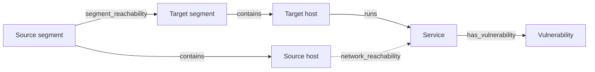
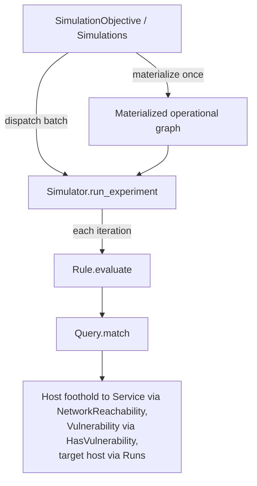
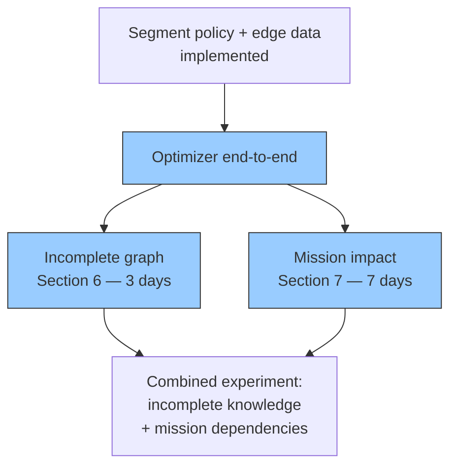

# Context Graph Model — Critical Evaluation and Extension Analysis

Status: Active evaluation analysis for the canonical model. Reachability is segment policy; see `../plans/reachability-modeling.md`.
Source files: `src/lib/network_defense/graph/`, `src/lib/network_defense/nodes/`, `src/lib/network_defense/relationships/`.
Contracts: `src/lib/network_defense/graph/contracts/`.
Primary documentation: `docs/concepts/model.md`.

---

## 1. Current Model

### Node Types

| Type | Fields | Module |
|------|--------|--------|
| Host | `name: string` | `NetworkDefense.Nodes.Host` |
| Service | `name: string`, `protocol: tcp\|udp`, `port: integer 1-65535`, `version?: string` | `NetworkDefense.Nodes.Service` |
| Vulnerability | `identifier: string`, `cvss: embedded`, `exploit_probability: float 0-1` | `NetworkDefense.Nodes.Vulnerability` |
| NetworkSegment | `name: string`, `cidr?: string` | `NetworkDefense.Nodes.NetworkSegment` |
| Credential | `identifier: string`, `credential_type: password\|ssh_key\|token` | `NetworkDefense.Nodes.Credential` |

### Edge Types

| Type | Direction | Semantics | Data | Module |
|------|-----------|-----------|------|--------|
| Contains | NetworkSegment → Host | The segment contains the host | (none) | `Relationships.Contains` |
| Runs | Host → Service | The host runs the service | (none) | `Relationships.Runs` |
| SegmentReachability | NetworkSegment → NetworkSegment | The source segment may reach matching services in the target segment | `protocol: tcp\|udp\|any`, `port_start?`, `port_end?` | `Relationships.SegmentReachability` |
| HasVulnerability | Host → Vulnerability, Service → Vulnerability | The host/service exposes the vulnerability | `required_privilege`, `granted_privilege` | `Relationships.HasVulnerability` |
| StoresCredential | Host → Credential | The host stores the credential | `required_privilege` | `Relationships.StoresCredential` |
| AuthenticatesTo | Credential → Service | The credential authenticates to the service | `granted_privilege` | `Relationships.AuthenticatesTo` |

`SegmentReachability` is the canonical directed segment policy and the only authored, persisted reachability edge. It owns protocol and port-range data. `NetworkReachability` is not canonical: the materializer derives one empty, deterministic `Host -> Service` marker per effective flow the policy admits. The marker is never authored, saved, or accepted by canonical contracts.

### Graph Topology



### Database Representation

Graphs persist as immutable revision chains. `graphs` holds only identity; every edit or optimization appends a new snapshot revision that a database trigger protects from updates.

- `graphs`: `id`
- `graph_revisions`: `id`, `graph_id` (FK), `parent_revision_id` (self-FK; null only for `initial`), `number` (per-graph sequence), `kind` (`initial` | `edit` | `optimization`), `title`
- `nodes`: `id`, `graph_id` (FK) — node identity only
- `edges`: `id`, `graph_id` (FK) — edge identity only
- `graph_revision_nodes`: composite PK (`graph_revision_id`, `node_id`), `type` (full module name string), `data` (JSONB), `view_data` (JSONB: `{x_pos, y_pos, radius}`) — the revision-scoped node snapshot
- `graph_revision_edges`: composite PK (`graph_revision_id`, `edge_id`), `from_id`, `to_id` (scoped to graph), `type` (string), `data` (JSONB) — the revision-scoped edge snapshot

The `data` JSONB column supports new fields without migrations. In-memory, the graph is an immutable Elixir struct with a `virtual: true` adjacency list built via `Graph.hydrate/3`.

### Simulation Usage



Materialization runs once before batch dispatch and scoring. The exploitation rule receives an already matching effective flow; it no longer filters by protocol or port. The graph is **never mutated** during simulation. Only `AttackerState` evolves. The remote-exploitation action is `ExploitVulnerability`; credential rules emit `AcquireCredential` and `ReuseCredential`. If the RNG sample ≤ `exploit_probability`, the target host is added to footholds.

---

## 2. Comparison Against Current Literature

The project's bibliography (`thesis/refs.bib`) includes the canonical attack-graph works: Phillips & Swiler (1998), Sheyner et al. (2002), Ammann et al. (2002), Ou/MulVAL (2005), Ingols/MP graphs (2006/2009), Noel & Jajodia (2003), Wang et al. (2006), Frigault et al. (2008), Poolsappasit et al. (2012), Albanese et al. (2012), Homer/NetSPA (2009), Matthews et al. (2021), Kaynar survey (2016), Allodi & Massacci (2014), Lippmann & Ingols (2005).

| Aspect | This Model | Literature Standard |
|--------|-----------|---------------------|
| Edge data | Policy and privilege data on `segment_reachability`, `has_vulnerability`, and credential edges; `contains` and `runs` are markers | Protocol, port, privilege requirements, exploit pre/post-conditions |
| Attacker model | Single `exploit_probability` float, collapsed from CVSS | Multi-dimensional: skill tier, tool access, persistence, patience |
| Exploit types | Remote and local exploitation; credential acquisition and reuse | Multiple: remote exploit, local privilege escalation, credential theft, phishing, supply chain |
| Privilege levels | `required_privilege`/`granted_privilege` on exploit and credential edges | User vs root, credential rings, trust domains |
| Credential propagation | `stores_credential`/`authenticates_to`; no token theft or trust domains | Shared passwords, SSH keys, LDAP trust, token theft (Sheyner, Ou, Ammann) |
| Pre/post-conditions | Hardcoded in Elixir rule, not in graph | Explicit condition/exploit/consequence nodes (MulVAL, MP graphs, NetSPA) |
| Temporal dynamics | None — instantaneous exploit, no detection delay, no patching-during-attack | Time windows, detection delays, attacker dwell time, recovery during attack |
| Network segmentation | Directed segment policy with protocol/port range, deny by default | Firewall rule nodes, zone membership, ACL edges |
| Monotonicity | Implicit — attacker never loses foothold | Explicitly stated and discussed as a trade-off (Ammann et al. 2002) |
| Validation | No mapping to real attack patterns | ATT&CK technique chains, empirical exploit data (Allodi) |
| Trust/domain relationships | Absent | Active Directory trust, domain admin propagation |

### What the Literature Gap Actually Is

The thesis identifies the gap as: "no existing system combines stochastic simulation + automated defense optimization under budget constraints." This is accurate — existing work either uses closed-form Bayesian propagation (Frigault, Poolsappasit) or single-shot hardening (Noel, Wang, Albanese), never both Monte Carlo simulation AND incremental budget-constrained optimization.

But the gap is **narrower than it reads**. Many of the listed differences are intentional (not defects):
- Simple graph = tractable optimization comparisons
- Limited exploit set = controlled experiment variable
- Credential scope excludes token theft and trust domains

The danger is that a reviewer may read the literature review (which surveys MulVAL, NetSPA, MP graphs in detail), then look at the implementation and ask: "Your model hardcodes exploit semantics in rules; the graph itself carries no pre/post-conditions. How does this relate to the systems you reviewed, which expressed exploit pre/post-conditions as first-class graph elements 10-20 years ago?"

The answer must be: "The model is deliberately minimal — the research question is about optimization strategy comparison, not graph expressiveness. The thesis demonstrates that even a simple model benefits from simulation-informed optimization. Adding expressiveness is future work." But this argument needs to be made **explicitly** in the design chapter, not left implicit.

---

## 3. Critical Gaps — What a Reviewer Will Flag

### 3.1 Undefended Monotonicity Assumption

The current model assumes: once a host is compromised, it stays compromised forever. This is Ammann's monotonicity assumption (2002), which every major attack-graph paper discusses explicitly. The thesis uses it implicitly — no citation, no trade-off discussion.

**Risk:** A reviewer reading the design chapter will ask: "You cite Ammann (2002) in your literature review, which introduced this assumption. Why don't you discuss it in your design?"

**Fix:** Add a paragraph in the design chapter that:
1. States the monotonicity assumption explicitly
2. Cites Ammann et al. (2002)
3. Discusses what is lost: modeling of patching-during-attack, defender cleanup, attacker losing footholds, and non-persistent access
4. Argues why it's acceptable: the research question compares defense strategies applied pre-attack, not mid-attack responses
5. Notes that the assumption matches the optimizer's model (pre-attack hardening decisions)

### 3.2 Exploit Probability Conflates Attacker Skill with Vulnerability Exploitability

CVSS exploitability sub-scores (Attack Vector, Attack Complexity, Privileges Required, User Interaction) are collapsed into a single `exploit_probability` float. Attacker skill level is not separately parameterized. Allodi & Massacci (2014) — already in the bibliography — demonstrated that CVSS alone is a poor predictor of real-world exploitation.

**Risk:** A reviewer will ask: "You cite Allodi (2014), which shows CVSS is a weak predictor. Why would an optimizer based on this data produce useful recommendations? Are your results robust to probability miscalibration?"

**Fix:** Acknowledge the limitation explicitly. Add a sensitivity analysis: vary the `exploit_probability` values by ±20% and check whether the strategy ranking changes. If the ranking is stable, argue that the optimization is robust to probability calibration errors. If not, discuss what additional data would be needed.

### 3.3 Pre/Post-Conditions Are Hardcoded, Not Modeled

The `RemoteServiceExploitation` and `LocalVulnerabilityExploitation` rules in `src/lib/network_defense/rules/` bake exploit logic into Elixir modules. The graph has no explicit per-vulnerability access-vector attribute. Edge placement covers the available local/remote cases: a `Service → Vulnerability` edge marks a remotely exploitable vulnerability, a `Host → Vulnerability` edge a locally exploitable one. What the graph cannot express:

- "This exploit requires root on host A AND network access to port 445 on host B"
- "This CVE only affects Apache versions < 2.4.50" — no version matching logic

The graph carries topology but not exploit semantics. Adding a new exploit type means writing a new Elixir rule, not adding graph data.

**Risk:** The optimizer's job is to decide which vulnerabilities to patch and which segment policy rules to remove. But without pre/post-condition data on the graph, every vulnerability looks identical to the optimizer — only probability and CVSS score differentiate them. The optimizer can't reason about "patching this CVE-7.2 requires a server reboot, so it costs more than patching three CVE-5.0s that don't."

**Fix:** The optimal balance depends on whether you plan more exploit types:
- If only one exploit type stays → document the limitation and argue it's a controlled experiment variable
- If adding exploit types → add `access_vector` and `privileges_required` fields to `Vulnerability` nodes; the rule then filters based on these instead of treating all vulns identically

### 3.4 Edge Data Coverage

The original gap — every edge a pure marker — is largely closed by the policy model. `SegmentReachability` carries protocol and port range, `HasVulnerability` carries `required_privilege`/`granted_privilege`, and credential edges carry privilege data. Remaining gaps:

| Remaining Gap | Consequence |
|---|---|
| `Runs` has no relationship type | Bare metal, container, VM — all indistinguishable. Compromise semantics identical. |
| No host-specific reachability exceptions | Deny-by-default segment policy cannot express per-host allow rules. Deliberately deferred by the reachability plan. |

**Fix:** See Section 4 for the deferred edge-data proposals. Host-specific exceptions are explicitly deferred by `../plans/reachability-modeling.md`.

---

## 4. Recommended Edge Data Additions (Low Effort, High Impact)

The `nodes.data` and `edges.data` JSONB columns already support adding fields. No database migration needed. The polymorphic registry pattern and discriminated union contracts handle new fields automatically.

### NetworkReachability (superseded)

Superseded by `../plans/reachability-modeling.md`. Protocol and port range now live on the canonical `SegmentReachability` policy edge. `NetworkReachability` is an empty operational marker; the target service already defines protocol and port. The materializer performs the matching, and the exploitation rule receives an already matching effective flow. Segmentation removes a policy rule, not individual host/service flows.

### HasVulnerability

Partially adopted. The relationship now carries `required_privilege` and `granted_privilege`. `access_vector` and `authentication_required` remain deferred; without them the graph has no explicit per-vulnerability access-vector attribute. Edge placement still distinguishes the available local/remote cases, as in Section 3.3.

### Host

The proposed `zone` attribute is superseded by segment containment: `network_segment` nodes with `contains` edges model zones, and `segment_reachability` policy expresses cross-zone rules. `Host` currently carries only `name`; a future `criticality` field (float, default 0.0) would serve as the placeholder that mission impact (Section 7) consumes.

### Service

`Service` already carries `name`, `protocol`, `port`, and `version`. A future `version_range` field (nil = exact match on `version`) would let a vulnerability affect "Apache 2.4.x < 2.4.50" while the service runs 2.4.49. Without it, every vulnerability on a service with `version: nil` is a false positive.

---

## 5. Credential-Based Lateral Movement (superseded)

Superseded. `credential-privilege-model-plan.md` defines the approved model: a `Credential` node with `StoresCredential` and `AuthenticatesTo` edges carrying privilege data, plus `ReuseCredential` as a simulation action. Credential reuse traverses the operational graph — after materialization, the reuse rule follows the derived reachability flow and the credential edges. See `../plans/reachability-modeling.md` for the reachability boundary.

---

## 6. Extension Analysis: Incomplete Defender Knowledge

**Thesis claim tested:** "The proposed strategy retains value when the defender has incomplete knowledge of the environment" (claim 4 in thesis-scope-roadmap).

**Research question:** If the defender sees only X% of the ground truth graph, how much worse are the defense decisions? Does the simulation-informed optimizer degrade more gracefully than CVSS prioritization?

### Architectural Fit

The architecture already supports this cleanly. Key facts from the code:

1. `Graph` is an immutable Elixir struct — no destructive updates
2. `Simulator.run_experiment(graph: graph, ...)` receives the graph as a parameter
3. `Graph.hydrate/3` builds an in-memory adjacency list from arbitrary node/edge lists — creating a filtered copy is trivial
4. The experiment stores `graph_revision_id` — it can pin a second revision for the observed graph
5. Graph is read-only during simulation — no risk of the optimizer accidentally modifying the ground truth

### Implementation Plan

**Step 1: Graph projection function** (~2 hours)

Shuffle the ground-truth nodes and edges, keep a `coverage` fraction of each, drop any edge whose endpoints were dropped, and rebuild the graph with a fresh revision identity. The function takes the ground-truth graph and a coverage value in `0.0..1.0` and returns the observed graph.

Variants worth implementing:
- `coverage: 1.0` → complete knowledge (control)
- `coverage: 0.75, 0.50, 0.25` → parameter sweep
- `mode: :edges_only` → defender knows all hosts but not all edges (stale reachability data)
- `mode: :nodes_only` → defender knows only a subset of hosts (incomplete reconnaissance)

**Step 2: Database storage** (optional, ~2 hours)

Two approaches:
- **On-the-fly (simpler):** Generate the observed graph from ground truth using the projection function. Store only `coverage` and `mode` as experiment metadata. Compute observed graph at experiment start.
- **Persisted (more realistic):** The observed graph gets its own `graphs` row. This models a real deployment where the defender has a separate asset management system with its own data. More realistic but adds complexity.

Recommendation: use on-the-fly for initial experiments, switch to persisted only if the thesis needs to model "stale data with a specific timestamp" scenarios.

**Step 3: Optimizer integration** (~2 hours)

The optimizer currently receives one graph. Split into two parameters:

For each candidate defense, apply it to the observed graph (the defender's view), map the decision onto the ground-truth graph, and simulate both. The ground-truth simulation is what actually happens; the observed one is what the defender expects. The gap between the two measures the value of the missing knowledge.

**Step 4: Experiment orchestration** (~3 hours)

For each coverage level, repeat with several random projections: project the observed graph, optimize against it under the budget, apply the chosen defenses to the ground-truth graph, simulate, and record coverage, projection index, strategy, and outcome.

**Step 5: Report and visualization** (~1 day)

The report needs a new comparison: "defender expected blast radius X vs ground truth blast radius Y" across coverage levels. Three chart types:
1. Line chart: coverage on X-axis, blast radius on Y-axis, one line per strategy
2. Scatter: each point = one projection × strategy, showing defender_expected vs ground_truth
3. Degradation ratio: `ground_truth_blast / defender_expected_blast` at each coverage level

### Risk Assessment

| Risk | Likelihood | Mitigation |
|------|-----------|------------|
| Random omissions produce trivially obvious degradation | Medium | Test with small coverage ranges first; ensure the experiment setup doesn't accidentally delete all vulnerabilities |
| Optimizer exploits perfect information from observed graph | Low | The optimizer is inherently limited by what it sees; random edge loss means it may not see a vulnerability to patch |
| Results are uninteresting (all strategies degrade equally) | Medium | Pre-test with manual parameter sweeps before committing to full experiments |

### Effort Summary

| Component | Estimated Time |
|-----------|---------------|
| Projection function + tests | 0.5 days |
| Database storage (optional) | 0.5 days |
| Optimizer integration | 0.5 days |
| Experiment orchestration | 0.5 days |
| Report + charts | 1.0 days |
| **Total** | **~3 days** |

---

## 7. Extension Analysis: Mission Impact

**Thesis claim tested:** "Propagation-aware optimization selects more effective controls than CVSS, centrality, random, and no-defense baselines" (claim 2), and "Combining preventive controls with prepared recovery capacity reduces cumulative mission loss and restoration time more effectively than prevention alone" (claim 3).

**Research question:** Does the optimizer select different (better) defenses when optimizing for mission loss instead of blast radius? Can the thesis demonstrate that a lower-severity vulnerability is the correct priority when it threatens a mission-critical dependency?

### Why It's the Differentiator

Existing attack-graph hardening literature (Noel 2003, Wang 2006, Albanese 2012) optimizes to prevent compromise — minimizing the set of reachable hosts. None of them model what the organization actually cares about.

This is the contribution that distinguishes the thesis from 20 years of prior work:
- Noel et al.: "Find the cheapest set of patches to prevent attacker from reaching critical asset X"
- This thesis: "Given budget B, which defenses minimize expected mission disruption, accounting for the fact that not all compromised hosts are equally important?"

### New Types Required

**Node: MissionCapability**

A node with a name, description, `criticality_weight` (relative importance, default 1.0), and a `threshold_rule` selecting how many supporting hosts must fail before the capability is down:

- `all` — the capability is down when any supporting host is compromised (no redundancy);
- `any` — the capability is down only when all supporting hosts are compromised (full redundancy);
- `majority` — the capability is down when more than half of the supporting hosts are compromised.

**Edge: Supports**

An edge from `Host` to `MissionCapability` (the host supports the capability) carrying a relative contribution `weight` (default 1.0).

These require no database migration — JSONB columns handle new types dynamically.

### Files to Create/Modify

| Area | Files | Effort |
|------|-------|--------|
| Domain modules | `nodes/mission_capability.ex` (new), `relationships/supports.ex` (new) | 1h |
| Registries | `nodes/registry.ex`, `relationships/registry.ex` — add entries | 15m |
| Data contracts | `contracts/data/mission_capability_data.ex` (new), `contracts/data/supports_data.ex` (new) | 30m |
| Type contracts | `contracts/node.ex`, `contracts/edge.ex` — add variants | 15m |
| TypeScript | Auto-generated via `mix gen.contracts` | 5m |
| Frontend palette | `presentation/nodes/MissionCapabilityNode.ts` (new), `presentation/edges/SupportsEdge.ts` (new) | 1h |
| Frontend registry | `presentation/registry.ts` — add entries | 15m |
| Frontend inspector | Inspector component for editing capability data | 2h |
| **Subtotal (mechanical)** | | **~0.5 days** |

### Simulation Changes

The core change: after each action execution during simulation, compute which mission capabilities are "down" and track cumulative mission loss.

**Current state tracking:**

`AttackerState` tracks the set of foothold host IDs and the set of already attempted action keys.

**New state tracking:**

Two options. Option A extends `AttackerState` with a running cumulative mission loss and the set of currently down capability IDs — simpler, but mixes attack and mission concerns. Option B adds a parallel mission state holding cumulative loss, per-iteration loss, and a per-capability status (`operational` | `degraded` | `down`) — cleaner separation, at the cost of one more struct.

Recommendation: Option A (extend AttackerState). The `AttackerState` is serialized to JSONB anyway. Adding two fields is low-risk. The concern about "mixing concerns" is theoretical — in practice, the simulator updates both sets of information at the same point in the loop. A separate struct adds indirection without benefit.

**Per-iteration computation** (after an action executes):

```text
for each capability node in the graph:
    supporting hosts = hosts connected by a Supports edge to the capability
    compromised = number of supporting hosts that are attacker footholds
    down = threshold rule satisfied:
        all      -> compromised > 0
        any      -> compromised == number of supporting hosts
        majority -> compromised > number of supporting hosts / 2
    if down:
        add the capability's criticality weight to the cumulative mission loss
        mark the capability as down
return cumulative mission loss and the set of down capabilities
```

**Impact on reporting:**

- `final_foothold_counts/1` → splits into `final_blast_radius/1` and `final_mission_loss/1`
- New metrics: expected mission loss, mission loss p95, time-to-first-capability-down
- New chart: capability-level breakdown (which capabilities were affected in what % of runs)
- Existing blast radius metrics remain for comparison (are they correlated with mission loss?)

| Simulation Component | Files | Effort |
|---------------------|-------|--------|
| Extend AttackerState | `attacker_state/attacker_state.ex` | 30m |
| Mission loss computation | New module: `simulation/mission_loss.ex` | 2h |
| Integrate into perform_iteration | `simulation/simulator.ex` | 1h |
| Serialization type | `simulation/types/attacker_state.ex` — update | 1h |
| Tests | `test/simulation/mission_loss_test.exs` | 3h |
| **Subtotal** | | **~1.5 days** |

### Report Changes

Current `report.ex` (~300 lines):

The report derives final foothold counts per run, computes blast-radius statistics, and emits summary KPIs plus histogram, CDF, convergence, per-action success, per-host compromise, and per-edge traversal charts.

New `report.ex`:

The report would add mission-loss statistics parallel to the blast-radius ones, a per-capability breakdown heatmap, and a blast-radius-versus-mission-loss scatter.

| Report Component | Effort |
|-----------------|--------|
| `mission_loss_stats/1` (parallel to `blast_radius_stats/1`) | 1h |
| Capability breakdown chart | 2h |
| Blast radius vs mission loss comparison chart | 1h |
| New contract for mission loss data in report reply | 1h |
| **Subtotal** | **~0.5 days** |

### Optimization Objective Change

The optimizer's objective changes: candidate evaluation now ranks by expected mission loss instead of expected blast radius, optionally keeping blast radius as a secondary metric. The optimizer loop itself doesn't change structurally — it still generates candidate configurations and evaluates them via simulation. But:

1. The simulation must now return mission loss as the primary output metric
2. The optimizer needs a new `objective` field: `:blast_radius` or `:mission_loss`
3. The "ranking by reduction per unit cost" now ranks by mission loss reduction, not blast radius reduction

| Component | Effort |
|-----------|--------|
| Objective parameter on optimizer | 30m |
| Report: both blast radius AND mission loss for each candidate | 1h |
| **Subtotal** | **~0.25 days** |

### Experiment Design (Non-Code Work)

This is where the real time goes. You need synthetic scenarios where:

1. CVSS says "patch host A (CVSS 9.8)" but mission impact says "patch host B (CVSS 4.3)" — and host B is the correct answer
2. The optimizer correctly identifies host B when optimizing for mission loss but not when optimizing for blast radius
3. Multiple capabilities with different redundancy configurations (all/any/majority) produce non-trivial trade-off surfaces

At minimum, design 3-4 scenarios:

| Scenario | Topology | Capabilities | Expected Result |
|----------|----------|-------------|----------------|
| Single critical dependency | DMZ web → internal app → database, one capability "Order Processing" depends on database | 1, threshold: any | CVSS patches web server, mission optimizer patches database |
| Redundant with failover | Two app servers behind load balancer, capability depends on majority | 1, threshold: majority | Both strategies agree until one server falls, then diverge |
| Multi-capability trade-off | Two capabilities share infrastructure, budget covers only one defense | 2, threshold: any + all | Optimizer must choose which capability to protect |
| Mixed criticality | 20 hosts, 5 capabilities with varying weights, budget = 3 actions | 5, mixed thresholds | Show ranked defense actions with blast-radius vs mission-loss ranking |

Effort: 2-3 days for scenario design + manual verification before automating.

### Total Effort Estimate

| Phase | Time |
|-------|------|
| New node/edge types + contracts + frontend | 0.5 days |
| Simulation changes (mission loss computation) | 1.5 days |
| Report changes (new metrics + charts) | 0.5 days |
| Optimization objective change | 0.25 days |
| Experiment scenario design | 2-3 days |
| **Total** | **~5-7 days** |

---

## 8. Implementation Dependency Order



The critical path is the optimizer. The end-to-end optimization loop now exists (`src/lib/network_defense/optimization/`, `src/lib/network_defense/defense_actions/`); its policies are segment-based, and `SimulationObjective` materializes each candidate before scoring.

Remaining work:
1. Incomplete graph (Section 6) — lower risk, architecture fits
2. Mission impact (Section 7) — thesis differentiator, higher risk

---

## 9. What NOT to Add

Items that would be scope creep without a corresponding research claim:

- **Firewall as a node**: firewalls filter existing policy edges. Model as attributes on `SegmentReachability`, not standalone entities. Making it a node forces N-ary relationships awkward in a directed graph. Host-specific filter exceptions are deferred by `../plans/reachability-modeling.md`.
- **Zone/Segment as a node (superseded)**: this document previously argued zones are host attributes. The model now has `network_segment` nodes with `contains` edges, and `segment_reachability` expresses cross-zone policy. See `../plans/reachability-modeling.md`.
- **Attacker profile as a graph element**: attacker profiles belong in simulation configuration parameters, not graph nodes. The graph describes the environment; the profile describes the threat actor.
- **Reinforcement learning, GNNs, autonomous agents**: explicitly excluded by thesis-scope-roadmap. Not relevant to the research claims.
- **Real-time monitoring, SOC orchestration, automated remediation**: outside scope. The system models pre-attack defense planning, not runtime incident response.
- **Privilege levels on hosts (superseded)**: implemented. Attacker state tracks per-host privilege (`none/user/administrator`), and exploit and credential edges carry `required_privilege`/`granted_privilege`. Only trust domains and credential rings remain deferred.

---

## 10. Summary

| Gap/Extension | Severity | Effort | Risk | Recommendation |
|---------------|----------|--------|------|----------------|
| Monotonicity discussion (Section 3.1) | Critical | Text only | None | Address in design chapter now |
| Probability calibration (Section 3.2) | Critical | Sensitivity analysis | Low | Add sensitivity sweep to evaluation |
| Pre/post-conditions in graph (3.3) | High | Varies | Low | Adopt access_vector + authentication_required on HasVulnerability |
| Edge data fields (Section 4) | High | 0.5 days | None | Done — SegmentReachability owns protocol/port range |
| Credential lateral movement (Section 5) | Medium | 1 day | None | Done — credential node with StoresCredential/AuthenticatesTo |
| Incomplete graph (Section 6) | Medium | 3 days | Low | Do after optimizer works |
| Mission impact (Section 7) | Medium | 7 days | Medium | Do last — thesis differentiator |
