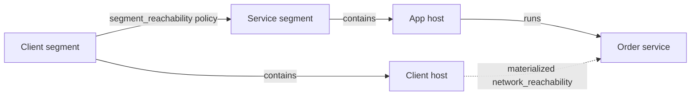

# Context Graph and Reachability

The context graph stores the network model. It uses typed nodes and directed
edges. It describes hosts, services, vulnerabilities, network segments,
credentials, and mission capabilities.

Use the canonical terms in [vocabulary.md](vocabulary.md).

## Endpoints catalog

The graph has six node types.

| Node type | Meaning |
| --- | --- |
| `host` | A compute resource. |
| `service` | An application that listens on a protocol and port. A port is a service attribute, not a node. |
| `network_segment` | A container for hosts. |
| `vulnerability` | A weakness of a host or service. It carries CVSS characteristics and a scenario exploit probability. |
| `credential` | A secret that authenticates to a service. |
| `mission_capability` | An outcome that one or more hosts support. |

The graph has seven persisted relationship types. Each row lists valid
endpoints as `from -> to`.

| Relationship | Meaning | Valid endpoints |
| --- | --- | --- |
| `contains` | A segment contains a host. Each host belongs to exactly one segment. | `network_segment -> host` |
| `runs` | A host runs a service. Each service has exactly one host. | `host -> service` |
| `segment_reachability` | The source segment may reach matching services in the target segment. It carries protocol and port range. This is the only authored network-policy edge. | `network_segment -> network_segment` |
| `has_vulnerability` | A host or service exposes a vulnerability. It carries required and granted privilege. | `host -> vulnerability`, `service -> vulnerability` |
| `stores_credential` | A host stores a credential. It carries required privilege. | `host -> credential` |
| `authenticates_to` | A credential authenticates to a service. It carries granted privilege. | `credential -> service` |
| `supports` | A host supports a mission capability. | `host -> mission_capability` |

One relationship is operational, not authored. `network_reachability` is an
empty marker edge from a host to a service. The context graph never persists
it. The save path rejects it. Because saved revisions never contain it, the
comparison path sees policy only, never derived flows.

The node types live in `src/lib/network_defense/nodes/registry.ex`. The
relationship types live in `src/lib/network_defense/relationships/registry.ex`.
Valid endpoints live in `src/lib/network_defense/graph/semantic_connectivity.ex`.

## Authored policy and derived reachability

Reachability is policy, not a measured flow. The system authorizes traffic at
the segment boundary. It derives host-to-service flows in memory.

`segment_reachability` is the only persisted reachability edge. It links a
source segment to a target segment. It has `protocol`, `port_start`, and
`port_end`. A rule matches a service when its protocol equals the service
protocol or is `any`, and its range is absent or contains the service port.

Reachability is deny by default. A flow exists only when a matching policy
links the source host segment to the target host segment. There is no implicit
self-access. Same-segment movement requires an explicit policy from the segment
to itself.

The materializer turns every matching policy rule into one effective
`network_reachability` edge for each `{source host, target service}` pair. It
merges all matching rules into one edge. It deduplicates and sorts the result.
Its output is deterministic.

The projection exists only in memory. The canonical graph stores no
`network_reachability` edge. Re-running materialization from the same revision
reproduces the same flows. The projection logic lives in
`src/lib/network_defense/graph/materialize_reachability.ex`. The policy data
schema lives in `src/lib/network_defense/relationships/segment_reachability.ex`.

## Topology projection

Reachability projection (above) derives flows. Topology projection derives
placement. For both, meaning belongs to Elixir and geometry belongs to the
browser.

The graph-domain projector derives graph meaning. It decides segment and host
membership, context anchors, grouped segment policy, grouped operational flows,
summary counts, result order, and placement issues. It is a pure function of a
graph. Dashboard handlers only validate transport data and serialize its
result.

The browser derives geometry and interaction. It reads names, fields, and saved
positions from the editable graph contract, then computes rectangles, edge
paths, viewport scale, zoom detail, focus lenses, and pins. It never infers
membership, ownership, anchors, or groups from raw edges.

This split keeps each rule in one place. The rule that a host belongs to one
segment is a graph rule, so Elixir states it once. Whether a card fits its
label is a rendering rule, so the browser owns it. The browser joins projection
IDs to graph entities and consumes the projection roles; it does not repeat
the graph rules. The projector is
`src/lib/network_defense/graph/topology_projection.ex`. The browser projection
model is
`src/assets/svelte/dashboard/graph/topology-projection-model.svelte.ts`, and the
browser scene join is `src/assets/svelte/dashboard/graph/topology-scene.ts`.

## Graph revisions

A graph has an immutable, linear revision history. Each graph starts with one
`initial` revision. An edit appends an `edit` revision. An optimization appends
an `optimization` revision. A new revision points to one parent revision. No
revision changes after the system saves it.

A save names the base revision that the editor edited. The system accepts the
save only when that base revision belongs to the same graph. If the base
revision is unknown or belongs to another graph, the system rejects the save
with an `invalid_base_revision` error.

This page states behavior only. It does not describe persistence internals.
The revision history lives in `src/lib/network_defense/graph/graphs.ex` and
`src/lib/network_defense/graph/graph_revision.ex`.

## Baseline topology and scenario provenance

The current baseline uses one fixed, synthetic topology. It lets a reviewer
compare equal-action-count defenses under one controlled policy and attacker
model. It does not measure real enterprise effectiveness. The approved
topology-scale study requires frozen controlled variants, but they are not
implemented. See [scope.md](scope.md) for that research boundary.

Segment policies represent logical enforcement. Gateway and bastion systems are
hosts. The attack rules act on their services. Router and firewall node types
are out of scope.

The scenario follows: external network compromise, then lateral movement
through remote services. These concepts follow NIST SP 800-207 and the MITRE
ATT&CK techniques T1190 and T1021.

Each attacker context has its own evaluation manifest. The manifests share the
graph. Do not compare results across footholds. Each estimate is valid only for
its own start point.
