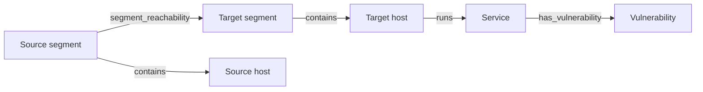

# System Model

The system has three concerns:

* a persistent context graph describing the environment;
* a simulator that models stochastic attack propagation;
* a defense optimizer that evaluates cost-constrained changes to the environment.

The graph is shared by simulation runs. Each run keeps its own attacker state. This separation allows baseline and defended configurations to be compared reproducibly. Planned extensions are described in [`thesis-scope-roadmap.md`](thesis-scope-roadmap.md).

## Context Graph

The context graph represents infrastructure, services, vulnerabilities, reachability, and security-relevant relationships. It is stored as typed nodes and directed edges and remains unchanged during a simulation run.

The thesis baseline uses these node types:

* `host`;
* `service`, including protocol and port;
* `vulnerability`, including CVSS and an explicitly modeled exploit probability;
* `network_segment`, a container of hosts;
* `credential`.

The baseline uses these edge types:

* `contains` - a network segment contains a host;
* `runs` - a host runs a service;
* `segment_reachability` - a source segment can reach a target segment's services. The policy carries protocol and port range;
* `has_vulnerability` - a service exposes a vulnerability;
* `stores_credential` - a host stores a credential;
* `authenticates_to` - a credential authenticates to a service.

Reachability is policy, not a host/service flow. `segment_reachability` is the only authored and persisted reachability edge. Materialization derives an empty, deterministic `network_reachability` (`Host -> Service`) marker edge in memory for each flow the policy admits. The marker is never authored, saved, or part of a contract edge.

A port is a service attribute, not a separate node. Capabilities, containers, and security controls are future extensions.



The `runs` edge identifies the host compromised after a successful exploit. A flow exists only when the source host's segment and the target host's segment are linked by a matching policy.

## Attacker State

Attacker state describes one simulation run and is separate from the context graph. It records:

* current footholds;
* attempted actions;
* executed actions and outcomes;
* state transitions;
* compromised resources.

The graph stays immutable while the attacker state evolves. A successful exploit adds the target host as a foothold. Attempt records prevent unlimited retries unless a rule defines an explicit retry policy.

## Attack Execution

Rules determine which actions are possible. A rule evaluates the context graph, attacker state, current foothold, previous actions, and simulation configuration, then returns candidate actions without mutating state.

The baseline rule models remote service exploitation. It requires:

* a foothold on the source host;
* directed reachability to a target service;
* a host running that service;
* an applicable vulnerability;
* satisfied vulnerability preconditions;
* an available exploit attempt.

The baseline action is `ExploitVulnerability`. The simulator selects a candidate action, resolves its deterministic or stochastic outcome, applies the state transition, and records the event. A run stops when no action is available or a configured limit or objective is reached.

## Monte Carlo Evaluation

A Monte Carlo experiment executes `N` independent runs against the same context graph. Each run receives an independent deterministic random seed derived from the experiment seed and run index.

The experiment aggregates blast-radius measurements and other run results. The baseline blast radius is the number of compromised compute resources:

```text
blast_radius = count(compromised_resources)
expected_blast_radius = mean(blast_radius across runs)
```

The expected blast radius is the primary optimization metric. Median, percentiles, variance, and per-resource compromise probability support analysis of distribution and stability.

## Defense Optimization

The defense optimizer changes the context graph or its security configuration, not the temporary attacker state of an individual run.

For each candidate configuration, it:

1. applies defensive actions to a copy or projection of the graph;
2. runs a Monte Carlo experiment;
3. compares attack-impact metrics with the baseline;
4. accounts for defensive cost.

The initial defensive actions are patching a vulnerability, removing a segment reachability policy, and revoking a credential. Each action has a cost.

The primary objective is:

```text
minimize expected blast radius
subject to total defense cost <= budget
```

The optimizer can also rank actions by expected blast-radius reduction per unit of cost.

## Baseline Strategies

Evaluation compares simulation-informed optimization with simpler strategies under the same budget:

* no defense;
* random action selection;
* CVSS-based patch prioritization;
* topology-based segmentation by segment-policy removal;
* greedy simulation-informed selection.

The optimizer evaluates every selected configuration through the same simulation process so that strategy comparisons use consistent attack and cost metrics.
