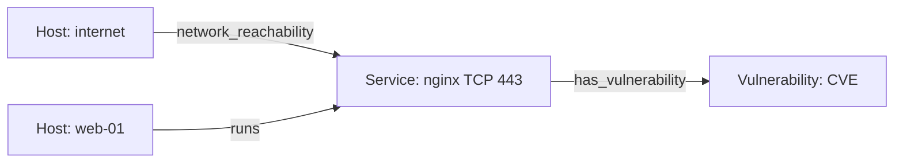

# Overview

The system consists of two main components:

* a Monte Carlo simulation engine that models attacker actions, compromise propagation, and lateral movement;
* a defense optimizer that evaluates defensive actions and strategies for reducing attack blast radius under a constrained defense budget.

The simulation engine operates on a persistent context graph and maintains the dynamic state of each attack simulation separately.

The defense optimizer modifies the context graph or its security configuration and evaluates the resulting configurations through repeated Monte Carlo simulations.

# Context graph

The context graph represents the environment in which attacks are simulated.

It contains:

* infrastructure topology;
* logical and physical compute resources;
* applications and services;
* network reachability;
* vulnerabilities;
* security-relevant relationships;
* possible effects of successful exploitation.

The graph represents the state of the environment, not the state of a particular attack run.

In PostgreSQL, the graph is stored as typed nodes and edges. For simulation, it is loaded into an in-memory representation optimized for traversal and relationship lookup, such as adjacency lists and type-specific indexes.

## Initial node types

The thesis baseline uses three node types:

* `host`;
* `service`, including its protocol and port;
* `vulnerability`, including CVSS and an explicitly modeled exploit probability.

Capabilities, credentials, containers, network segments, and security controls are extensions. A port is a service attribute, not a separate graph node.

## Initial edge types

The thesis baseline uses:

* `runs`;
* `network_reachability`;
* `has_vulnerability`;

## Example



The reachability edge identifies the exact service that a foothold can contact. The `runs` edge identifies the host compromised by a successful exploit.

# Simulator

The simulator executes repeated stochastic attack simulations.

A Monte Carlo experiment consists of `N` independent simulation runs. Each run has a deterministic seed derived from the experiment seed and run index.

## Inputs

A simulation run receives:

* a context graph;
* an initial attacker state;
* a set of attack rules;
* an action-selection policy;
* a random-number generator state;
* simulation limits and stopping conditions.

## Outputs

A simulation run produces:

* the final attacker state;
* a sequence of executed actions;
* a sequence of state transitions;
* the set of compromised resources;
* blast-radius metrics;
* termination metadata.

A Monte Carlo experiment additionally produces aggregated statistics such as:

* mean blast radius;
* median blast radius;
* standard deviation;
* selected percentiles;
* per-resource compromise probability;
* action frequency;
* attack-path frequency.

# Attacker state

The attacker state represents the dynamic state of one simulation run.

It is intentionally stored separately from the context graph so that:

* many simulations can run against the same graph;
* each simulation can have an independent state;
* the graph remains immutable during a run;
* attacker behavior and environmental structure can evolve independently;
* baseline and defended configurations can be compared reproducibly.

## Example

```yaml
footholds:
  - internet

attempted_actions:
  - source_host: internet
    vulnerability: CVE-2024-1
```

## Footholds

A foothold represents a resource from which the attacker can perform further actions.

The thesis baseline records only the compromised host identifier. The initial foothold is part of the attack scenario. A successful exploit adds the target host as a new foothold. Attempted actions prevent unlimited retries.

# Rules

Rules determine which attacker actions are possible in the current simulation state.

A rule inspects:

* the context graph;
* the attacker state;
* the current foothold;
* previous actions;
* simulation configuration.

A rule does not modify the attacker state directly. It produces zero or more candidate actions.

## Rule contract

Conceptually, a rule implements:

```text
applicable_actions(context_graph, attacker_state) -> [action]
```

## Example rule

```text
Rule: remote_service_exploitation

Conditions:

- the attacker has a foothold on the source node;
- the source host has directed reachability to a target service;
- a target host runs that service;
- the service has an applicable vulnerability;
- the attacker satisfies the vulnerability preconditions;
- the same exploit attempt has not already been exhausted.

Result:

- produce an ExploitVulnerability action.
```

Rules should describe reusable attack semantics rather than individual attack paths.

# Actions

An action is a concrete attacker operation that may transition the attacker state from state `S_n` to state `S_n+1`.

Rules generate candidate actions. The action-selection policy chooses an action. The action executor resolves its outcome and applies the resulting state transition.

## Action lifecycle

```text
context graph + attacker state
            ↓
        evaluate rules
            ↓
      candidate actions
            ↓
       select action
            ↓
 resolve deterministic or stochastic outcome
            ↓
       update attacker state
            ↓
         record event
```

## Initial action types

The thesis baseline has one action:

* `ExploitVulnerability`.

Later action types may include:

* `DiscoverNode`;
* `DiscoverService`;
* `ExploitVulnerability`;
* `EscalatePrivilege`;
* `ReuseCredential`;
* `MoveLaterally`;
* `EscapeContainer`.

## Example action

```yaml
type: exploit_vulnerability
source_host: internet
target_host: web-01
service: nginx/tcp/443
vulnerability: CVE-2024-1
success_probability: 0.8
```

## Example successful result

```yaml
outcome: success

state_changes:
  - add_foothold:
      node_id: web-01
```

## Example failed result

```yaml
outcome: failure

state_changes:
  - mark_action_attempted:
      type: exploit_vulnerability
      source_host: internet
      vulnerability: CVE-2024-1
```

The minimal model should avoid unlimited retries. Each action should either be attempted once or have an explicit retry policy.

# Simulation loop

A single simulation run follows this loop:

```text
1. Initialize attacker state.
2. Evaluate rules against the current graph and attacker state.
3. Generate candidate actions.
4. Stop if no actions are available.
5. Select one action using the configured policy.
6. Resolve the action outcome.
7. Apply the resulting state transition.
8. Record the action and outcome.
9. Repeat until termination.
```

Possible termination conditions include:

* no applicable actions;
* no active attack frontier;
* maximum step count reached;
* target objective reached;
* maximum simulation duration reached.

# Blast radius

The minimal blast-radius metric is the number of compromised compute resources:

```text
blast_radius = count(compromised_resources)
```

Later extensions may include:

* weighted resource impact;
* critical-resource compromise probability;
* compromised application count;
* affected network-segment count;
* expected financial or operational impact.

For Monte Carlo experiments, the principal metric is the expected blast radius:

```text
expected_blast_radius = mean(blast_radius across simulation runs)
```

# Defense optimizer

The defense optimizer proposes and evaluates modifications to the context graph or its security configuration.

It does not optimize the temporary attacker state of one simulation run.

For each candidate defense configuration, the optimizer:

1. applies defensive actions to a copy or projection of the context graph;
2. executes a Monte Carlo experiment;
3. calculates attack-impact metrics;
4. compares the result with the baseline;
5. evaluates the reduction relative to defensive cost.

## Defense actions

Initial defense actions may include:

* patch a vulnerability;
* block a network link;
* restrict network reachability;
* disable an application.

Each defensive action has a cost.

## Optimization objective

Conceptually:

```text
minimize expected blast radius
subject to total defense cost <= budget
```

A strategy may instead rank actions by:

```text
expected blast-radius reduction / defense cost
```

# Defense strategies

## Primary strategies

### CVSS-based prioritization

Selects patches according to vulnerability severity.

This strategy does not require attack simulation to select actions, but its result is evaluated by the simulator.

### Min-cut segmentation

Uses the network topology to identify a low-cost set of network links whose removal separates attacker entry points from protected targets.

This strategy is primarily applicable to network segmentation.

Its proposed configuration is subsequently evaluated through Monte Carlo simulation.

### Greedy simulation-informed optimization

At each optimization step:

1. generate candidate defensive actions;
2. evaluate every candidate using Monte Carlo simulation;
3. select the action with the greatest blast-radius reduction relative to cost;
4. repeat until the defense budget is exhausted.

### Random selection

Randomly selects defensive actions under the same budget constraints.

This strategy provides a control baseline.

# Planned extensions

## Additional optimization strategies

Possible extensions include:

* heuristic search;
* beam search;
* simulated annealing;
* genetic optimization;
* hybrid topology- and simulation-informed strategies.

## Incomplete defender knowledge

The experiment model may distinguish between:

* the ground-truth context graph;
* the graph observed by the defender;
* attacker knowledge maintained during simulation.

The defense optimizer operates on the defender-observed graph, while the selected defenses are evaluated against the ground-truth graph.

This allows evaluation of strategy robustness when:

* vulnerabilities are unknown;
* assets are missing from inventory;
* network relationships are incomplete;
* application versions are outdated;
* the attacker possesses knowledge unavailable to the defender.
