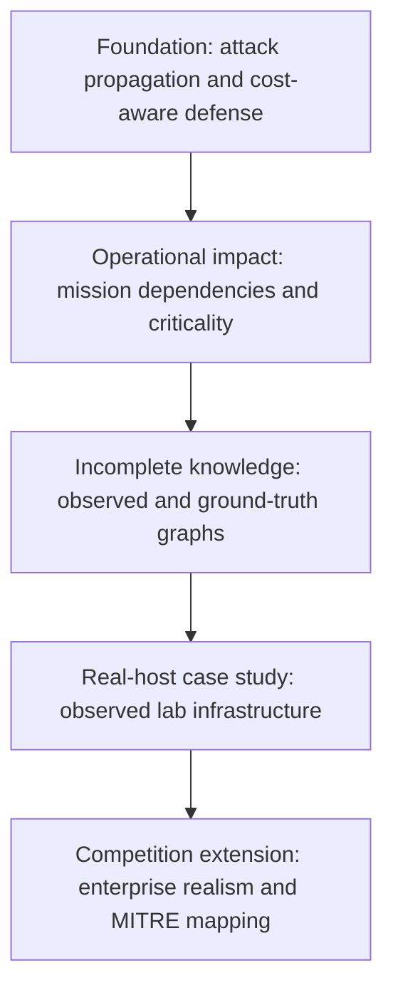

# Thesis Scope Roadmap

## Direction

The initial attack-propagation model is the first valid milestone, not the thesis ceiling. The thesis should develop into resilience-oriented defense planning under incomplete knowledge.

## Revised Research Question

> How effectively can simulation-informed, cost-aware defense optimization minimize expected mission impact in partially observed enterprise networks compared with severity- and topology-based prioritization?

## Research Claims

The evaluation should test three claims:

1. Propagation-aware optimization outperforms local severity and topology heuristics.
2. Cost-aware combinations of patching and segmentation reduce mission impact more effectively than patch-only defense.
3. Reachability controls and robust strategies retain value when the defender has incomplete asset and vulnerability knowledge.

## Development Layers

### Foundation

Model hosts, services, vulnerabilities, and directed reachability. Simulate remote exploitation, then optimize patching and segmentation under a normalized operational-cost budget.

Compare the proposed optimizer against no defense, random selection, CVSS prioritization, centrality prioritization, and topology-driven segmentation.

### Operational Impact

Add asset criticality and business-service or mission-capability nodes. Model how infrastructure and applications support operational capabilities through dependency relationships.

Evaluate expected mission loss and probability of mission-service failure alongside blast radius.

### Incomplete Defender Knowledge

Maintain separate graphs for the defender's observations and the ground truth. The ground truth can contain unobserved assets, services, reachability relationships, and vulnerabilities. The optimizer must use only the observed graph; evaluation occurs against the ground truth.

Measure how each strategy changes as observation coverage declines. Compare risk-neutral expected-loss selection with conservative strategies that minimize tail or worst-case loss.

### Real-Host Case Study

Use agents to observe package versions, exposed services, and reachability in a self-hosted lab. Convert observations into the same source-agnostic graph used for synthetic experiments.

Compare predicted risk reduction after a patch or network-control change with the updated observed graph. Automated remediation is optional; reliable observation and reproducible before-and-after measurements provide the research value.

### Competition Extension

Use enterprise roles such as identity services, jump hosts, CI/CD, backup infrastructure, databases, and administrative workstations. Map implemented attacker behaviors to MITRE ATT&CK techniques.

Frame the system as an operational cyber-resilience platform that minimizes mission impact, not as a vulnerability dashboard.

## Scope Boundary

Avoid adding features that do not test one of the research claims. Reinforcement learning, graph neural networks, chat interfaces, autonomous offensive agents, and generic malware detection are outside this scope.

## Milestone Rule

Treat each layer as a standalone, evaluated contribution. Do not start the next layer until the previous layer has a reproducible experiment, baselines, and documented validity limits.
