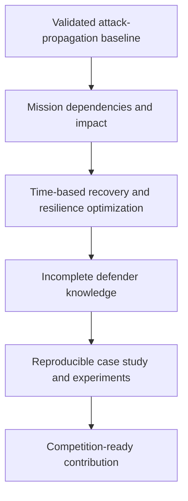

# Thesis Scope Roadmap

## Research Framing

The thesis develops and evaluates a graph-based method for selecting preventive and recovery controls that preserve critical capabilities during multi-stage cyberattacks.

Working title:

> Graph-Based Modelling and Optimization of Cyber Resilience in Mission-Critical Enterprise Networks

The contribution is not a generic cyber-resilience platform. It is a reproducible decision method that joins attack propagation, mission dependencies, recovery capacity, and constrained defensive investment.

Blast radius remains an explanatory measure of attacker reach. The primary outcome is mission loss over time.

Mission and recovery claims are planned extensions, not part of the current thesis scope.

## Research Question

> To what extent does a graph-based model combining attack propagation, mission dependencies, and recovery capacity improve the selection of cost-constrained cyber-resilience controls compared with severity- and topology-based prioritization?

## Research Claims

The evaluation should test these claims:

1. Severity-only prioritization can select controls that do not minimize mission loss in interconnected networks.
2. Propagation-aware optimization selects more effective controls than CVSS, centrality, random, and no-defense baselines under the same budget.
3. Combining preventive controls with prepared recovery capacity reduces cumulative mission loss and restoration time more effectively than prevention alone.
4. The proposed strategy retains value when the defender has incomplete knowledge of the environment.

## Model Boundary

The system models mission-critical enterprise IT. It does not claim to represent every cyber threat, operational technology environment, or a real military network.

The static context graph contains:

* hosts, technical services, vulnerabilities, and directed reachability;
* mission-capability nodes that represent outcomes the organization must preserve;
* support and dependency relationships that determine how infrastructure failure disrupts a capability;
* recovery relationships between backup or standby infrastructure and protected hosts.

The dynamic state of one run remains separate from the context graph:

* attacker state records footholds, access, and attempted actions;
* system state records compromise, availability, isolation, restoration, and pending recovery events;
* mission availability is derived from the system state and declared dependency rules.

A capability must declare whether all, any, or a threshold number of supporting resources are needed. This makes redundancy and failover measurable rather than assumed.

Network segments are first-class graph entities: `network_segment` nodes contain hosts, and `segment_reachability` is the directed cross-segment policy. Organizational units and long-lived controls remain attributes or configuration unless a simulation rule requires them as first-class graph entities. Credentials and privilege levels are added only with attacker behaviors that use them.

## Resilience Objective

The optimizer selects a portfolio before an attack. It chooses preparations, not autonomous runtime decisions.

```text
minimize expected cumulative mission loss over a fixed time horizon
subject to defense and recovery-preparedness budget
```

Initial control classes are:

* vulnerability patching;
* reachability restriction or segmentation;
* isolation preparation after detection;
* backup restoration preparation;
* failover preparation for supported capabilities.

Each control has an investment cost and, where relevant, an operational cost or recovery delay. During a simulation, configured recovery policies may trigger after an attack event.

## Development Layers



### 1. Validated Attack-Propagation Baseline

Complete the simulation and optimizer before broadening the model. Independent deterministic runs, event traces, explicit attacker action selection, graph-changing defensive controls, and budget compliance are prerequisites for evidence.

Compare no defense, random selection, CVSS prioritization, graph-centrality prioritization, topology-driven segmentation, and the proposed strategy.

### 2. Mission Dependencies And Impact

Add mission-capability nodes and support/dependency relationships. Distinguish compromise from operational unavailability. Evaluate mission disruption rather than treating every compromised host as equally important.

### 3. Time-Based Recovery And Resilience

Introduce discrete simulation time, detection assumptions, isolation, restoration delays, and failover. Derive each capability's availability after every state transition.

Evaluate probability of mission disruption, cumulative mission loss, time to disruption, time to restoration, and blast radius. Blast radius remains secondary evidence of propagation.

### 4. Incomplete Defender Knowledge

Maintain an observed graph for optimization and a ground-truth graph for evaluation. Vary observation coverage and compare expected-loss selection with conservative strategies that limit tail loss.

### 5. Reproducible Evidence

Use synthetic enterprise scenarios with identity services, jump hosts, remote access, CI/CD, databases, administrative workstations, and backup infrastructure. A self-hosted lab may supply a separate case study, but synthetic experiments remain the controlled evidence.

Map implemented attacker behaviors to MITRE ATT&CK. The mapping documents modeled behavior; it does not claim complete ATT&CK coverage or adversary emulation.

## Original Contribution

The original contribution is the experimentally evaluated integration of three decisions normally assessed separately:

* where an attack can propagate;
* which technical assets sustain a critical capability;
* which limited preventive and recovery preparations minimize disruption over time.

The thesis should demonstrate a concrete result: a lower-severity or less central vulnerability can be the correct priority when it threatens a mission dependency, while a high-severity isolated vulnerability may not be. It should also show when recovery capacity changes the optimal preventive investment.

## Competition Fit

The Konkurs im. Mariana Rejewskiego evaluates substantive value, independent research, innovation, and significance for national defense. This work addresses those criteria through:

* a transparent, testable model instead of an opaque dashboard claim;
* controlled comparisons against credible defensive baselines;
* a measurable contribution to continuity of critical digital capabilities;
* realistic but non-sensitive enterprise scenarios relevant to public-sector and defense-supporting environments;
* explicit assumptions, reproducible experiments, and threats to validity.

The intended practical value is decision support for prioritizing finite cyber-defense and recovery resources. The thesis must not claim that its simulated results prove effectiveness in a production or military environment.

## Scope Boundary

Do not add features that fail to test a research claim. Reinforcement learning, graph neural networks, chat interfaces, autonomous offensive agents, generic malware detection, full SOC orchestration, and automated remediation are outside scope.

## Milestone Rule

Treat each layer as a standalone evaluated contribution. Do not start the next layer until the current layer has a reproducible experiment, defined baselines, tests, and documented validity limits.
