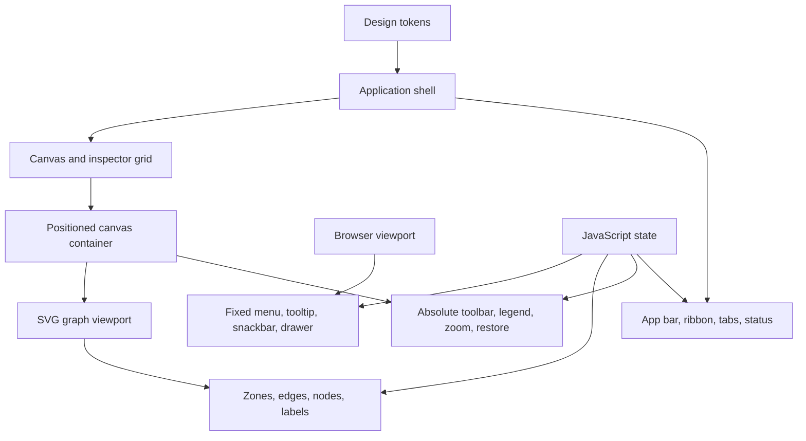
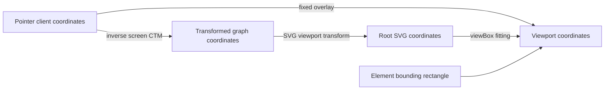
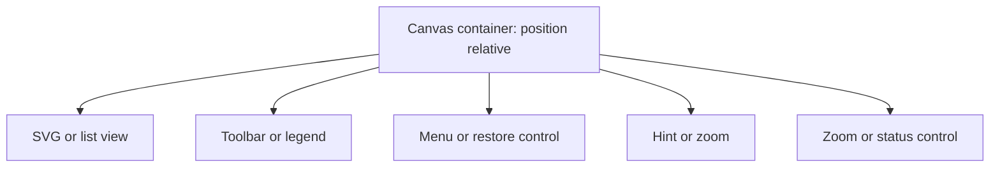
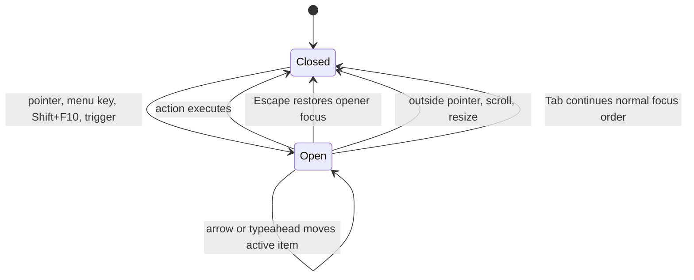
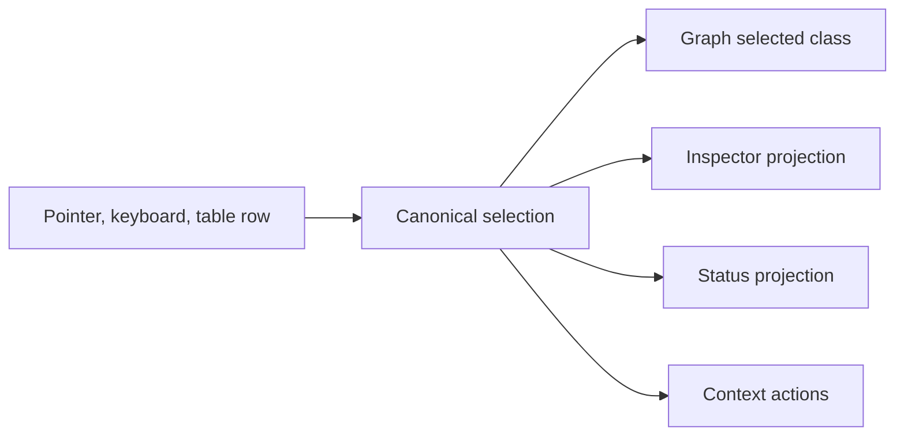

# Dashboard component implementation guide

This guide explains the implementation principles behind the topology-editor and simulation-analysis wireframes. It is intended for someone rebuilding the same component types with HTML, CSS, and JavaScript, rather than copying the prototypes verbatim.

The current source of truth is:

- `dashboard-tokens.css` for shared visual primitives.
- `wireframe-4-topology-editor.html` for topology editing, force layout, graph dragging, and the first overlay implementation.
- `wireframe-5-simulation-analysis.html` for simulation comparison, responsive inspector behavior, and the more complete context-menu implementation.

Values such as dimensions, colors, force constants, graph data, and breakpoints should be read from those files. This guide focuses on why the components work and which calculations are required.

## 1. System model

The dashboards have four implementation layers:

1. Normal-flow application layout uses CSS Grid and Flexbox.
2. Canvas chrome uses absolute positioning inside a deliberately positioned canvas container.
3. Transient overlays use fixed positioning in viewport coordinates.
4. Graph content uses an SVG coordinate system transformed by pan and zoom.



This separation is important. Grid and Flexbox should solve stable page structure. Absolute or fixed positioning should solve overlays whose position is derived from an anchor or coordinate. SVG transforms should move graph content without moving canvas controls.

## 2. Coordinate systems

Most difficult dashboard bugs are coordinate-system bugs. Identify the coordinate space before writing placement code.

| Coordinate space | Origin | Typical units | Used by |
|---|---|---|---|
| Layout flow | Parent content box | CSS pixels | Shell, ribbon, tabs, workspace |
| Positioned ancestor | Padding box of nearest positioned ancestor | CSS pixels | Canvas toolbar, legend, zoom controls |
| Viewport | Browser viewport top-left | CSS pixels | Context menu, tooltip, snackbar, fixed drawer |
| SVG root | SVG `viewBox` top-left | Graph units | Nodes, edges, zones, labels |
| Transformed graph viewport | SVG root after pan and zoom | Graph units | Draggable and zoomable graph content |



Use these rules:

- `event.clientX` and `event.clientY` are viewport coordinates.
- `getBoundingClientRect()` returns viewport coordinates.
- CSS `position: fixed` consumes viewport coordinates when it is attached near the document root. A transformed, filtered, or perspective ancestor can establish a different containing block for a fixed descendant.
- CSS `position: absolute` consumes coordinates from the nearest positioned containing block.
- SVG `x`, `y`, path commands, and transforms consume SVG graph units.
- `getScreenCTM().inverse()` converts a screen point back through SVG fitting, pan, zoom, and ancestor transforms.

Do not assign raw SVG coordinates to a fixed HTML overlay. Do not assign `clientX` directly to an element positioned inside a scaled SVG or canvas container.

## 3. Shared design tokens

### Purpose

Tokens keep components visually compatible and make theme changes independent of component logic. The wireframes centralize neutral colors, type families, spacing, radii, shadows, recurring control sizes, and focus colors. Graph-semantic colors remain local because their meaning differs by view.

### CSS mechanism

Declare custom properties on `:root`, then override only theme-specific properties on a root data attribute.

```css
:root {
  --color-surface: ...;
  --space-unit: ...;
  --control-height: ...;
}

:root[data-theme="analysis"] {
  --color-accent: ...;
}
```

Components consume semantic names such as `--color-border` rather than palette names such as `--gray-300`. Semantic naming permits a theme to change the value without changing component CSS.

### What to consider

- Keep spacing on a small base grid so neighboring components align.
- Use tabular numerals for changing counts, probabilities, zoom values, and status metrics.
- Use a dedicated focus token rather than reusing the accent color blindly.
- Reserve elevation tokens for overlays and floating controls; do not use shadows as the primary layout boundary.
- Validate contrast after every theme override.

### 3.1 SVG icon system

The wireframes define reusable SVG `<symbol>` elements once and render instances with `<use>`. This avoids repeating path data and keeps stroke behavior consistent.

Use a decorative icon inside a button only when the button already has visible text or an accessible name. Hide that icon from the accessibility tree. If an icon itself conveys unique content, give the surrounding component a text alternative rather than relying on the symbol ID.

SVG symbols have their own `viewBox`. The rendered `<svg>` supplies CSS dimensions, while the browser scales the symbol into that viewport. Use `currentColor` for strokes and fills when icon color should inherit button state.

Set `pointer-events: none` on decorative icon content when the parent button or graph group owns the interaction. This keeps event targets stable when a pointer lands on an internal path.

### 3.2 Buttons, toggles, and segmented controls

Use a native `<button>` for every command. Visual styling does not replace button semantics, keyboard activation, disabled behavior, or focus handling.

Choose state attributes by meaning:

| Interaction | State mechanism |
|---|---|
| Executes one command | No persistent ARIA state |
| Toggles one option | `aria-pressed` |
| Expands another element | `aria-expanded` and `aria-controls` |
| Chooses one tab panel | `role="tab"` and `aria-selected` |
| Opens a menu | `aria-haspopup="menu"` and `aria-expanded` |

A segmented graph/list switch is a group of toggle buttons with exactly one pressed state. Keep its visual state, controlled-element visibility, and ARIA state synchronized in one function.

Do not remove focus outlines. Use `:focus-visible` so keyboard focus is prominent without forcing a ring after every pointer click. Hover, pressed, selected, and disabled states must remain distinguishable without color alone.

### 3.3 Legends, badges, metrics, and property values

A legend is normal-flow content inside an absolutely positioned surface. Use Flexbox for marker-label pairs. Line samples should reproduce meaningful differences such as solid versus dashed, not only color. Every marker needs adjacent text.

Badges summarize categorical state. They should not be the only source of the state; repeat the meaning in the selected object's accessible label or property description.

Use a definition list for read-only property/value pairs. Use labeled native form controls for editable properties. Numeric data benefits from a monospace family or `font-variant-numeric: tabular-nums`, especially when values update in place.

### 3.4 Visually hidden content

SVG symbol libraries and extra accessible descriptions sometimes need to remain available to assistive technology without occupying layout space. A visually hidden utility uses absolute positioning, a minimal box, clipping, and hidden overflow.

Do not use `display: none`, the `hidden` attribute, or `visibility: hidden` when content must remain in the accessibility tree. Conversely, do use `hidden` when inactive controls must not be focusable, as with a closed menu or snackbar.

## 4. Application shell

### HTML

Use semantic regions: `<header>`, `<nav>`, `<main>`, `<aside>`, and `<footer>`. The main shell should own the height of the application.

### CSS

Use Grid for the stable vertical tracks:

```css
.app {
  min-height: 100dvh;
  display: grid;
  grid-template-rows: auto auto minmax(0, 1fr) auto;
}
```

`minmax(0, 1fr)` is important. Without the zero minimum, a large canvas or table can force the grid track beyond the viewport instead of scrolling inside itself.

### JavaScript

The shell should have little behavioral code. State belongs to tabs, documents, views, and inspectors. Keeping the shell passive prevents unrelated interactions from becoming coupled.

### Responsive behavior

At narrow widths, allow the shell to become content-height if the design must scroll vertically. Prefer `100dvh` over `100vh` for mobile browser chrome. Do not hide critical commands only because their labels no longer fit; preserve an accessible name on icon-only controls.

## 5. App bar

### HTML and CSS

The app bar is a Flexbox row. Brand, file context, and actions remain in normal flow. `margin-inline-start: auto` pushes actions to the far edge without absolute positioning.

### State

Document activation may update the visible document name and save state. Treat that text as a projection of active-document state, not independent state stored in the header.

### Accessibility

- Use actual `<button>` elements for actions.
- Give icon-only buttons an `aria-label`.
- Keep an avatar as text or an image unless it opens a menu; only then should it be a button.
- Do not rely on a colored dot alone to communicate save or connection status.

## 6. Command ribbon

The ribbon combines an ARIA tab interface with normal-flow command groups.

### HTML

Use a tab list containing tab buttons. Every tab references one panel with `aria-controls`, and every panel references its tab with `aria-labelledby`.

```html
<div role="tablist" aria-label="Commands">
  <button role="tab" aria-selected="true" aria-controls="panel-a">...</button>
</div>
<div id="panel-a" role="tabpanel">...</div>
```

### CSS

Use Grid to stack the tab strip over the panel. Use Flexbox inside the panel for command groups. A group label may be absolutely positioned at the bottom of a `position: relative` group when commands of different heights must align above one shared caption.

Absolute group labels require bottom padding in the group. That padding reserves layout space which the removed-from-flow label would otherwise cover.

### JavaScript tab state

Only the active tab participates in the normal tab sequence:

- Active tab: `tabindex="0"`, `aria-selected="true"`.
- Inactive tab: `tabindex="-1"`, `aria-selected="false"`.
- Active panel: no `hidden` attribute.
- Inactive panel: `hidden`.

For `N` visible tabs and current index `i`, wrap arrow navigation with:

$$
i_{next} = (i + direction + N) \bmod N
$$

Use `direction = 1` for Right Arrow and `direction = -1` for Left Arrow. Home selects index zero; End selects index `N - 1`.

### Responsive behavior

The wireframes hide command text at compact widths. A production command must retain an accessible name through `aria-label`. If command groups overflow, prefer horizontal scrolling or an overflow menu over silently dropping required commands.

## 7. Document tabs and overlaid close buttons

Document tabs need two independent actions: activate the document and close the document. A close icon nested inside the tab button creates nested interactive controls, which is invalid and ambiguous.

### HTML

Use a relative wrapper with sibling buttons:

```html
<div class="document-item">
  <button role="tab">Document name</button>
  <button class="document-close" aria-label="Close document">...</button>
</div>
```

### CSS

The wrapper is `position: relative`. The close button is `position: absolute` and pinned to one edge. Add equivalent padding to the tab so its text cannot run underneath the close button.

The relationship is:

$$
P_{reserved} \ge W_{close} + G
$$

where `P_reserved` is tab padding on the close-button side, `W_close` is the close hit target, and `G` is the desired gap.

### JavaScript

Keep open/closed state by stable document ID. When closing:

1. Reject the close if the interface requires at least one open document.
2. Record whether the document is active.
3. Remove or hide its wrapper.
4. If it was active, activate the nearest remaining document.
5. Move focus to a remaining tab when the close button itself is removed.
6. Update `aria-labelledby` on the shared tab panel.

Build the visible-tab sequence before closing. If the closed document occupied index `c` in that visible sequence and `R` documents remain, a simple replacement is:

$$
i_{replacement} = \min(c, R - 1)
$$

Filter hidden documents before keyboard index calculations. Otherwise arrow navigation can focus a closed tab.

The prototypes calculate `c` from all document wrappers and then apply it to the remaining visible tabs. That can skip the nearest neighbor after multiple earlier tabs have already closed. Production code should calculate both the closed index and replacement from visible sequences.

### State to preserve

Each document may need its own selection, pan, zoom, graph/list view, filters, dirty state, and inspector state. Store these in a map keyed by document ID rather than in DOM text.

## 8. Workspace and inspector grid

### Desktop layout

Use a two-column Grid:

```css
.workspace {
  display: grid;
  grid-template-columns: minmax(0, 1fr) var(--inspector-width);
  min-height: 0;
}
```

Collapsing the inspector can switch the second track to zero or remove it entirely. The canvas remains a flexible track and consumes the freed space.

### Inspector content

Use `<aside>` for inspector semantics. Use a scrollable body and a sticky header so the close action remains reachable:

```css
.inspector-header {
  position: sticky;
  inset-block-start: 0;
  z-index: 1;
}
```

Sticky positioning remains in layout flow, unlike absolute positioning. It behaves like a normal element until scrolling would move it beyond its inset. It sticks within its nearest relevant scrolling ancestor, not automatically the browser viewport. It needs at least one inset, and ancestor `overflow`, insufficient scrollable height, or an unexpectedly short parent can prevent or constrain sticking. In the simulation wireframe, the inspector is intentionally the scroll container and its header sticks within that inspector.

### State and focus

Synchronize every control that can open or close the inspector:

- `aria-controls` points to the inspector ID.
- `aria-expanded` reflects actual visibility.
- A restore button is visible when the inspector is closed.
- Closing moves focus to a stable restore control.
- Reopening moves focus to the inspector heading or close control.

Replacing inspector content after graph selection should update one canonical selection state. Consider a polite live region if the new selection is not otherwise announced.

## 9. Responsive inspector drawer

A desktop grid column often becomes an overlay drawer on narrow screens because two side-by-side work areas would both become unusable.

### Fixed drawer geometry

Use `position: fixed` when the drawer should be relative to the viewport. If it must leave the app bar and status bar visible:

$$
H_{drawer} = H_{viewport} - H_{top\ chrome} - H_{bottom\ chrome}
$$

CSS logical insets express this directly:

```css
.drawer {
  position: fixed;
  inset-block: var(--top-chrome) var(--bottom-chrome);
  inset-inline-end: 0;
  inline-size: min(var(--drawer-width), 92vw);
}
```

Use `100dvh`, safe-area environment variables, and `visualViewport` handling when virtual keyboards or mobile browser chrome matter.

### Absolute drawer geometry

Use `position: absolute` only when the drawer should be clipped to a workspace. The intended workspace must establish the containing block with `position: relative`. Without that declaration, the drawer may position against the initial containing block.

The topology prototype demonstrates the absolute drawer visually but does not explicitly position its intended workspace ancestor. Treat that as a prototype shortcut; add the containing block before reusing the pattern.

### Modal versus nonmodal behavior

A drawer that blocks the underlying UI needs dialog behavior: initial focus, Escape to close, focus containment, background `inert`, and focus restoration. A nonmodal properties drawer should not trap focus, but its background must remain genuinely operable.

## 10. Canvas layer model

The canvas container is the boundary between normal layout and local overlays.

### HTML

Use one positioned wrapper containing the graph, optional list view, and canvas controls.

### CSS

Set the wrapper to `position: relative` and `overflow: hidden`. This establishes the containing block for absolute children and clips graph content to the canvas.



### Layer order

Use a small documented z-index scale:

| Layer | Typical content |
|---|---|
| Base | Grid background and SVG |
| Canvas overlay | Legend, toolbar, zoom controls |
| Local transient | Inspector restore, local popover |
| Viewport overlay | Drawer and context menu |
| Global feedback | Snackbar or critical notification |

Creating arbitrary large z-index values does not solve stacking-context problems. A transform, opacity, filter, or positioned ancestor can create a new stacking context. Keep viewport overlays near the document root when they must escape local contexts.

## 11. Floating canvas controls

The toolbar, legend, zoom cluster, help hint, menu trigger, and inspector restore button use the same pattern.

### CSS pattern

```css
.canvas {
  position: relative;
}

.canvas-control {
  position: absolute;
  inset-block-start: var(--overlay-gap);
  inset-inline-start: var(--overlay-gap);
}
```

Use logical properties so the interface can support right-to-left direction. Give controls opaque or translucent surfaces, borders, and restrained elevation so graph lines do not reduce legibility.

### Collision concerns

Corner anchoring alone does not prevent overlays from colliding with each other. Before adding another control, define reserved regions. A production overlay manager can model each persistent overlay as a rectangle and test intersection:

$$
intersects(A, B) = A_l < B_r \land A_r > B_l \land A_t < B_b \land A_b > B_t
$$

If rectangles intersect, move the lower-priority control, stack controls in a shared Flexbox container, or collapse them into one overflow menu. Prefer a flow container in each corner over separately positioning many children.

### Accessibility

- Use real buttons.
- Give icon-only controls explicit accessible names.
- Keep touch targets large enough even when the icon is small.
- Do not use a tooltip as the only accessible name.
- Keep canvas controls outside the transformed SVG group so zoom does not resize them.

## 12. Graph/list view switch

Graph and table views are two representations of the same domain state.

### HTML and state

Each toggle uses `aria-controls` and `aria-pressed`. The inactive view uses the `hidden` attribute, not only `display: none` through an unrelated class.

The simulation toolbar follows this contract. The topology canvas controls expose pressed state, while its ribbon duplicates graph/list commands without the same pressed-state synchronization. A production implementation should connect every duplicate command to the same state controller.

### JavaScript

One function should update all four facts atomically:

1. Graph visibility.
2. List visibility.
3. Graph button pressed state.
4. List button pressed state.

Selection should remain shared. Activating a row should select the corresponding node, and selecting a graph object should optionally highlight its row.

### Table implementation

Use a native `<table>` with headings and a caption or accessible label. If rows act like buttons, prefer an actual button or link inside a cell. Making a `<tr>` focusable without exposing its action can be confusing to assistive technology.

The topology prototype makes rows directly focusable for demonstration. Use the button-in-cell pattern when converting it to application code.

## 13. Context menu

The context menu is the most important viewport-positioned component in these wireframes.

### Why fixed positioning

Pointer coordinates and element rectangles are already expressed relative to the viewport. A root-level `position: fixed` menu can consume them without correcting for document scroll, canvas pan, or SVG zoom.

### HTML

Use one detached menu container near the end of `<body>`. Build items from the selected target type.

```html
<div role="menu" hidden></div>
```

Use buttons with `role="menuitem"`. Use `role="separator"` for separators. The trigger uses `aria-haspopup="menu"` and synchronized `aria-expanded`.

### CSS

```css
.context-menu {
  position: fixed;
  z-index: var(--overlay-menu);
  max-inline-size: calc(100vw - 2 * var(--viewport-gap));
  max-block-size: calc(100dvh - 2 * var(--viewport-gap));
  overflow: auto;
}

.context-menu[hidden] {
  display: none;
}
```

The maximum dimensions are essential. Flip-and-clamp math cannot fit an overlay that is larger than the available viewport.

### Anchor selection

Use `event.clientX/clientY` for a pointer-opened menu. Use `getBoundingClientRect()` for a keyboard or button-opened menu.

Reasonable element anchors include the bottom-start corner, bottom-end corner, or center. Choose one policy and keep it consistent.

### Measure before placement

The menu size is unknown until items are rendered. Use this sequence:

1. Build the items.
2. Remove `hidden`.
3. Set `visibility: hidden` to avoid a flash.
4. Measure with `getBoundingClientRect()`.
5. Calculate placement.
6. Set `left` and `top`.
7. Restore visibility.

### Flip and clamp math

The simplest implementation uses layout-viewport coordinates, matching `clientX`, `clientY`, `getBoundingClientRect()`, and root-level fixed positioning. Let:

- `(a_x, a_y)` be the anchor point in viewport coordinates.
- `(W_m, H_m)` be the measured menu size.
- `(W_v, H_v)` be the usable viewport size.
- `g` be the minimum viewport gutter.

Start with the preferred placement:

$$
x_0 = a_x, \qquad y_0 = a_y
$$

Flip when the preferred side overflows:

$$
x_1 =
\begin{cases}
a_x - W_m & \text{if } a_x + W_m > W_v - g \\
x_0 & \text{otherwise}
\end{cases}
$$

$$
y_1 =
\begin{cases}
a_y - H_m & \text{if } a_y + H_m > H_v - g \\
y_0 & \text{otherwise}
\end{cases}
$$

Clamp the result even after flipping:

$$
x = \max(g, \min(x_1, W_v - W_m - g))
$$

$$
y = \max(g, \min(y_1, H_v - H_m - g))
$$

For pinch zoom or an on-screen keyboard, define visual-viewport bounds in the same layout-viewport coordinate system:

$$
V_l = visualViewport.offsetLeft, \qquad V_t = visualViewport.offsetTop
$$

$$
V_r = V_l + visualViewport.width, \qquad V_b = V_t + visualViewport.height
$$

Then replace the zero-based clamp with:

$$
x = \max(V_l+g, \min(x_1, V_r-W_m-g))
$$

$$
y = \max(V_t+g, \min(y_1, V_b-H_m-g))
$$

The flip tests must use the same bounds:

$$
x_1 =
\begin{cases}
a_x - W_m & \text{if } a_x + W_m > V_r - g \\
x_0 & \text{otherwise}
\end{cases}
$$

$$
y_1 =
\begin{cases}
a_y - H_m & \text{if } a_y + H_m > V_b - g \\
y_0 & \text{otherwise}
\end{cases}
$$

The anchor and CSS `left`/`top` values must use that same coordinate convention. Account for safe-area insets as additional bounds. The current wireframes use layout-viewport dimensions only; visual-viewport handling is production guidance.

### JavaScript positioning skeleton

```js
function placeOverlay(menu, anchor, viewport, gap) {
  const box = menu.getBoundingClientRect();
  const left = viewport.offsetLeft ?? 0;
  const top = viewport.offsetTop ?? 0;
  const right = left + viewport.width;
  const bottom = top + viewport.height;
  let x = anchor.x;
  let y = anchor.y;

  if (x + box.width > right - gap) x -= box.width;
  if (y + box.height > bottom - gap) y -= box.height;

  x = Math.max(left + gap, Math.min(x, right - box.width - gap));
  y = Math.max(top + gap, Math.min(y, bottom - box.height - gap));

  menu.style.left = `${x}px`;
  menu.style.top = `${y}px`;
}
```

This is illustrative. The current implementations and their values remain in the wireframe files.

### Keyboard model

Only one item has `tabindex="0"`; the rest use `-1`. For `N` items:

$$
i_{down} = (i + 1) \bmod N
$$

$$
i_{up} = (i - 1 + N) \bmod N
$$

Support Arrow Up, Arrow Down, Home, End, Enter, Space, Escape, and typeahead. Tab should close the menu and allow focus to continue rather than trapping it. Because a detached menu is usually near the end of `<body>`, merely hiding it does not preserve the opener's document-order position. One practical policy is to restore focus to the opener synchronously, leave the Tab event unprevented, and verify forward and reverse traversal in supported browsers. A stricter controller can calculate and focus the next or previous tabbable element itself, then prevent the default event.

The prototypes close on Tab without an explicit continuation algorithm. Treat that behavior as a wireframe simplification and test the chosen production policy in each supported browser.

### Focus lifecycle



Store the opener before moving focus. On Escape or completed action, restore focus only if that element is still connected and visible. On pointer dismissal, restoring focus may be undesirable because the user intentionally moved elsewhere.

### Closing and repositioning

At minimum, close on outside pointer, ancestor scroll, resize, document switch, and anchor removal. A production menu may reposition instead of closing. Use `ResizeObserver` for content changes and `IntersectionObserver` when anchor visibility matters.

### Production concerns

- Support right-to-left placement.
- Avoid covering persistent canvas controls when another side has space.
- Handle an empty action list before focusing the first item.
- Keep destructive actions separated and clearly named.
- Never derive command authorization from the menu; authorization belongs in application logic.

## 14. Tooltip and noninteractive callout

The wireframes do not need a custom tooltip engine, but one can reuse the context-menu positioner.

### Semantic differences from a menu

- Use `role="tooltip"`.
- Connect the trigger with `aria-describedby` while the tooltip is present.
- Open on keyboard focus as well as pointer hover.
- Never move focus into the tooltip.
- Do not place buttons or links inside it. Interactive content is a popover, not a tooltip.
- Remove the native `title` attribute when a custom tooltip supplies the same content.

### Placement math

For an anchor rectangle with center `(c_x, c_y)`, tooltip size `(W_t, H_t)`, arrow gap `d`, and preferred top placement:

$$
x_0 = c_x - \frac{W_t}{2}
$$

$$
y_0 = anchor_{top} - H_t - d
$$

If `y_0` violates the top gutter, flip below:

$$
y_1 = anchor_{bottom} + d
$$

Then clamp horizontal placement with the same clamp equation used by menus. The arrow offset inside the tooltip must compensate for horizontal clamping:

$$
x_{arrow} = \operatorname{clamp}(c_x - x, r, W_t - r)
$$

where `r` reserves enough distance from rounded corners.

### Graph tooltip anchors

For an SVG node, use its screen rectangle or transform its graph center through `getScreenCTM()`. For an edge, use the pointer location, a path midpoint, or the nearest point on the path. Raw graph coordinates are not valid fixed-overlay coordinates.

### Timing

Use a short show delay to prevent flicker while crossing graph objects. Cancel pending timers when the pointer leaves, focus changes, the view pans, or the target is removed. Honor reduced motion.

## 15. Popover

A popover uses menu-like placement but ordinary document interaction rather than menu keyboard semantics.

Use a dialog or the HTML Popover API when the content contains forms, links, or multiple control types. Keep natural Tab order. Escape closes it. Restore focus to the trigger. Apply the same measure, flip, clamp, scroll, and resize logic as the context menu.

## 16. Snackbar and undo

### Positioning

A snackbar is a viewport-level, bottom-centered overlay:

```css
.snackbar {
  position: fixed;
  inset-inline-start: 50%;
  inset-block-end: var(--snackbar-offset);
  transform: translateX(-50%);
  max-inline-size: calc(100vw - 2 * var(--viewport-gap));
}
```

The centering transform subtracts half of the snackbar's own width from a point at half the viewport width.

### Semantics

Use one announcement owner for noncritical feedback. The robust pattern is a persistent, visually hidden `role="status"` node whose text is updated after the action occurs. Show the visible actionable snackbar independently without a second live-region role, which avoids duplicate announcements. Use the actual `hidden` attribute on the visible snackbar when inactive so off-screen controls cannot receive focus. Revealing a previously hidden live-region subtree and changing it in the same operation is not announced consistently by every assistive-technology combination.

### Undo state

Store a reversible command, not only a detached DOM element. A robust undo record contains the domain action, prior data, expiration time, and a rollback function. New snackbars should clear the previous timer and define whether they replace or queue messages.

An expiring Undo action must remain discoverable. Pause its timeout while the snackbar or Undo button is hovered or focused, and provide enough time for keyboard users to reach it. Do not move focus automatically for routine feedback, but expose another persistent recovery path when expiration would cause irreversible loss.

### Responsive concerns

Do not combine a minimum width larger than the narrowest viewport with only a maximum-width rule. Allow content to wrap and account for safe-area bottom insets.

The simulation prototype uses `hidden` correctly. The topology prototype animates the snackbar off-screen while leaving it in the accessibility tree. Replace that visual-only hidden state before production use. Both prototype minimum widths should also be treated as visual mockup values, not responsive constraints to copy.

## 17. SVG graph structure

### HTML

An interactive SVG should contain:

- `<title>` and `<desc>` for the graph.
- `<defs>` for markers and filters.
- One transformable viewport group.
- Separate ordered layers for areas, edges, and nodes.
- Focusable groups for interactive nodes and edges.

```html
<svg viewBox="0 0 W H" role="group" aria-labelledby="graph-title graph-desc">
  <title id="graph-title">...</title>
  <desc id="graph-desc">...</desc>
  <defs>...</defs>
  <g class="graph-viewport">
    <g class="areas">...</g>
    <g class="edges">...</g>
    <g class="nodes">...</g>
  </g>
</svg>
```

Layer order is paint order. Areas must be inserted before edges, and edges before nodes, unless a different overlap policy is intentional.

### Accessibility

An SVG `<g>` can be keyboard interactive with `tabindex="0"`, `role="button"`, and an accessible label. Because it is not a native button, implement both Enter and Space activation, plus the context-menu key and Shift+F10 where contextual actions exist. Prevent Space from scrolling the page when it activates the object. Keep the table/list representation available for users who cannot interpret or manipulate a spatial graph.

Both prototypes currently activate SVG objects with Enter but not Space. The topology graph includes `<title>` and `<desc>`. The simulation graph currently uses an `aria-label` only. Complete both contracts when promoting the graphs beyond wireframes.

## 18. SVG viewBox fitting

For a root SVG viewBox with dimensions `(W_b, H_b)` rendered into a client rectangle `(W_c, H_c)`, the default `xMidYMid meet` scale is:

$$
k = \min\left(\frac{W_c}{W_b}, \frac{H_c}{H_b}\right)
$$

The letterbox offsets are:

$$
o_x = \frac{W_c - kW_b}{2}, \qquad o_y = \frac{H_c - kH_b}{2}
$$

A client point `(x_c, y_c)` converts to untransformed root SVG coordinates as:

$$
x_b = \frac{x_c - L - o_x}{k}
$$

$$
y_b = \frac{y_c - T - o_y}{k}
$$

where `(L, T)` is the SVG's client-rectangle origin.

Do not manually maintain this math when the SVG DOM can do it more reliably:

```js
const point = svg.createSVGPoint();
point.x = event.clientX;
point.y = event.clientY;
const graphPoint = point.matrixTransform(viewport.getScreenCTM().inverse());
```

The inverse current transformation matrix handles viewBox fitting, CSS scaling, pan, zoom, and ancestor transforms together.

## 19. Nodes

### Fixed-layout nodes

Represent a node as an SVG group translated to its graph position. Internal shapes and labels use coordinates local to the group. Moving the group moves the entire node without recalculating each child.

### Force-layout nodes

Keep numerical position and velocity in JavaScript model objects. Rendering should project model position into a group transform. Do not treat the DOM transform string as the source of truth.

### Interaction

- Use a visible selection ring, not only color.
- Use a separate hover state from selection.
- Set text and icons to `pointer-events: none` when the containing group owns the interaction.
- Include label dimensions in collision calculations if labels must not overlap.
- Provide keyboard actions equivalent to pointer selection.

## 20. Edges, hit targets, and arrow markers

### Directed edges

Place an SVG marker on the path end. `orient="auto"` rotates the marker to the path's terminal tangent.

For a straight edge from source `p_s` to target `p_t`, calculate the unit vector:

$$
u = \frac{p_t - p_s}{\lVert p_t - p_s \rVert}
$$

Clip the visible line outside node bodies:

$$
p_{start} = p_s + r_su
$$

$$
p_{end} = p_t - r_tu
$$

`r_s` and `r_t` include node radius, stroke allowance, and marker geometry. Define marker `viewBox`, `refX`, `refY`, and `markerUnits` deliberately; otherwise marker size changes with stroke width in surprising ways.

### Shape-aware clipping

Scalar radii are exact for circles. The wireframes also use rectangular cards and elliptical node bodies, which need direction-dependent intersection distances.

For an axis-aligned rectangle with half-width `h_x`, half-height `h_y`, and unit edge direction `u = (u_x, u_y)`, the distance from its center to the boundary is:

$$
t_{rect} = \min\left(\frac{h_x}{|u_x|}, \frac{h_y}{|u_y|}\right)
$$

Treat division by zero as infinity. The clipped point is `p + t_rect u`.

For an ellipse with radii `r_x` and `r_y`:

$$
t_{ellipse} = \frac{1}{\sqrt{u_x^2/r_x^2 + u_y^2/r_y^2}}
$$

Add marker clearance after finding the shape boundary. For a curved edge authored from node centers, use the source endpoint tangent toward `P_1` and the target endpoint tangent toward `P_2` as the clipping directions. For arbitrary paths, sample or binary-search along path length until the curve crosses the node boundary.

### Pointer hit target

Duplicate the edge path with a transparent, much wider stroke. Set `pointer-events: stroke`. This separates visual width from interactive width without adding a visible shape.

### Parallel and self edges

Straight paths overlap when multiple relationships connect the same nodes. Assign curvature by edge index or route lanes. Self-edges require an explicit loop path.

## 21. Cubic Bezier edges

A cubic Bezier path with endpoints `P_0`, `P_3` and control points `P_1`, `P_2` is:

$$
B(t) = (1-t)^3P_0 + 3(1-t)^2tP_1 + 3(1-t)t^2P_2 + t^3P_3
$$

The endpoint tangents are:

$$
B'(0) = 3(P_1-P_0)
$$

$$
B'(1) = 3(P_3-P_2)
$$

The terminal tangent controls an automatically oriented arrow marker.

### Label placement

A simple label anchor evaluates `B(0.5)`. Better placement uses the path's actual half-length point through `getTotalLength()` and `getPointAtLength()`. Offset the label along the normal vector to avoid drawing directly over the edge.

For tangent `v = (v_x, v_y)`, one normal is:

$$
n = \frac{(-v_y, v_x)}{\lVert v \rVert}
$$

Then:

$$
p_{label} = p_{path} + dn
$$

Use a text halo with `paint-order: stroke` when labels cross graph lines. Keep visible probabilities and the accessible edge description synchronized.

## 22. Pan

### State

Store pan in graph units, not CSS pixels. On pointer down, record the pointer ID, starting client point, and starting pan.

### Correct delta conversion

Convert both the previous and current client points through the inverse screen CTM, then subtract:

$$
\Delta p = CTM^{-1}(p_{current}) - CTM^{-1}(p_{start})
$$

This is more robust than multiplying by independent width and height ratios because it handles letterboxing and transforms.

### Pointer lifecycle

1. Start only on empty graph space.
2. Call `setPointerCapture(pointerId)`.
3. Update pan during pointer movement.
4. Release capture on pointer up or cancel.
5. Use a movement threshold to distinguish a click from a pan.

For a threshold `q` in client pixels, Euclidean movement is:

$$
d = \sqrt{(x-x_0)^2 + (y-y_0)^2}
$$

Treat the gesture as a pan when `d > q`.

Do not install duplicate pointer and mouse implementations unless supporting a browser that lacks Pointer Events.

## 23. Zoom

### Center-based zoom

Let graph center be `C`, pan be `p`, scale be `s`, and graph point be `q`. The wireframe transform is:

$$
q' = C + p + s(q-C)
$$

In SVG transform syntax:

```text
translate(C + pan) scale(s) translate(-C)
```

Clamp scale to explicit minimum and maximum values:

$$
s = \max(s_{min}, \min(s_{requested}, s_{max}))
$$

### Cursor-centered zoom

Center zoom is simple but causes the content under the pointer to drift. To keep graph point `g` under the pointer stationary when scale changes from `s` to `s'`, update pan:

$$
p' = p + (s-s')(g-C)
$$

Obtain `g` by inverse-transforming the pointer through the current viewport CTM before changing scale.

### Fit to content

Resetting to 100 percent is not true fitting. Express graph bounds, visible viewport dimensions, and padding in the same root-SVG coordinate system. If padding is specified in client pixels, convert it through the inverse root CTM first. For graph bounds `(W_g, H_g)`, root-space viewport `(W_v, H_v)`, and total horizontal/vertical padding `(P_x, P_y)`:

$$
s_{fit} = \min\left(\frac{W_v-P_x}{W_g}, \frac{H_v-P_y}{H_g}\right)
$$

Pan so the graph-bounds center maps to the viewport center. Clamp the result to zoom limits.

### Accessibility

Provide zoom buttons and a readable zoom value. Add keyboard panning or a "focus selected object" command. Respect reduced motion if zoom transitions are animated.

## 24. Node dragging

Convert pointer coordinates through the inverse CTM of the transformed graph viewport. Assign the resulting graph point to the node model, clear its velocity, and clamp its center to usable graph bounds.

For horizontal bounds `[x_min, x_max]`:

$$
x = \max(x_{min}, \min(x_g, x_{max}))
$$

Use equivalent vertical clamping.

### Force-layout policy

Choose whether dragging temporarily pins or permanently pins a node.

- Temporary pin: fix during drag, release on pointer up, then reheat.
- Permanent pin: retain fixed position and provide an explicit unpin action.

The prototype retains dragged nodes as fixed. A production UI should make this state visible and keyboard operable.

## 25. Force-directed layout

The force graph maintains position `(x, y)`, velocity `(v_x, v_y)`, area membership, and optional fixed state for each node.

### Repulsion

For two nodes with displacement `d = p_b - p_a`, distance `r`, and unit direction `u = d/r`, use a softened inverse-square force:

$$
F_r = \frac{k_r}{\max(r_{soft}^2, r^2)}\alpha
$$

Apply equal and opposite impulses:

$$
v_a \mathrel{-}= uF_r, \qquad v_b \mathrel{+}= uF_r
$$

Softening prevents near-zero distances from creating infinite acceleration. Handle exactly coincident nodes with a deterministic tiny jitter rather than biasing one axis.

### Collision force

For required center separation `R` and `r < R`:

$$
F_c = (R-r)k_c\alpha
$$

Apply it along the same unit vector in opposite directions. This is a soft penalty. Hard non-overlap needs iterative positional correction or a constraint solver.

### Link springs

Hooke's law pulls an edge toward desired length `L`:

$$
F_s = (r-L)k_s\alpha
$$

Positive values pull distant nodes together; negative values push overly close linked nodes apart. Different relationship or area types may use different desired lengths.

### Area attraction

For assigned area center `c`:

$$
v \mathrel{+}= (c-p)k_a\alpha
$$

This weak linear attraction creates clusters without hard partition boundaries.

### Damping and integration

Apply damping `lambda`, then semi-implicit Euler integration:

$$
v_{t+1} = \lambda(v_t + a_t\Delta t)
$$

$$
p_{t+1} = p_t + v_{t+1}\Delta t
$$

The prototypes effectively use a unit time step. A production solver should make time step and mass explicit, clear wall-normal velocity after boundary collision, and stop when total kinetic energy falls below a threshold.

### Cooling and reheating

`alpha` scales force strength. Reduce it over time so the graph settles. Reheat after a node drag or graph mutation.

A simple exponential cooling schedule is:

$$
\alpha_{t+1} = \max(\alpha_{min}, \alpha_t(1-\rho))
$$

Stop when `alpha` and kinetic energy are both low. Avoid long synchronous loops on the main thread. Use `requestAnimationFrame`, a worker, or an incremental solver for larger graphs.

### Complexity

Pairwise repulsion is `O(n^2)`. For large graphs use Barnes-Hut approximation, a quadtree, spatial hashing, or GPU computation. Link and area forces are approximately linear in edges and nodes.

## 26. Network area hulls

The wireframe's area shapes are padded bounding ellipses, not geometric hulls.

For member points, compute padded bounds:

$$
x_{min} = \min_i x_i - p_l, \qquad x_{max} = \max_i x_i + p_r
$$

$$
y_{min} = \min_i y_i - p_t, \qquad y_{max} = \max_i y_i + p_b
$$

Then derive ellipse geometry:

$$
c_x = \frac{x_{min}+x_{max}}{2}, \qquad c_y = \frac{y_{min}+y_{max}}{2}
$$

$$
r_x = \frac{x_{max}-x_{min}}{2}, \qquad r_y = \frac{y_{max}-y_{min}}{2}
$$

An ellipse fitted to bounding-box dimensions may not contain points near the box corners. If guaranteed containment matters, enlarge the radii after checking each point against:

$$
\frac{(x_i-c_x)^2}{r_x^2} + \frac{(y_i-c_y)^2}{r_y^2} \le 1
$$

Better production alternatives include a padded convex hull, a concave hull, or a contour around the union of node circles. Recompute area labels from the final shape bounds.

## 27. Probability and comparison bars

For normalized value `p` in `[0, 1]`, visual fill is:

$$
W_{fill} = 100p\%
$$

Always clamp untrusted data:

$$
p_c = \max(0, \min(p, 1))
$$

Use `<meter>` or a `role="progressbar"` element with value attributes when the bar conveys data, not decoration. Keep adjacent text because color and width alone are insufficient.

If edge transition probabilities are conditional and treated as independent, a path estimate may be:

$$
P(path) = \prod_{e \in path} P(e \mid prior\ compromise)
$$

Do not imply this assumption when simulation dependencies, shared causes, or attacker state make transitions correlated. Monte Carlo path estimates should display uncertainty when it matters. Do not recompute a path result from rounded labels shown on individual edges; calculate with full-precision model values and round only for presentation.

A weighted expected blast-radius model may use:

$$
E[B] = \sum_i w_iP(C_i)
$$

where `w_i` is asset impact weight and `P(C_i)` is compromise probability. The wireframe bars are presentation values; simulation logic belongs in the application domain layer.

## 28. Selection and inspector synchronization

Use one selection object such as `{kind, id}`. Graph classes, inspector content, table highlights, menu variants, and status text should all derive from it.



Do not let each view independently remember what is selected. That causes the inspector and graph to diverge after tab or view switches.

## 29. Status bar

Use Flexbox because status items form one-dimensional content. A flexible spacer can separate global state from selection and viewport state.

The bar should not become the only place where an interaction result is communicated. Use a live region for important dynamic feedback. Pair colored indicators with text. At compact widths, remove low-priority metrics in a defined priority order rather than by arbitrary child index.

## 30. Reduced motion, forced colors, and input modes

### Reduced motion

Disable decorative transitions under `prefers-reduced-motion: reduce`. A force layout may still need to calculate positions, but it can render the settled result without animated interpolation.

### Forced colors

Keep semantic borders and outlines. Do not rely on graph fill color alone. Ensure transparent hit paths remain transparent and visible shapes use system colors where needed.

### Touch

Pointer Events unify mouse, pen, and touch. Use pointer capture. Avoid disabling all native touch behavior unless the graph provides equivalent pan/zoom behavior and does not block page scrolling unexpectedly.

### Keyboard

Every pointer action needs a keyboard path: select, open actions, zoom, close, restore, and ideally pan or focus-selected. Dragging can be represented by move commands or a keyboard reposition mode when spatial editing is essential.

## 31. Overlay implementation checklist

Use this checklist for every absolute, fixed, sticky, or SVG-positioned component.

1. Name the coordinate system.
2. Identify the containing block or viewport.
3. Decide whether the overlay should scroll with its anchor.
4. Render before measuring dynamic content.
5. Define preferred placement, fallback placement, and clamp rules.
6. Constrain overlays larger than the available space.
7. Account for persistent overlay rectangles and safe areas.
8. Define z-index within a documented layer scale.
9. Define open, close, resize, scroll, and anchor-removal behavior.
10. Define keyboard interaction and focus restoration.
11. Synchronize `hidden`, `aria-expanded`, `aria-controls`, and live feedback.
12. Verify narrow viewport, browser zoom, reduced motion, and forced colors.

## 32. Component source map

Use these selectors and functions to inspect the current implementation without duplicating source in this document.

| Component | Topology editor | Simulation analysis |
|---|---|---|
| Shell | `.app` | `.app` |
| App bar | `.appbar` | `.appbar` |
| SVG icon library | Symbol definitions and `.icon` | Symbol definitions and `.icon` |
| Ribbon | `.ribbon`, `setupTabs()` | `.ribbon`, `activateTabs()` |
| Ribbon metrics | Not used | Ribbon `.metric` values |
| Document tabs | `.docbar`, `.doc-item` | `.documents`, `.doc-item` |
| Document close controls | `.doc-close` listeners | `.doc-close` listeners |
| Canvas containing block | `.canvas-shell` | `.canvas-wrap` |
| Floating controls | `.canvas-toolbar`, `.canvas-hint`, `.zoom` | `.canvas-float`, `.zoom` |
| Legend | Not used | `.legend`, `.key` |
| Graph/list switch | `[data-view]` handlers | `setView()` |
| Graph viewport | `.graph-viewport` | `.graph-viewport` |
| Fixed graph | `#graph-svg` | `#graph` |
| Force graph | `#freeform-svg`, `stepForce()`, `renderForceGraph()` | Not used |
| Force areas | `#force-areas`, `renderForceGraph()` | Not used |
| Node dragging | `moveNode()` inside `initForceGraph()` | Not used |
| Edge hit targets | `.edge-hit` | `.edge-hit` |
| Arrow markers | Marker definitions in each graph | `#arrow` |
| Comparison overlay | Scenario document classes | `.compare-toggle`, `.compare-mark` |
| Pan and zoom | `updateViewport()`, `setZoom()`, `fitGraph()` | Same function names |
| Inspector | `#inspector` | `#analysis-inspector` |
| Sticky inspector header | Normal-flow `.inspector-head` | Sticky `.inspector-head` |
| Inspector restore | `#inspector-restore` | `#inspector-restore-sim` |
| Responsive drawer | Mobile `.inspector` rules | `.inspector-mobile`, `setInspector()` |
| Property fields | `.field`, `.metric`, inspector render functions | `.prop-grid`, `.inspect-section` |
| Probability bars | Inspector metrics only | `.risk-bar`, `.mini-compare`, `.bar` |
| Context menu | `#context-menu`, `openMenu()`, `closeMenu()` | Same IDs and function names |
| Snackbar | `#snackbar`, `showSnack()` | `#snackbar`, `showUndo()` |
| List view | `#list-view` | `#path-list` |
| Status bar | `.statusbar` | `.status` |

## 33. Production hardening priorities

The wireframes demonstrate interactions but intentionally omit framework-level infrastructure. Before production use:

1. Extract shared tab, menu, viewport, drawer, and snackbar controllers.
2. Replace duplicated mouse and pointer handlers with one Pointer Events implementation.
3. Use pointer capture for graph pan and drag.
4. Convert pan deltas through inverse SVG matrices instead of aspect-ratio approximations.
5. Implement cursor-centered zoom and true bounds-based fit.
6. Decide and expose temporary versus permanent node pinning.
7. Move large force simulations off synchronous startup work.
8. Add label collision, parallel-edge routing, and stronger area hulls where required.
9. Add proper focus transitions for tab close and inspector collapse.
10. Give mobile drawers deliberate modal or nonmodal semantics.
11. Ensure inactive snackbars are removed from the accessibility tree.
12. Add automated tests for viewport edges, scrolling ancestors, browser zoom, RTL, keyboard-only use, and reduced-motion/forced-color modes.
