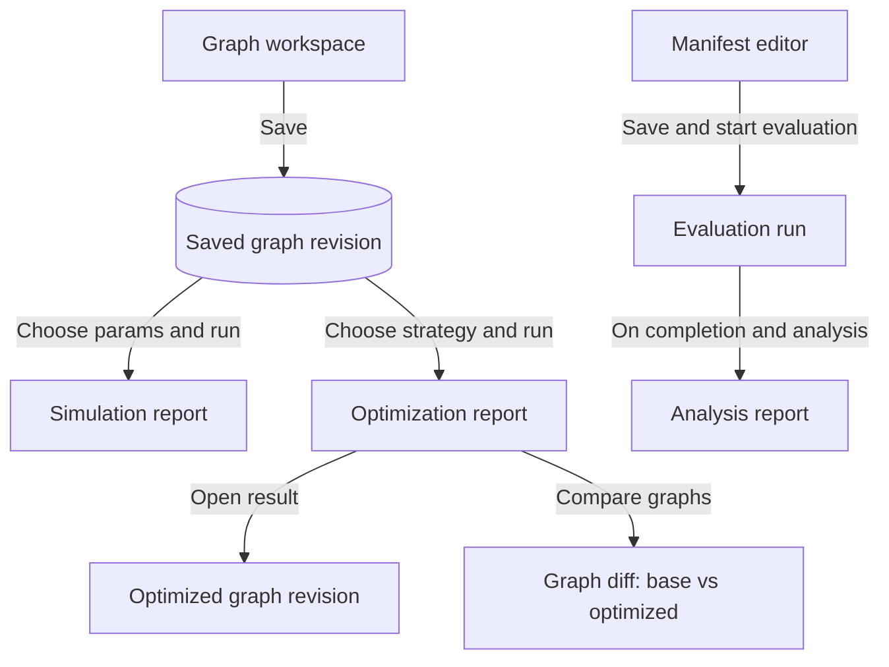

# Dashboard

The dashboard is the browser UI of the system. It presents a graph workspace
and report views. It drives attack simulation, defense optimization, and
evaluation. This page describes the current behavior.

The model rules behind the workflows live in the concepts pages
([graph](../concepts/graph.md), [defense](../concepts/defense.md),
[evaluation](../concepts/evaluation.md),
[model-example](../concepts/model-example.md)).

## Workflows

The dashboard supports four primary workflows. Each workflow starts with a
stable graph. The next section explains why a stable graph matters.

### Graph and revision management

The workspace opens a saved graph revision for editing. The user edits nodes
and relationships, then saves. A save appends a new revision to the graph. The
graph keeps an immutable, linear revision history.

Graphs live in folders. Use folders to organize them. The user can create,
delete, and move graphs between folders (supporting behavior only).

Source references:

- graph revision model:
  [`graph_revision.ex`](../../src/lib/network_defense/graph/graph_revision.ex);
- workspace document and folders:
  [`WorkspaceModel.svelte.ts`](../../src/assets/svelte/dashboard/workspace/WorkspaceModel.svelte.ts).

### Simulation and report

The user runs an attack simulation on the active graph revision. The system
shows a pending report and its progress. When the run completes, the report
shows the expected and median blast radius, mission impact, and their spread
across the runs.

Source reference:

- simulation report view:
  [`SimulationReport.svelte`](../../src/assets/svelte/dashboard/simulation-report/SimulationReport.svelte).

### Defense optimization and graph comparison

The user chooses a defense strategy and runs optimization against the active
graph revision. The report shows the requested and used budget, the applied
actions, and a per-strategy analysis. The optimization appends an optimized
graph revision to the graph.

The user can open the optimized graph revision as a new document. The user can
also compare the base graph with the optimized graph and inspect the diff.

The user can compare any two saved graph revisions directly and inspect a
structural diff.

Source references:

- optimization report with graph diff:
  [`OptimizationReport.svelte`](../../src/assets/svelte/dashboard/optimization-report/OptimizationReport.svelte);
- optimization runs and reports:
  [`optimizations.ex`](../../src/lib/network_defense/optimizations.ex).

### Evaluation and analysis

The dashboard edits and saves an evaluation manifest. A manifest declares the
scenario, attacker, strategies, plans, budgets, trials, objectives, and seeds
for one evaluation. The user starts the evaluation from the manifest.

On completion, the system opens an analysis report. The report lists the plans
and the aggregate results of the experiments. Statistical analysis is a
follow-on step; the user triggers it. A completed analysis report offers a
download of the result archive. No other view offers a download.

Source references:

- manifest model:
  [`ManifestModel.svelte.ts`](../../src/assets/svelte/dashboard/manifest/ManifestModel.svelte.ts);
- analysis report view:
  [`AnalysisReport.svelte`](../../src/assets/svelte/dashboard/analysis-report/AnalysisReport.svelte);
- evaluation lifecycle: [evaluation](../concepts/evaluation.md).

## Why save before run

Simulation and optimization run against a graph revision. When the active
graph has unsaved edits, the system saves it before it starts the run
([`DashboardModel.svelte.ts`](../../src/assets/svelte/dashboard/DashboardModel.svelte.ts)).
This save creates a stable graph revision that the run can target.

A stable revision matters because the run input must not change while the run
executes. Each simulation or optimization is a long-running, asynchronous job.
The job reads its graph revision. If the user could edit and re-save the graph
during the run, the result would no longer match the input the user saw. Saving
first fixes the input as one immutable revision, so the report always describes
the graph the user intended to run.

## User flow

The diagram shows the path from the graph workspace to the three result kinds:
a simulation report, an optimized graph with its diff, or an analysis report.

## Core journey capture

A screen capture of the open-graph, simulate, and report journey will be added
here after it is recorded. No capture exists yet.
