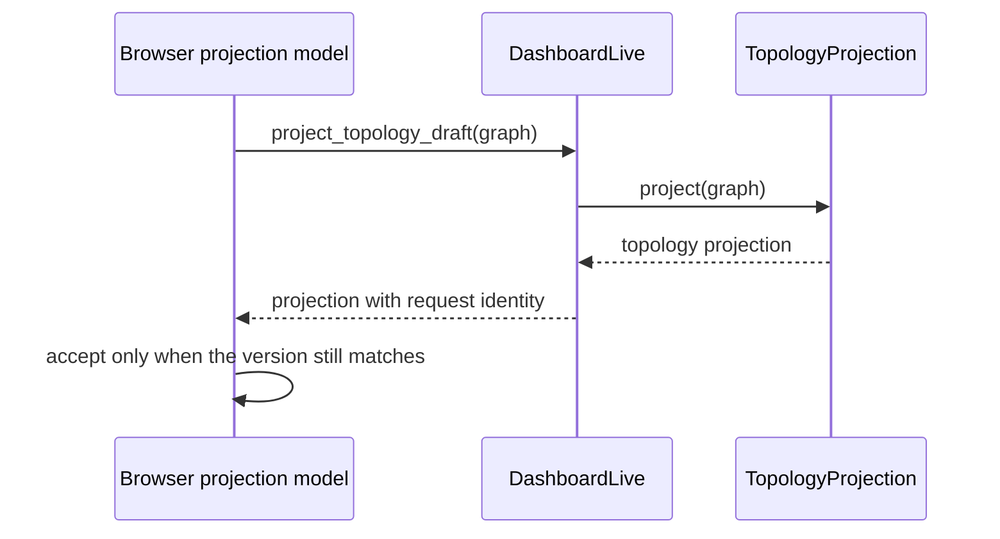
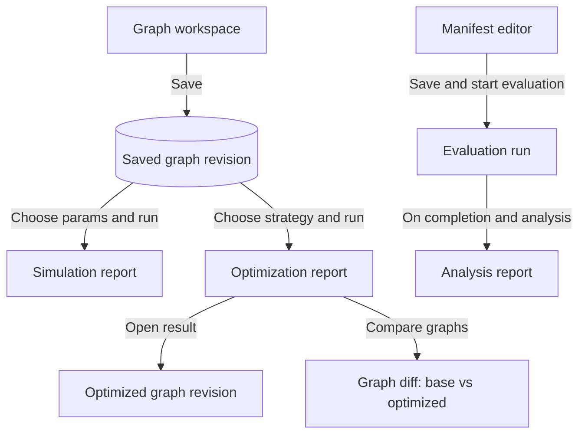

# Dashboard

The dashboard is the browser UI of the system. It presents a graph workspace
and report views. It drives attack simulation, defense optimization, and
evaluation. This page describes the current behavior.

The model rules behind the workflows live in the concepts pages
([graph](../concepts/graph.md), [defense](../concepts/defense.md),
[evaluation](../concepts/evaluation.md),
[model-example](../concepts/model-example.md)).

## Workflows

The dashboard supports four primary workflows. Each workflow starts with a
stable graph. The next section explains why a stable graph matters.

### Graph and revision management

The workspace opens a saved graph revision for editing. The user edits nodes
and relationships, then saves. A save appends a new revision to the graph. The
graph keeps an immutable, linear revision history.

Graphs live in folders. Use folders to organize them. The user can create,
delete, and move graphs between folders (supporting behavior only).

Source references:

- graph revision model:
  [`graph_revision.ex`](../../src/lib/network_defense/graph/graph_revision.ex);
- workspace document and folders:
  [`WorkspaceModel.svelte.ts`](../../src/assets/svelte/dashboard/workspace/WorkspaceModel.svelte.ts).

### Topology canvas

The workspace shows one topology canvas for a graph. It does not offer a
separate network view. Elixir owns graph meaning and the browser owns geometry
and interaction ([graph](../concepts/graph.md)).

Open and Save return the graph and its matching projection from the same
revision. The canvas renders that projection. A new blank graph starts with an
empty projection.

When the user changes graph meaning, the browser sends the unsaved graph for a
draft projection. While the server works, the canvas keeps the last accepted
projection and marks changed entities as pending. The browser ignores a reply
whose version is older than the current one, so a slow reply cannot overwrite a
newer state. A geometry-only change, such as a drag or an arrangement, does not
request a projection.

```mermaid
sequenceDiagram
    participant Browser as Browser projection model
    participant Server as DashboardLive
    participant Projector as TopologyProjection
    Browser->>Server: project_topology_draft(graph)
    Server->>Projector: project(graph)
    Projector-->>Server: topology projection
    Server-->>Browser: projection with request identity
    Browser->>Browser: accept only when the version still matches
```

When an entity has no unambiguous placement, the canvas lists it in the
Unplaced tray with a reason. The user keeps full graph editing. When projection
fails, the canvas shows a non-blocking error and keeps flat editing available.
It does not restore a second projector in TypeScript.

Zoom changes entity detail, not positions or connection representation. Every
zoom level uses one directed connection bundle per ordered segment pair. The
bundle shows a connection count. Its hover, keyboard-focus, and click detail
lists `service · source host → target host`. Selecting a host shows that host's
outgoing projected connections. Segment containment draws no line: the enclosing
frame and the projected host list already show it.

Source references:

- Elixir projector:
  [`topology_projection.ex`](../../src/lib/network_defense/graph/topology_projection.ex);
- browser projection model:
  [`topology-projection-model.svelte.ts`](../../src/assets/svelte/dashboard/graph/topology-projection-model.svelte.ts);
- scene join:
  [`topology-scene.ts`](../../src/assets/svelte/dashboard/graph/topology-scene.ts).

### Simulation and report

The user runs an attack simulation on the active graph revision. The system
shows a pending report and its progress. When the run completes, the report
shows the expected and median blast radius, mission impact, and their spread
across the runs.

Source reference:

- simulation report view:
  [`SimulationReport.svelte`](../../src/assets/svelte/dashboard/simulation-report/SimulationReport.svelte).

### Defense optimization and graph comparison

The user chooses a defense strategy and runs optimization against the active
graph revision. The report shows the requested and used budget, the applied
actions, and a per-strategy analysis. The optimization appends an optimized
graph revision to the graph.

The user can open the optimized graph revision as a new document. The user can
also compare the base graph with the optimized graph and inspect the diff.

The user can compare any two saved graph revisions directly and inspect a
structural diff.

Source references:

- optimization report with graph diff:
  [`OptimizationReport.svelte`](../../src/assets/svelte/dashboard/optimization-report/OptimizationReport.svelte);
- optimization runs and reports:
  [`optimizations.ex`](../../src/lib/network_defense/optimizations.ex).

### Evaluation and analysis

The dashboard edits and saves an evaluation manifest. A manifest declares the
scenario, attacker, strategies, plans, budgets, trials, objectives, and seeds
for one evaluation. The user starts the evaluation from the manifest.

On completion, the system opens an analysis report. The report lists the plans
and the aggregate results of the experiments. Statistical analysis is a
follow-on step; the user triggers it.

The dashboard opens completed study-analysis result ZIPs and renders them in a
read-only report. The same renderer serves live study results; imported reports
show no run controls.

### Study analysis

The Study split button runs study analysis over completed evaluation runs. Its
primary action opens Run study; its menu keeps Open study results.

The Study dialog uses the evaluation-manifest pattern. It contains JSON,
Preview, and Run tabs. The user saves a study specification, maps each declared
tier to one completed non-warm-up run, and passes server preflight. Saved
versions are immutable: an edit disables Save and requires Save as new version.
A completed warm-up run never qualifies, even when it is otherwise exportable.

Each tier picker lists only runs whose resolved manifest matches the
specification's `expected_family`: the primary-comparison matrix, the single
model variant, and the common analysis settings. The picker also filters on the
seed schedule of the selected mode. A Pilot run must declare its evaluation
seed inside `pilot_seed_schedule.evaluation` and its selection seeds inside
`pilot_seed_schedule.selection`; a Final run must satisfy
`final_seed_schedule`. The two schedules are disjoint, so a Pilot run is not
Final-compatible and the modes cannot share evidence. The server repeats the
same check during preflight and execution. Each tier row shows a concise
summary of the required input shape.

Pilot starts only from a saved version with one unique completed run per
declared tier and a passing preflight. The server rebuilds and revalidates the
same bundle before it calls the analysis service.

Pilot and Final use one ephemeral document but separate tier mappings. A
completed eligible Pilot enables a Final tier mapping in the same document.
The Final picker offers only Final-compatible runs and excludes the locked
Pilot run IDs. Final stays disabled until its own mapping is complete, unique,
and preflight passes. Starting Final locks that mapping, and a Final retry
reuses the locked mapping. An insufficient or non-informative Pilot keeps
Final disabled and permits an identical rerun.

Results and the exact tier-run mapping live in the browser document only. They
are not persisted. Keep the document open until analysis completes. Closing a
running document or disconnecting the LiveView cancels its task. No Cancel
control exists. The document warns before it closes a running analysis or a
completed result whose download has not started.

Each completed result offers its own ZIP download from the exact returned
bytes. The server encodes the validated ZIP for the browser session and
enforces the existing output-size limit before it sends the bytes. The filename
is `STUDY_ID-vSPECIFICATION_VERSION-MODE.zip`, so it names the exact immutable
version that produced the result.

The browser download URL serves the completed evaluation output-contract ZIP.
The ZIP is input to statistical analysis. It is not a study-analysis result
ZIP. Imported study reports do not offer a download.

Source references:

- manifest model:
  [`ManifestModel.svelte.ts`](../../src/assets/svelte/dashboard/manifest/ManifestModel.svelte.ts);
- study dialog and model:
  [`StudyDialog.svelte`](../../src/assets/svelte/dashboard/study/StudyDialog.svelte),
  [`StudyModel.svelte.ts`](../../src/assets/svelte/dashboard/study/StudyModel.svelte.ts);
- live study document:
  [`StudyDocument.svelte.ts`](../../src/assets/svelte/dashboard/study/StudyDocument.svelte.ts),
  [`StudyFinalMapping.svelte.ts`](../../src/assets/svelte/dashboard/study/StudyFinalMapping.svelte.ts);
- study session and coordinator:
  [`study_session.ex`](../../src/lib/network_defense/evaluation/study/study_session.ex),
  [`study_coordinator.ex`](../../src/lib/network_defense_web/live/web/dashboard/study_coordinator.ex);
- evaluation analysis report:
  [`AnalysisReport.svelte`](../../src/assets/svelte/dashboard/analysis-report/AnalysisReport.svelte);
- shared study renderer:
  [`StudyAnalysis.svelte`](../../src/assets/svelte/dashboard/analysis-report/StudyAnalysis.svelte);
- imported study report:
  [`ImportedStudyResults.svelte`](../../src/assets/svelte/dashboard/analysis-report/ImportedStudyResults.svelte);
- evaluation lifecycle: [evaluation](../concepts/evaluation.md).

## Why save before run

Simulation and optimization run against a graph revision. When the active
graph has unsaved edits, the system saves it before it starts the run
([`DashboardModel.svelte.ts`](../../src/assets/svelte/dashboard/DashboardModel.svelte.ts)).
This save creates a stable graph revision that the run can target.

A stable revision matters because the run input must not change while the run
executes. Each simulation or optimization is a long-running, asynchronous job.
The job reads its graph revision. If the user could edit and re-save the graph
during the run, the result would no longer match the input the user saw. Saving
first fixes the input as one immutable revision, so the report always describes
the graph the user intended to run.

## User flow

The diagram shows the path from the graph workspace to the three result kinds:
a simulation report, an optimized graph with its diff, or an analysis report.

```mermaid
flowchart TD
    WS[Graph workspace] -->|Save| REV[(Saved graph revision)]
    REV -->|Choose params and run| SIM[Simulation report]
    REV -->|Choose strategy and run| OPT[Optimization report]
    OPT -->|Open result| OR[Optimized graph revision]
    OPT -->|Compare graphs| DIFF[Graph diff: base vs optimized]
    MF[Manifest editor] -->|Save and start evaluation| EV[Evaluation run]
    EV -->|On completion and analysis| AN[Analysis report]
```

## Core journey capture

A screen capture of the open-graph, simulate, and report journey will be added
here after it is recorded. No capture exists yet.
