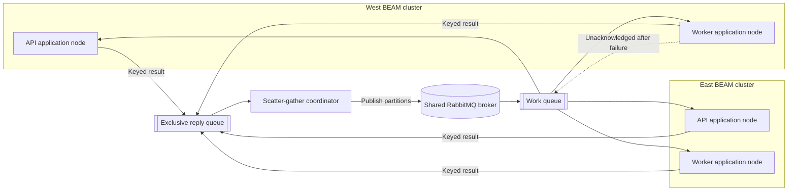
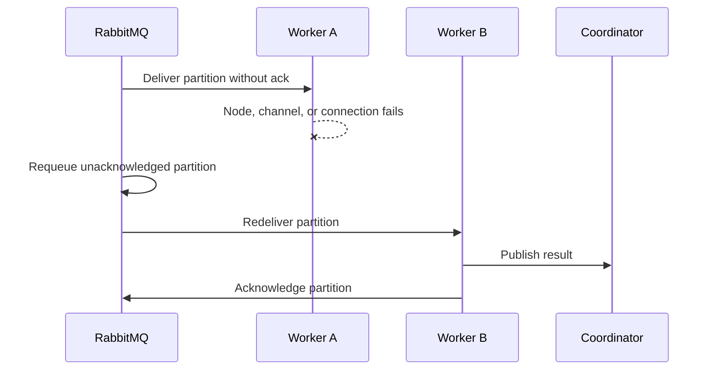

# RabbitMQ Distributed Scatter-Gather Executor

This page describes the implemented local runtime.

## Purpose

Add an ephemeral scatter-gather executor that distributes partitions across
application nodes in all site-local BEAM clusters. Use one shared RabbitMQ
broker for cross-site work delivery and result transport. Keep Erlang
distribution site-local.

The executor preserves the current scatter-gather operation and executor
contracts. It never writes intermediate partitions or results to PostgreSQL.
The existing `gather/3` callback remains the only final persistence boundary.

## Topology

One shared RabbitMQ broker joins every site network. Each application node
keeps one consumer on the shared work queue. Application nodes connect only to
the broker and their site-local Erlang distribution mesh.



## Flow

The coordinator scatters the input, publishes a bounded work window, collects
keyed results, reports progress, and calls `gather/3`. Each worker consumes one
partition at a time, publishes the result, and only then acknowledges the work
message.



The coordinator matches replies by internal run and partition IDs, ignores
duplicate results, and calls `gather/3` once all unique partitions succeed.

The shared queue makes every connected consumer eligible for work. It does not
guarantee that each run uses every site. Strict site participation needs
per-site queues or explicit routing.

## Failure semantics

- Node, channel, or connection loss leaves work unacknowledged. RabbitMQ can
  redeliver it to the same consumer after recovery.
- `execute/1` errors and task exits publish a compact terminal error. The worker
  acknowledges the message without retry or requeue. The callback must make no
  durable changes; at-least-once delivery can execute one partition more than
  once.
- No result before the inactivity timeout fails the run with `:result_timeout`.
- Coordinator loss abandons the run. The in-memory state and exclusive reply
  queue disappear. Durable coordinator recovery is future work.

## Ephemeral-data boundary

Intermediate state lives in coordinator memory and transient RabbitMQ messages
only. The executor has no Oban coordination or partition store. Ephemeral means
the application creates no durable intermediate records and broker restart can
discard in-flight work.

## Observability

The coordinator keeps the run span. Partition spans run on consumer nodes. W3C
trace context travels in work-message headers so workers extend the same trace.
Prometheus groups partition metrics by the collector's `site` and `replica`
labels. Central Prometheus scrapes broker metrics directly from the shared
observability network. A bounded counter tracks redelivered partitions.

## Security

Read the RabbitMQ password from a mounted secret file. Pass host, port, virtual
host, and username as environment variables. Use a dedicated user and virtual
host with only the required permissions. Use TLS for traffic that leaves a
private deployment network. Map the operation identifier through a fixed
allowlist and validate every message before execution. Replace an oversized
encoded result with a compact partition error before publication.

## Why Shovel is deferred

Shovel moves messages in one direction between separate brokers. A shared
broker already reaches all application clusters, so Shovel adds no route here.
If each site later requires its own broker, add Shovel per direction with
confirmation-based acknowledgement. Do not build that topology before separate
brokers are required.

## Local broker exercises

Run these commands from `src/` after Terraform creates the local stack. They
use the Terraform-created broker container and the mounted password file. They
do not expose the password.

### Eligibility test

This opt-in test opens two independent consumers on one shared queue. It proves
consumer eligibility only.

```bash
RABBITMQ_INTEGRATION_HOST="$(docker inspect -f '{{(index .NetworkSettings.Networks "network-defense-local-site-west-network").IPAddress}}' network-defense-local-rabbitmq)" \
RABBITMQ_INTEGRATION_VIRTUAL_HOST=network_defense \
RABBITMQ_INTEGRATION_USERNAME=network_defense \
RABBITMQ_INTEGRATION_PASSWORD_FILE=../infra/environments/local/secrets/rabbitmq-password \
mix test test/network_defense/compute/rabbit_mq_broker_integration_test.exs --include rabbitmq
```

### Broker-level redelivery exercise

This opt-in test closes a consumer connection with one unacknowledged test
message. A replacement consumer receives it with the redelivery flag. It proves
broker behavior only. It does not prove recovery of an interrupted simulation
partition.

```bash
RABBITMQ_INTEGRATION_HOST="$(docker inspect -f '{{(index .NetworkSettings.Networks "network-defense-local-site-west-network").IPAddress}}' network-defense-local-rabbitmq)" \
RABBITMQ_INTEGRATION_VIRTUAL_HOST=network_defense \
RABBITMQ_INTEGRATION_USERNAME=network_defense \
RABBITMQ_INTEGRATION_PASSWORD_FILE=../infra/environments/local/secrets/rabbitmq-password \
mix test test/network_defense/compute/rabbit_mq_broker_integration_test.exs --include redelivery
```
