# Minimal Azure Deployment Plan

This plan uses an existing Azure subscription. Terraform must not create or manage a subscription. The first hosted environment is `dev`.

The local Docker environment remains at `infra/environments/local`. Azure roots use cloud-scoped paths:

- `infra/environments/azure/bootstrap`
- `infra/environments/azure/dev`

Future environments can use paths such as `infra/environments/aws/dev`. These paths are examples only. They are not committed implementations.

State, identity, network, registry, secret store, and managed services remain provider-specific. Application runtime contracts remain provider-neutral:

- Non-secret inputs use environment variables.
- Secrets use mounted files.

## Target design

Each phase leaves a valid state. Do not expose the application before Entra authentication is active.

```mermaid
flowchart LR
  P0[Inputs and access] --> P1[Azure bootstrap state]
  P1 --> P2[Azure dev identity]
  P2 --> P3[Manual OIDC check]
  P3 --> P4[Registry and Key Vault]
  P4 --> P5[Private network and database]
  P5 --> P6[Runtime secrets]
  P6 --> P7[Image and migration job]
  P7 --> P8[Authenticated dev application]
  P8 --> P9[Manual release workflow]
```

## Phase 0: Prepare inputs and access

Use the separate [Phase 0 plan](azure-phase-0-plan.md). Record the existing subscription, tenant, region, project prefix, and GitHub repository details.

Create the GitHub `azure-dev` Environment. Store `AZURE_SUBSCRIPTION_ID`, `AZURE_TENANT_ID`, `AZURE_LOCATION`, and `PROJECT_PREFIX` as environment variables. Do not create an Azure client secret or add deployment secrets.

**Gate:** The operator can select the existing subscription, and the required Azure and GitHub inputs are recorded.

## Phase 1: Bootstrap Azure state

Create `infra/environments/azure/bootstrap` in the existing subscription. During this phase, create only the Azure resources needed for the Terraform state store. Phase 2 extends the same root with shared Azure identities and access control. Use a separate remote state key for this root, for example `azure/bootstrap.tfstate`.

Use Entra authentication for the AzureRM backend. Do not use Terraform workspaces for cloud or stage isolation.

**Checks:** Run format and validation checks. Review the plan before apply. Confirm state locking and state migration.

## Phase 2: Create Azure dev identities

Create the Azure deployment identity, the application workload identity, and the `dev` resource group from the bootstrap root. Bind GitHub OIDC trust to the `azure-dev` GitHub Environment. Use the `api://AzureADTokenExchange` audience.

Grant only the permissions needed for the planned deployment. Entra application-registration permissions depend on tenant policy. Stop before Phase 2 if the required Entra rights are unavailable.

**Checks:** Inspect the federated subject and audience. Confirm that no Azure client secret exists. Confirm that the deployment identity cannot modify unrelated resource groups.

## Phase 3: Verify manual OIDC access

Add an OIDC smoke-check job to `.github/workflows/ci.yml`. The job runs only for `workflow_dispatch`, after all quality jobs pass. Give only this job `id-token: write`. Bind it to the `azure-dev` Environment.

The operator selects a ref and manually starts the workflow. The workflow reruns its quality checks for that ref before the OIDC job starts. Do not deploy on `push` or `pull_request`. Manual approval is not required. GitHub Environment protection can be added later.

The smoke-check job logs in through OIDC and runs read-only Azure checks. It does not deploy resources.

**Checks:** Confirm that pull requests cannot obtain deployment access. Confirm that the manually started job selects the expected subscription without a client secret.

## Phase 4: Create the Azure dev registry and secret store

Create `infra/environments/azure/dev`. Add Azure Container Registry and Key Vault only.

Use a separate remote state key, such as `azure/dev.tfstate`. Keep it separate from the bootstrap key. Use Key Vault RBAC, soft delete, and purge protection. Disable the registry admin account.

Grant the workload identity pull access to the registry and read access to Key Vault. Grant the deployment identity only the registry, secret, and infrastructure permissions that the deployment requires.

**Checks:** Confirm least-privilege registry and secret access. Confirm the absence of subscription-wide Contributor access.

## Phase 5: Create the private network and database

Add Log Analytics, one virtual network, separate delegated subnets, PostgreSQL private DNS, PostgreSQL Flexible Server, and the Container Apps environment to `infra/environments/azure/dev`.

Disable public PostgreSQL access. The Container Apps environment can support external ingress, but it contains no application.

**Checks:** Confirm private DNS resolution from the virtual network. Confirm that PostgreSQL has no public endpoint.

## Phase 6: Add dev runtime secrets

Write the database administrator, application database role, Phoenix key base, and LiveView signing salt to Key Vault. Mark Terraform secret inputs as sensitive.

Runtime containers receive mounted secret files. They do not receive raw secret environment variables.

**Checks:** Confirm that plans do not print secret values. Confirm that Key Vault contains each required secret.

## Phase 7: Build the image and run migrations

Build `src/Dockerfile` and push an immutable commit image to the registry. Pass its digest to the deployment.

Run a manual Container Apps Job with the mounted secret files. The job creates or updates the least-privilege application database role and runs `/app/bin/migrate`. A failed migration stops the deployment.

**Checks:** Confirm that migration uses the pushed image digest. Confirm that the application role differs from the database administrator.

## Phase 8: Deploy the authenticated dev application

Create the single-replica Container App, Entra application registration, and Container Apps authentication configuration. Use the workload identity for registry and Key Vault access. Configure `/healthz` and `/readyz` probes.

Deploy the first revision with public ingress disabled. Enable public ingress only after Entra authentication succeeds.

**Checks:** Confirm anonymous requests redirect to Entra ID. Confirm health probes and private PostgreSQL TLS connections. Confirm that public content was unavailable before authentication became active.

## Phase 9: Complete the manual release workflow

Extend the manual `workflow_dispatch` path in `.github/workflows/ci.yml`. Keep automatic `push` and `pull_request` runs limited to quality checks.

The manual path must run these steps in order:

1. Run the existing quality jobs for the selected ref.
2. Authenticate to Azure through OIDC.
3. Build and push an immutable image.
4. Apply migration-job changes.
5. Run and verify the migration job.
6. Apply the application release.
7. Wait for the active revision.
8. Verify the Entra redirect and Azure logs.

**Checks:** Confirm that no deployment job runs on `push` or `pull_request`. Confirm that a failed quality check or migration stops the release.

## Acceptance cases

- When an operator starts a deployment for a commit that passed CI, the workflow must use `workflow_dispatch` and the `azure-dev` Environment.
- When the deployment authenticates to Azure, it must use OIDC without an Azure client secret.
- When a migration fails, the workflow must not activate the new dev application revision.
- When an unauthenticated user requests the application, Azure must redirect the user to Entra ID.
- When the application starts, it must load required secrets from mounted files.
- When a public client connects to PostgreSQL, Azure must reject the request.
- When the same dev release runs again, Terraform and the migration job must complete without unintended changes.

## Learning

- [Select an Azure subscription](https://learn.microsoft.com/en-us/cli/azure/account#az-account-set)
- [GitHub deployment environments](https://docs.github.com/en/actions/how-tos/deploy/configure-and-manage-deployments/manage-environments)
- [GitHub OIDC with Azure](https://docs.github.com/en/actions/how-tos/security-for-github-actions/security-hardening-your-deployments/configuring-openid-connect-in-azure)
- [Azure login with GitHub OIDC](https://learn.microsoft.com/en-us/azure/developer/github/connect-from-azure)
- [Terraform standard module structure](https://developer.hashicorp.com/terraform/language/modules/develop/structure)
- [Terraform backends](https://developer.hashicorp.com/terraform/language/backend)
- [Container Apps VNet integration](https://learn.microsoft.com/en-us/azure/container-apps/vnet-custom)
- [PostgreSQL private networking](https://learn.microsoft.com/en-us/azure/postgresql/network/concepts-networking-private)
- [Container Apps jobs](https://learn.microsoft.com/en-us/azure/container-apps/jobs-get-started-cli)
- [Container Apps authentication](https://learn.microsoft.com/en-us/azure/container-apps/authentication)

## Deferred work

Do not add production, another cloud provider implementation, a custom domain, multiple replicas, private registry endpoints, private Key Vault endpoints, or full Azure telemetry until a measured requirement exists.
