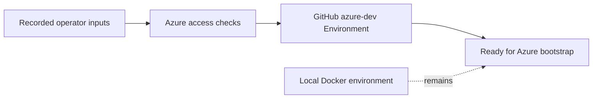

# Azure Phase 0 Plan

Phase 0 prepares the first hosted environment. It creates no Azure resources and no Terraform code.

## Design

The project keeps the local Docker environment and separates cloud concerns by provider. Azure starts with `dev`. Later providers can use their own roots, such as `infra/environments/aws/dev`, but no cross-cloud Terraform module is planned.



Use these defaults:

- Existing Azure subscription.
- Azure `dev` as the first hosted environment.
- Manual `workflow_dispatch` deployment after CI passes for the selected commit.
- GitHub Environment named `azure-dev`.
- Resource names based on project, cloud, stage, and resource.
- Cloud-scoped roots under `infra/environments/<cloud>/<stage>`.
- Provider-specific state and identities.
- Runtime inputs use environment variables for non-secrets and mounted files for secrets.

State, identity, network, registry, secret store, and managed services stay provider-specific. Only the application runtime contract is provider-neutral.

## Execution

### Record inputs

Record these values outside this document:

- Azure subscription ID.
- Microsoft Entra tenant ID.
- Azure region.
- GitHub owner and repository.
- Project prefix.

### Check Azure access

1. Sign in to Azure and select the existing subscription.
2. Check that the operator can create resource groups and RBAC assignments.
3. Check that the operator has the Entra rights needed later for federated identity and application registration.

Tenant policy can change the exact Entra rights. Phase 2 must stop if the rights are unavailable.

### Prepare GitHub

1. Create the GitHub Environment `azure-dev`.
2. Add `AZURE_SUBSCRIPTION_ID`, `AZURE_TENANT_ID`, `AZURE_LOCATION`, and `PROJECT_PREFIX` as environment variables in `azure-dev`.
3. Do not add an Azure client secret or other deployment secrets.
4. Do not add an approval rule. Manual `workflow_dispatch` is the initial deployment control.
5. Confirm that local development still uses `infra/environments/local`.

### Safe read-only Azure checks

Set the placeholders before running the checks. These commands read account data only.

```bash
export AZURE_SUBSCRIPTION_ID='<subscription-id>'
export AZURE_TENANT_ID='<tenant-id>'

az login --tenant "$AZURE_TENANT_ID"
az account set --subscription "$AZURE_SUBSCRIPTION_ID"
az account show --subscription "$AZURE_SUBSCRIPTION_ID" --query '{subscriptionId:id,tenantId:tenantId,name:name,state:state}' --output json
az account list --refresh --query "[?id=='$AZURE_SUBSCRIPTION_ID'].{id:id,name:name,state:state,tenantId:tenantId}" --output table
az ad signed-in-user show --query '{id:id,displayName:displayName,userPrincipalName:userPrincipalName}' --output json
```

The checks do not prove that later resource-group, RBAC, or Entra operations will succeed. Record their results for the later phase operators.

### Acceptance cases

- When Phase 0 is complete, the recorded target must identify an existing subscription and the approved non-production stage.
- When the GitHub setup is checked, `azure-dev` must contain the four non-secret target variables and no Azure client secret.
- When a deployment is requested, an operator must start it manually through `workflow_dispatch`.
- When an operator runs the read-only checks with placeholder values replaced, Azure must return the selected account without creating resources.
- When Phase 0 ends, the repository must contain no Azure resources and no new Terraform implementation.

## Completion gate

Phase 0 is complete when the inputs are recorded, the read-only account check succeeds, access limitations are known, `azure-dev` contains the four non-secret variables, and the operator can start Phase 1 without adding a subscription resource.

## Non-goals

- Create or modify Azure resources.
- Add Terraform roots, modules, backends, or providers.
- Create federated credentials, Entra applications, or deployment identities.
- Add deployment secrets.
- Create a production environment or automatic push-to-main deployment.
- Design shared Terraform modules across cloud providers.

## Learning

- [Select an Azure subscription](https://learn.microsoft.com/en-us/cli/azure/account#az-account-set)
- [GitHub deployment environments](https://docs.github.com/en/actions/how-tos/deploy/configure-and-manage-deployments/manage-environments)
- [GitHub OIDC with Azure](https://docs.github.com/en/actions/how-tos/security-for-github-actions/security-hardening-your-deployments/configuring-openid-connect-in-azure)
- [Azure workload identity federation](https://learn.microsoft.com/en-us/entra/workload-id/workload-identity-federation)
- [Terraform standard module structure](https://developer.hashicorp.com/terraform/language/modules/develop/structure)
- [Terraform backends](https://developer.hashicorp.com/terraform/language/backend)
