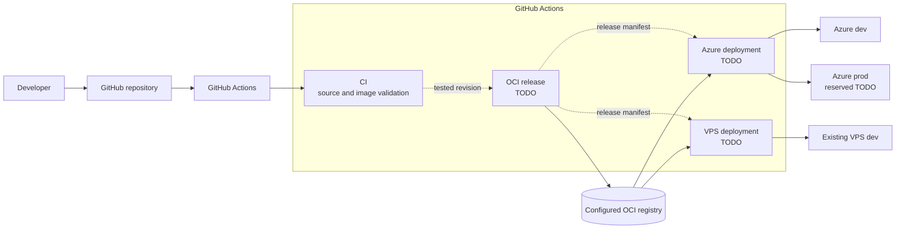
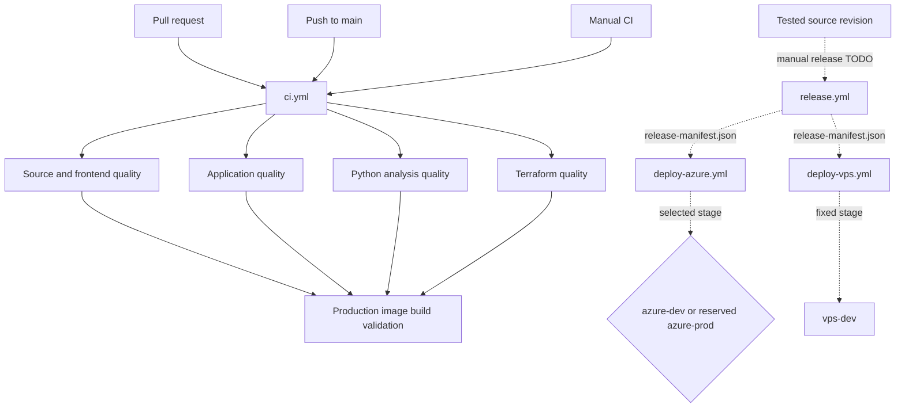
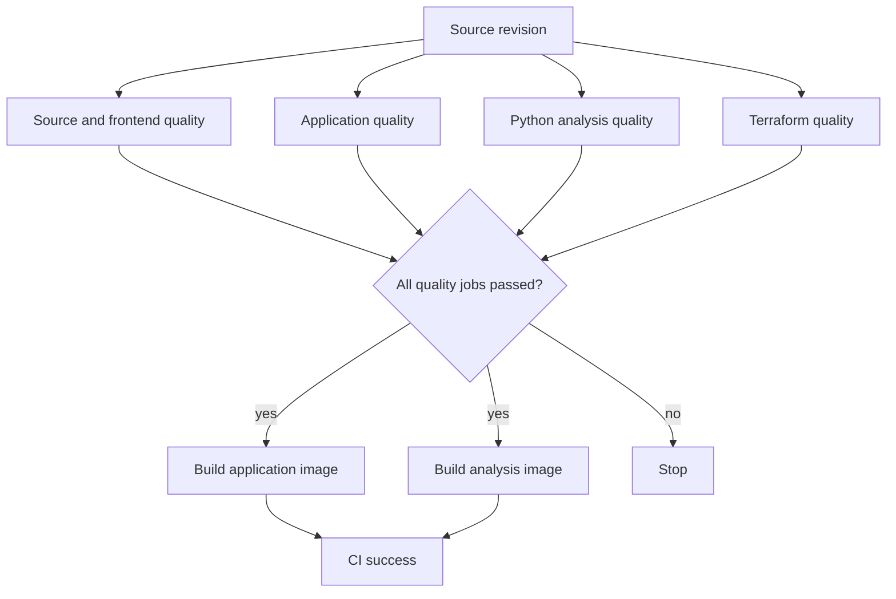
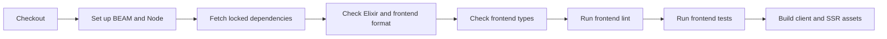
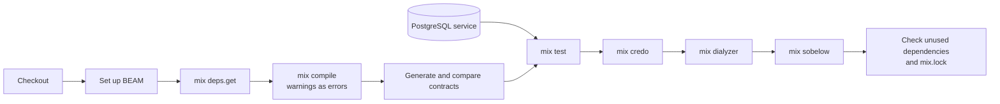
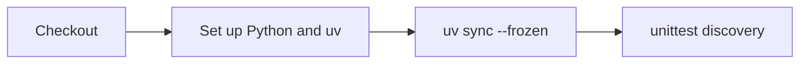
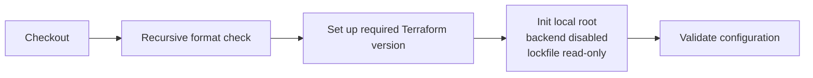
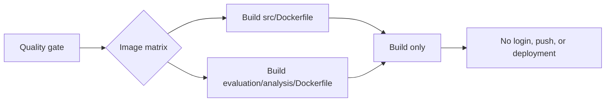
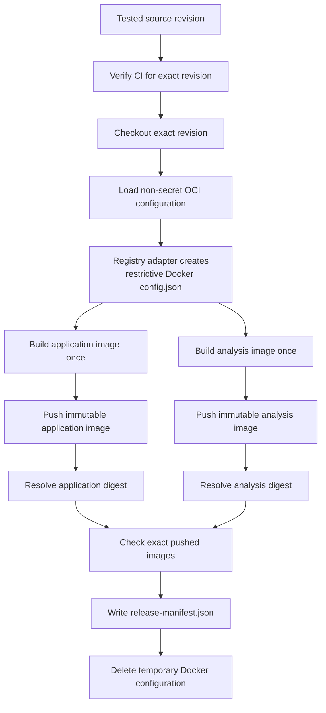
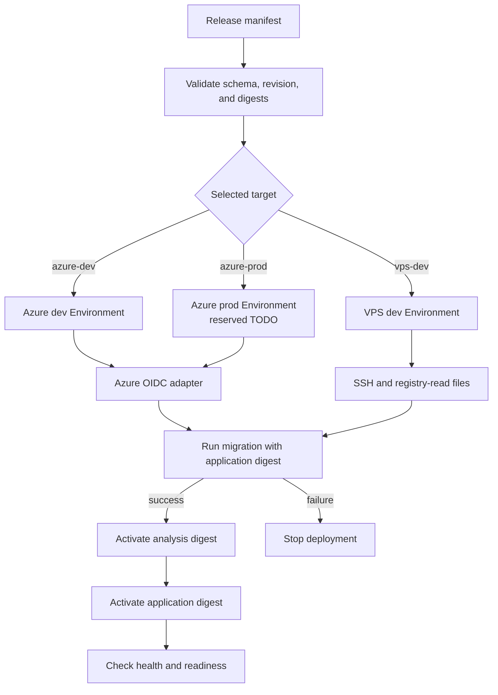

# CI/CD Pipeline Plan

## Status

This plan separates source validation, image release, and target deployment.
Only the CI redesign is in the current implementation scope. Release and
deployment workflows remain TODO contracts. Do not add empty workflows,
disabled jobs, placeholder credentials, or successful no-op deployment jobs.

| Area | Planned file | Status |
|---|---|---|
| Source and image validation | `.github/workflows/ci.yml` | Current scope |
| OCI image release | `.github/workflows/release.yml` | TODO |
| Azure deployment | `.github/workflows/deploy-azure.yml` | TODO |
| Existing VPS deployment | `.github/workflows/deploy-vps.yml` | TODO |

## Design

### Zoom 1: Delivery Landscape

GitHub Actions separates credentials by responsibility. CI receives no
deployment credentials. Release receives registry-write access only. Each
deployment receives access to one target environment only.



The common deployment boundary is an immutable OCI release manifest. It is
not an Azure resource, a VPS command, or a registry-specific tag.

### Zoom 2: Workflow Boundaries



The initial release trigger is a manual dispatch with a required full source
revision. The workflow must validate that revision and its CI result. Automatic
release triggers remain a TODO.

### Zoom 3: CI Jobs

Independent quality jobs run in parallel. The image matrix starts only after
all quality jobs pass.



#### Source and Frontend Quality



This job uses Mix dependencies because npm has local dependencies under
`src/deps`. It does not export `node_modules` or `_build` to other jobs.

#### Application Quality

This job compiles the test source once. Tests and static analysis reuse that
build on the same runner.



The normal Mix incremental build behavior reuses unchanged compiled files.
The test job does not upload `_build`, and no other job downloads it.

#### Python Analysis Quality



The job installs the local package in its own environment. It caches package
downloads, not `.venv`.

#### Terraform Quality



This job does not run a plan or apply. It does not load `.env`, state, or
local secret files.

#### Production Image Validation



CI validates both production build paths. It does not claim that these local
images are release artifacts.

### Build Sharing Rules

| Build material | Sharing rule | Reason |
|---|---|---|
| Elixir `_build/test` | Reuse only in the application-quality job and its compatibility-scoped cache | Tests and analysis use the same source, runtime, and Mix environment |
| Mix dependency downloads | Cache with runtime, environment, job, and lockfile scope | Dependencies are expensive but reproducible from the lockfile |
| npm downloads | Cache through the Node setup action | `npm ci` must still recreate `node_modules` |
| `node_modules` | Do not share | Installation is cheap compared with artifact handling and path risks |
| Python `.venv` | Do not share | The CI runner and production image are different environments |
| Test and production Mix builds | Never share | `MIX_ENV=test` and `MIX_ENV=prod` have different contracts |
| CI-built images | Do not deploy | CI only verifies that both Dockerfiles build |
| Released OCI images | Share by digest across every target | Every target must run the same immutable release |

CI can rebuild an image for validation. The release workflow builds each
distribution image once. Azure and the VPS must not rebuild those images.

### Zoom 3: OCI Release

The release workflow has one configurable canonical OCI registry. Registry
mirroring is deferred until a target requires it.



The registry adapter owns authentication. It creates a temporary Docker
configuration directory and writes its sensitive `config.json` file with
restrictive permissions. The common release steps set `DOCKER_CONFIG` to that
directory and publish with Docker Buildx. The adapter can obtain its
short-lived credential through Azure OIDC, GitHub, or another secret store.

#### Release Manifest

The release manifest is non-secret and provider-neutral.

```json
{
  "schema_version": "<version>",
  "source_revision": "<tested-revision>",
  "images": {
    "application": "<registry>/<repository>@sha256:<digest>",
    "analysis": "<registry>/<repository>@sha256:<digest>"
  }
}
```

Do not put tags, credentials, target addresses, or application secrets in
this file. Tags can exist for operator convenience, but deployments use the
digest references.

### Zoom 3: Target Deployments



Migration runs before application activation. An application rollback can
select the previous image digest. Database rollback is not automatic.

## Input Contracts

### CI Inputs

| Input | Source | Sensitive | Notes |
|---|---|---:|---|
| Source revision | GitHub event | No | Pull request, main push, or manual ref |
| Elixir and OTP versions | Existing repository version contract | No | Keep aligned with the production Dockerfile |
| Node version | Existing repository version contract | No | Keep aligned with the production Dockerfile |
| Python and uv versions | Analysis project and Dockerfile | No | Do not duplicate changing values in documentation |
| Terraform version | Terraform root and helper | No | The root remains authoritative |
| PostgreSQL version | Local infrastructure | No | CI must test the supported local major version |
| Mix and npm lockfiles | Repository | No | Cache and installation inputs |

CI receives no registry, Azure, VPS, or application runtime secrets.

The source/frontend job can cache dependency downloads, but not `_build`. The
application-quality job can restore `_build/test` and Dialyzer data only from
a key scoped to that job, `MIX_ENV`, operating system, BEAM versions, and the
Mix lockfile. No parallel job uses that key.

### Release Inputs And Outputs

| Name | Form | Sensitive | Purpose |
|---|---|---:|---|
| `SOURCE_REVISION` | Required manual-dispatch input | No | Full revision that passed CI |
| `OCI_REGISTRY` | Repository or Environment variable | No | Canonical registry endpoint |
| `OCI_REPOSITORY_PREFIX` | Repository or Environment variable | No | Namespace for both image repositories |
| `DOCKER_CONFIG` | Temporary directory path | Path only | Directory consumed by Docker Buildx |
| `DOCKER_CONFIG/config.json` | Restrictive temporary file | Yes | Registry authentication created by the adapter |
| `release-manifest.json` | Workflow artifact and output | No | Immutable image references for deployments |

The registry adapter creates the Docker configuration under the runner
temporary directory. It sets restrictive permissions on `config.json` before
use and deletes the directory in an `always` cleanup step. Do not pass the
credential value as a command-line argument or commit it to the repository.

### Azure Inputs

One future Azure workflow can serve both stages. The current Azure plan covers
development only. Production is a reserved design target and creates no
Environment, identity, state, or workflow until its deferred phase starts.
GitHub Environments isolate variables, OIDC subjects, state, concurrency, and
protection rules.

| Environment | Identity | State | Initial protection |
|---|---|---|---|
| `azure-dev` | Development OIDC trust | Development state | Manual dispatch |
| `azure-prod` | Reserved TODO | Reserved TODO | TODO approval policy |

| Name | Form | Sensitive | Purpose |
|---|---|---:|---|
| `AZURE_SUBSCRIPTION_ID` | Environment variable | No | Target subscription |
| `AZURE_TENANT_ID` | Environment variable | No | OIDC tenant |
| `AZURE_LOCATION` | Environment variable | No | Target region |
| `PROJECT_PREFIX` | Environment variable | No | Resource naming input |
| `TERRAFORM_ROOT` | Environment variable | No | Stage-specific root |
| Release manifest | Workflow input or artifact | No | Images selected for deployment |
| Azure OIDC token | GitHub-issued token | Short-lived | Azure authentication |
| Registry pull mapping | Azure target configuration | Target-specific | Managed identity or external pull credential |

Do not create an Azure client secret. Grant `id-token: write` only to the
deployment job after it enters the selected GitHub Environment.

Azure maps application secrets from its secret store into mounted files. The
application contract remains the `*_FILE` interface implemented in
`src/lib/network_defense/runtime_config.ex`. The current required files and
non-secret runtime variables remain defined by the application and target
Terraform configuration. The deployment plan must not duplicate their values.

If ACR is the canonical registry, Azure can use managed identity for pulls.
If the registry is external, the Azure adapter supplies a read-only pull
credential. This choice does not change the release manifest.

#### Application Runtime Contract

Each target adapter maps the application interface below. Authoritative
behavior remains in `src/config/runtime.exs` and
`src/lib/network_defense/runtime_config.ex`.

| Input | Form | Purpose |
|---|---|---|
| `REPO_HOSTNAME` | Environment variable | Database host |
| `REPO_PORT` | Environment variable | Database port |
| `REPO_DATABASE` | Environment variable | Database name |
| `REPO_USERNAME` | Environment variable | Database application role |
| `REPO_PASSWORD_FILE` | Mounted secret-file path | Database password |
| `SECRET_KEY_BASE_FILE` | Mounted secret-file path | Phoenix secret key base |
| `LIVE_VIEW_SIGNING_SALT_FILE` | Mounted secret-file path | LiveView signing salt |
| `PHX_HOST` | Environment variable | External application host |
| `PORT` | Environment variable | Container HTTP port |
| `ANALYSIS_SERVICE_URL` | Environment variable | Private analysis service URL |

Target-specific TLS, clustering, logging, and telemetry inputs remain in the
target configuration. Do not put their values in the release manifest.

#### Azure Analysis Topology

The planned Azure target runs the analysis image as an internal-only service
in the same Container Apps environment as the application. It exposes its
health endpoint to platform probes and its analysis endpoint only inside the
environment. The application receives the internal service URL through
`ANALYSIS_SERVICE_URL`. Exact sizing and scaling remain target configuration.
Azure deployment cannot start until the Azure infrastructure plan includes
this service and verifies private application-to-analysis requests.

### Existing VPS Inputs

The VPS mechanism is not implemented. Its future GitHub Environment is
`vps-dev`.

| Name | Form | Sensitive | Purpose |
|---|---|---:|---|
| `VPS_HOST` | Environment variable | No | Deployment host |
| `VPS_PORT` | Environment variable | No | SSH port |
| `VPS_USER` | Environment variable | No | Restricted deployment account |
| `VPS_DEPLOY_PATH` | Environment variable | No | Host deployment directory |
| `PUBLIC_BASE_URL` | Environment variable | No | External health verification address |
| Release manifest | Workflow input or artifact | No | Images selected for deployment |
| `DEPLOY_SSH_KEY_FILE` | Restrictive temporary file | Yes | Deployment SSH identity |
| `DEPLOY_KNOWN_HOSTS_FILE` | Integrity-controlled file | No secret value | Pinned host identity |
| `DOCKER_CONFIG/config.json` | Restrictive host or temporary file | Yes | Read-only registry authentication |

Application runtime secrets remain host-local files mounted into containers.
The workflow must not copy application secret values into the release
manifest. The VPS adapter must use the same application `*_FILE` contract as
local and Azure deployments.

The VPS target runs the analysis image on the private application network. It
does not publish the analysis endpoint publicly. The application uses the
network service name through `ANALYSIS_SERVICE_URL`.

## Existing Commands And Scripts

The workflow must use repository commands instead of duplicating their
implementation.

| Concern | Authoritative location |
|---|---|
| Elixir aliases and quality commands | `src/mix.exs` |
| Frontend format, type, lint, and test commands | `src/package.json` |
| Application production build | `src/Dockerfile` |
| Analysis production build | `evaluation/analysis/Dockerfile` |
| Python dependencies | `evaluation/analysis/pyproject.toml` and its lockfile |
| Terraform version and providers | `infra/environments/local/versions.tf` |
| Local Terraform wrapper | `infra/environments/local/terraform.sh` |
| Release migration entry point | `src/rel/overlays/bin/migrate` |
| Runtime variable and secret-file handling | `src/config/runtime.exs` and `src/lib/network_defense/runtime_config.ex` |

Do not add a helper script for a short workflow command. Add a script only
when logic is reused, needs tests, or becomes hard to review in YAML.

Future adapters can become small scripts when implementation starts:

| Adapter | Responsibility | Status |
|---|---|---|
| Registry authentication | Create and remove the temporary Docker configuration | TODO |
| Release manifest validation | Validate schema and digest references | TODO |
| Azure deployment | Apply one Azure stage and run its migration and checks | TODO |
| VPS deployment | Pull, migrate, activate, verify, and record one release | TODO |

No adapter path or implementation is reserved before that code is needed.

## Detailed Workflow Steps

### CI: Source And Frontend Quality

1. Check out the requested source revision.
2. Set up the repository's BEAM and Node versions.
3. Restore scoped dependency-download caches.
4. Run `mix deps.get` before npm because npm uses local Mix dependencies.
5. Run `npm ci`.
6. Run `mix format --check-formatted`.
7. Run `npm run format:check`.
8. Run `npm run typecheck`.
9. Run `npm run lint:color`.
10. Run `npm test`.
11. Run `mix assets.build`.

### CI: Application Quality

1. Start the PostgreSQL service and wait for its health check.
2. Check out the requested source revision.
3. Set up the repository's BEAM versions.
4. Restore a job-specific Mix and Dialyzer cache.
5. Run `mix deps.get`.
6. Run `mix compile --warnings-as-errors` once under `MIX_ENV=test`.
7. Run `mix gen.contracts`.
8. Fail if the generated contract differs from the committed contract.
9. Run `mix test`; Mix reuses the same runner's compiled files.
10. Run `mix credo`.
11. Run `mix dialyzer`.
12. Run `mix sobelow --config --skip`.
13. Run `mix deps.unlock --unused`.
14. Fail if the unused-dependency check changes `mix.lock`.

### CI: Python Analysis Quality

1. Check out the requested source revision.
2. Use `evaluation/analysis` as the working directory.
3. Set up the versions declared by the analysis project and image.
4. Restore the uv download cache.
5. Run `uv sync --frozen`.
6. Run `uv run python -m unittest discover -s tests`.

### CI: Terraform Quality

1. Check out the requested source revision.
2. Run `terraform fmt -check -recursive infra` from the repository root.
3. Set up the version required by the Terraform root.
4. Run `terraform init -backend=false -lockfile=readonly` in the local root.
5. Run `terraform validate` in the local root.

### CI: Production Image Validation

1. Wait for every quality job.
2. Check out the same source revision.
3. Run `docker build -f src/Dockerfile src` in the application matrix entry.
4. Run `docker build -f evaluation/analysis/Dockerfile evaluation/analysis` in the analysis matrix entry.
5. Do not log in to a registry.
6. Do not push or upload either image.

### TODO: OCI Release

1. Accept a required full source revision through manual `workflow_dispatch`.
2. Verify that CI passed for that revision.
3. Check out that revision, not the current branch head.
4. Load `OCI_REGISTRY` and `OCI_REPOSITORY_PREFIX` as non-secret inputs.
5. Invoke the selected registry-authentication adapter.
6. Require the adapter to create a temporary Docker `config.json` with restrictive permissions.
7. Set `DOCKER_CONFIG` to the temporary configuration directory.
8. Build the application image once for distribution with Docker Buildx.
9. Build the analysis image once for distribution with Docker Buildx.
10. Push immutable references for both images.
11. Resolve both registry digests.
12. Check the exact pushed digest references.
13. Write and validate `release-manifest.json`.
14. Publish the manifest as the deployment handoff.
15. Delete the temporary Docker configuration in an `always` step.

### TODO: Azure Deployment

1. Accept a release manifest and an allowed stage.
2. Enter `azure-dev`; allow `azure-prod` only after its deferred phase creates the protected Environment.
3. Validate the manifest before requesting Azure access.
4. Authenticate through environment-scoped OIDC.
5. Select the environment-scoped subscription and Terraform state.
6. Configure read-only access to the canonical registry.
7. Map application secrets to mounted runtime files.
8. Plan and apply target-specific infrastructure or release changes.
9. Run the migration job with the application digest.
10. Stop if migration fails.
11. Activate the analysis digest as an internal-only service.
12. Activate the application digest.
13. Wait for the active revision.
14. Check health, readiness, and platform authentication.
15. Record the deployed manifest and digest references.

### TODO: Existing VPS Deployment

1. Enter the `vps-dev` GitHub Environment.
2. Download and validate the selected release manifest.
3. Materialize SSH and registry credentials as restrictive temporary files.
4. Connect with a restricted deployment account and pinned host identity.
5. Copy the release manifest to a staging location.
6. Pull both exact digest references with read-only registry access.
7. Run the migration command from the application digest.
8. Stop if migration fails.
9. Activate the analysis and application digests through the selected VPS orchestrator.
10. Check health and readiness through the public target address.
11. Record the deployed manifest on the host.
12. Delete temporary runner credential files in an `always` step.

## Security Boundaries

| Workflow | Allowed credentials | Credentials it must not receive |
|---|---|---|
| CI | None | Registry, Azure, VPS, and runtime secrets |
| OCI release | Registry write only | Azure subscription access and VPS SSH |
| Azure dev | Development OIDC and target pull access | Production identity and VPS SSH |
| Azure prod, reserved | Production OIDC and target pull access after activation | Development identity and VPS SSH |
| VPS dev | Restricted SSH and registry read only | Azure identities and registry write access |

Secret values must not enter repository files, workflow artifacts, command-line
arguments, logs, or the release manifest. Temporary runner files must use
restrictive permissions and unconditional cleanup. Runtime secret values use
mounted files. Non-secret runtime inputs use environment variables.

## Acceptance Cases

- When a pull request targets the protected branch, CI must run all independent quality jobs in parallel.
- When application quality runs, tests and static analysis must reuse one test build on the same runner.
- When one quality job fails, CI must not start production image validation.
- When image validation runs, CI must build both images without registry authentication or publishing.
- When image validation builds the application, Docker must use `src` as its build context.
- When image validation builds the analysis service, Docker must use `evaluation/analysis` as its build context.
- When CI runs manually, it must not request Azure, VPS, registry, or runtime credentials.
- When a release is created, the workflow must verify CI for the exact selected revision.
- When a release is published, its manifest must contain both immutable OCI digest references and no secret values.
- When a target deploys a release, it must not rebuild either image.
- When a migration fails, the target workflow must not activate the new application image.
- When Azure development authenticates, it must not receive production or VPS credentials.
- When Azure activates the analysis service, the application must reach its private endpoint and the public network must not.
- When Azure production is enabled, its GitHub Environment must enforce the approved production policy.
- When Azure production is enabled, deployment must enforce the selected image provenance and signing policy.
- When the VPS authenticates, it must use a restricted account, pinned host identity, and read-only registry access.

## Execution

Each chunk includes a quick review before the next chunk starts.

### Chunk 1: Restructure CI

Estimated effort: 30 to 60 minutes.

1. Replace the serial quality chain with the four parallel quality jobs in this design.
2. Keep the application compile, tests, and static checks in one sequential job.
3. Add missing frontend and Python checks.
4. Add Terraform initialization and validation.
5. Add the final two-image build matrix without publishing.
6. Add read-only workflow permissions and safe cache scopes.
7. Add concise TODO comments that point to this plan.
8. Review permissions, job dependencies, working directories, and cache keys.

### Chunk 2: Validate CI

Estimated effort: 30 to 60 minutes, excluding image download time.

1. Validate workflow syntax with `actionlint`.
2. Run the frontend format, type, lint, test, and asset commands.
3. Run the application-quality command sequence against a test database, then run the repository precommit gate.
4. Run `uv sync --frozen` and `uv run python -m unittest discover -s tests` from `evaluation/analysis`.
5. Run Terraform format, read-only initialization, and validation.
6. Build both production images with their explicit Docker contexts.
7. Review the final workflow diff and confirm that it references no deployment secrets.

### Chunk 3: Activate OCI Release

Status: TODO. Start only after selecting a registry and authentication adapter.

Estimated effort: 30 to 60 minutes per implementation slice.

1. Add manual dispatch with a required full source revision and define its validation.
2. Define and test release-manifest validation.
3. Add the registry adapter with temporary Docker configuration cleanup.
4. Build and push both images from an exact tested revision.
5. Check the pushed digests and publish the manifest.
6. Review registry permissions and prove that the job has no target credentials.

### Chunk 4: Activate Azure Deployment

Status: TODO. Start only after Azure roots, identities, state, and runtime topology exist.

Estimated effort: 30 to 60 minutes per environment slice.

1. Implement `azure-dev` first.
2. Verify OIDC, registry pull access, secret mounts, migration gating, and probes.
3. Add `azure-prod` only after defining production state, identity, and approval policy.
4. Review each environment's effective permissions and deployed digest.

### Chunk 5: Activate Existing VPS Deployment

Status: TODO. Start only after selecting the VPS orchestrator and preparing a restricted host account.

Estimated effort: 30 to 60 minutes per implementation slice.

1. Provision host-local runtime secret files and read-only registry access.
2. Implement pinned SSH access and release-manifest validation.
3. Implement pull, migration, activation, checks, and release recording.
4. Review host permissions, credential cleanup, and rollback behavior.

## Unresolved TODOs

| Decision | Required before |
|---|---|
| Automatic release trigger policy | Replacing the initial manual release trigger |
| Canonical OCI registry | Publishing the first release |
| Registry authentication adapter | Granting registry write access |
| Image scan, SBOM, provenance, and signing policy | Enabling production deployment; development initially uses digest and CI verification |
| Azure analysis-service sizing and scaling | Deploying the internal analysis service |
| Azure production approval policy | Creating `azure-prod` |
| VPS orchestrator | Creating `deploy-vps.yml` |
| VPS host account and network access | Enabling VPS deployment |
| Migration serialization | Allowing concurrent deployment requests |
| Application and database rollback policy | Enabling production deployment |
| Registry mirroring | Adding a target that cannot use the canonical registry |
