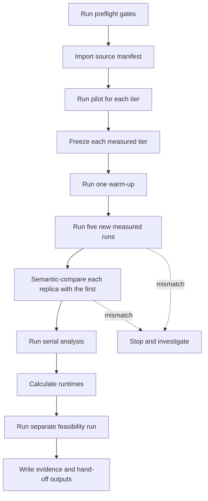

# Measured Cloud Evaluation Runbook

This runbook tells an agent how to execute the measured cloud study. It works
without this conversation. Use the
[topology-scale study protocol](topology-scale-study.md) for the surrounding
study design and the manual replication commands.

## Purpose and evidence boundary

This runbook produces measured cloud runtime and outcome evidence. The
executor runs every tier on fixed, frozen inputs. Use the results to compare
runtime and strategy outcomes across tiers.

The results are not absolute performance claims. They describe one fixed
environment on one fixed graph per tier. Do not compare these results with
results from another environment.

## Inputs the executor must receive

Receive these inputs before you start:

- the source manifests for the measured tiers;
- the tier host and edge counts;
- the common attack-trial count;
- the selection seeds;
- the list of strategies and budgets;
- the fixed environment record;
- the path to write durable evidence.

Use the values in the source manifests. Do not invent values.

## Preflight gates

Check every gate before you run timed measures. Stop the study if a gate
fails.

- The source manifests are committed to the repository.
- The topology-relevance diagnostic confirms that tier growth changes the
  intended attack-relevant structure. If the ranking is unchanged, record the
  unchanged ranking as the observed result.
- All pending migrations are applied.
- The application replicas are healthy.
- The database is healthy.
- The analysis service is healthy.
- The local test environment runs the invariant test and the evaluation report
  component test.
- The fixed environment record matches the running environment.
- No other evaluation runs concurrently.

## Run sequence

Mix commands run in a one-off application task with the deployed application
identity, mounted secrets, database access, and non-conflicting listeners. Do
not run host-side Mix without credentials.

Follow the manual replication process in the topology-scale protocol:

1. Import the source manifest with `mix evaluate.import --file PATH`.
2. Run mission-impact pilots. Confirm the measured tiers and the common trial
   count.
3. Freeze each measured tier with `mix evaluate.freeze
   --manifest-id SOURCE --frozen-manifest-id TARGET`.
4. Run one warm-up with `mix evaluate.warmup --manifest-id TARGET`. Do not use
   its result as a timing or outcome sample.
5. Run five new evaluations with
   `mix evaluate.manifest --manifest-id TARGET --output REPLICA.zip`. Write one
   archive for each run.
6. Handle a failed, cancelled, interrupted, resumed, corrupt, or missing-archive
   replica. Exclude it from the timing samples. Log it in the evidence. After
   confirming no duplicate execution, create a fresh replacement run. Stop if
   the problem recurs or cannot be diagnosed.
7. Use the first timed archive for outcome analysis.
8. Compare each other timed archive with the first one before you accept its
   timing result. A comparison error, including a malformed archive, stops
   acceptance.
9. Run the analysis serially with
   `mix evaluate.analyze --run-id RUN_ID --mode analyze --output analysis.zip`.
   Do not start the next analysis until the previous one completes. See the
   [analysis guide](../../evaluation/analysis/README.md) for interpretation.
10. Calculate median runtimes for simulation, strategy selection, and total
    evaluation.
11. After the timing runs complete, run one separate feasibility run with its
    own separately versioned feasibility manifest. The feasibility manifest
    records its own graph and purpose. It is not tier-runtime evidence.

Do not change a measured graph revision or manifest during these runs.

## Stop conditions

Stop the study and investigate when any condition below occurs:

- any application, database, or analysis service becomes unhealthy;
- a handled replica failure recurs or cannot be diagnosed;
- a semantic comparison reports a mismatch;
- a comparison error occurs, including a malformed archive;
- the analysis service reports a capacity failure;
- the primary outcome is non-informative, for example a zero-difference and a
  zero-width interval.

Record the condition and the stopped stage in the evidence. Do not continue
until you resolve the condition.

## Durable evidence and hand-off outputs

Write these outputs to the evidence path:

- the committed source manifest for each tier;
- the frozen manifest for each tier;
- one archive for each measured run;
- the semantic comparison results;
- the analysis outputs;
- the fixed environment record;
- the runtime summary;
- the stop-condition log.

The evidence must identify which archive is the outcome archive and which are
timing replicas. Name the files so another agent can reproduce the hand-off.

## Interpretation limits

- The reported intervals include simulator uncertainty only. They condition on
  the declared selection seeds and exclude plan-selection uncertainty.
- One frozen graph exists per tier. The study contains no graph replication
  within a host-count tier.

Describe these limits with every reported result.
