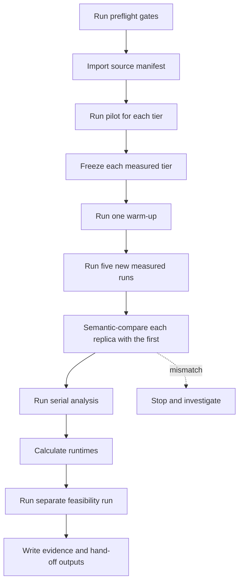

# Measured Cloud Evaluation Runbook

**Status: blocked.** The cloud study is blocked until the planned tooling
exists. See the
[cloud evaluation tooling plan](cloud-evaluation-tooling-plan.md). Do not start
timed cloud runs before every tooling item there is complete.

This runbook tells an agent how to execute the measured cloud study once that
tooling exists. It works without this conversation. Use the
[topology-scale study protocol](topology-scale-study.md) for the surrounding
study design and the manual replication commands.

## Purpose and evidence boundary

This runbook produces measured cloud runtime and outcome evidence. The
executor runs every tier on fixed, frozen inputs. Use the results to compare
runtime and strategy outcomes across tiers.

The results are not absolute performance claims. They describe one fixed
environment on one fixed graph per tier. Do not compare these results with
results from another environment.

## Inputs the executor must receive

Receive these inputs before you start:

- the source manifests for the measured tiers;
- the tier host counts (edge counts are generated outputs, not inputs);
- the common attack-trial count;
- the selection seeds;
- the list of strategies and budgets;
- the generated environment record;
- the path to write durable evidence.

Use the values in the source manifests. Do not invent values.

## Prerequisites

The study starts only after the
[tooling plan](cloud-evaluation-tooling-plan.md) is complete: the one-off
evaluator, the topology diagnostic, the automatic environment record, and the
automatic once-per-frozen-manifest warm-up.

Check every gate before you run timed measures. Stop the study if a gate
fails.

Committed inputs:

- The source manifests are committed to the repository.
- The topology diagnostic records whether tier growth changes attack-relevant
  structure. Record an unchanged result as evidence, not as a failed gate.

Local test gates, run from `src/`:

- Topology invariant test:
  `mix test test/network_defense/topology/enterprise_topology_test.exs`.
- Evaluation report component test:
  `npx vitest run assets/svelte/dashboard/analysis-report/AnalysisReport.svelte.test.ts`.

Verified local stack gates:

- Migration status: `docker exec network-defense-local-app-0 mix ecto.migrations`.
- Application readiness: `curl -fsS http://127.0.0.1:4000/readyz`.
- Database readiness: `docker exec network-defense-local-postgres pg_isready -U postgres -d network_defense_dev`.
- Database container health: `docker inspect --format '{{.State.Health.Status}}' network-defense-local-postgres`.
- Analysis-service health: `curl -fsS http://127.0.0.1:8080/healthz`.
- Analysis-service container health: `docker inspect --format '{{.State.Health.Status}}' network-defense-local-analysis`.
- Stack service URLs: run `./terraform.sh output` from `infra/environments/local`.

Deployed environment gates:

- All pending migrations are applied; the migration status lists every
  migration as up.
- Each application replica answers `GET /readyz` with HTTP 200.
- The database accepts connections (`pg_isready`).
- The analysis service answers `GET /healthz` with HTTP 200.
- The generated environment record matches the running environment.
- No other evaluation runs concurrently.

## Run sequence

The commands below require the one-off evaluator from the
[tooling plan](cloud-evaluation-tooling-plan.md). That evaluator runs each Mix
command with the deployed application identity, mounted secrets, database
access, and non-conflicting listeners. It does not exist yet, so no command in
this sequence can run against the deployed environment today. Do not run
host-side Mix without credentials.

Follow the manual replication process in the topology-scale protocol:

1. Import the source manifest with `mix evaluate.import --file PATH`.
2. Run the two pilots. The runtime pilot owns the tier host counts: it selects
   host counts that fit the environment capacity and pass the topology
   diagnostic. The mission-impact pilot owns the common trial count: it runs
   `mix evaluate.analyze --run-id RUN_ID --mode pilot --output pilot.zip` and
   chooses the smallest trial count that meets `analysis.pilot.ci_half_width`
   for all selected tiers. Confirm both before you freeze.
3. Freeze each measured tier with `mix evaluate.freeze
   --manifest-id SOURCE --frozen-manifest-id TARGET`.
4. Run one warm-up with `mix evaluate.warmup --manifest-id TARGET`. Warm-up is
   manual today; requesting it automatically once per frozen manifest is
   planned tooling. Do not use the warm-up result as a timing or outcome
   sample.
5. Run five new evaluations with
   `mix evaluate.manifest --manifest-id TARGET --output ARCHIVE`. Write one
   archive for each run. `mix evaluate.manifest` starts a new run on every
   invocation; it never resumes an interrupted run. Save the printed run ID.
   Name each archive with its tier, replica number, and run ID.
6. Handle a failed, cancelled, interrupted, corrupt, or missing-archive
   replica. Never resume a timing replica: exclude the run from the timing
   samples, log it in the evidence, and, after confirming no duplicate
   execution, start a fresh replacement run. Stop if the problem recurs or
   cannot be diagnosed.
7. Use the first timed archive for outcome analysis. Run analysis for every
   accepted archive so each replica produces a runtime summary.
8. Compare each other timed archive with the first one before you accept its
   timing result. A comparison error, including a malformed archive, stops
   acceptance.
9. Run each analysis serially with
   `mix evaluate.analyze --run-id RUN_ID --mode analyze --output analysis.zip`.
   Do not start the next analysis until the previous one completes. See the
   [analysis guide](../../evaluation/analysis/README.md) for interpretation.
10. For each tier, use the five accepted runtime summaries. Report the median
    simulation, plan-selection, and total-evaluation durations.
11. After the timing runs complete, run one separate feasibility run with a
    manifest reserved for that run. It is not tier-runtime evidence.

Do not change a measured graph revision or manifest during these runs.

## Stop conditions

Stop the study and investigate when any condition below occurs:

- any application, database, or analysis service becomes unhealthy;
- a handled replica failure recurs or cannot be diagnosed;
- a semantic comparison reports a mismatch;
- a comparison error occurs, including a malformed archive;
- the analysis service returns HTTP 413, `Request too large`, or HTTP 429,
  `Service busy`;
- the primary outcome is non-informative, for example a zero-difference and a
  zero-width interval.

Record the condition and the stopped stage in the evidence. Do not continue
until you resolve the condition.

## Durable evidence and hand-off outputs

Write these outputs to the evidence path:

- the committed source manifest for each tier;
- the frozen manifest for each tier;
- one archive for each measured run;
- the semantic comparison results;
- the analysis outputs;
- the generated environment record;
- the runtime summary;
- the stop-condition log.

The evidence must identify which archive is the outcome archive and which are
timing replicas. Identify each archive by name alone: tier, replica number,
and run ID. Do not rely on a directory layout.

## Interpretation limits

- The reported intervals include simulator uncertainty only. They condition on
  the declared selection seeds and exclude plan-selection uncertainty.
- One frozen graph exists per tier. The study contains no graph replication
  within a host-count tier.

Describe these limits with every reported result.
