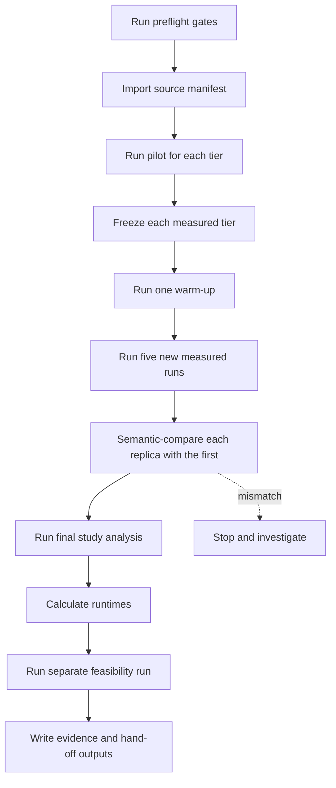

# Measured Cloud Evaluation Runbook

**Status: blocked.** Tooling items 1 through 4 block the cloud study. See the
[cloud evaluation tooling plan](cloud-evaluation-tooling-plan.md). The crossed
study analysis and pilot are current behavior. Do not start timed cloud runs
before items 1 through 4 are complete.

This runbook tells an agent how to execute the measured cloud study once that
tooling exists. It works without this conversation. Use the
[topology-scale study protocol](topology-scale-study.md) for the surrounding
study design and the manual replication commands.

## Purpose and evidence boundary

This runbook produces measured cloud runtime and outcome evidence. The
executor runs every tier on fixed, frozen inputs. Use the results to compare
runtime and strategy outcomes across tiers.

The results are not absolute performance claims. They describe one fixed
environment on one fixed graph per tier. Do not compare these results with
results from another environment.

## Inputs the executor must receive

Receive these inputs before you start:

- the source manifests for the measured tiers;
- the tier host counts (edge counts are generated outputs, not inputs);
- the common attacks-per-plan count;
- the common plan-selection seed count;
- the list of strategies and budgets;
- the generated environment record;
- the path to write durable evidence.

Use the values in the source manifests. Do not invent values.

## Prerequisites

The study starts only after tooling items 1 through 4 in the
[tooling plan](cloud-evaluation-tooling-plan.md) are complete: the one-off
evaluator, topology diagnostic, automatic environment record, and automatic
once-per-frozen-manifest warm-up. The crossed study analysis and pilot are
current behavior.

Check every gate before you run timed measures. Stop the study if a gate
fails.

Committed inputs:

- The source manifests are committed to the repository.
- The topology diagnostic records whether tier growth changes attack-relevant
  structure. Record an unchanged result as evidence, not as a failed gate.

Local test gates, run from `src/`:

- Topology invariant test:
  `mix test test/network_defense/topology/enterprise_topology_test.exs`.
- Evaluation report component test:
  `npx vitest run assets/svelte/dashboard/analysis-report/AnalysisReport.svelte.test.ts`.

Verified local stack gates:

- Terraform apply completes and configured container health checks pass.
- The application readiness endpoint answers through the application URL from
  `./terraform.sh output` in `infra/environments/local`.
- The database accepts connections through the database URL from that output.
- Inspect current Docker container state without assuming container names.
- The managed analysis services are site-internal and have no host endpoint;
  do not use an analysis host-port check.
- Terraform output lists the current service URLs and site-primary node names.

Deployed environment gates:

- All pending migrations are applied; the migration status lists every
  migration as up.
- Each application replica answers `GET /readyz` with HTTP 200.
- The database accepts connections (`pg_isready`).
- The analysis service answers `GET /healthz` with HTTP 200.
- The generated environment record matches the running environment.
- No other evaluation runs concurrently.

## Run sequence

```mermaid
flowchart TD
    A[Run preflight gates] --> B[Import source manifest]
    B --> C[Run pilot for each tier]
    C --> D[Freeze each measured tier]
    D --> E[Run one warm-up]
    E --> F[Run five new measured runs]
    F --> G[Semantic-compare each replica with the first]
    G --> H[Run final study analysis]
    H --> I[Calculate runtimes]
    I --> J[Run separate feasibility run]
    J --> K[Write evidence and hand-off outputs]
    G -. mismatch .-> S[Stop and investigate]
```

The commands below require the one-off evaluator from the
[tooling plan](cloud-evaluation-tooling-plan.md). That evaluator runs each Mix
command with the deployed application identity, mounted secrets, database
access, and non-conflicting listeners. It does not exist yet, so no command in
this sequence can run against the deployed environment today. Do not run
host-side Mix without credentials.

Follow the manual replication process in the topology-scale protocol:

1. Import the source manifest with `mix evaluate.import --file PATH`.
2. Run the two pilots. The runtime pilot owns the tier host counts: it selects
   host counts that fit the environment capacity and pass the topology
   diagnostic. Run `mix evaluate.study --mode pilot` for the mission-impact
   pilot. It selects the common plan-selection seed count and attacks-per-plan
   count. Both counts must meet the one-point half-width target for every
   non-degenerate primary comparison. Confirm both pilots before you freeze.
3. Freeze each measured tier with `mix evaluate.freeze
--manifest-id SOURCE --frozen-manifest-id TARGET`.
4. Confirm that the automatic warm-up completed exactly once for the frozen
   manifest. Do not run a second manual warm-up. Do not use the warm-up result
   as a timing or outcome sample.
5. Run five new evaluations with
   `mix evaluate.manifest --manifest-id TARGET --output ARCHIVE`. Write one
   archive for each run. `mix evaluate.manifest` starts a new run on every
   invocation; it never resumes an interrupted run. Save the printed run ID.
   Name each archive with its tier, replica number, and run ID.
6. Handle a failed, cancelled, interrupted, corrupt, or missing-archive
   replica. Never resume a timing replica: exclude the run from the timing
   samples, log it in the evidence, and, after confirming no duplicate
   execution, start a fresh replacement run. Stop if the problem recurs or
   cannot be diagnosed.
7. Compare each other timed archive with the first one before you accept its
   timing result. A comparison error, including a malformed archive, stops
   acceptance.
8. Designate one accepted archive for each tier as the outcome archive. Run
   single-run analysis for every accepted archive to produce its runtime
   summary.
9. Run `mix evaluate.study --mode analyze` across the designated tier run IDs
   for the final primary analysis. The analysis includes plan-selection and
   attack-outcome variation and applies Holm correction once across all 36
   comparisons. Keep single-run analysis separate for replica runtime
   summaries. See the [analysis guide](../../evaluation/analysis/README.md)
   for interpretation.
10. For each tier, use the five accepted runtime summaries. Report the median
    and observed range of simulation, plan-selection, and total-evaluation
    durations.
11. After the timing runs complete, run one separate feasibility run with a
    manifest reserved for that run. It is not tier-runtime evidence.

Do not change a measured graph revision or manifest during these runs.

## Stop conditions

Stop the study and investigate when any condition below occurs:

- any application, database, or analysis service becomes unhealthy;
- a handled replica failure recurs or cannot be diagnosed;
- a semantic comparison reports a mismatch;
- a comparison error occurs, including a malformed archive;
- the analysis service returns HTTP 413, `Request too large`, or HTTP 429,
  `Service busy`;
- the primary outcome is non-informative, for example a zero-difference and a
  zero-width interval.

Record the condition and the stopped stage in the evidence. Do not continue
until you resolve the condition.

## Durable evidence and hand-off outputs

Write these outputs to the evidence path:

- the committed source manifest for each tier;
- the frozen manifest for each tier;
- one archive for each measured run;
- the semantic comparison results;
- the analysis outputs;
- the generated environment record;
- the runtime summary;
- the stop-condition log.

The evidence must identify which archive is the outcome archive and which are
timing replicas. Identify each archive by name alone: tier, replica number,
and run ID. Do not rely on a directory layout.

## Interpretation limits

- Primary intervals include plan-selection variation and attack-outcome
  variation. They do not include graph-generation or environment variation.
- One frozen graph exists per tier. The study contains no graph replication
  within a host-count tier.
- Results apply to the declared model, three frozen graphs, and recorded Azure
  environment. They are not absolute performance or real-world effectiveness
  claims.

Describe these limits with every reported result.
