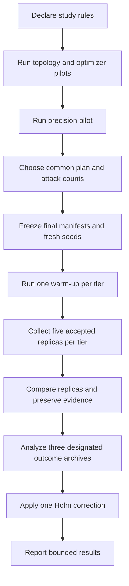

# Topology-Scale Evaluation Methodology and Parameters

## Purpose

This document defines how a scenario becomes study evidence. It defines each
parameter group, owner, freeze point, and meaning.

See the [evaluation lifecycle](../concepts/evaluation.md) and the
[analysis guide](../../evaluation/analysis/README.md) for the execution and
analysis interfaces.

## Method overview

The evaluation has two levels:

1. A **tier run** executes one manifest on one frozen graph and exports plans,
   trials, outcomes, and runtimes.
2. A **study analysis** combines one designated outcome archive from each tier,
   calculates the 36 primary comparisons, and applies one Holm correction.



## Parameter classes

| Class              | Meaning                                                  | Examples                                                    |
| ------------------ | -------------------------------------------------------- | ----------------------------------------------------------- |
| Scenario and model | Defines the graph, attacker, mission, and defense model. | Host count, topology seed, entry host, exploit probability. |
| Study design       | Defines comparisons and statistical rules.               | Confidence level, comparison family, correction method.     |
| Pilot-selected     | Chosen from observed pilot behavior.                     | Tier sizes, plan count, attacks per plan.                   |
| Environment        | Defines the measured deployment.                         | Image digest, Azure region, service versions.               |
| Derived            | Computed from controlled inputs.                         | Frozen graph revision, plan identity, child seeds.          |
| Measured           | Recorded during execution.                               | Mission impact, blast radius, runtime.                      |

## Ownership and freeze stages

| Owner                | Owns                                                                           | Freeze stage                      |
| -------------------- | ------------------------------------------------------------------------------ | --------------------------------- |
| Study specification  | Family-level rules, candidate grid, correction, seed separation, replica rule. | Before pilots.                    |
| Tier manifest        | One scenario, strategy runs, executable seed roots, and per-plan trial count.  | Before that tier runs.            |
| Model code and graph | Vulnerability behavior, mission weights, topology semantics, action semantics. | Source revision and graph freeze. |
| Pilot                | Recommended tier sizes and common sample counts.                               | Before final manifests.           |
| Environment record   | Platform identity for measured runs.                                           | Before warm-up and replicas.      |
| Archives             | Plans, trials, outcomes, and per-run runtimes.                                 | At export.                        |
| Study analysis       | Intervals, raw p-values, Holm results, and pilot recommendation.               | At analysis.                      |

## Tier-manifest parameters

Validation owner:
[`EvaluationManifest`](../../src/lib/network_defense/evaluation/contracts/evaluation_manifest.ex).
Python validates the exported copy again in
[`contracts.py`](../../evaluation/analysis/src/network_defense_analysis/contracts.py).

### Manifest identity and source

| Parameter                  | Plain-language meaning                                                  | Domain or unit             | Chosen by      | Freeze          |
| -------------------------- | ----------------------------------------------------------------------- | -------------------------- | -------------- | --------------- |
| `schema_version`           | Format version of the manifest.                                         | Supported integer version. | Code           | Release         |
| `model_version`            | Label for the model revision used by the scenario.                      | Text                       | Study author   | Manifest import |
| `id`                       | Stable manifest identity.                                               | Text                       | Study author   | Manifest import |
| `source.type`              | Whether the source is generated or already frozen.                      | Topology or graph revision | Study author   | Manifest import |
| `source.generator`         | Generator used for a generated topology.                                | Supported generator name   | Study author   | Manifest import |
| `source.hosts`             | Enterprise host count. It excludes the generated internet ingress node. | Host count                 | Runtime pilot  | Final manifest  |
| `source.seed`              | Random input for deterministic topology generation.                     | Non-negative integer       | Study author   | Graph freeze    |
| `source.graph_revision_id` | Immutable graph used by measured runs.                                  | Revision identifier        | Freeze command | Graph freeze    |

The topology is derived from the host count and topology seed. The study stores
the resolved graph so later runs do not regenerate it.

### Attacker parameters

| Parameter                   | Plain-language meaning                             | Domain or unit          | Chosen by         | Freeze                |
| --------------------------- | -------------------------------------------------- | ----------------------- | ----------------- | --------------------- |
| `attacker.entry_host.type`  | How the entry host is identified.                  | Semantic key or node ID | Scenario author   | Manifest import       |
| `attacker.entry_host.value` | Host controlled at the beginning of every trial.   | Host reference          | Scenario author   | Manifest import       |
| `attacker.max_attempts`     | Maximum attempts for one distinct attacker action. | Positive count          | Scenario author   | Manifest import       |
| Attack horizon              | Maximum attacker-action steps in one trajectory.   | Step count              | Model or scenario | Manifest/model freeze |

The initial foothold contributes to blast radius. The simulator selects an
eligible action uniformly, then samples that action's scenario outcome.

### Model variants

| Parameter                        | Plain-language meaning                                        | Domain                                               | Chosen by    | Freeze          |
| -------------------------------- | ------------------------------------------------------------- | ---------------------------------------------------- | ------------ | --------------- |
| `model_variants[].id`            | Stable name of an optimization configuration.                 | Supported variant                                    | Study author | Manifest import |
| `objective`                      | Outcome minimized during plan selection.                      | Mission impact, blast radius, or supported composite | Study author | Manifest import |
| `require_pre_attack_feasibility` | Rejects plans that disrupt mission support before the attack. | Boolean                                              | Study author | Manifest import |

The feasibility comparison uses matched settings except for the feasibility
constraint. It is separate from tier-runtime evidence.

### Strategy-run parameters

| Parameter                       | Plain-language meaning                                          | Domain or unit          | Chosen by                 | Freeze          |
| ------------------------------- | --------------------------------------------------------------- | ----------------------- | ------------------------- | --------------- |
| `strategy_runs[].model_variant` | Model variant used by this plan group.                          | Declared variant ID     | Study author              | Manifest import |
| `strategy`                      | Plan-selection method.                                          | Supported strategy name | Study author              | Manifest import |
| `budget`                        | Maximum defense-action count.                                   | Positive action count   | Study design              | Manifest import |
| `selection_seeds`               | Random inputs used to select plans. One seed produces one plan. | Unique integer list     | Pilot/final seed schedule | Manifest import |

Equal budgets compare action counts. They do not mean equal money, effort, or
operational risk.

### Evaluation parameters

| Parameter              | Plain-language meaning                                           | Domain or unit       | Chosen by       | Freeze          |
| ---------------------- | ---------------------------------------------------------------- | -------------------- | --------------- | --------------- |
| `evaluation.trials`    | Number of attack trajectories evaluated for each selected plan.  | Attacks per plan     | Precision pilot | Final manifest  |
| `evaluation.seed`      | Root input used to derive attack-related random streams.         | Non-negative integer | Seed schedule   | Manifest import |
| `optimizer_trials`     | Monte Carlo trials used inside simulation-backed plan selection. | Trial count          | Optimizer pilot | Final manifest  |
| `optimizer_iterations` | Iterations used inside one optimizer simulation.                 | Iteration count      | Optimizer pilot | Final manifest  |

The Elixir and Python validators use the same minimum rule for attack trials.

### Per-tier analysis parameters

These fields remain in each manifest for single-archive compatibility. The
study specification is authoritative for family-level analysis and validates
that every tier agrees.

| Parameter                 | Meaning                                                                | Domain or unit              | Chosen by    | Freeze            |
| ------------------------- | ---------------------------------------------------------------------- | --------------------------- | ------------ | ----------------- |
| `confidence_level`        | Coverage requested from the interval procedure.                        | Number between zero and one | Study design | Study-spec freeze |
| `bootstrap_resamples`     | Number of bootstrap replicates.                                        | Positive count              | Study design | Study-spec freeze |
| `permutation_resamples`   | Legacy or supporting test replicate count.                             | Positive count              | Study design | Study-spec freeze |
| `multiplicity_correction` | Method applied to the declared family.                                 | Holm for the final study    | Study design | Study-spec freeze |
| `analysis.seed`           | Random input for deterministic statistical resampling.                 | Non-negative integer        | Study design | Study-spec freeze |
| `primary_comparisons`     | Alternative, baseline, budget, variant, and outcome for each contrast. | Comparison list             | Study design | Study-spec freeze |

The precision target belongs only to the study specification. Tier manifests
do not carry a pilot block.

## Graph and model parameters outside the manifest

Some scenario behavior comes from the frozen graph and model code rather than
from the manifest.

| Parameter                   | Meaning                                                                                           | Source                      | Classification            |
| --------------------------- | ------------------------------------------------------------------------------------------------- | --------------------------- | ------------------------- |
| CVSS base score             | Severity used by the CVSS strategy to order vulnerabilities.                                      | Vulnerability node/catalog  | Controlled model input    |
| Exploit probability         | Probability that a modeled exploit action succeeds. It is not a measured real-world exploit rate. | Vulnerability catalog/graph | Controlled scenario input |
| Capability impact weight    | Contribution of one disrupted capability to mission impact.                                       | Mission-capability node     | Controlled scenario input |
| Minimum operational support | Minimum uncompromised supporting-host count.                                                      | Mission-capability node     | Controlled scenario input |
| Required flows              | Network flows that must exist for a capability to remain operational.                             | Graph relationships         | Controlled scenario input |
| Reachability policies       | Segment-level access rules that create eligible remote actions.                                   | Graph relationships         | Controlled scenario input |
| Defense-action semantics    | Effects of patching, segmentation, and credential revocation.                                     | Model code                  | Controlled model behavior |

Changes to these values define a different scenario or model. Record them in
the frozen graph and source revision.

## Study-specification parameters

The study specification owns values that span all tier manifests.

| Parameter                   | Meaning                                                                | Chosen by          | Freeze                 |
| --------------------------- | ---------------------------------------------------------------------- | ------------------ | ---------------------- |
| `study_id`                  | Stable study identity.                                                 | Study author       | Specification creation |
| `specification_version`     | Revision of the study-level format.                                    | Code/study author  | Specification creation |
| `tiers`                     | Required tier labels and analysis archive entries.                     | Study design       | Before pilots          |
| Strategy set                | Four alternatives and CVSS baseline.                                   | Study design       | Before pilots          |
| Budget set                  | Action-count budgets included in the primary family.                   | Study design       | Before pilots          |
| Primary outcome             | Simulated mission impact.                                              | Study design       | Before pilots          |
| Expected family             | Matrix that expands to the declared primary comparisons.               | Study design       | Before pilots          |
| Plan-count candidates       | Common plan counts tested by the pilot; every value is at least five.  | Study design       | Before precision pilot |
| Attacks-per-plan candidates | Common attack counts tested by the pilot; every value is at least ten. | Study design       | Before precision pilot |
| Precision target            | Maximum guarded interval half-width.                                   | Study design       | Before precision pilot |
| Guard quantile              | Upper quantile used to avoid selecting a fragile candidate.            | Statistical design | Before precision pilot |
| Correction method           | One Holm pass over the complete primary family.                        | Study design       | Before final analysis  |
| Pilot seed schedule         | Seeds reserved for sample-size selection.                              | Study author       | Before pilot           |
| Final seed schedule         | Disjoint seeds reserved for final evidence.                            | Study author       | Before final manifests |
| Optimizer setting           | Common optimizer trials and iterations.                                | Optimizer pilot    | Before final manifests |
| Warm-up rule                | One excluded warm-up for each frozen tier manifest.                    | Study design       | Before measured runs   |
| Replica rule                | Five accepted measured replicas per tier.                              | Study design       | Before measured runs   |
| Stopping rules              | Conditions that block acceptance or require investigation.             | Study design       | Before pilots          |

The specification declares the comparison matrix. Each tier manifest contains
its 12 executable comparison entries. Bundle validation rejects a mismatch; it
does not choose one declaration silently.

## Pilot-selected parameters

### Topology and optimizer pilots

- The runtime pilot selects the three host counts that fit the environment and
  pass the topology diagnostic.
- The optimizer pilot selects common optimizer trial and iteration counts.

### Precision pilot

The precision pilot selects:

- one common plan-selection seed count of at least five;
- one common attacks-per-plan count of at least ten.

These lower bounds come from the finite-sample method calibration. Counts below
them did not provide acceptable coverage and false-positive behavior. Coverage
above 0.99 is recorded as conservative behavior. It can increase the selected
sample size, but it does not invalidate inference.

For each candidate pair, it records the guarded half-width for each primary
comparison. A candidate passes only when every informative comparison meets the
configured target. If no candidate passes, the result is
`insufficient_pilot = true` and final collection does not start.

The recommendation is copied into new final manifests with fresh seed
schedules. The pilot archives are not final outcome evidence.

## Environment and replica parameters

| Parameter              | Meaning                                                                                               | Classification            |
| ---------------------- | ----------------------------------------------------------------------------------------------------- | ------------------------- |
| Environment record     | Region, compute identity, image digests, service versions, configuration hashes, and migration state. | Controlled evidence       |
| Warm-up                | One excluded run that prepares the environment.                                                       | Controlled procedure      |
| Accepted replica count | Number of measured runtime repeats for one tier.                                                      | Controlled procedure      |
| Replica runtime        | Plan-selection, simulation, and total-evaluation duration.                                            | Measured outcome          |
| Replica equality       | Semantic comparison that ignores expected run IDs and timing differences.                             | Derived acceptance result |

A changed environment record blocks measured collection. A failed or unequal
replica is excluded, recorded, and replaced only after investigation.

## Measured and derived outputs

| Output                        | Meaning                                                             | Source                              |
| ----------------------------- | ------------------------------------------------------------------- | ----------------------------------- |
| Mission impact                | Weighted disrupted-capability impact in one trial.                  | `trials.csv`                        |
| Blast radius                  | Foothold-host count, including the initial foothold.                | `trials.csv`                        |
| Capability disruption         | Operational state of one capability.                                | `capability_outcomes.csv`           |
| Pre-attack mission disruption | Missing required flows and affected capabilities before the attack. | `pre_attack_flow_statuses.csv`      |
| Host compromise probability   | Fraction of trials in which a host is a foothold.                   | `host_compromises.csv` and analysis |
| Plan-selection duration       | Time used to select one plan.                                       | `plans.jsonl`                       |
| Simulation duration           | Time used by one attack experiment.                                 | `summary.csv`                       |
| Total-evaluation duration     | End-to-end evaluator runtime.                                       | `evaluator_runtime.csv`             |
| Mean contrast                 | Alternative mean mission impact minus CVSS mean.                    | Study analysis                      |
| Confidence interval           | Crossed-bootstrap uncertainty over plan and attack variation.       | Study analysis                      |
| Raw and adjusted p-values     | Centered-bootstrap test and Holm result.                            | Study analysis                      |

The designated outcome archive from each tier enters the 36-comparison family.
All five accepted replica archives remain in the durable evidence package and
provide runtime summaries.

## Freeze timeline

```mermaid
flowchart LR
    M[Freeze model and method] --> O[Run optimizer pilot]
    O --> T[Run topology/runtime pilot]
    T --> P[Freeze precision-pilot specification]
    P --> Q[Run precision pilot]
    Q --> C[Freeze common sample counts]
    C --> F[Create final manifests with fresh seeds]
    F --> G[Freeze graphs and environment]
    G --> R[Collect accepted replicas]
    R --> A[Run final study analysis]
```



A change after its freeze stage creates a new study-specification version. Do
not patch a measured manifest in place.

## Illustrative scenario

The values below are examples only. They are not recommended production values.

```json
{
  "id": "tier-example-pilot",
  "source": {
    "type": "topology",
    "generator": "enterprise",
    "hosts": 15,
    "seed": 7401
  },
  "attacker": {
    "entry_host": {
      "type": "semantic_key",
      "value": "example-client"
    },
    "max_attempts": 3
  },
  "strategy_runs": [
    {
      "strategy": "simulation_informed",
      "budget": 2,
      "selection_seeds": [51, 52, 53, 54]
    },
    {
      "strategy": "cvss",
      "budget": 2,
      "selection_seeds": [61, 62, 63, 64]
    }
  ],
  "evaluation": {
    "trials": 72,
    "seed": 8502,
    "optimizer_trials": 9,
    "optimizer_iterations": 4
  }
}
```

Interpretation:

1. The generator creates a 15-host enterprise graph from topology seed 7401.
2. Every trial starts from the declared client foothold.
3. Budget two permits at most two defense actions per plan.
4. Four selection seeds create four plans on each comparison side.
5. Every plan receives 72 attack trajectories from a shared attack schedule.
6. The precision pilot may test smaller row and column counts from this larger
   dataset.
7. Final manifests use the selected counts and different seeds.

One primary result identifies the tier, model variant, alternative strategy,
CVSS baseline, budget, and mission-impact outcome. A negative contrast means
that the alternative produced lower mean simulated mission impact.

## Remaining collection controls

- Bind the model version to a running model or source revision.
- Define and validate the environment record.
- Enforce common optimizer settings and final sample counts where the study
  specification does not yet do so.
- Enforce the accepted replica count and designated outcome archive during
  cloud collection.
