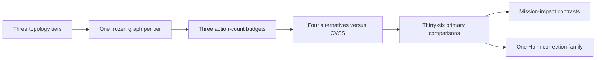

# Topology-Scale Study Protocol

Question: how does controlled growth in topology size affect simulation,
plan-selection, and total-evaluation runtime, and the mission-impact contrasts
between equal-action-count strategies and CVSS prioritization?

See the [scope page](../concepts/scope.md) for the research boundary. See the
[methodology](topology-scale-methodology.md) for frozen study decisions.

## Status

Local runs are pilots. They validate the workflow and select study parameters.
They do not support final cloud-runtime, topology-scale, optimizer-quality, or
strategy-effect claims.

The Azure study is blocked until tooling items 1 through 4 exist. See the
[cloud evaluation tooling plan](cloud-evaluation-tooling-plan.md). The
`mix evaluate.study` task builds a study bundle and runs pilot or final study
analysis. It does not start evaluation runs.

## Size tiers

The study uses three controlled size tiers and one frozen graph per tier. A
runtime pilot selects their exact host counts before the full study. Edge
counts are generated outputs of the selected host counts, not inputs.

The tiers span small, medium, and large topologies. Growth in size must not
change the invariants. Results remain conditional on the three frozen graphs.

## Invariants

Each tier preserves:

- the node-role schema and relationship types;
- the exposure template;
- the reachability policy pattern;
- the attacker entry context;
- equal action-count budgets.

The topology diagnostic records how attack-relevant structure changes as the
graph grows. Structural change is an observed result, not an automatic failure.

## Compared strategies

The study compares four alternatives with CVSS score priority ordering:

- random defense selection;
- topology-driven policy segmentation;
- simulation-informed defense selection;
- simulated-annealing search over defense plans.

Each method uses equal action-count budgets of one, two, and three. Equal action
counts compare plan cardinality, not money, effort, or deployment complexity.
The pilot selects one common count of plan-selection seeds. The null strategy
is a descriptive no-defense control and is not part of the primary comparison
family.

This page does not prescribe a construction method or a topology generator.

## Study structure at a glance



One primary comparison has one tier, one budget, and one alternative. For
example, topology segmentation at budget two on the medium tier is compared
with CVSS at budget two on that same graph. All selected plans and paired
attacks for those conditions contribute to one contrast and one uncertainty
interval. A direct topology-segmentation versus simulated-annealing claim is
outside the primary comparison family.

## Outcomes

Simulated mission impact is the primary outcome. For each tier and budget, the
study estimates the paired mean difference between each alternative and CVSS.
Ordering these contrasts does not establish a universal total ranking.

Blast radius is a secondary safety outcome. It counts all foothold hosts at the
end of a trial, including the initial foothold. The separate feasibility run
reports modeled pre-attack mission disruption.

## Runtime measures

The study reports median wall-clock durations for:

- simulation;
- strategy selection;
- total evaluation.

Each tier has one excluded warm-up and five accepted measured replicas. The
study reports the median and observed range of the five accepted replicas for
each timing metric. The runner records strategy-selection time as plan-selection
time; the terms refer to the same measure.

The study takes these measures in one recorded Azure environment. A changed or
mismatched environment record stops collection.

## Mission-impact pilot

The mission-impact pilot selects one common plan-selection seed count and one
common attacks-per-plan count before the full study. Both counts must cover
plan-selection variation and attack-outcome variation. The pilot uses a
confidence-interval half-width target of one mission-impact point for every
non-degenerate primary comparison.

A zero-difference and zero-width comparison does not pass the precision gate.
It is non-informative and stops the study for investigation. The current pilot
implements this contract: it selects both counts and rejects a non-informative
comparison.

## Frozen inputs

Before the full study, the study freezes all comparability inputs:

- topology variants and one graph revision per tier;
- metrics and the one-point precision target;
- strategies and action-count budgets;
- plan-selection and attack seed schedules;
- the common plan count and attacks-per-plan count;
- the complete family of 36 primary comparisons;
- stopping rules.

## Cloud protocol

The cloud study is blocked until the planned tooling is complete. See the
[cloud evaluation tooling plan](cloud-evaluation-tooling-plan.md) and the
[runbook prerequisites](cloud-evaluation-runbook.md#prerequisites).

See the [cloud evaluation runbook](cloud-evaluation-runbook.md) to execute the
measured cloud study. The cloud study extends the manual process below. Run the
diagnostic before it freezes tiers. It records whether growth changes
attack-relevant structure. An unchanged result is evidence, not a failed gate.

Pilot ownership:

- The runtime pilot owns the tier host counts. It selects host counts that fit
  the environment capacity and pass the topology diagnostic.
- The mission-impact pilot owns the common plan-selection seed count and
  attacks-per-plan count. It must meet the one-point half-width target for each
  non-degenerate primary comparison.

The primary analysis includes plan-selection and attack-outcome variation.
Holm correction applies once across all 36 primary comparisons: four
alternatives, three budgets, and three tiers. The analysis and pilot enforce
these rules. The study specification declares the family, and the
`mix evaluate.study` task runs the pilot and the final analysis.

When tooling items 1 through 4 are complete, Mix commands run in a one-off
application task with the deployed application identity, mounted secrets,
database access, and non-conflicting listeners. The one-off evaluator does not
exist yet. Do not run host-side Mix without credentials.

The feasibility input uses a separate manifest reserved for the feasibility
run. It is not tier-runtime evidence. Run it once after the timing runs
complete.

When a source uses the enterprise generator, `source.hosts` counts enterprise
hosts. It excludes the generated internet ingress host.

Before timed cloud runs, confirm the pending migrations and the health of the
application, database, and analysis services.

## Manual Replication Process

1. Keep each source manifest as a versioned JSON file.
2. Import the source manifest with `mix evaluate.import --file PATH`.
3. Run the pilots with the ownership recorded under
   [Cloud protocol](#cloud-protocol). Choose the measured tiers, common
   plan-selection seed count, and common attacks-per-plan count.
4. For each generated tier, freeze the selected source with
   `mix evaluate.freeze --manifest-id SOURCE --frozen-manifest-id TARGET`.
5. Use the frozen manifest for all warm-up and measured runs. A manifest that
   already names a graph revision needs no freeze step.
6. Confirm that the automatic warm-up completed exactly once for the frozen
   manifest. Do not run a second manual warm-up. Do not use the warm-up result
   as a timing or outcome sample.
7. Run five new evaluations with
   `mix evaluate.manifest --manifest-id TARGET --output ARCHIVE`. Write one
   archive for each run. The task starts a new run on every invocation. Save the
   printed run ID. Name each archive with its tier, replica number, and run ID.
8. Handle a failed, cancelled, interrupted, corrupt, or missing-archive
   replica. Never resume a timing replica: exclude the run from the timing
   samples, log it, and, after confirming no duplicate execution, start a
   fresh replacement. Stop if the problem recurs or cannot be diagnosed.
9. Compare each other timed archive with the first one before accepting its
   timing result. A comparison error, including a malformed archive, stops
   acceptance.
10. Designate one accepted archive for each tier as the outcome archive. Run
    `mix evaluate.study --mode analyze` across the designated tier run IDs. Run
    single-run analysis for every accepted archive to produce its runtime
    summary.
11. For each tier, report the median and observed range from five accepted
    runtime summaries.

Do not change a measured graph revision or manifest during these runs.

## Replica Check

Run this command from `evaluation/analysis/`:

```sh
uv run network-defense-analysis compare first.zip replica.zip
```

The command checks the manifest, graph, selected plans, attack outcomes,
capability outcomes, pre-attack flow status, host compromises, and non-timing
summary values. It ignores run IDs and timing values. It returns zero when the
outcomes match. It returns one when they differ. Stop the study and investigate
an outcome mismatch. A comparison error, including a malformed archive, stops
acceptance. See the [analysis guide](../../evaluation/analysis/README.md) for
the comparison details and how to run it from `evaluation/analysis/`.

## Limits

The study is exploratory and adds no directional hypothesis. It makes no
claims beyond the three frozen graphs, the declared model, and the recorded
Azure environment. One graph per tier does not measure graph-generation
variation.
