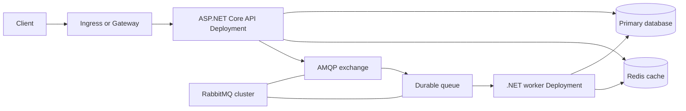

# Kubernetes, Redis, and RabbitMQ Tutorial for ASP.NET Core

## Purpose and target

This standalone tutorial shows how to run a conventional ASP.NET Core API and queue worker on Kubernetes with RabbitMQ and Redis. It targets .NET 10 LTS and RabbitMQ's current 4.3 documentation. It deliberately uses ordinary AMQP work queues; it does not require RabbitMQ Federation, Shovel, or distributed Erlang.

The pattern is:



The API owns request validation and durable state changes. RabbitMQ owns buffered, at-least-once delivery. Workers perform retryable work. Redis stores disposable cache entries. The database remains the source of truth.

## 1. Understand the delivery contract first

Before creating any Kubernetes object, decide what happens on failure.

1. An API request writes the business row and an outbox row in one database transaction.
2. A publisher relay sends unsent outbox rows to RabbitMQ using publisher confirms.
3. A worker receives one message with manual acknowledgement enabled.
4. The worker performs an idempotent database update.
5. The worker acknowledges the AMQP delivery only after that database transaction commits.
6. If the worker crashes before acknowledgement, RabbitMQ requeues the delivery. The replacement worker can receive it.

This is at-least-once delivery. A duplicated delivery is expected, so the handler must make its database effect idempotent. Never treat an AMQP message as a database transaction.

### A minimal message shape

Messages should contain identifiers and schema versions, not whole database objects:

```json
{
  "jobId": "durable-job-id",
  "correlationId": "request-correlation-id",
  "schemaVersion": 1
}
```

The worker loads the current durable data by `jobId`. This keeps messages small, lets schemas evolve, and makes retries safe.

## 2. Prepare the Kubernetes cluster

Confirm before deployment:

1. Metrics Server is available for HPA.
2. A default StorageClass exists for RabbitMQ and any in-cluster database.
3. The CNI enforces NetworkPolicy.
4. An ingress controller or Gateway supports the HTTP features the API uses.
5. The image registry is reachable by nodes.
6. Secrets are supplied by a secret manager or restrictive input files, not committed manifests.

```bash
kubectl create namespace example-app
kubectl get storageclass
kubectl top nodes
```

Create a Secret from externally managed files. Do not put passwords in YAML or source control.

```bash
kubectl -n example-app create secret generic app-runtime \
  --from-file=connection-string=/secure/path/connection-string \
  --from-file=rabbitmq-uri=/secure/path/rabbitmq-uri \
  --from-file=redis-connection=/secure/path/redis-connection
```

Kubernetes Secret encoding is not encryption. Enable encryption at rest in the cluster and grant only the workload service accounts access to their required Secrets.

## 3. Prepare the ASP.NET Core application

### Health endpoints

Expose separate liveness and readiness endpoints. Liveness answers "should Kubernetes restart this process?" Readiness answers "should Kubernetes send it traffic?"

```csharp
var builder = WebApplication.CreateBuilder(args);

string ReadRequiredSecret(string environmentVariable)
{
    var path = Environment.GetEnvironmentVariable(environmentVariable)
        ?? throw new InvalidOperationException($"{environmentVariable} is required");

    return File.ReadAllText(path).Trim();
}

builder.Configuration.AddInMemoryCollection(new Dictionary<string, string?>
{
    ["ConnectionStrings:Primary"] = ReadRequiredSecret("CONNECTION_STRING_FILE"),
    ["ConnectionStrings:Redis"] = ReadRequiredSecret("REDIS_CONNECTION_FILE"),
    ["RabbitMq:Uri"] = ReadRequiredSecret("RABBITMQ_URI_FILE")
});

builder.Services.AddHealthChecks()
    .AddCheck("live", () => HealthCheckResult.Healthy(), tags: ["live"]);

var app = builder.Build();

app.MapHealthChecks("/healthz/live", new HealthCheckOptions
{
    Predicate = check => check.Tags.Contains("live")
});

app.MapHealthChecks("/healthz/ready", new HealthCheckOptions
{
    Predicate = _ => true
});

app.Run();
```

Add a database health check to readiness only after confirming its timeout and failure behavior fit your database capacity. Do not put a dependency outage into liveness: restarting every API pod cannot repair a database outage and makes recovery harder.

### Container behavior

The container must listen on the configured HTTP port, write structured logs to standard output, and handle SIGTERM. ASP.NET Core's host translates SIGTERM into graceful shutdown. Keep `HostOptions.ShutdownTimeout` lower than the Pod's `terminationGracePeriodSeconds`.

For file-mounted secrets, read each secret file once during startup and add the value to configuration before registering dependent services, as in the ordered startup sequence above. This preserves a file-based secret boundary instead of exposing the values as process environment variables.

Build a release image with an immutable tag or digest. Run it locally before Kubernetes:

```bash
docker run -d --rm --name example-api -p 8080:8080 \
  -v /secure/example-app:/run/secrets/example-app:ro \
  -e CONNECTION_STRING_FILE=/run/secrets/example-app/connection-string \
  -e REDIS_CONNECTION_FILE=/run/secrets/example-app/redis-connection \
  -e RABBITMQ_URI_FILE=/run/secrets/example-app/rabbitmq-uri \
  registry.example/example-api@sha256:replace-me
curl -f http://localhost:8080/healthz/live
docker stop example-api
```

## 4. Deploy the API

### Deployment

This is an example shape. It assumes an official .NET image running as UID/GID `1654`; align `runAsUser`, `runAsGroup`, and `fsGroup` with the actual image. Measure and replace resource values for the application; they are intentionally not sizing guidance.

```yaml
apiVersion: apps/v1
kind: Deployment
metadata:
  name: example-api
  namespace: example-app
spec:
  selector:
    matchLabels:
      app.kubernetes.io/name: example-api
  template:
    metadata:
      labels:
        app.kubernetes.io/name: example-api
    spec:
      securityContext:
        runAsNonRoot: true
        runAsUser: 1654
        runAsGroup: 1654
        fsGroup: 1654
      terminationGracePeriodSeconds: 45
      containers:
        - name: api
          image: registry.example/example-api@sha256:replace-me
          ports:
            - name: http
              containerPort: 8080
          env:
            - name: ASPNETCORE_URLS
              value: http://+:8080
            - name: CONNECTION_STRING_FILE
              value: /run/secrets/example-app/connection-string
            - name: REDIS_CONNECTION_FILE
              value: /run/secrets/example-app/redis-connection
            - name: RABBITMQ_URI_FILE
              value: /run/secrets/example-app/rabbitmq-uri
          readinessProbe:
            httpGet:
              path: /healthz/ready
              port: http
          livenessProbe:
            httpGet:
              path: /healthz/live
              port: http
          startupProbe:
            httpGet:
              path: /healthz/live
              port: http
            failureThreshold: 30
            periodSeconds: 2
          resources:
            requests:
              cpu: 250m
              memory: 256Mi
            limits:
              memory: 512Mi
          volumeMounts:
            - name: runtime-secrets
              mountPath: /run/secrets/example-app
              readOnly: true
      volumes:
        - name: runtime-secrets
          secret:
            secretName: app-runtime
            defaultMode: 0440
```

Requests drive scheduling and HPA utilization. CPU limits throttle instead of terminating a process; test CPU-sensitive work before choosing one. Memory limits protect the node but an exceeded limit causes an OOM kill.

### Service and ingress

Create a ClusterIP Service selecting `app.kubernetes.io/name: example-api`. Expose it through your ingress or Gateway. Keep RabbitMQ, Redis, and database Services internal.

```yaml
apiVersion: v1
kind: Service
metadata:
  name: example-api
  namespace: example-app
spec:
  selector:
    app.kubernetes.io/name: example-api
  ports:
    - name: http
      port: 80
      targetPort: http
```

Apply and verify:

```bash
kubectl -n example-app apply -f api.yaml
kubectl -n example-app rollout status deployment/example-api
kubectl -n example-app get pods,svc
```

## 5. Autoscale the API and workers separately

### API HPA

Use CPU utilization as a first signal for HTTP capacity. The target is relative to CPU requests, so define a CPU request before enabling it.

```yaml
apiVersion: autoscaling/v2
kind: HorizontalPodAutoscaler
metadata:
  name: example-api
  namespace: example-app
spec:
  scaleTargetRef:
    apiVersion: apps/v1
    kind: Deployment
    name: example-api
  minReplicas: 2
  maxReplicas: 10
  metrics:
    - type: Resource
      resource:
        name: cpu
        target:
          type: Utilization
          averageUtilization: 70
  behavior:
    scaleDown:
      stabilizationWindowSeconds: 300
```

When HPA controls a deployment, do not continuously apply a conflicting `spec.replicas`. Check `kubectl describe hpa` for missing metrics and scale decisions.

### Worker scaling

Worker demand is queue age and backlog, not API CPU. Use an external metric through Prometheus Adapter or a KEDA RabbitMQ scaler. KEDA is the usual small operational addition when queue-driven scaling is needed; it creates HPA behavior from the RabbitMQ queue metric.

Start with one in-flight message per worker handler for expensive or non-idempotent work. Increase prefetch only after measuring handler duration, memory, acknowledgement latency, and redelivery behavior.

Set the worker maximum from all constraints:

`maximum workers <= CPU capacity, database connection budget, and useful queue throughput`

More consumers do not make a serial database bottleneck faster.

## 6. Run RabbitMQ as a broker, not as application state

Use the RabbitMQ Cluster Operator and Messaging Topology Operator for a production in-cluster broker. A three-node local cluster with persistent storage is the usual HA starting point. A two-node cluster cannot retain a majority after one node fails.

For a conventional work queue:

1. Create a dedicated vhost and least-privilege API publisher and worker consumer users.
2. Declare a durable exchange, a durable quorum queue, and a binding.
3. Configure a dead-letter exchange and queue.
4. Publish persistent messages with publisher confirms.
5. Consume with manual acknowledgement and a bounded prefetch.
6. Set a finite delivery limit and inspect dead letters rather than retrying poison messages forever.

RabbitMQ's quorum queues replicate data using Raft and need a majority of queue members available. They are a good choice for durable business work, not for exclusive temporary queues or the lowest-latency transient workload.

### Publish from the API

Use the current `RabbitMQ.Client` 7.x asynchronous API. Keep a long-lived connection and create channels deliberately; do not open a TCP connection per request. The real reliability boundary remains the transactional outbox: publisher confirms alone cannot repair a process crash between database commit and message publication.

The worker Deployment uses the identical read-only Secret mount and the `CONNECTION_STRING_FILE`, `REDIS_CONNECTION_FILE`, and `RABBITMQ_URI_FILE` paths. It loads them with the same startup configuration before constructing its database, cache, and broker clients.

Pseudocode for the relay is:

```text
for each unsent outbox row:
  publish durable message
  wait for broker confirm
  mark row sent in the database
```

If marking sent fails after a confirmed publish, a later relay attempt may publish again. That is why the consumer must be idempotent.

### Consume in a hosted service

Use `BackgroundService` for a long-lived worker process. Create service scopes inside the handler rather than injecting scoped database services into the singleton hosted service.

```csharp
public sealed class JobConsumer(IServiceScopeFactory scopes) : BackgroundService
{
    protected override async Task ExecuteAsync(CancellationToken stoppingToken)
    {
        // Connect once, configure manual acknowledgement and bounded prefetch.
        // For each delivery: create a scope, claim and process the job,
        // commit durable state, then acknowledge that delivery.
        await Task.Delay(Timeout.Infinite, stoppingToken);
    }
}
```

The skeleton intentionally omits broker-specific wiring. The current RabbitMQ .NET API guide documents `IChannel`, `IAsyncBasicConsumer`, `BasicConsumeAsync`, and `BasicAckAsync`; use those async APIs rather than legacy synchronous examples.

### Graceful worker termination

Kubernetes sends SIGTERM, then sends SIGKILL after the grace period. The hosted-service cancellation token is signaled during orderly shutdown.

1. On cancellation, stop registering or accepting new deliveries.
2. Finish in-flight work before `ShutdownTimeout`.
3. Acknowledge only successful durable commits.
4. Close the channel after the handler exits.
5. Set Pod `terminationGracePeriodSeconds` longer than `ShutdownTimeout`.

If shutdown or a crash closes the connection while a delivery is unacknowledged, RabbitMQ redelivers it. Use a unique job key or an atomic state transition so the second handler has no duplicate business effect.

## 7. Add Redis as a cache

### Register a distributed cache

Use `IDistributedCache` with the StackExchange.Redis implementation for data caching. The in-memory distributed-cache implementation is only process-local and is not a shared cache across API replicas.

Install `Microsoft.Extensions.Caching.StackExchangeRedis` before using `AddStackExchangeRedisCache`.

```csharp
builder.Services.AddStackExchangeRedisCache(options =>
{
    options.Configuration = builder.Configuration.GetConnectionString("Redis");
    options.InstanceName = "example-app:";
});
```

Keep cache keys versioned and scoped, for example `customer:<id>:v1` or `report:<id>:v2`. Never use cache entries as the authoritative job state, lock, payment result, or acknowledgement record.

### Cache-aside pattern

1. Read a key from `IDistributedCache`.
2. On a hit, deserialize and return it.
3. On a miss, read the database or external service.
4. Serialize and store the response with an absolute or sliding expiration.
5. After the source-of-truth write commits, remove or replace the affected key.

Use cache-aside for slow, frequently read, safely reproducible values. Do not cache a value merely because Redis exists.

### Output caching is separate

`IDistributedCache` is not the correct backing store for ASP.NET Core output caching. Output caching needs atomic operations for tag eviction. For multi-replica public GET/HEAD response caching, register the Redis output-cache provider separately:

Install `Microsoft.AspNetCore.OutputCaching.StackExchangeRedis` before using `AddStackExchangeRedisOutputCache`.

```csharp
builder.Services.AddOutputCache();
builder.Services.AddStackExchangeRedisOutputCache(options =>
{
    options.Configuration = builder.Configuration.GetConnectionString("Redis");
    options.InstanceName = "example-output:";
});

var app = builder.Build();
app.UseOutputCache();

app.MapGet("/catalog/{id}", GetPublicCatalogItem).CacheOutput();
```

`CacheOutput()` opts the endpoint into output caching; service registration alone does not cache a response. The default output-cache policy caches only successful GET/HEAD responses with no cookies and no authenticated user. Keep output caching after CORS and authentication middleware so cached responses cannot cross security boundaries.

### Redis capacity and eviction

Set `maxmemory`; a cache with no bound can exhaust its pod or node. Choose an eviction policy from observed traffic, usually `allkeys-lru` or `allkeys-lfu`. All `volatile-*` policies require keys with TTLs and otherwise behave like `noeviction`.

Monitor Redis `keyspace_hits`, `keyspace_misses`, `evicted_keys`, memory, latency, and connection count. If replication or AOF persistence is enabled, leave memory headroom because replication/AOF buffers are not counted against the eviction limit.

## 8. Database and connection budget

Keep the database as the source of truth. The number of application pods changes total connection demand:

`total connections = API pods x API pool + worker pods x worker pool + migrations + operations`

Size HPA maxima and client pools so that this stays below the database's usable connection capacity. A connection pooler may help with many mostly idle clients, but it does not make a slow database query faster.

For Entity Framework Core with PostgreSQL, enable provider-supported retry behavior only after making operations idempotent. Execution strategies can replay a failed operation. Retries buffer result sets and manual transactions must run under the execution strategy, so large reads and transaction boundaries require testing.

Use a read replica only for stale-tolerant reads. Streaming replication is asynchronous by default; immediately reading a just-written value from a replica can return stale data. Writes, job claims, migrations, and read-after-write flows remain on the primary.

## 9. Security and network policy

Start from default-deny ingress and egress, then allow only required paths:

| Source | Destination | Purpose |
| --- | --- | --- |
| Ingress controller | API Service | Public HTTP. |
| API and workers | database | Durable application state. |
| API relay and workers | RabbitMQ | Publish and consume. |
| API and workers | Redis | Cache access. |
| Prometheus or collector | metrics endpoint | Telemetry. |
| Pods | CoreDNS | Service name resolution. |

Use TLS for client-to-broker and client-to-database connections where the network is not already strongly trusted. Give publisher and consumer accounts only the vhost, exchange, and queue permissions they need. Do not expose RabbitMQ management, AMQP, Redis, or database ports through public ingress.

## 10. Observability

Use OpenTelemetry SDK instrumentation for ASP.NET Core, HTTP clients, database calls, and custom job spans. Carry the request correlation identifier and W3C trace context in message headers, then create a consumer span when handling a delivery.

Monitor these signals together:

1. API request rate, latency, errors, restarts, and HPA decisions.
2. Queue ready messages, unacknowledged deliveries, consumer count, redeliveries, dead letters, and oldest-message age.
3. Worker processing duration, failures, retry count, and graceful-shutdown duration.
4. Database pool use, query latency, errors, locks, and replica lag if present.
5. Redis hit rate, misses, evictions, memory, and latency.

Alert on queue age and dead letters. Depth alone misses the case where one expensive job blocks a user-facing workflow.

## 11. Prove failure behavior

Before production, automate or rehearse these checks:

1. Kill a worker after it receives a message but before acknowledgement. Verify redelivery and one final business result.
2. Publish the same job twice. Verify idempotent handling.
3. Roll the API Deployment while serving traffic. Verify readiness removes terminating pods before they receive new traffic.
4. Scale workers down with pending work. Verify in-flight work finishes or safely redelivers.
5. Take one RabbitMQ node down from a three-node cluster. Verify quorum-queue availability and recovery.
6. Make RabbitMQ temporarily unavailable. Verify the outbox retains work and publishes after recovery.
7. Force HPA scale-up. Verify database connections, Redis connections, and RabbitMQ connections remain within their budgets.
8. Restore a database backup into an isolated environment and verify a representative job record.
9. Fill Redis to its memory limit. Verify eviction behavior and correctness on cache miss.

## 12. Optional: .NET Aspire

.NET Aspire can orchestrate local dependencies and publish a Kubernetes-oriented deployment model. It is useful for developer experience and a unified local dashboard, but it does not remove the need to understand probes, resource requests, secrets, network policy, RabbitMQ acknowledgement behavior, or database recovery.

Adopt it after the manual architecture is clear. Do not make it a prerequisite for a small API and worker deployment.

## Sources

### Primary documentation, checked August 2026

- [.NET support policy](https://dotnet.microsoft.com/en-us/platform/support/policy/dotnet-core)
- [ASP.NET Core health checks](https://learn.microsoft.com/en-us/aspnet/core/host-and-deploy/health-checks)
- [ASP.NET Core hosted services](https://learn.microsoft.com/en-us/aspnet/core/fundamentals/host/hosted-services)
- [.NET Generic Host and graceful shutdown](https://learn.microsoft.com/en-us/aspnet/core/fundamentals/host/generic-host)
- [ASP.NET Core distributed caching](https://learn.microsoft.com/en-us/aspnet/core/performance/caching/distributed)
- [ASP.NET Core output caching](https://learn.microsoft.com/en-us/aspnet/core/performance/caching/output)
- [OpenTelemetry .NET instrumentation](https://opentelemetry.io/docs/languages/dotnet/instrumentation/)
- [.NET observability with OpenTelemetry](https://learn.microsoft.com/en-us/dotnet/core/diagnostics/observability-with-otel)
- [Kubernetes probes](https://kubernetes.io/docs/tasks/configure-pod-container/configure-liveness-readiness-startup-probes/)
- [Kubernetes Horizontal Pod Autoscaling](https://kubernetes.io/docs/concepts/workloads/autoscaling/horizontal-pod-autoscale/)
- [Kubernetes NetworkPolicies](https://kubernetes.io/docs/concepts/services-networking/network-policies/)
- [RabbitMQ .NET client](https://www.rabbitmq.com/client-libraries/dotnet)
- [RabbitMQ .NET API guide](https://www.rabbitmq.com/client-libraries/dotnet-api-guide)
- [RabbitMQ acknowledgements and publisher confirms](https://www.rabbitmq.com/docs/confirms)
- [RabbitMQ consumers and prefetch](https://www.rabbitmq.com/docs/consumers)
- [RabbitMQ quorum queues](https://www.rabbitmq.com/docs/quorum-queues)
- [RabbitMQ Kubernetes Operator](https://www.rabbitmq.com/kubernetes/operator/operator-overview)
- [Redis eviction](https://redis.io/docs/latest/develop/reference/eviction/)
- [EF Core connection resiliency](https://learn.microsoft.com/en-us/ef/core/miscellaneous/connection-resiliency)
- [Npgsql EF Core provider](https://www.npgsql.org/efcore/)
- [.NET Aspire Kubernetes deployment](https://aspire.dev/deployment/kubernetes/)
