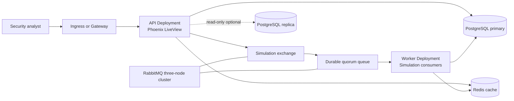
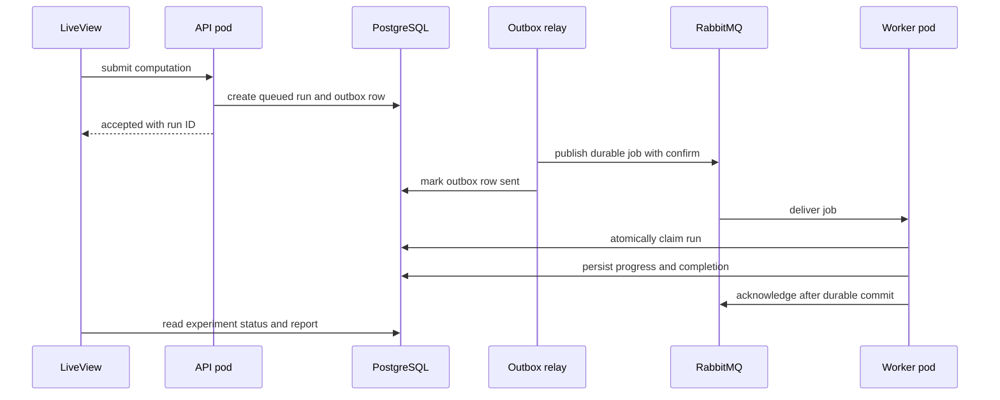

# Kubernetes and RabbitMQ Tutorial for Network Defense

## Purpose and scope

This is a migration and design tutorial for running Network Defense on Kubernetes, separating HTTP traffic from long-running simulation and optimization work. It covers RabbitMQ clustering, quorum queues, queue-driven autoscaling, two independent BEAM groups, PostgreSQL choices, and Redis caching.

It does not claim that this architecture already exists. The repository currently has one Phoenix/OTP application, PostgreSQL, and observability. It has no RabbitMQ client, Redis client, job worker, or BEAM clustering implementation. Treat the steps labelled **application change** as prerequisites for the corresponding infrastructure step.

The recommended first production architecture is simpler than two distributed Erlang clusters: independently scalable API and worker Deployments communicate only through RabbitMQ, while PostgreSQL is the source of truth. Add BEAM clustering only when cross-node process communication is a measured requirement.

## Reading basis

The tutorial was checked against the current primary documentation listed in [Sources](#sources). The local thesis bibliography has no Kubernetes, RabbitMQ, Redis, or distributed-systems book, so it cannot be used as evidence for operational claims. Its relevant design constraint is a reproducible Monte Carlo pipeline for a 200-host topology on one workstation; see `thesis/chapter_design.tex`.

For conceptual background, read *Kubernetes: Up & Running*, 3rd edition, by Hightower, Burns, and Beda. Use the linked versioned product documentation when implementing: Kubernetes and RabbitMQ operational behavior changes more quickly than a book.

## 1. Start from the actual system

### What exists today

| Area | Current behavior | Consequence on Kubernetes |
| --- | --- | --- |
| HTTP application | Phoenix LiveView, Bandit, and the simulation engine run in one OTP release. | A Deployment can run it, but an HTTP pod also owns long-running work. |
| Background work | `NetworkDefense.Simulations` and `NetworkDefense.Optimizations` start supervised in-process tasks; simulation batches parallelize locally. | Terminating or rescheduling a web pod interrupts the computation. A restart does not provide durable retry. |
| Progress events | Progress and completion use local `Phoenix.PubSub`. | A LiveView connected to another pod will not receive those events unless PubSub becomes distributed or the UI reads durable status. |
| Data | Ecto/PostgreSQL stores graphs, experiments, batches, and results. | PostgreSQL is already the correct source of truth for job state and results. |
| Discovery | `DNSCluster` is configured from `DNS_CLUSTER_QUERY`. | DNS discovery alone is not a BEAM cluster and does not distribute application state. |
| Health and metrics | `/healthz`, `/readyz`, and Prometheus metrics are present. | These are the correct basis for probes and HPA input. |

The evidence is in `src/lib/network_defense/application.ex`, `src/lib/network_defense/simulations.ex`, `src/lib/network_defense_web/telemetry.ex`, `src/config/runtime.exs`, and `infra/modules/local/app/main.tf`.

### The target boundary



There are three different meanings of "cluster" here:

| Term | Purpose | Do not use it for |
| --- | --- | --- |
| Kubernetes cluster | Schedules Pods and provides networking. | Application message delivery. |
| RabbitMQ cluster | Makes one broker deployment highly available inside a low-latency failure domain. | WAN replication between sites. |
| BEAM cluster | Lets Erlang nodes communicate directly. | A durable job queue or a substitute for database state. |

## 2. Choose the smallest useful architecture

### Recommended rollout

1. Run the current application as one Kubernetes Deployment with one replica. Keep simulations in-process. This validates image, Secrets, probes, telemetry, storage, and ingress without altering behavior.
2. Move simulation and optimization execution into separate worker processes and RabbitMQ queues. Persist job state before publishing. Make the UI read durable status from PostgreSQL.
3. Scale the API Deployment with CPU or request-rate metrics. Scale workers with queue backlog. Do not scale a CPU-bound worker from web CPU.
4. Add Redis only for measured repeated reads. It is not a job queue and is not the system of record.
5. Add a separate BEAM cluster only if nodes must share live process state. Keep API and workers separated by RabbitMQ even then.
6. Add Federation or Shovel only when a second RabbitMQ cluster exists in another site or administrative domain.

This order keeps the current thesis workload reproducible while adding failure recovery one boundary at a time.

### Do not create two BEAM clusters by default

RabbitMQ is the durable boundary between independently deployed roles. A stateless API pod and a stateless worker pod do not need direct Erlang distribution to publish or consume AMQP messages. They can be horizontally scaled as ordinary Deployments.

Create two BEAM groups only for a concrete need such as distributed Phoenix PubSub or a role-local process registry:

| Group | Membership | What may communicate directly | What must still use RabbitMQ |
| --- | --- | --- | --- |
| API BEAM group | API pods only | LiveView or PubSub coordination inside the API role. | Simulation submission and completion. |
| Worker BEAM group | Worker pods only | Worker-local coordination, if required. | All requests originating from the API role. |

Use different node-name prefixes and different Erlang cookies for the groups. Never form one cluster across API and worker roles merely because they share a Kubernetes namespace.

## 3. Prepare the Kubernetes platform

Before deploying an application, confirm that the cluster provides:

1. A default `StorageClass` that supports the persistent volumes selected for PostgreSQL and RabbitMQ.
2. Metrics Server, so resource-based HPA works.
3. A CNI that enforces `NetworkPolicy`. A manifest without an enforcing CNI has no network-isolation effect.
4. An ingress controller or Gateway implementation with WebSocket support.
5. A registry reachable by the worker nodes.
6. A backup target outside the cluster failure domain for PostgreSQL backups and restore tests.

Create an application namespace and verify the prerequisites:

```bash
kubectl create namespace network-defense
kubectl get storageclass
kubectl top nodes
kubectl -n kube-system get deployment metrics-server
```

The exact `metrics-server` object name varies by distribution. `kubectl top nodes` is the useful check.

### Keep configuration and secrets separate

The current production release accepts secrets through `*_FILE` variables. Preserve that property: mount Kubernetes Secret keys as files and pass their file paths as environment variables. Do not place connection strings, cookies, or passwords in a Deployment, ConfigMap, Helm values file, or Git history.

Create a Secret from restrictive files held outside the repository:

```bash
kubectl -n network-defense create secret generic network-defense-runtime \
  --from-file=database-url=/secure/path/database-url \
  --from-file=secret-key-base=/secure/path/secret-key-base \
  --from-file=live-view-signing-salt=/secure/path/live-view-signing-salt
```

For production, make a secret manager or an External Secrets-style controller the writer of this Secret. Kubernetes Secrets are base64-encoded objects, not encrypted by that encoding.

## 4. Deploy the baseline application

### Step 1: build an immutable release image

Build the existing `src/Dockerfile`, publish it under an immutable digest or versioned tag, and deploy that identifier. Terraform starts production migrations as a one-shot release command; see `infra/modules/local/app/main.tf`.

### Step 2: run migrations as one Job

Use one Job per release before changing the application Deployment. The Job must use the same image, database Secret, and network policy as the application. Do not run migrations in every API pod: concurrent startup migrations make rollout behavior depend on a race.

```yaml
apiVersion: batch/v1
kind: Job
metadata:
  name: network-defense-migrate
  namespace: network-defense
spec:
  backoffLimit: 1
  template:
    spec:
      securityContext:
        runAsNonRoot: true
        fsGroup: 65534
      restartPolicy: Never
      containers:
        - name: migrate
          image: registry.example/network-defense@sha256:replace-me
          command: ["/app/bin/migrate"]
          env:
            - name: DATABASE_URL_FILE
              value: /run/secrets/network-defense/database-url
            - name: SECRET_KEY_BASE_FILE
              value: /run/secrets/network-defense/secret-key-base
            - name: LIVE_VIEW_SIGNING_SALT_FILE
              value: /run/secrets/network-defense/live-view-signing-salt
          volumeMounts:
            - name: runtime-secrets
              mountPath: /run/secrets/network-defense
              readOnly: true
      volumes:
        - name: runtime-secrets
          secret:
            secretName: network-defense-runtime
            defaultMode: 0440
```

Wait for it, inspect its logs, and only then continue:

```bash
kubectl -n network-defense apply -f migrate-job.yaml
kubectl -n network-defense wait --for=condition=complete job/network-defense-migrate --timeout=5m
kubectl -n network-defense logs job/network-defense-migrate
```

### Step 3: create the API Deployment and Service

Start with two API replicas only after the progress-notification change in [Section 6](#6-make-simulation-and-optimization-work-durable). Until then, retain a single API replica: otherwise an accepted run can publish local progress to a different pod than the connected LiveView.

Use existing endpoints exactly as intended:

| Probe | Endpoint | Meaning |
| --- | --- | --- |
| Startup | `/healthz` | The process has started. Use this only if cold start needs protection from liveness restarts. |
| Liveness | `/healthz` | The release is alive. It must not fail because PostgreSQL is temporarily unavailable. |
| Readiness | `/readyz` | The release can serve traffic; the current endpoint checks database readiness. |

An abbreviated Deployment shape follows. The resource quantities are examples and must come from a measured baseline, not copied into production unchanged.

```yaml
apiVersion: apps/v1
kind: Deployment
metadata:
  name: network-defense-api
  namespace: network-defense
spec:
  selector:
    matchLabels:
      app.kubernetes.io/name: network-defense-api
  template:
    metadata:
      labels:
        app.kubernetes.io/name: network-defense-api
    spec:
      securityContext:
        runAsNonRoot: true
        fsGroup: 65534
      terminationGracePeriodSeconds: 45
      containers:
        - name: api
          image: registry.example/network-defense@sha256:replace-me
          env:
            - name: PHX_SERVER
              value: "true"
            - name: DATABASE_URL_FILE
              value: /run/secrets/network-defense/database-url
            - name: SECRET_KEY_BASE_FILE
              value: /run/secrets/network-defense/secret-key-base
            - name: LIVE_VIEW_SIGNING_SALT_FILE
              value: /run/secrets/network-defense/live-view-signing-salt
          ports:
            - name: http
              containerPort: 4000
            - name: metrics
              containerPort: 4001
          readinessProbe:
            httpGet:
              path: /readyz
              port: http
          livenessProbe:
            httpGet:
              path: /healthz
              port: http
          resources:
            requests:
              cpu: 250m
              memory: 512Mi
            limits:
              memory: 1Gi
          volumeMounts:
            - name: runtime-secrets
              mountPath: /run/secrets/network-defense
              readOnly: true
      volumes:
        - name: runtime-secrets
          secret:
            secretName: network-defense-runtime
            defaultMode: 0440
```

Requests reserve schedulable capacity; limits constrain execution. A CPU limit can throttle CPU-bound Monte Carlo work, so first measure the simulation workload before setting one. A memory limit remains useful because exceeding it terminates the process instead of destabilizing a node.

Expose only the HTTP port through a ClusterIP Service and configure the ingress or Gateway with a long enough idle timeout for LiveView WebSockets. Keep metrics internal for Prometheus.

### Step 4: prove the baseline

```bash
kubectl -n network-defense apply -f api.yaml
kubectl -n network-defense rollout status deployment/network-defense-api
kubectl -n network-defense get pods,svc
kubectl -n network-defense port-forward service/network-defense-api 4000:4000
```

Open the dashboard through the forwarded port, run a small simulation, and confirm `/readyz`, logs, traces, and metrics. This is the baseline before introducing a queue.

## 5. Autoscale the right workload

### API HPA

CPU utilization is a reasonable initial signal for request-serving API pods. It is not a complete latency SLO, but it is already available. HPA CPU utilization is calculated against the CPU request, so an API pod without a CPU request cannot be CPU-autoscaled correctly.

```yaml
apiVersion: autoscaling/v2
kind: HorizontalPodAutoscaler
metadata:
  name: network-defense-api
  namespace: network-defense
spec:
  scaleTargetRef:
    apiVersion: apps/v1
    kind: Deployment
    name: network-defense-api
  minReplicas: 2
  maxReplicas: 10
  metrics:
    - type: Resource
      resource:
        name: cpu
        target:
          type: Utilization
          averageUtilization: 70
  behavior:
    scaleDown:
      stabilizationWindowSeconds: 300
```

Apply this HPA only after [Section 6](#6-make-simulation-and-optimization-work-durable) is complete; its two-pod minimum assumes cross-pod status delivery is safe. Before then, retain one API pod and omit the HPA. When HPA owns replica count, omit `spec.replicas` from the applied Deployment manifest. Otherwise repeated `kubectl apply` can fight the autoscaler. HPA has a tolerance band and conservatively treats missing metrics, so inspect `kubectl describe hpa` rather than assuming it is broken.

### Worker autoscaling

Do not use API CPU to scale workers. A worker may be idle while a queue grows, or use high CPU because one expensive job is already in progress. Queue backlog is the direct demand signal.

Use one of these paths:

| Path | Use when | Trade-off |
| --- | --- | --- |
| HPA external metric | Prometheus Adapter already exposes queue depth. | Fewer components, but adapter metric mapping is operational work. |
| KEDA RabbitMQ scaler | Queue-driven workers need independent scaling. | Adds an operator, but provides the queue-to-scale bridge. |

Set a conservative prefetch, initially one message per worker process for CPU-heavy simulations. Then define capacity from measurement:

`desired workers = ceil(ready messages / acceptable waiting messages per worker)`

Cap the worker maximum by database connections, CPU capacity, and RabbitMQ quorum-queue throughput. More workers than useful CPU only create context switching and database contention.

### Scale-down safety

An autoscaler removes pods. A worker must respond to termination in this order:

1. Stop accepting new deliveries.
2. Finish and commit the current batch before the grace period ends.
3. Acknowledge the message only after its durable state is committed.
4. If the grace period expires or the pod crashes, close the channel without acknowledgement so RabbitMQ redelivers it.

This is an **application change**. Kubernetes cannot make an in-memory `Task.Supervisor` task durable.

## 6. Make simulation and optimization work durable

### The job contract

The current code already persists simulation experiments and batch progress. Preserve that model, and create equivalent durable optimization-run state before queuing optimizations. A RabbitMQ message should identify durable state, not carry the graph or a serialized computation result.

Example message body:

```json
{
  "run_id": "immutable-computation-id",
  "graph_revision_id": "immutable-revision-id",
  "kind": "simulation",
  "correlation_id": "request-correlation-id",
  "schema_version": 1
}
```

The graph revision identifier matters because the project models versioned topology. A worker must load exactly that revision, which preserves the thesis requirement that a seed and topology reproduce a result.

### The required application changes

1. In one PostgreSQL transaction, create the durable computation record in `queued` state and create an outbox row containing the job payload. For a simulation this is an experiment; for an optimization it is an optimization run.
2. Have a small publisher relay read unsent outbox rows, publish with RabbitMQ publisher confirms, then mark the outbox row sent. This prevents the database-commit/publish gap from losing a job.
3. Replace `Task.Supervisor.start_child` for simulation and optimization execution with worker consumers that claim one queued durable run atomically. Use separate queues if their resource limits or priorities differ.
4. Give each computation record a state machine such as `queued`, `running`, `completed`, and `failed`. Claiming must be idempotent: a redelivery of an already completed record is an acknowledgement, not a second computation.
5. Retain the existing simulation batch persistence. A retry can resume from `completed_trials` if the worker and business rules allow it; define corresponding retry semantics before queuing optimizations.
6. Acknowledge the RabbitMQ delivery only after the state update or batch commit succeeds. Nack or let the connection close on transient failure.
7. Put poison messages into a dead-letter queue after a finite delivery limit. Store a failure reason in PostgreSQL for the analyst.
8. Make the LiveView poll durable computation status, or broadcast through a deliberately distributed PubSub adapter. Polling the existing database record is the smaller first change and works with multiple API pods.

At-least-once delivery means duplicates are normal. Exactly-once end-to-end delivery is not provided by AMQP, PostgreSQL, or Kubernetes. Idempotent claims and unique database constraints give the desired observable result: one experiment result even when a message is delivered more than once.

### Trace the handoff



Carry the existing `correlation_id` in AMQP headers and create a consumer span. This lets the current OpenTelemetry setup join browser, publisher, worker, and database traces.

## 7. Run RabbitMQ correctly

### One local RabbitMQ cluster

Use the official RabbitMQ Cluster Operator for the broker lifecycle and the Messaging Topology Operator for users, vhosts, exchanges, queues, bindings, and policies. Do not hand-build a RabbitMQ StatefulSet unless learning its recovery model is itself the goal.

For one failure domain:

1. Install the operators in an operator namespace using the versioned operator documentation.
2. Create a `RabbitmqCluster` with an odd node count, persistent storage, and spread across available nodes or zones.
3. Create a dedicated vhost and least-privilege users for the API publisher, worker consumer, and operator.
4. Declare a durable direct or topic exchange, a durable quorum queue, a binding, and a dead-letter exchange/queue through topology custom resources.
5. Give the application only the broker endpoint and credentials through a mounted Secret.
6. Enable Prometheus metrics and alert on node availability, queue depth, unacknowledged deliveries, disk alarms, and consumer count.

Use three nodes as the normal HA starting point. A two-node RabbitMQ cluster cannot retain a majority after one node fails. Quorum queues use Raft and require a majority of their members online.

### Quorum queue rules

For simulation jobs, use a durable quorum queue, publisher confirms, manual consumer acknowledgements, and a dead-letter strategy. This prioritizes correctness over the lowest possible latency.

Do not use a quorum queue for exclusive temporary queues or workloads needing sub-millisecond latency. Do not let a CPU-heavy handler accumulate a large unacknowledged prefetch window. A small prefetch makes crashes and rolling updates recover quickly.

### RabbitMQ is not an Erlang application cluster

RabbitMQ nodes require their own Erlang cookie, hostname resolution, and cluster ports. Those credentials and ports are for RabbitMQ internals, not for the Network Defense release. The application should connect as an AMQP client; it should not attempt to join the broker's Erlang cluster.

## 8. Add BEAM clustering only when needed

### When it is justified

Use a BEAM cluster if the API requires direct cross-node PubSub, process discovery, or coordinated singleton work that cannot be represented as a durable database and queue workflow. Use RabbitMQ and PostgreSQL for durable simulation processing regardless.

### DNS-based cluster recipe

1. Give the API group a dedicated headless Service. Give the worker group another headless Service. Do not share them.
2. Use stable DNS names, long node names, a release basename compatible with the deployed release, and one unique hostname or IP per pod.
3. Mount one Erlang cookie Secret per group with restrictive file permissions.
4. Configure a Kubernetes DNS discovery strategy. `libcluster` DNS or DNS-SRV avoids Kubernetes API RBAC; the repository's current `DNSCluster` configuration must be verified against its own supported discovery and distribution behavior before relying on it.
5. Allow only the required Erlang distribution and EPMD traffic between pods in the same group. Erlang distribution is plaintext by default; use TLS distribution or a trusted isolated network.
6. Test a full cluster restart. RabbitMQ warns against ordered readiness for its own nodes because it can deadlock; apply the same principle generally: readiness must not wait forever for a peer that is also waiting.

### HPA and BEAM membership

Autoscaling changes membership. A role that holds only ephemeral process state can accept that. A role that shards ownership across members needs explicit rebalance, handoff, or a durable coordinator before HPA is safe.

For this project, retain durable state in PostgreSQL and hand off work through RabbitMQ. That makes worker membership disposable and lets a worker Deployment scale without relying on BEAM distribution.

## 9. Federation and Shovel: use only between broker clusters

Clustering, Federation, and Shovel solve different problems:

| Mechanism | Scope | Use it when | Do not use it when |
| --- | --- | --- | --- |
| RabbitMQ clustering | One low-latency site | Broker nodes need shared metadata and replicated local queues. | Connecting distant regions. |
| Federation | Separate clusters, asynchronous and WAN-tolerant | A remote cluster needs a selected exchange flow or a logical queue. | You need unconditional one-way movement. |
| Shovel | Separate clusters, one direction | A queue must be pumped from source to destination, including a controlled drain. | You need local-consumer-aware queue federation. |

Do not enable either plugin for the single-cluster deployment. They add no availability benefit there.

### Federation procedure

Use exchange federation to replicate selected integration events to another site. A federated exchange replays upstream messages into a local exchange flow. A federated queue only pulls from upstream when that upstream queue has no local consumers; it is not a global load balancer.

1. Create independent RabbitMQ clusters, each with its own local users, vhosts, policies, and persistent storage.
2. Establish TLS trust and create least-privilege upstream credentials. Use multiple upstream endpoints for cluster failover.
3. Enable the Federation plugin on every node in the downstream cluster.
4. Declare an upstream and an explicit policy matching only the intended exchange or queue.
5. Monitor federation-link status and reconnect failures.
6. Make consumers idempotent. Asynchronous links can duplicate or delay observable delivery during reconnection.

For Network Defense, federate immutable completion or audit events if another site needs them. Do not federate the primary simulation job queue as a substitute for choosing where jobs execute.

### Shovel procedure

Use a dynamic Shovel when jobs must move unconditionally from one queue to a destination exchange or queue, for example during a planned site drain.

1. Define source and destination endpoints, TLS credentials, and permissions as Secrets outside the repository.
2. Enable the Shovel plugin across the hosting cluster.
3. Create a dynamic shovel with multiple reachable source and destination endpoints.
4. Configure source acknowledgement after destination confirmation so a link failure does not discard a job.
5. Monitor shovel status and destination queue depth until the drain completes.
6. Remove the shovel after the migration. Permanent unexplained shovels obscure message ownership.

## 10. PostgreSQL: choose one primary first

### Option A: one global primary

This is the recommended option for the current project. The thesis target is small, the application writes experiment batches, and the current release has a single Ecto repository. One primary gives a simple consistency model: a completed experiment is visible immediately to the UI that reads it.

Use managed PostgreSQL or a PostgreSQL operator only after selecting backup, restore, failover, and upgrade ownership. A Kubernetes StatefulSet alone is not a production PostgreSQL HA design.

Operational checklist:

1. Put PostgreSQL on persistent storage or consume it as a managed service.
2. Take tested backups and run a restore drill into a new instance.
3. Restrict inbound network access to migration, API, and worker pods.
4. Bound connections. The current release defaults its Ecto pool to ten connections per pod. Calculate: maximum API pods times API pool, plus maximum worker pods times worker pool, plus migration and administration connections. Keep the total below PostgreSQL capacity.
5. Introduce PgBouncer only if measured connection pressure requires it. Transaction pooling changes session semantics and must be tested with Ecto.

### Option B: primary plus read replica

Choose this only when read traffic demonstrably limits the primary or a separate read-only reporting workload can tolerate lag. A read replica improves read capacity and can support failover; it does not scale writes.

Requirements before routing application reads to a replica:

1. Configure streaming replication, WAL retention or replication slots, backups, and a tested promotion process.
2. Make the application explicitly distinguish write and read connections. The current repository has only one configured `NetworkDefense.Repo`.
3. Keep experiment creation, claim, batch append, completion, migration, and read-after-write requests on the primary.
4. Route only stale-tolerant completed reports or historical analytics to the replica.
5. Monitor replication lag and fall back to primary when the report must include the latest completed data.

PostgreSQL streaming replication is asynchronous by default. Synchronous replication narrows data-loss exposure but adds commit latency and can block writes when the required standby is unavailable.

## 11. Redis: use it as a disposable cache

Redis is not needed to make queued work reliable. Add it only after profiling shows repeated expensive reads that PostgreSQL and the current in-process computation cannot serve cheaply.

### Good first cache entries

| Candidate | Key shape | Invalidation |
| --- | --- | --- |
| Completed simulation report | `report:<experiment-id>:v1` | Delete or replace on experiment completion. Never cache a running report indefinitely. |
| Immutable graph-derived metric | `graph-metric:<revision-id>:<metric-version>` | Revision ID changes naturally invalidate it. |
| NVD/CVE response | `nvd:<cve-id>:<source-version>` | Short TTL plus explicit replacement after refresh. |

Do not cache experiment ownership, queued/running state, message acknowledgements, or results that must be durable. PostgreSQL remains authoritative.

### Cache-aside procedure

1. Read Redis by a versioned key.
2. On hit, return the decoded value.
3. On miss, compute or read from PostgreSQL.
4. Store the result with a bounded TTL.
5. On a relevant write, delete or overwrite the key after the database commit.

Start with one Redis instance for a non-critical cache. Redis replication or Redis Cluster adds operational complexity but cannot turn a cache into a source of truth. Set `maxmemory`, choose an eviction policy such as `allkeys-lru` or `allkeys-lfu` from observed access patterns, and leave headroom for replication or persistence buffers if enabled.

Monitor hit rate, misses, evictions, latency, and memory. A low hit rate with few evictions indicates poor key selection or TTLs; a high eviction count indicates insufficient cache capacity or a mismatched policy.

## 12. Security and observability

### Network policy baseline

Start with default-deny ingress and egress per namespace, then add only these flows:

| Source | Destination | Reason |
| --- | --- | --- |
| Ingress controller | API HTTP Service | Browser traffic. |
| API and workers | PostgreSQL primary | State and results. |
| API publisher and workers | RabbitMQ AMQP Service | Job publish and consume. |
| API and workers | Redis Service | Cache access, after Redis is adopted. |
| Prometheus | metrics Service | Scraping. |
| Workloads | CoreDNS | Service discovery. |
| Workloads | OTel collector | Existing telemetry export. |

Kubernetes NetworkPolicy is additive L3/L4 filtering. It does not apply TLS policy and an egress default deny also blocks DNS until CoreDNS is explicitly allowed.

### Measure the new boundaries

Keep existing application metrics, especially simulation duration, Ecto timings, VM CPU, memory, and run queue. Add:

1. Queue ready count, unacknowledged count, delivery rate, consumer count, redelivery count, and dead-letter count.
2. Job age from creation to completion, not just worker execution time.
3. Outbox backlog and oldest unsent age.
4. HPA desired versus current replicas, plus throttling and pod restarts.
5. PostgreSQL connection use, query latency, lock waits, replication lag, and cache hit ratio.

Alert on sustained queue age and dead letters. A queue with a small depth can still violate an analyst-facing latency target if each job is expensive.

## 13. Verification and failure drills

Run these in a non-production namespace before claiming the architecture works:

1. Submit a simulation and an optimization, kill each worker before acknowledgement, and verify one redelivery and one final durable result.
2. Submit the same message twice and verify the durable claim prevents duplicated completed work for both computation kinds.
3. Restart all API pods during a running job and verify the UI obtains status from PostgreSQL after reconnecting.
4. Drain one worker node and verify the worker finishes or redelivers safely within the termination grace period.
5. Remove one RabbitMQ node from a three-node cluster and verify the quorum queue remains available. Restore it and check queue membership and alarms.
6. Force RabbitMQ unavailable while an outbox row is pending, restore it, and verify eventual confirmed publication.
7. Load the API to trigger HPA and verify total database connections remain within budget.
8. Restore a PostgreSQL backup into an isolated instance and validate a known experiment report.
9. If a read replica exists, create a completed experiment and verify that a primary-only read is used until replica lag is acceptable.
10. If Federation or Shovel exists, interrupt the WAN link, restore it, and verify link recovery and idempotent downstream handling.

## Sources

### Project sources

- `README.md`
- `docs/architecture.md`
- `docs/infrastructure.md`
- `src/lib/network_defense/application.ex`
- `src/lib/network_defense/simulations.ex`
- `src/lib/network_defense_web/telemetry.ex`
- `src/config/runtime.exs`
- `infra/modules/local/app/main.tf`
- `thesis/chapter_design.tex`

### Primary documentation, checked August 2026

- [Kubernetes Deployments](https://kubernetes.io/docs/concepts/workloads/controllers/deployment/)
- [Kubernetes Horizontal Pod Autoscaling](https://kubernetes.io/docs/concepts/workloads/autoscaling/horizontal-pod-autoscale/)
- [Kubernetes resource management](https://kubernetes.io/docs/concepts/configuration/manage-resources-containers/)
- [Kubernetes StatefulSets](https://kubernetes.io/docs/concepts/workloads/controllers/statefulset/)
- [Kubernetes PodDisruptionBudgets](https://kubernetes.io/docs/tasks/run-application/configure-pdb/)
- [Kubernetes NetworkPolicies](https://kubernetes.io/docs/concepts/services-networking/network-policies/)
- [RabbitMQ Cluster Operator](https://www.rabbitmq.com/kubernetes/operator/operator-overview)
- [RabbitMQ clustering](https://www.rabbitmq.com/docs/clustering)
- [RabbitMQ quorum queues](https://www.rabbitmq.com/docs/quorum-queues)
- [RabbitMQ consumer acknowledgements and publisher confirms](https://www.rabbitmq.com/docs/confirms)
- [RabbitMQ Federation](https://www.rabbitmq.com/docs/federation)
- [RabbitMQ Shovel](https://www.rabbitmq.com/docs/shovel)
- [PostgreSQL high availability](https://www.postgresql.org/docs/current/high-availability.html)
- [PostgreSQL streaming replication](https://www.postgresql.org/docs/current/warm-standby.html)
- [PgBouncer configuration](https://www.pgbouncer.org/config.html)
- [Redis eviction](https://redis.io/docs/latest/develop/reference/eviction/)
- [Redis expiration](https://redis.io/docs/latest/commands/expire/)
- [libcluster Kubernetes DNS strategy](https://hexdocs.pm/libcluster/Cluster.Strategy.Kubernetes.DNS.html)
- [Erlang distributed systems](https://www.erlang.org/doc/system/distributed.html)
