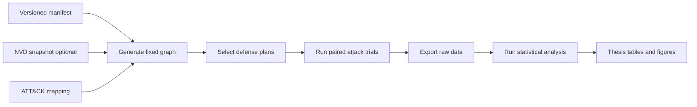
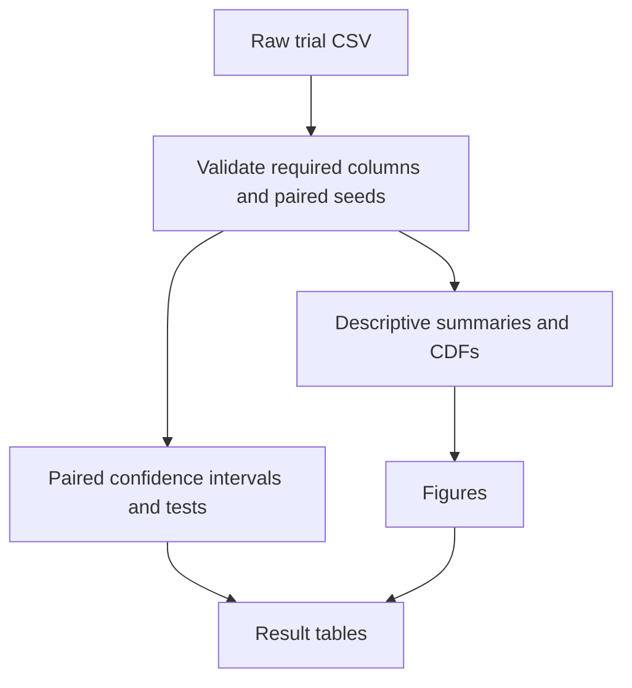
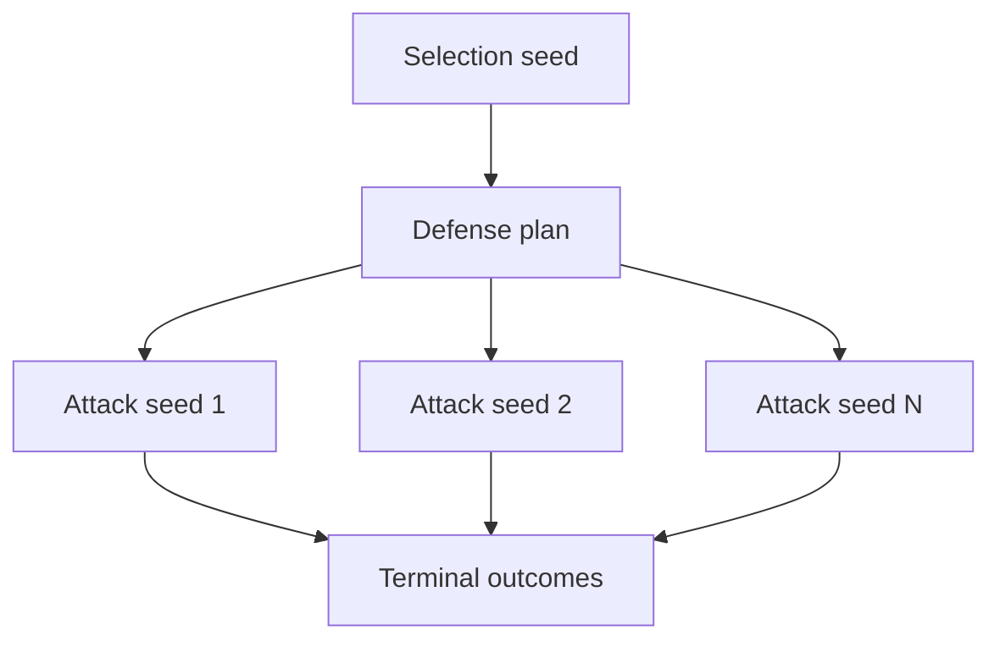
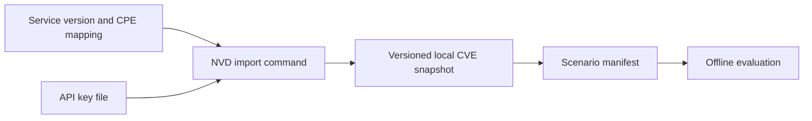
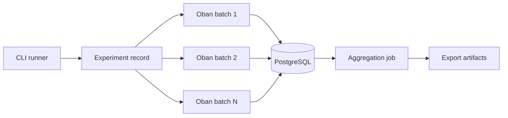

# Evaluation Roadmap

## Purpose

This plan produces the evidence for the thesis. It does not add a new security
product.

The first study uses one fixed synthetic enterprise scenario. It compares six
defense strategies at action budgets one, two, and three. The study measures
modeled outcomes. It does not claim real-world defensive effectiveness.

## What Exists Now

The application already provides most execution building blocks:

| Capability | Current implementation |
| --- | --- |
| Fixed topology input | `EnterpriseTopology.generate/1` generates seeded topology structure. Graph, node, and edge IDs are currently generated UUIDs. |
| Mission model | Mission capabilities, required flows, support thresholds, and pre-attack feasibility checks exist. |
| Defense plans | CVSS, topology, simulation-informed, and annealing strategies exist. Null and random strategies exist but are not public runner options. |
| Before/after run | The combined workflow runs baseline simulation, optimization, and post-defense simulation. |
| Per-trial data | Experiments persist a seed, terminal attacker state, and iteration records for each trial. |
| Dashboard comparison | The comparison report displays before/after metrics and selected actions. |

The missing layer is a reproducible experiment. The current
`mix evaluate.optimization` command creates one defense plan. It does not
evaluate all strategies, export terminal outcomes, or create statistical
results.

## Implementer Context

Read this section before changing the evaluation path. It lists the existing
boundaries that the new runner must use.

### Start Here

| Concern | Main code | Supporting test or document |
| --- | --- | --- |
| CLI pattern | `src/lib/mix/tasks/evaluate.optimization.ex` | `src/test/network_defense/optimization/evaluate_optimization_test.exs` |
| Simulation lifecycle and batch persistence | `src/lib/network_defense/simulations.ex` | `src/test/network_defense/simulations_test.exs` |
| Per-trial report calculations | `src/lib/network_defense/simulation/simulation_report.ex` | Simulation-report tests under `src/test/network_defense/simulation/` |
| Optimization lifecycle | `src/lib/network_defense/optimizations.ex` | Tests under `src/test/network_defense/optimization/` |
| Strategy implementation | `src/lib/network_defense/optimization/` | Strategy-specific tests in the same test directory |
| Topology input | `src/lib/network_defense/topology/enterprise_topology.ex` | `src/test/network_defense/topology/enterprise_topology_test.exs` |
| Mission feasibility | `src/lib/network_defense/simulation/mission_impact.ex` | `mission_impact_test.exs` and `mission_capabilities_test.exs` |
| Workflow and retries | `src/lib/network_defense/workflows/` | `src/test/network_defense/workflows_test.exs` |
| Dashboard comparison | `src/assets/svelte/dashboard/comparison-report/` | `docs/concepts/vocabulary.md` |

### Domain Invariants

These rules are part of the model. Do not bypass them in an evaluation helper.

| Rule | Implementation consequence |
| --- | --- |
| A graph revision is immutable. | Start from one source revision. Persist every defended graph as a new revision. |
| Segment policy is canonical reachability. | Do not save `NetworkReachability` marker edges in the scenario or export input graph. |
| Marker edges are a deterministic in-memory projection. | Call `MaterializeReachability` only where execution or metric calculation needs effective flows. |
| A trial is one attacker trajectory. | Keep trial index and derived seed in every raw outcome record. |
| A budget counts unit-cost defense actions. | Do not describe it as money, staff effort, or deployment cost. |
| Feasibility and mission impact use one model. | Use `MissionImpact` for both candidate rejection and reported pre-attack status. |
| CVSS and exploit probability are different inputs. | Keep the scenario probability explicit even when an NVD snapshot supplies CVSS data. |

Seed derivation already lives in `NetworkDefense.Simulation.Seed`. Extend that
module or use named child-seed indexes. Do not use process-global random state.
The manifest must record the derivation scheme so a later implementation cannot
silently change matched trial pairs.

TODO: Define canonical graph identity and reuse. Fresh topology manifest
executions currently persist fresh graph revisions. They can therefore have
different graph, node, and edge IDs and different archive hashes, even with the
same topology seed. Do not imply that graph identity reuse is implemented.

### Required Tests

Add small deterministic tests with the runner. Each test must fail if its
corresponding scientific control breaks.

| Test | Required assertion |
| --- | --- |
| Manifest validation | Invalid strategy, budget, model mode, or entry host fails before work starts. |
| Input reproducibility | The same manifest produces the same seed schedule. Graph identity reuse remains a deferred TODO. |
| Paired evaluation | Every plan at one budget uses the identical ordered attack-seed list. |
| Separation of random streams | Changing a selection seed does not change the attack-evaluation seeds. |
| Export completeness | Every persisted terminal trial has exactly one raw record. |
| Resume safety | Re-running a completed manifest does not duplicate plan or trial rows. |
| Feasibility | The known required-flow cut is rejected when feasibility is enabled. |
| Statistical input check | The analysis rejects missing pairs and duplicate records. |

## Literature And Claim Boundary

The literature does not support a novelty claim for multi-objective hardening
or mission-impact assessment. The current thesis claim is narrower: a
controlled simulation study tests when operational feasibility and
mission-first ranking select different defenses from simpler baselines.

| Topic | Use it for | Do not claim |
| --- | --- | --- |
| Attack-graph literature | Explain why a context graph and dynamic simulation are a tractable model. | Complete attack-graph enumeration or realistic adversary emulation. |
| CVSS and NVD | Define a severity-priority baseline and source vulnerability characteristics. | CVSS is a calibrated exploit probability. |
| Multi-objective hardening | Position the feasibility and mission objective in existing research. | The objective itself is new. |
| Mission-impact research | Justify capability dependencies and impact weights. | The thesis invents mission-impact assessment. |
| ATT&CK | Document modeled behavior and select structural scenario checks. | ATT&CK coverage or validation of real attack behavior. |

Use `thesis/chapter_literature_review.tex` and
`docs/plans/mission-feasibility-optimization.md` as the source for these
boundaries. Use `docs/concepts/model.md` for the current model semantics and
`docs/concepts/vocabulary.md` for names in code, exports, and UI labels.

## Target Study



Each defense plan receives the same attack-evaluation seed schedule. This
controls random attack variation when plans are compared.

The system must use separate random streams for topology generation, plan
selection, optimizer-internal simulation, and post-selection attack trials.

| Study dimension | Core value |
| --- | --- |
| Scenario | One named, versioned enterprise scenario |
| Budgets | 1, 2, and 3 actions |
| Strategies | Null, random, CVSS, topology segmentation, simulation-informed, simulated annealing |
| Random and annealing plans | 30 independent policy-selection seeds |
| Attack trials | Pilot first. Freeze the count before the full study. |
| Primary outcome | Blast radius |
| Secondary outcomes | Mission impact, capability disruption, tail outcomes, and runtime |

## Phase 1: Manifest-Driven CLI Runner

The CLI is the source of evidence. The dashboard can start or open a completed
experiment later. It must not be the only way to run one.

The manifest declares every input that can change a result. The runner writes a
resolved copy beside its output. It never depends on mutable dashboard state.

Example manifest shape:

```json
{
  "id": "fixed-enterprise-v1",
  "model": {
    "objective": "mission_then_blast_radius",
    "require_pre_attack_feasibility": true
  },
  "topology": { "generator": "enterprise", "hosts": 50, "seed": 42 },
  "attacker": { "entry_host": "internet", "max_attempts": 1 },
  "strategy_runs": [{ "strategy": "cvss", "budget": 1, "selection_seeds": [101] }],
  "analysis": { "primary_comparisons": [{ "strategy": "cvss", "baseline": "null", "budget": 1, "outcome": "blast_radius" }], "confidence_level": 0.95, "bootstrap_resamples": 10000, "permutation_resamples": 10000, "multiplicity_correction": "holm", "seed": 7001, "pilot": { "ci_half_width": 0.25 } },
  "evaluation": { "trials": 1000, "seed": 9001 }
}
```

The values above are examples. The reviewed manifest sets the real study
values. The manifest must identify the input schema version and model version.

Example command:

```sh
mix evaluate.manifest docs/evaluation/manifests/fixed-enterprise-v1.json
```

The runner follows this sequence:

```text
load and validate manifest
generate the graph from its topology input
for each budget and strategy:
  select one or more feasible defense plans
  evaluate each plan with the shared attack seeds
write raw records, summaries, and input hashes
```

The runner must select plans before it starts post-defense evaluation. It must
not use post-defense trial results to select a plan.

### Output Contract

Publish result files, not only database IDs. Keep raw output separate from the
database so another machine can analyze it without the source database.

| Path | Purpose |
| --- | --- |
| `evaluation/manifests/<id>.json` | Reviewed experiment input. |
| `evaluation/results/<id>/<run>/manifest.resolved.json` | Exact input used by one run. |
| `evaluation/results/<id>/<run>/graph.json` | Generated source graph contract. |
| `evaluation/results/<id>/<run>/plans.jsonl` | Each selected defense plan and its selection seed. |
| `evaluation/results/<id>/<run>/trials.csv` | One terminal outcome per plan and attack seed. |
| `evaluation/results/<id>/<run>/summary.csv` | Descriptive statistics and timing data. |
| `evaluation/results/<id>/<run>/checksums.txt` | File hashes, source revision, and dependency-lock hashes. |

A trial row needs at least the scenario ID, budget, strategy, selection seed,
attack seed, plan ID, blast radius, mission impact, capability outcomes, and
runtime. Store the action list in `plans.jsonl`; do not repeat it in every CSV
row.

## Phase 2: Statistical Analysis

The analysis reads the Phase 1 ZIP files only: `manifest.resolved.json`,
`graph.json`, `plans.jsonl`, `trials.csv`, `capability_outcomes.csv`,
`summary.csv`, and `checksums.txt`. The core does not query the application
database or make network requests. CLI and HTTP adapters transport the ZIP.

The Python CLI accepts a directory, a ZIP path, or binary ZIP stdin. It writes a
directory or binary ZIP stdout. The dedicated Docker image starts the HTTP
service by default. `POST /v1/analyze` and `POST /v1/pilot` accept and return
raw ZIP data. `GET /healthz` checks service health. The image command can be
overridden to run the CLI.

Phoenix communicates with the service through Req. Use
`mix evaluate.analyze --run-id ID --mode pilot|analyze --output PATH`. Docker
DNS provides the internal service URL. Host commands use a configurable
loopback port.

The service has no authentication. TODO: add authentication before exposure to
non-local or untrusted networks. Until then, use it only on trusted local or
private networks. There is no protobuf or gRPC interface.

Phase 2 does not provide automatic analysis, Dashboard integration, an Oban
analysis job, or artifact persistence.

Use one pinned Python environment with SciPy and Matplotlib. This avoids
reimplementing statistical tests and plotting code in the application.



### Analysis Rules

1. Freeze hypotheses, outcomes, comparisons, and the trial-count rule before
   the full run.
2. Run a pilot to select the attack-trial count. Use a declared confidence
   interval width for the paired blast-radius difference as the stopping rule.
3. Compare plans with paired attack trials. A matching seed is a pair.
4. Treat blast radius as the primary outcome.
5. Treat mission impact, capability disruption, tail metrics, and runtime as
   secondary outcomes.
6. Correct the declared primary comparisons with Holm correction.
7. Report uncertainty in the simulator. Do not interpret it as uncertainty in
   real enterprise networks.

For each strategy against a declared baseline, report:

| Output | Reason |
| --- | --- |
| Paired mean difference and bootstrap 95% CI | Shows the size and uncertainty of the blast-radius change. |
| Paired effect size | Shows practical size without relying only on a p-value. |
| Paired permutation or Wilcoxon signed-rank test | Tests the declared paired comparison. |
| Blast-radius CDF | Shows tail risk and not only the average. |
| Capability disruption difference and CI | Shows mission effects. |
| Policy-selection variation | Shows variation across the 30 random or annealing plans. |

Do not use Mann--Whitney U as the primary test. It assumes independent groups.
The shared evaluation seed schedule creates matched observations.

The random and annealing strategies have two sources of variation:



The analysis must report plan-selection variation separately from attack-trial
variation. Many trials for one random plan do not measure the random strategy
as a whole.

## Phase 3: Model Comparison

The current optimizer uses the full model: pre-attack feasibility is required,
then it minimizes mission impact, blast radius, and cost in that order.

Make the objective and feasibility rule manifest inputs. Evaluate these modes:

| Mode | Expected purpose |
| --- | --- |
| Blast radius only | Shows what happens when all compromised hosts have equal value. |
| Mission impact only | Shows that mission impact alone can still allow disconnected services. |
| Mission then blast radius | The full ranking policy. |
| Feasibility off | Demonstrates the temptation to break a required flow. |
| Feasibility on | Rejects plans that break normal operation before the attack. |

Example: a policy removal can prevent access to a database and reduce attacker
reach. If the policy is required for order processing, the feasibility-on mode
rejects that plan. The model then needs another plan, such as patching an entry
service.

Keep this as a focused ablation of simulation-informed and annealing strategies.
CVSS and topology baselines do not optimize all objectives.

## Phase 4: A Discriminating Scenario

Do not first build a general-purpose "realistic enterprise" generator. Build
one scenario that can test the thesis claim.

The scenario must contain:

- an external entry path to a critical service;
- credential and authentication relationships for the implemented credential rules;
- a high-severity target with low mission consequence;
- a lower-severity target on a mission-critical route;
- a segmentation action that reduces reach but breaks a required service flow;
- one capability with redundant support.

Use deterministic tests for documented attack paths. A test checks that a path
is possible in the graph. It does not claim that a real attacker will use it.

```text
given the fixed scenario and external entry host
when the remote-exploitation rule runs
then a public-service candidate exists

given the mission-critical policy is removed
when pre-attack feasibility is checked
then the plan is rejected
```

Move scenario roles, services, policies, vulnerabilities, capabilities, and
required flows into versioned input data. The generator can still create host
counts and layout from a seed.

## NVD And MITRE ATT&CK

NVD and ATT&CK make the scenario more traceable. They do not calibrate the
simulator. Keep both integrations outside the critical path for the first
reproducible study.

### NVD Snapshot Import

Use NVD to source identifiers and CVSS characteristics for declared service
versions. The evaluation must read a reviewed local snapshot, never query NVD
during a run.



Rules for this integration:

- Use `Req` for the importer and a file secret such as `NVD_API_KEY_FILE`.
- Cache the raw NVD response and record its hash and fetch date.
- Review the CPE-to-service mapping. Do not infer a product identity from a
  display name alone.
- Keep `exploit_probability` as an explicit scenario parameter.
- Do not derive exploit probability from CVSS or call it a real exploit rate.
- Pin the selected CVEs in the scenario input after review.

Example scenario entry:

```json
{
  "service": "public-web",
  "version": "declared-version",
  "cves": [
    { "id": "CVE-example", "cvss_source": "nvd-snapshot-v1", "exploit_probability": 0.4 }
  ]
}
```

### ATT&CK Mapping

Add a small static mapping from implemented rules to ATT&CK techniques. It
documents model coverage. It does not add an ATT&CK API dependency or claim
adversary emulation.

| Implemented behavior | Mapping record must contain |
| --- | --- |
| Remote service exploitation | ATT&CK technique ID, version, source URL, and model limitation. |
| Local vulnerability exploitation | ATT&CK technique ID, version, source URL, and model limitation. |
| Credential acquisition or reuse | ATT&CK technique ID, version, source URL, and model limitation. |

Use the mapping to choose three or four structural scenario checks. Do not use
the mapping as a probability model or effectiveness score.

## Phase 5: Durable Work Distribution

Measure the local runner first. Add distributed workers only when a measured
study cannot finish in the available time.

The application currently uses Oban for workflow steps, but the heavy simulator
uses tasks on the node that owns the workflow step. Distributed evaluation needs
durable, idempotent trial batches.



Each batch owns a fixed inclusive trial range. A unique database constraint
must prevent two workers from writing the same range. The aggregation job runs
only after all ranges complete.

```text
create experiment with fixed plan and seed schedule
split trial indexes into fixed ranges
enqueue one idempotent job for each range
wait until every range is complete
aggregate terminal records and write artifacts
```

Do not distribute annealing candidate scoring first. It adds coordination cost
and is not needed until measurements show that plan selection is the bottleneck.

## Phase 6: Cloud Deployment

Cloud deployment is not a thesis-evidence prerequisite. It becomes useful when
the durable batches need more CPU than the local runner provides.

Use one cloud environment. Reuse the existing contracts:

- PostgreSQL stores Oban jobs, experiment state, and trial records.
- Application workers receive non-secret configuration through environment
  variables.
- Secrets are mounted as files.
- The runner writes output to durable object storage or a mounted result volume.
- Infrastructure code provisions workers, database access, secret mounts, and
  result storage together.

Do not add a second cloud provider, multi-region deployment, or a general job
platform for this thesis.

## Thesis Deliverables

The final evaluation chapter needs these items:

| Deliverable | Content |
| --- | --- |
| Scenario table | Topology, entry point, rules, budgets, and seed policy. |
| Plan table | Selected actions by strategy and budget. |
| Primary-results table | Blast radius, paired CI, effect size, and corrected test. |
| Mission table | Capability disruption and mission-impact results. |
| Figures | Blast-radius CDFs, plan-selection variation, and model-ablation results. |
| Runtime table | Plan selection, simulation, export, hardware, and worker count. |
| Validity section | Synthetic topology, stylized probabilities, fixed attacker, unit costs, and limited external validity. |
| Reproduction package | Manifest, graph input, raw data, analysis environment, scripts, tables, and hashes. |

## Completion Rule

The evaluation is complete when a clean machine can run the manifest, verify
the exported hashes, run the analysis, and regenerate every table and figure in
the evaluation chapter.
