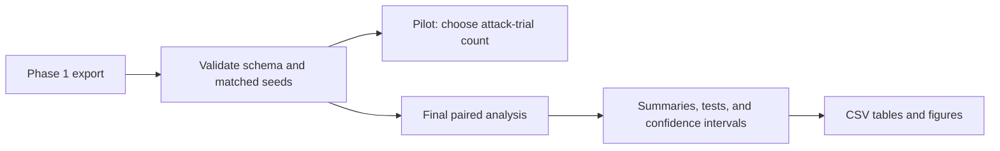

# Phase 2: Statistical Analysis

## Design

Phase 2 is a Python analysis of the Phase 1 ZIP export contract. The current
payload contains `manifest.resolved.json`, `graph.json`, `plans.jsonl`,
`trials.csv`, `capability_outcomes.csv`, `summary.csv`, and `checksums.txt`.
The analysis core remains database and network independent. The CLI and HTTP
adapters only transport this ZIP. The analysis does not select plans.

The CLI accepts an export directory, a ZIP path, or `-` for binary ZIP stdin.
It writes to a directory or `-` for binary ZIP stdout. The HTTP service accepts
raw `application/zip` requests at `/v1/analyze` and `/v1/pilot` and returns raw
ZIP responses. It uses no protobuf or gRPC.

The resolved manifest declares each confirmatory comparison with its tested
strategy and model variant, baseline strategy and model variant, outcome,
budget, plus every strategy run and statistical setting. For each comparison,
the difference is the tested strategy minus its declared baseline. A negative
blast-radius difference favors the tested strategy. Matching attack seeds form
pairs. The analysis reports variation between declared selection seeds
separately from attack-trial variation and keeps model variants separate.

The pilot is a planning step, not evidence for the final comparison. With the
manifest's selection seeds fixed, increase the attack-trial count until every
primary comparison meets its declared confidence-interval half-width. Freeze
that count and rerun the final study. Do not mix pilot outcomes with final-study
outcomes or use final outcomes to choose the count.

For each primary comparison, report the paired mean difference and a bootstrap
confidence interval at the manifest's declared level. Report a paired
standardized effect size to describe the difference relative to
paired-difference variability. Report a paired permutation test for the null of
no systematic difference. Apply the multiplicity correction declared by the
manifest.

Mission impact, capability disruption, blast-radius tails, runtime, and
selection-plan variation are secondary outputs. CDFs show the distribution and
tail behavior. Runtime distinguishes plan selection, attack simulation, and
analysis where the export provides those measurements. Uncertainty describes
this simulator under the fixed scenario and attacker model. It does not
describe real enterprise networks or real exploit likelihood.

Write versioned, machine-readable tables and figures to the caller-selected
output directory, together with analysis metadata. The HTTP service returns
these files in a ZIP. It does not persist artifacts or modify the raw export.

## Execution

### 1. Define the offline analysis package (30–60 minutes)

Add the pinned Python environment and command entry point under `evaluation/`.
Keep SciPy and Matplotlib as the statistical and plotting dependencies. Read
comparison filters, resampling settings, multiplicity correction, analysis
seed, and pilot precision from `manifest.resolved.json`.

Check: **When** the command receives an export directory, **the system shall**
load local files only and fail before analysis when a required input is absent.

### 2. Validate and normalize exported data (30–60 minutes)

Implement readers for `evaluation/results/<id>/<run>/trials.csv` and
`plans.jsonl`. Validate the model-aware plan identity (model variant, strategy,
budget, selection seed), scenario, attack seed, plan ID, blast radius, and the
available secondary outcomes. Reject missing or duplicate paired records,
inconsistent plan metadata, mixed scenarios, and unapproved budgets or
strategies. Preserve the declared ordered attack-seed schedule and distinguish
selection seeds from attack seeds.

Use `src/lib/network_defense/evaluation/output_contract.ex` as the export
boundary. Extend the export only when the analysis requires data that the
contract cannot provide, including capability terminal outcomes. Do not make
the analysis depend on database queries.

Check: **If** one paired record is missing or duplicated, **the system shall**
reject the dataset and identify the offending plan and attack seed.

### 3. Implement the pilot and freeze the final trial count (30–60 minutes)

Run the pilot for the manifest's declared selection seeds. Estimate each paired
outcome difference at increasing attack-trial counts and calculate its
confidence-interval half-width. Stop at the first count that meets every
declared target, record the decision in analysis metadata, and keep pilot data
out of final tables.

Check: **When** the pilot reaches the declared half-width target, **the system
shall** freeze the attack-trial count and prevent later final-study rows from
changing it.

### 4. Produce confirmatory and secondary statistics (30–60 minutes)

Execute every primary comparison declared by the manifest. Produce the paired
mean difference, bootstrap confidence interval, paired standardized effect
size, raw permutation p-value, and adjusted p-value. Summarize selection-seed
variation separately from within-plan attack-trial variation.

Produce secondary summaries for mission impact, capability disruption when
exported, tail quantiles, CDF inputs, and runtime. Label all secondary results
as exploratory and do not promote them to confirmatory claims.

Check: **When** a final dataset contains a declared comparison, **the system
shall** emit all primary statistical results with the difference sign defined
as tested strategy minus declared baseline.

### 5. Write reproducible artifacts and verify the run (30–60 minutes)

Write analysis tables, CDF data, figures, and metadata to the caller-selected
output directory. Include input hashes and the resolved analysis
configuration. Make rerunning the same inputs produce equivalent sorted table
contents and figures without modifying raw exports.

Run the package's unit checks, a small synthetic paired-data check, and a clean
end-to-end analysis against a Phase 1 export. Review that no automatic
analysis, Dashboard integration, Oban analysis job, artifact persistence,
distributed worker, database, or network dependency was added to the analysis
core.

Check: **When** the same export and analysis configuration are run twice, **the
system shall** produce identical machine-readable results and matching input
hashes.
