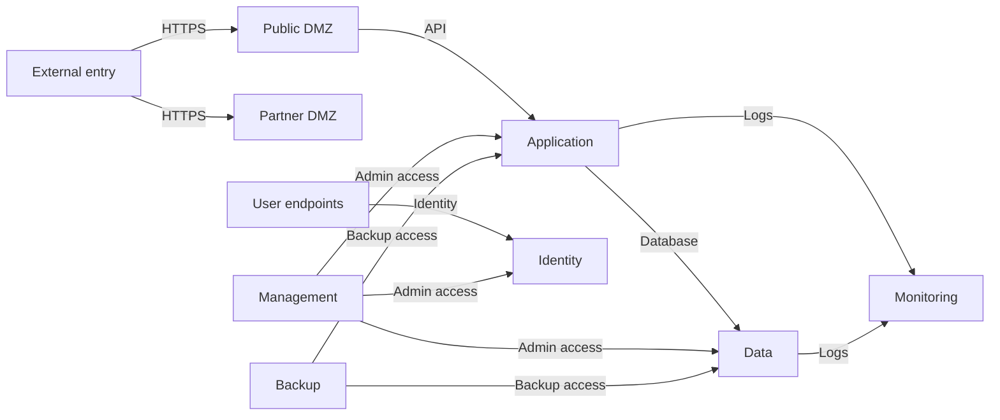

# Phase 4: Fixed Order-Fulfilment Scenario

## Purpose

This phase creates one hand-authored enterprise scenario for the evaluation.
It tests the thesis claim under two fixed attacker contexts and a fixed
network model. It does not create a general topology generator.

The scenario has 80 `Host` nodes, including the external entry host. It uses
fictional organization, host, business-service, and capability names. It uses
real product versions and real CVE identifiers only when a reviewed NVD record
maps to that service through a declared CPE.

## Design

The scenario is a declarative Elixir graph builder. It uses the existing graph
constructors and domain contracts. A dedicated Mix task persists one immutable
graph revision and creates the two local evaluation manifests that refer to it.



| Zone | Roles | Host count |
| --- | --- | ---: |
| External | Internet entry source | 1 |
| Public DMZ | Order gateways and public status service | 3 |
| Partner DMZ | Vendor portal, remote-access gateway, and mail relay | 3 |
| Application | Order, inventory, payment, two support, integration, and reporting services | 12 |
| Data | Order, inventory, customer, reporting, and file data services | 8 |
| Identity | Directory, federation, certificate, and DNS services | 5 |
| Management | Bastions, administration, configuration, virtualization, and patch services | 6 |
| User | Sales, customer care, warehouse, finance, and engineering endpoints | 34 |
| Monitoring | Log collection, SIEM, and metrics services | 4 |
| Backup | Backup control, repositories, and recovery management | 4 |

The graph has four deliberate controls:

| Control | Scenario property | Expected model contrast |
| --- | --- | --- |
| Severity versus mission | A reachable, high-severity partner service has no path to a mission-critical capability. A lower-severity service is on the order path. | CVSS prioritizes the contained target. Mission-aware strategies protect the critical path. |
| Blast radius versus feasibility | Removing the public-DMZ-to-application policy reduces attacker reach but breaks the order-service required flow. | Feasibility-on excludes the action. The blast-only unconstrained model can select it. |
| Credential reuse | A public-service compromise can acquire a declared deployment credential and reuse it against an authorized internal service. | The scenario exercises the implemented credential rules. |
| Redundant support | Customer support uses two support hosts with `min_operational_support: 1`. | One support-host loss does not stop the capability. |

Two evaluation manifests instantiate the controls. Each manifest fixes one
attacker foothold and one selection comparison.

- `fixed-order-fulfilment-v1` starts at `internet-entry`. It compares full
  simulation-informed selection to CVSS. It proves the severity-versus-mission
  control.
- `fixed-order-fulfilment-feasibility-v1` starts at `order-gateway`. It
  compares feasibility-constrained blast-only selection to unconstrained
  blast-only selection. It proves the blast-radius-versus-feasibility control.

Two manifests are necessary because the two controls need different attacker
footholds and different selection comparisons. One shared manifest cannot
express both. The manifests share the graph. They do not compare results
across attacker footholds. The credential-reuse and redundant-support controls
are scenario properties. They do not need a manifest.

Policies model network enforcement. Router and firewall node types are out of
scope. Gateway and bastion systems are hosts because the implemented attack
rules can target their services.

The builder creates UUIDs through the existing constructors. A run exports its
exact graph. The repository does not yet claim byte-identical graph identity
across fresh databases. Tests use stable semantic names and graph structure.
The scenario avoids equal CVSS scores and equal topology reductions for all
intended strategy comparisons.

## Scenario Source And Outputs

```text
src/
├── lib/
│   ├── mix/tasks/seed.fixed_order_fulfilment.ex
│   └── network_defense/topology/fixed_order_fulfilment_scenario.ex
└── test/
    ├── mix/tasks/seed_fixed_order_fulfilment_test.exs
    └── network_defense/topology/fixed_order_fulfilment_scenario_test.exs

evaluation/
├── scenarios/fixed-order-fulfilment-v1/
│   ├── rationale.md
│   └── nvd/
│       ├── snapshot.json
│       └── provenance.json
└── results/fixed-order-fulfilment-v1/<run>/
```

`FixedOrderFulfilmentScenario` is the source of truth for the graph and the
reviewed CVE-to-service mappings. It exposes a pure graph function, an
idempotent seed function, and the local manifest builders. The seed task
returns the stored graph revision and the two attacker footholds. A scenario
version never changes after use. A changed scenario uses a new version suffix.

The runner uses the existing `graph_revision` source. It does not add a graph
file import path, a new manifest source type, a topology generator, or fixed
UUID allocation.

## NVD Curation

NVD selection starts only after the service and version inventory is frozen.
The application never calls NVD while it runs an evaluation.

1. Download the required NVD JSON 2.0 annual feed files manually.
2. Keep the reviewed source records only in `nvd/snapshot.json`.
3. Record feed URLs, download time, NVD schema version, and feed hashes in
   `nvd/provenance.json`.
4. Map each selected CVE to one declared product version and CPE.
5. Copy the reviewed NVD CVSS characteristics into the graph builder.
6. Declare a separate stylized `exploit_probability` for each vulnerability.

The selected records must provide a strict severity contrast between the
contained partner service and the order-path service. CVSS data does not set
the exploit probability and does not establish real exploitation likelihood.

## Research Boundary

The existing `docs/concepts/enterprise-topology-sources.md` remains the source
for open topology patterns. Add a short rationale that cites NIST SP 800-207
for identity and resource-focused access, MITRE ATT&CK T1190 for public-service
entry, and MITRE ATT&CK T1021 for credential-based remote access.

These sources motivate structural patterns. They do not validate the simulator
or claim that the scenario represents a real enterprise.

## Required Tests

| Test | EARS assertion |
| --- | --- |
| Graph structure | When the scenario graph is built, then it contains the declared host count and canonical graph relationships only. |
| Public entry | When the remote-exploitation rule evaluates the external entry, then it finds a public-service candidate. |
| Credential path | When the designated public host is compromised, then credential reuse exposes the authorized internal service. |
| Required-flow cut | When the required public-DMZ-to-application policy is removed, then pre-attack feasibility fails. |
| Redundancy | When one customer-support host is compromised, then the customer-support capability remains operational. |
| Severity ranking | When CVSS ranks a one-action plan, then it chooses the strictly higher-severity contained target. |
| Model contrast, severity-versus-mission | When `fixed-order-fulfilment-v1` ranks a one-action plan, then full simulation-informed selection deviates from CVSS and protects the critical path. |
| Model contrast, feasibility | When `fixed-order-fulfilment-feasibility-v1` ranks a one-action plan, then feasibility-constrained blast-only selection deviates from unconstrained blast-only selection. |
| Seed safety | When the seed task runs twice for the same scenario version, then it does not create duplicate scenario revisions or manifests. |
| Static CVE data | When a selected vulnerability is loaded, then its declared CPE and CVSS characteristics match one local reviewed NVD record. |

## Execution

### Chunk 1: Freeze The Scenario Contract

**Owner:** Main agent

Confirm the policy matrix, service inventory, attack path, capability weights,
and calibration targets. Update this plan if the design changes. Do not write a
generator or select CVEs before this contract is stable.

**Complete when:** The four controls above each map to named graph elements and
one test assertion.

### Chunk 2: Build The Scenario Core

**Owner:** `implementor_terra`

Create the declarative scenario builder with all segments, hosts, services,
and canonical policy edges. Use existing graph constructors, contracts, and
materialization behavior. Add structural tests that normalize UUIDs when they
compare two independently built graphs.

**Complete when:** The graph has 80 hosts and passes graph validation and
effective-flow checks.

### Chunk 3: Add Mission And Identity Controls

**Owner:** `implementor_terra`

Add credential nodes and relationships, mission capabilities, required flows,
two customer-support service hosts, and the feasibility-breaking policy action.
Add rule-level and mission-impact tests.

**Complete when:** The required public entry, credential path, feasibility cut,
and redundancy checks pass.

### Chunk 4: Add The Seed Task

**Owner:** `implementor_fast_fast`

Add the dedicated Mix task. It seeds or returns one versioned scenario revision
and the two local manifests. It follows the existing task and seed conventions.

**Complete when:** A second task run reuses the scenario revision and manifests.

### Chunk 5: Curate And Integrate NVD Data

**Owner:** `implementor_terra` selects and reviews records. `implementor_fast_fast`
stores the approved records and provenance.

Freeze service versions. Select NVD records by service applicability and the
required strict severity contrast. Store the static evidence. Integrate the
reviewed CVSS characteristics and separate exploit probabilities into the
scenario builder.

**Complete when:** Every scenario CVE has a local source record, explicit CPE
mapping, and separate probability.

### Chunk 6: Calibrate And Pilot

**Owner:** `implementor_terra` calibrates. `implementor_fast_fast` finalizes
the manifests and pilot wiring.

Run fixed-seed calibration studies. Adjust only graph structure or declared
stylized probabilities. Freeze the scenario after the intended model contrast
appears. Run the Phase 1 export and the Phase 2 pilots for both manifests to
select the attack-trial count.

**Complete when:** The pilot artifacts pass analysis validation and each
declared stopping rule selects the full-study trial count.

## Next Steps

1. Use mission impact as the severity study's primary outcome. Retain blast
   radius as a secondary safety outcome.
2. Export each plan's pre-attack required-flow status. The feasibility study
   must measure operational loss directly, not infer it from attack outcomes.
3. Freeze hypotheses, metrics, comparisons, seeds, budgets, and stopping rules
   before the full study. Do not tune the graph to improve statistical results.
4. Run the equal-budget strategy matrix. Include CVSS, topology, random,
   simulation-informed, and simulated-annealing strategies at budgets one to
   three. Use multiple selection seeds.
5. Run a new mission-impact pilot to select the attack-trial count. The current
   ten-seed pilot meets the blast-radius rule, but mission-impact uncertainty is
   still too wide.
6. Add a small sensitivity study with independently defined scenario variants.
   Limit conclusions to the measured stylized models.

## Exclusions

- Parameterized topology generation
- Network-device graph types
- Fixed graph or node UUIDs
- NVD API calls, API keys, and runtime network access
- NVD-based exploit probabilities
- Durable distributed evaluation and cloud deployment
