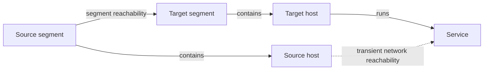

# Reachability Modeling — Canonical Policy, Transient Operational Flows

## Decision

Persist the structural policy graph. Derive host-to-service reachability only when a simulator or network view needs it.

`NetworkReachability` is an internal operational projection, not an authored or persisted relationship. It is a pure `Host -> Service` marker: the target service already defines protocol and port. `SegmentReachability` is the single persistent network-policy relationship and carries protocol and port-range data.

Defense actions are revision deltas, not graph nodes. A segmentation action removes a `SegmentReachability` rule from the canonical graph. The next operational projection reflects that removal.

There is no compatibility path. Existing graph revisions, optimization runs, frontend drafts, fixtures, and generated contract snapshots are discarded or rewritten as part of this change.

## Model

### Canonical graph

Persist these nodes: `Host`, `Service`, `NetworkSegment`, `Vulnerability`, and `Credential`.

Persist these relationships:

| Relationship | Direction | Meaning |
| --- | --- | --- |
| `Contains` | `NetworkSegment -> Host` | The host belongs to one segment. |
| `Runs` | `Host -> Service` | The host owns one listening service. |
| `SegmentReachability` | `NetworkSegment -> NetworkSegment` | The source segment may initiate traffic to matching services in the target segment. |
| Existing vulnerability and credential relationships | Existing direction | Unchanged. |

`SegmentReachability` has `protocol`, `port_start`, and `port_end`. A rule matches when its protocol is `any` or equals the target service protocol, and its range is absent or contains the target service port. Rules are directed, deny by default, and compose by logical OR. A same-segment flow requires an explicit self-rule.

### Operational projection

For every matching policy rule, materialize one effective `NetworkReachability` edge for each `{source host, target service}` pair. Collapse all matching rules into one edge. Its deterministic ID derives from the graph ID, source-host ID, and target-service ID.

The projection exists only in memory. It is never saved in a graph revision or accepted by the save API. Simulation event records may reference its deterministic ID; the same canonical revision reproduces it.

### Required invariants

| Invariant | Enforcement point | Reason |
| --- | --- | --- |
| Every host has exactly one `Contains` parent. | Canonical graph validation. | A source policy cannot be ambiguous. |
| Every service has exactly one `Runs` parent. | Canonical graph validation. | A target service resolves to one host. |
| Canonical graph contains no `NetworkReachability`. | Save and revision persistence. | Prevents policy drift. |
| Projection contains one edge per effective host/service flow. | Materializer. | Prevents duplicate attack candidates. |
| Projection ordering and IDs are deterministic. | Materializer. | Preserves reproducible simulation and optimization results. |

## Flow Inventory

| Flow | Canonical input | Operational step | Output |
| --- | --- | --- | --- |
| Generated topology | Roles, segments, policy table | Materializer during simulation/view | Persisted policy graph and projected flows. |
| Manual graph save | Authored nodes and canonical edges | Validate only; no projection stored | New canonical revision. |
| Open topology | Graph revision | None | Editable policy graph. |
| Open network view | Graph revision | Materialize on the server | Read-only host/service flow projection. |
| Simulation | Canonical revision | Materialize once before `Simulator.run_batch` | Existing rule traversal over operational edges. |
| Optimization scoring | Candidate canonical graph | Materialize before every simulation evaluation | Candidate blast-radius score. |
| Apply policy defense | Canonical graph and policy-edge ID | Remove policy, rematerialize for subsequent scoring | Canonical optimized revision. |
| Graph comparison | Two canonical revisions | None | Policy-level diff without derived-flow noise. |

## Phase 0 — Reset And Characterize

**Outcome:** a clean baseline and tests that define the intended blast-radius-preserving behavior before the model changes.

### Changes

- Remove existing development graph revisions, optimization runs, and frontend fixture snapshots. Do not migrate host-to-service edges into policy: that conversion can over-grant access.
- Record baseline seeded generator scenarios, initial footholds, simulation parameters, and expected blast-radius distributions. The new generated policy must produce the same effective host/service flows and simulation outcomes for equivalent inputs.
- Add one focused characterization fixture that covers ingress, inter-segment access, management access, and denied access.

### Blast radius

- Data: all existing persisted graph and optimization records become intentionally invalid.
- Operations: graph open, simulation, optimization, and comparison operate only on newly created canonical revisions after this phase.
- No database schema migration is needed because graph snapshots already store relationship type and data dynamically.

### Files

- Replace legacy graph and optimization fixtures under `src/test/network_defense/` and `src/assets/svelte/dashboard/`.
- Remove development data seeded by `src/priv/repo/seeds.exs`; it cannot satisfy the canonical ownership invariants.
- Update generated-contract assertions in `src/test/network_defense_web/contracts_gen_test.exs`.
- Add baseline characterization tests beside `src/test/network_defense/topology/enterprise_topology_test.exs` and simulation tests.

### Gate

- Tests state expected effective flows and seeded blast-radius results before implementation starts.
- `mix precommit` passes against the reset dataset.

## Phase 1 — Canonical Policy Graph

**Outcome:** the application can persist, open, render, and validate an authored segment-policy graph. Direct host-to-service reachability no longer exists in stored topology.

### Backend and data definitions

1. Add `NetworkDefense.Relationships.SegmentReachability` with the current reachability protocol and range validation.
2. Change `NetworkDefense.Relationships.NetworkReachability` to an empty operational marker. Delete `matches_service?/2` and its protocol/range data schema.
3. Register `SegmentReachability` in `relationships/registry.ex` and permit only `NetworkSegment -> NetworkSegment` in `graph/semantic_connectivity.ex`.
4. Strengthen `Graph.hydrate/3` validation from at-most-one to exactly-one `Contains` per host and exactly-one `Runs` parent per service.
5. Reject `NetworkReachability` from canonical graph contracts and graph persistence. Keep the domain relationship registered because the materializer and simulator use it internally.
6. Add `SegmentReachabilityData` and update the edge contract variants. Regenerate TypeScript contracts.

### API and frontend

1. Make `GraphContract` and `SaveGraphContract` canonical-only. `NetworkReachability` is absent from graph-open and graph-save payloads.
2. Keep connection-draft validation for authored topology only. It exposes `SegmentReachability` and no host-to-service reachability option.
3. Register a policy-edge presentation, color, label, and inspector. The inspector edits protocol and port range.
4. Remove host-to-service reachability creation from `EditableCanvas.svelte` and `NetworkCanvas.svelte`.
5. Retain generic canonical-edge editing and deletion in `EditableGraphDocument.svelte.ts` and `Canvas.svelte`. Delete only operational-reachability presentation, editing, and inspection paths.
6. Rewrite `src/priv/repo/seeds.exs` to create segments, exact membership, and policy rules. Its seeded topologies must no longer create direct host/service reachability.

### Change blast radius

| Affected item | Change | Required check |
| --- | --- | --- |
| `NetworkReachability` data | Protocol/range is removed. | No canonical contract or persisted snapshot contains it. |
| All graph writes | Incomplete ownership and direct operational edges fail validation. | Save API rejection tests. |
| All graph reads | Open response contains policy edges only. | Contract and LiveView tests. |
| Topology editor | Segment policies are created through standard graph connection flow. | Keyboard and pointer creation tests. |
| Existing graph model tests | Test fixtures need exact ownership edges. | Unit tests compile without bypassing invariants. |

### Files

- Add `src/lib/network_defense/relationships/segment_reachability.ex`.
- Update `src/lib/network_defense/relationships/network_reachability.ex` and `registry.ex`.
- Update `src/lib/network_defense/graph/graph.ex`, `semantic_connectivity.ex`, `edge.ex`, `graphs.ex`, and graph contract modules under `graph/contracts/`.
- Add `src/lib/network_defense/graph/contracts/data/segment_reachability_data.ex`.
- Update `src/lib/network_defense_web/live/web/dashboard/dashboard_live.ex` and dashboard graph contracts.
- Regenerate `src/assets/svelte/contracts.generated.ts`; update `src/assets/svelte/dashboard/contract.ts`.
- Update `EditableCanvas.svelte`, `Canvas.svelte`, `EditableGraphDocument.svelte.ts`, `EditableSelectionInspector.svelte`, presentation registry, edge inspectors, and their tests.
- Delete `NetworkReachabilityInspector.svelte`, its presentation module, registry entry, and reachability-editor tests in this phase, before canonical-only TypeScript contracts are generated.
- Update `src/priv/repo/seeds.exs`.
- Update graph, contract, semantic-endpoint, draft, dashboard-contract, and dashboard-LiveView tests.

### Gate

- A hand-authored, fully owned segment-policy graph saves and reopens.
- Invalid ownership and direct host-to-service save requests fail.
- The topology canvas can create and edit a policy edge.
- `mix gen.contracts` and `mix precommit` pass.

## Phase 2 — Materialized Operational Projection

**Outcome:** generated and authored policy graphs drive the same simulation rules and a read-only network view through a deterministic in-memory projection.

### Backend

1. Add `NetworkDefense.Graph.MaterializeReachability`.
2. Resolve membership, ownership, policy matching, deduplication, sorting, and deterministic operational IDs in that module only.
3. Change `EnterpriseTopology` to emit a dedicated segment-policy table, then remove `add_reachability/3` and its host/service pair helpers. Keep `@transitions`; it only selects extra host roles.
4. Add one shared operational-graph boundary used by both normal simulation dispatch and optimization scoring. `Simulations` materializes before batch execution; `SimulationObjective.expected_blast_radius/2` materializes before its direct `Simulator.run_experiment/3` call. No rule or strategy passes a canonical graph directly to a simulator.
5. `RemoteServiceExploitation` and `ReuseCredentialRule` retain their traversal shape but remove protocol/range filtering.
6. Add a server read operation that returns a network projection for one revision. It returns hosts, segments, policy links, and derived operational flows. It never writes them.

### Frontend

1. Split topology data from network-view data.
2. Make `NetworkCanvasProjection` consume canonical topology plus the server projection.
3. At low zoom, display direct segment-policy links. At high zoom, display derived host/service flows as read-only operational state.
4. Disable or mark the network view stale while a topology document has unsaved changes; refresh it from the saved revision after a successful save.
5. Update force-layout routing and edge presentation so segment-policy edges and operational flows have distinct visual roles.

### Change blast radius

| Affected item | Change | Required check |
| --- | --- | --- |
| Generator | Policy rules replace direct flow creation. | Generated effective flows equal the characterization baseline. |
| Remote exploit rule | Removes redundant service-match predicate. | Candidate actions and outcomes remain equivalent. |
| Credential reuse rule | Removes the same predicate. | Credential lateral movement remains equivalent. |
| Simulation boundary | Receives a materialized graph, never a persisted projection. | Supporting operational-edge IDs are deterministic. |
| Optimization objective | Bypasses `Simulations` today and calls the simulator directly. | Both simulator entry paths materialize the same canonical graph. |
| Network canvas | Stops inferring segment policy from host links. | Policy links and derived flows render independently. |
| API | Adds a read-only projection operation. | It cannot be used to save or mutate flows. |

### Files

- Add `src/lib/network_defense/graph/materialize_reachability.ex` and tests.
- Update `src/lib/network_defense/topology/enterprise_topology.ex` and its tests.
- Update `src/lib/network_defense/simulations.ex`, `optimization/simulation_objective.ex`, simulator and objective tests, `remote_service_exploitation.ex`, `reuse_credential_rule.ex`, and rule tests.
- Update or delete `src/priv/bench/map_fun_bench.exs`; it must benchmark canonical topology plus materialization rather than constructing invalid direct flows.
- Add projection payload/reply contracts under `src/lib/network_defense_web/contracts/dashboard/graph/`.
- Update `dashboard_live.ex` and `src/assets/svelte/dashboard/dashboard-api.ts`.
- Update `NetworkCanvasProjection.ts`, `NetworkCanvas.svelte`, `ForceLayout.svelte.ts`, presentation files, and their tests.

### Gate

- Materialization is deterministic, idempotent, directed, deny-by-default, and deduplicated.
- A self-segment rule is required for same-segment movement.
- Generator and characterization simulations produce the agreed flow set and blast-radius distribution.
- Network canvas renders policy and operational layers without allowing an operational-edge mutation.
- `mix precommit` passes.

## Phase 3 — Policy-Based Defense And Optimization

**Outcome:** segmentation strategies operate on meaningful policy boundaries and persist only canonical optimized revisions.

### Backend

1. Add `BlockSegmentReachability`. It targets a policy edge and removes it from the canonical graph.
2. Remove `BlockReachability` from all active action lists, strategies, and frontend labels. Delete it rather than preserving micro-segmentation behavior.
3. Keep `Optimizer`, `Strategy.rank/4`, and every `DefenseAction.apply/2` on canonical graphs only. `SimulationObjective` is the sole scoring boundary and materializes each candidate immediately before its experiment.
4. Rework `TopologySegmentationStrategy` to rank policy-edge removals by their marginal reachable-host reduction after materialization. Exclude policies with zero effective reduction.
5. Update simulation-informed, random, and annealing candidate discovery to use `BlockSegmentReachability` through the existing action-type mechanism.
6. Update `OptimizationReport` to name source segment, target segment, protocol, and range.
7. Delete unused `mincut_strategy.ex` and `greedy_structural_strategy.ex` rather than implying unsupported strategies.

### Frontend

1. Change optimization reports from “network segmentation” host/service labels to policy-rule labels.
2. Update strategy panels and action summaries to describe a segment-boundary cut.
3. Keep operational flow count as explanatory output only; it never becomes an action target.

### Change blast radius

| Affected item | Change | Required check |
| --- | --- | --- |
| Defensive action target | One policy rule can remove many operational flows. | Only flows uniquely enabled by that rule disappear. |
| Sequential optimizer | Every selected action changes later candidate scores. | Re-rank after each canonical action. |
| Overlapping policies | Removing one rule can have zero operational effect. | Topology strategy excludes it; general strategies score it correctly. |
| Optimized revision | Contains the policy removal, not generated flow deletions. | Persisted edge set has no `NetworkReachability`. |
| Reports | Target label changes from host/service to policy boundary. | Report and UI tests assert policy terminology. |

### Files

- Add `src/lib/network_defense/defense_actions/block_segment_reachability.ex`.
- Update `defense_actions/registry.ex`, `optimization/optimizer.ex`, `topology_segmentation_strategy.ex`, action and strategy tests, and `optimization_report.ex`.
- Delete `defense_actions/block_reachability.ex`, `optimization/mincut_strategy.ex`, and `optimization/greedy_structural_strategy.ex`.
- Update optimization contracts and report components under `src/assets/svelte/dashboard/`.
- Update `OptimizationReport.svelte`, `StrategyPanel.svelte`, `TopologySegmentationStrategyPanel.svelte`, and associated tests.

### Gate

- Removing a policy rule changes the materialized flow set and only that set.
- Optimizer-produced revisions contain policy actions only.
- Policy segmentation reduces the expected blast radius in the characterization topology.
- All strategy, action, report, persistence, and frontend tests pass through `mix precommit`.

## Phase 4 — Comparison, Cleanup, And Documentation

**Outcome:** every remaining surface describes the policy model and operational flows cannot leak back into authoring or comparison.

### Changes

1. Keep `GraphDiff` canonical-only. It compares policy changes directly and does not expand generated host/service edges.
2. Remove any residual host-flow creation copy, shortcut, test, or presentation path not deleted in Phase 1.
3. Audit all uses of `NetworkReachability` with repository search. The only allowed production consumers are the materializer, operational graph traversal, and projection response.
4. Update the model documentation to state the structural-versus-operational split and the deliberate absence of micro-segmentation exceptions.

### Change blast radius

| Affected item | Change | Required check |
| --- | --- | --- |
| Graph comparison | Policy changes remain readable. | One policy removal produces one edge-level diff. |
| Editor accessibility | Keyboard help and labels no longer promise host-flow creation. | Keyboard and screen-reader tests cover policy links. |
| Documentation | Old direct-flow ownership claims are removed. | No contradictory model description remains. |
| Repository boundaries | Direct operational edge persistence is impossible. | Search and contract tests enforce the boundary. |

### Files

- Update `src/lib/network_defense/graph/graph_diff.ex` and `src/assets/svelte/dashboard/graph/GraphDiff.svelte` with their tests.
- Update residual frontend tests and presentation-registry tests.
- Update `docs/concepts/model.md`, `docs/concepts/graph-model-evaluation.md`, `docs/concepts/usecases.md`, `docs/concepts/enterprise-topology-sources.md`, `docs/concepts/credential-privilege-model-plan.md`, `docs/concepts/milestones.md`, and this plan.

### Gate

- Repository search shows no production direct-reachability authoring or persistence path.
- Policy diffs, network projection, simulation, and optimization work from one newly generated graph.
- `mix precommit` passes.

## Explicitly Deferred

- Host-specific allow or deny exceptions.
- Rule priority and deny-overrides.
- Multi-homed hosts and services owned by multiple hosts.
- Routing, NAT, return-path, and proxy semantics.
- Firewall-device or security-group nodes.

These features require a rule-precedence model. Adding them now would dilute the segmentation experiment and reintroduce policy ambiguity.
