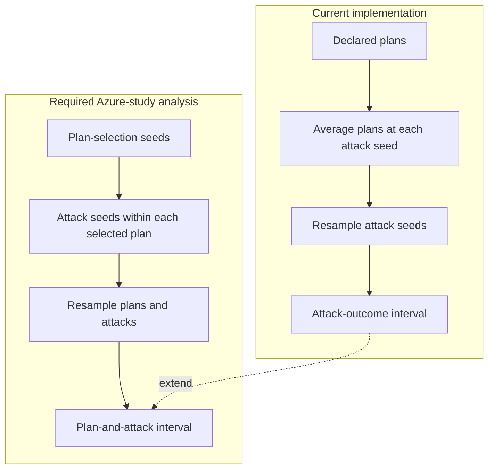

# Statistical Analysis

## Evaluation archive files

The analysis reads a completed evaluation archive. The archive contains
`manifest.resolved.json`, `graph.json`, `plans.jsonl`, `trials.csv`,
`capability_outcomes.csv`, `pre_attack_flow_statuses.csv`,
`host_compromises.csv`, `summary.csv`, `evaluator_runtime.csv`, and
`checksums.txt`.

The resolved manifest declares the strategy runs, comparisons, outcomes,
resampling settings, correction, and pilot precision target. The analysis core
does not use the database or the network. The CLI and HTTP service only
transport the evaluation archive.

```sh
uv sync --frozen
uv run network-defense-analysis pilot /path/to/export --output /path/to/pilot
uv run network-defense-analysis analyze /path/to/evaluation.zip --output /path/to/analysis
cat evaluation.zip | uv run network-defense-analysis pilot - --output - > pilot.zip
cat evaluation.zip | uv run network-defense-analysis analyze - --output - > analysis.zip
```

Run the commands from this directory. The analysis engine reads local files
only. Current intervals describe attack-outcome uncertainty for the exported
scenario. They condition on the manifest's plan-selection seeds.

## Azure-study analysis extension

The approved Azure topology-scale study requires analysis behavior that is not
implemented yet:

- include variation between selected plans and variation between attack
  outcomes in the primary interval;
- select one common plan-selection seed count and one common attacks-per-plan
  count;
- use a confidence-interval half-width target of one mission-impact point;
- treat a zero-difference and zero-width primary comparison as non-informative,
  not as an automatic precision pass;
- compare random, topology segmentation, simulation-informed, and
  simulated-annealing strategies with CVSS at three budgets and three tiers;
- apply Holm correction once across the complete family of 36 primary
  comparisons.

Simulated mission impact is primary. Blast radius is secondary and includes the
initial foothold. Ordering the CVSS contrasts does not establish a universal
total ranking. The study-level runtime report uses one excluded warm-up and the
median and observed range from five accepted Azure replicas.

### Current and required uncertainty



The current interval answers how attack outcomes vary for the declared plans.
The required interval answers how outcomes vary when the strategy can also
select different plans.

## Analysis output

The analysis output contains primary, secondary, and capability results. It
also contains descriptive host compromise probabilities, feasibility summaries,
and a runtime summary. The runtime summary gives median plan-selection and
simulation durations, plus the total evaluator duration.

## Comparison

`compare` checks that two completed evaluation archives are semantically equal,
for example two replicas of the same evaluation:

```sh
uv run network-defense-analysis compare /path/to/reference/export /path/to/candidate/export
```

It accepts archive paths or directories. On equality it prints `{"equal":true}`
and exits 0; on a mismatch it prints `{"equal":false, "differences":[...]}`
with the affected dataset names and exits 1. Invalid archives are CLI errors
that exit 2.

Equality covers the resolved manifest and source graph; plan semantics
(variant, strategy, requested budget, selection seed, objective, feasibility,
used budget, actions, status); baseline and defended trial outcomes;
capability outcomes; pre-attack required-flow status; host compromises; and
non-timing summary outcomes. Plan order is normalized by mapping plan IDs to
the stable identity (model_variant, strategy, requested_budget,
selection_seed); baseline rows use a literal identity. Experiment IDs are
ignored and rows are sorted before comparison.

It excludes evaluator, plan-selection, and simulation runtimes, which vary
between replicas. The differences list names only the logical dataset that
diverges, not the raw rows.

## Tests

Run the Python unittest suite from this directory:

```sh
uv run python -m unittest discover -s tests
```

## HTTP service

Build the dedicated image and start the service:

```sh
docker build -t network-defense-analysis evaluation/analysis
docker run --rm -p 127.0.0.1:8080:8080 network-defense-analysis
curl http://127.0.0.1:8080/healthz
curl -H 'content-type: application/zip' --data-binary @evaluation.zip \
  http://127.0.0.1:8080/v1/analyze -o analysis.zip
```

The service accepts raw ZIP requests and returns raw ZIP responses for
`/v1/analyze` and `/v1/pilot`. It returns an `application/problem+json`
response with HTTP 413 when the request exceeds the compressed ZIP limit. It
returns the same media type with HTTP 429 when no analysis slot is available.
The image starts the service by default. Override the command to run the CLI,
for example `docker run --rm network-defense-analysis
network-defense-analysis --help`.

Phoenix uses Req and the explicit task:

```sh
ANALYSIS_SERVICE_URL=http://127.0.0.1:8080 \
  mix evaluate.analyze --run-id RUN_ID --mode analyze --output analysis.zip
```

Terraform-managed app containers use the site-local `analysis` alias through
Docker DNS. The Terraform-managed service has no host port. Host-side commands
need a separately published local service. The service has no authentication.

TODO: Add service authentication before non-local or untrusted exposure. Until
then, use the service only on trusted local or private networks.

There is no protobuf or gRPC interface. The service does not add automatic
analysis, Dashboard integration, an Oban analysis job, or artifact persistence.
