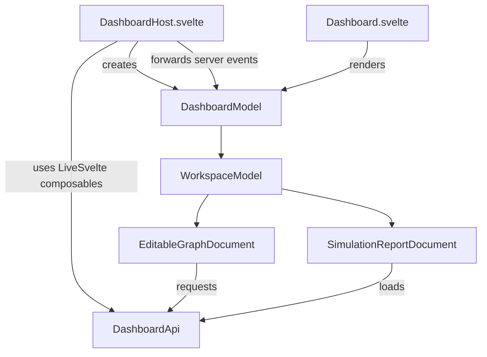
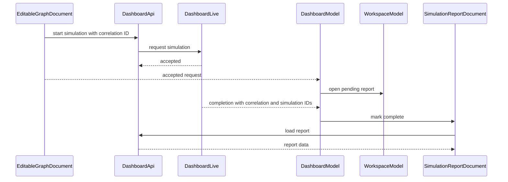
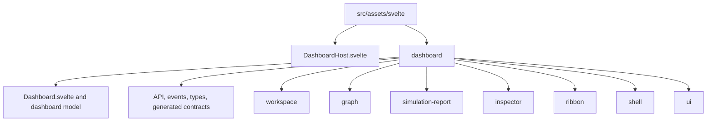

# Dashboard UI Refactor Plan

## Goal

Replace the controller-centered dashboard with feature-owned models. Views render models and forward user actions. Models own state transitions. The root model only coordinates actions that affect more than one child model.

## Model Ownership

| Model | Owns |
|---|---|
| `DashboardModel` | Cross-model coordination, including routing simulation completion events to their report documents. |
| `WorkspaceModel` | Open documents, active document, tabs, document creation and closing, topology picker, report picker, and opening historical reports. |
| `EditableGraphDocument` | Graph editing, selection, force layout, saving, and starting a simulation. |
| `SimulationReportDocument` | Pending, ready, loading, and failed report state; loading its report data. |
| `GraphCanvas` | Rendering and viewport interaction: pan, zoom, drag mechanics, and fit-to-view. |

Selection remains document-local and generic. Each document can expose one of the supported selection variants. The inspector resolves the active document's selection to an inspector view.

## Component Boundary

`DashboardHost.svelte` is the LiveSvelte entry component. It receives the LiveView connection and initial data, creates the API and root model, calls `useLiveEvent`, and renders the presentational dashboard.

`Dashboard.svelte` receives only `DashboardModel`. It must not create models, call LiveView, or manage workflow state.

The host owns Svelte lifecycle wiring because `useLiveEvent` and `useEventReply` require a mounted component. `DashboardModel` owns the domain event handlers and state transitions.

## API Boundary

`DashboardApi` is a typed, Promise-based facade over LiveView events.

- Use `useEventReply` in the host for singleton request/reply UI operations.
- Use direct Promise wrappers around `live.pushEvent` where concurrent operations are possible.
- Pass the API explicitly to document actions, for example saving a graph, starting a simulation, and loading a report.
- Do not introduce a separate gateway abstraction or use global access to the LiveView connection.

## Simulation Flow

Use a client-generated correlation ID. The persisted simulation ID is available only after the asynchronous simulation completes.

The backend contract needs an immediate accepted or rejected reply and two server-pushed events:

- `simulation_completed` with the correlation ID, graph ID, and persisted simulation ID.
- `simulation_failed` with the correlation ID, graph ID, and failure reason.

Use one static event name with the correlation ID in the payload. Do not dynamically construct event names per request.

If a user closes a pending report tab, remove it. Ignore its completion event. The persisted result remains available from the historical report picker.

Each accepted request creates a distinct pending report document, even for the same graph. Historical reports are reused only when they have the same persisted simulation ID. Report loads use a request token so late replies cannot replace newer data. A completed or failed report is marked unread when it is not active.

## Report Flow

`WorkspaceModel` owns the historical report picker.

1. Collect graph IDs from open editable graph documents.
2. Load available simulation-run summaries and open the picker.
3. On selection, find or create the matching `SimulationReportDocument`.
4. Select it and load its data immediately.

Newly completed reports use the same document loading method. This replaces the current duplicated report-fetch paths.

The run picker prevents duplicate in-flight requests and displays a request failure in its status area.

## Directory Layout

Organize by feature. Colocate each feature's components, rune model, pure helpers, types, and tests. Do not add top-level technical buckets such as `models`, `components`, or `utils`.

| Directory | Contents |
|---|---|
| `dashboard/` | Root view, root model, API facade, event payload types, and dashboard-only types. |
| `dashboard/workspace/` | Workspace view and model, document union, topology picker, report picker, and shared workspace fields. |
| `dashboard/graph/` | Editable graph document, canvas, graph geometry, canvas state, fit-view logic, layout, and graph node features. |
| `dashboard/simulation-report/` | Report document, report view, charts, KPI cards, and chart adapter. |
| `dashboard/inspector/` | Inspector panel, empty state, selection contract, and inspector resolution. |
| `dashboard/ribbon/` | Dashboard ribbon and its compound ribbon primitives. |
| `dashboard/shell/` | App bar and status bar. |
| `dashboard/ui/` | Reused dashboard primitives only. |

Move graph node components under `dashboard/graph/nodes/<kind>/`. Move canvas-specific inspector components under `dashboard/graph/` or `dashboard/inspector/` according to whether they render graph details or resolve the generic selection.

Keep `contracts.generated.ts` in its generator-owned location. Do not edit or move it. Keep handwritten dashboard types separate and do not create a re-export-only contract barrel.

Use `.svelte.ts` only for modules that use Svelte runes. Use `.ts` for pure helpers, API code, contracts, and types. Keep the compound `Ribbon.ts` module because it provides a real component API. Remove no-op re-export modules.

Colocate tests with source files rather than using a central test folder.

## File Changes

- Add `DashboardHost.svelte` and change the LiveView mount to use it.
- Move the presentational dashboard into the dashboard feature and make it receive `DashboardModel`.
- Rename `DashboardController` to `WorkspaceModel` and remove cross-document coordination from it.
- Rename `CanvasDocument` to `EditableGraphDocument`.
- Move save, simulation-start, force-layout, and selection behavior into `EditableGraphDocument`.
- Move report loading and lifecycle transitions into `SimulationReportDocument`.
- Move topology and historical-report picker state into `WorkspaceModel`.
- Remove the document constructor registry, module-level document registration, dashboard context, duplicated report-loading paths, and unused UI modules.
- Replace the dashboard-wide fit-to-view counter with a graph-layout revision observed by the canvas.
- Rename the historical report modal to `SimulationRunPickerDialog`.

## Verification

Add focused model tests for workspace lifecycle, editable-graph save state, simulation correlation, report completion, report loading, closing pending reports, and opening historical reports.

Run the frontend test, type-check, formatting, and style checks, then run `mix precommit`.
