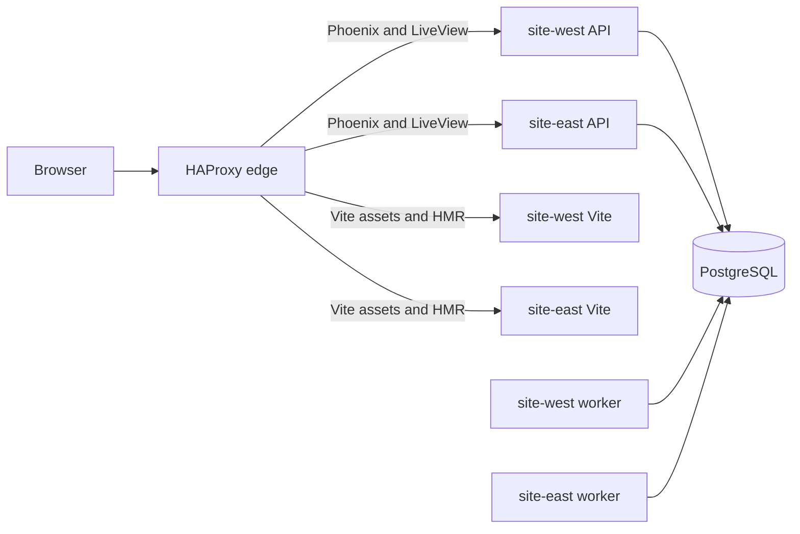

# Phase 1: Active-Active Edge Routing

Status: implemented. This phase changes the local Terraform-managed Docker
stack. It does not add Kubernetes, a proxy pair, or an automatic interrupted-job
recovery policy.

## Goal

Make both sites serve browser traffic through one loopback HAProxy edge. The
edge sends Phoenix, Vite assets, and Vite HMR traffic only to ready API nodes.
Workers stay private.

HAProxy is a local single point of failure. This is deliberate. A proxy pair
on one Docker host adds containers but not a failure domain.

## Topology Rules

- Replica `0` in each site has role `api`. It runs Phoenix and Vite. It keeps
  Oban available for enqueueing but disables workload queues.
- Replicas with an index greater than `0` have role `worker`. They run workload
  queues and have no browser route.
- Each site needs at least two replicas. The default has one API and one worker
  in each site.
- `primary_site` selects the setup container network only. It has no traffic or
  failover meaning.
- HAProxy attaches to every site network. It publishes the one loopback browser
  HTTP port.
- Only the primary site's API keeps the reserved debugger port. It stays outside
  HAProxy and has no current listener.
- Use Terraform-generated, site-qualified container names in HAProxy servers.
  Do not use `app-0`, because that DNS alias exists on more than one site
  network.
- HAProxy keeps separate Phoenix and Vite pools. A Vite failure must not remove
  the Phoenix API from its pool.
- Vite servers share dependency-cache and HMR client state. This keeps browser
  modules coherent while HAProxy routes Vite requests without affinity.
- HAProxy checks each Phoenix server at `/readyz`. This endpoint stays
  PostgreSQL-only. Redis and analysis failures must not remove the API server.
- HAProxy uses no affinity and makes no backend request retry. A request that
  fails after HAProxy selects a server returns an error to the browser.
- A planned API stop first removes new traffic from that API. The operator then
  closes its LiveView connections. Clients reconnect through HAProxy. Do not add
  a drain controller.

## Implementation Map

| Area | Files | Change |
|---|---|---|
| Role and topology validation | `infra/modules/common/deployment_config/variables.tf`, `infra/modules/common/deployment_config/locals.tf` | Change the per-site replica lower-bound validation from one to two. Keep the existing upper bound. Preserve the node map and setup use of `primary_site`. |
| App roles and ports | `infra/modules/local/app/locals.tf`, `infra/modules/local/app/main.tf`, `infra/modules/local/app/variables.tf` | Change the replica-zero role to `api` in every site. Publish no HTTP, metrics, or Vite port from app containers. Keep the separate debugger mapping on the primary API only. |
| Edge module | Add `infra/modules/local/haproxy/` with its variables, container, and generated configuration template. | Create one HAProxy container. Generate static site-qualified API servers from the fixed node map. Attach it to all site networks. Publish only the loopback browser HTTP port. |
| Root wiring | `infra/environments/local/main.tf`, `infra/environments/local/variables.tf`, `infra/environments/local/locals.tf`, `infra/environments/local/outputs.tf`, `infra/environments/local/local.auto.tfvars` | Instantiate HAProxy after app networking is available. Move the browser port ownership to the edge. Remove `metrics` and `assets` from the application host-port object and its uniqueness-check count. Keep `http` for the edge and `debugger` for the primary API. Make the application URL output point to HAProxy. |
| Runtime roles | `src/config/runtime.exs`, `src/lib/network_defense_web/telemetry.ex` | Disable Oban workload queues on every `api` node. Emit global queue depth from every `api` node when PostgreSQL is available. |
| Vite through the edge | `src/config/dev.exs`, `src/assets/vite.config.mjs` | Generate Vite asset URLs from the edge origin. Allow the edge origin in Vite CORS. Configure the HMR client to reconnect through the edge. Route the Vite client, modules, assets, and WebSocket upgrade path to the Vite pool. Verify the actual browser request paths before finalizing HAProxy ACLs. |
| Internal telemetry | `infra/modules/local/observability/config/site-collector.yaml.tftpl` and Grafana dashboard queries if they name the old role | Keep collector-to-app metrics scrapes on the site network. A collector can retain its `app-<index>` target because it joins one site network only. HAProxy must use site-qualified names because it joins every site network. Do not add a metrics host port. Aggregate replicated global `oban_queue_depth` values with `max`, never `sum`. |
| Design records | `planning/erlang-multisite-design-draft.md`, `planning/load-balancing-primer.md` | Replace the obsolete single-coordinator current-state text after the stack works. Keep the documented limits for Redis, PostgreSQL, HAProxy, and interrupted jobs. |

## HAProxy Contract

The generated HAProxy configuration must have these properties:

- A single HTTP frontend bound to the configured loopback browser port.
- A Phoenix backend pool that contains only `api` nodes on port `4000`.
- A Vite backend pool that contains only `api` nodes on port `5173`.
- PostgreSQL readiness checks in the Phoenix pool, using `/readyz`. Use a
  separate TCP check in the Vite pool so a failed watcher moves only Vite
  traffic.
- Vite route rules that match the requests observed from the browser, including
  the HMR WebSocket upgrade. The default Phoenix route remains in the Phoenix
  pool.
- Static backend entries derived from Terraform's fixed API-node set.
- Retry count set to zero. No request replay after a connection or response
  failure.
- No sticky cookie, source affinity, external service discovery, or dashboard.

## Availability Limits

| Condition | Expected behavior |
|---|---|
| One API fails | HAProxy removes it after the readiness check fails. New connections use the other API. Existing LiveViews reconnect. |
| One worker fails | Remaining workers can claim new available jobs. The final state of an interrupted job is not guaranteed. |
| One analysis service fails | Requests routed to its local API fail at analysis. That API stays ready. |
| Redis fails | APIs stay ready. Progress broadcasts can be lost. The system does not replay them. |
| PostgreSQL fails | APIs become unready. Durable state and Oban stop. |
| HAProxy fails | Browser traffic stops. The local model has no edge redundancy. |

## Completion Checks

1. Run Terraform formatting and validation. Apply the local stack with
   `infra/environments/local/terraform.sh`.
2. Check the application URL from Terraform outputs. Confirm that no app
   container exposes the browser, Vite, or metrics ports to the host.
3. Confirm that HAProxy has one Phoenix and one Vite server per site. Stop one
   API container. Wait for its HAProxy health check to fail. Confirm new HTTP
   requests use the other API.
4. Load the dashboard through HAProxy. Check the Vite client, JavaScript, CSS,
   and an HMR update through the same origin.
5. Confirm that site collectors still scrape app metrics internally. Confirm a
   Grafana queue-depth query uses `max` across API emitters.
6. Run `mix precommit` in `src`. Do not claim interrupted-job recovery until a
   separate policy and test define it.

## Sources

- [Load balancing and proxy decisions](load-balancing-primer.md)
- [Current multi-site design](erlang-multisite-design-draft.md)
- `infra/modules/local/app/main.tf` and `infra/modules/local/app/locals.tf`
- `infra/environments/local/main.tf` and `infra/environments/local/outputs.tf`
- `src/config/runtime.exs` and `src/lib/network_defense_web/telemetry.ex`
