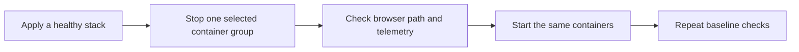

# Phase 2: Manual Failure Exercises

Status: completed. Repeat this runbook only after
[Phase 1](active-active-phase-1.md) passes its completion checks. This phase
adds no fault-injection framework, Kubernetes component, or automatic recovery
feature.

## Prerequisite Evidence

Before an exercise, confirm Phase 1 completion:

- Both API servers appear healthy in HAProxy.
- Both sites report BEAM membership series.
- The dashboard routes through HAProxy and survives an API restart.
- Analysis of a completed evaluation run succeeds and produces an
  `evaluation.analysis` trace span.

## Goal

Exercise the active-active local stack with manual Docker failures. Record what
continues to work and what remains undefined.

Use current Terraform outputs and `docker ps -a` to identify containers. Do not
put generated container names or host URLs into this document.

## Shared Rules

- Check the browser only through the HAProxy application URL from Terraform
  outputs. Do not call an API container directly.
- Use the site collectors and Prometheus to observe metrics. The app metrics
  port has no host publication.
- Stop selected containers with Docker. Restore them with Docker or reapply
  Terraform. Use the same method consistently for one exercise.
- Do not stop PostgreSQL, Redis, HAProxy, Grafana, Prometheus, Tempo, Loki,
  Alloy, cAdvisor, node-exporter, postgres-exporter, or pgAdmin.
- Record the target, start time, request result, telemetry result, and recovery
  result for every exercise.
- Use `docker logs` to inspect HAProxy health transitions. HAProxy does not
  send these logs to Loki.
- Wait for HAProxy health checks before declaring a routing result.

## Baseline Gate

Run these as commands against the running stack:

1. Apply the local stack with `infra/environments/local/terraform.sh`.
2. Check that the setup container exited successfully and long-running
   containers are healthy.
3. Get the application URL from Terraform output. Check its `/readyz` response
   through HAProxy.
4. Check that both API servers are healthy in HAProxy and have `UP` entries in
   its health-transition log.
5. Check that each site collector can scrape its API and worker metrics.
6. Confirm the prerequisite evidence from Phase 1 holds before you inject any
   failure.
7. Start a harmless workload only when an exercise needs a running job. Record
   its identifier before you inject the failure.

For every exercise, route proof comes from two independent signals:
HAProxy `UP` or `DOWN` health-transition logs in the Phoenix backend and a
surviving API trace for the browser request. Membership change is observed in
the stopped replica's own labelled metric series: the aggregate site value can
stay flat even though that replica's series disappears.

## Exercises

| Exercise | Stop target | Expected result | Recovery gate |
|---|---|---|---|
| API loss | Replica `0` in one site | HAProxy removes the failed API after its readiness check. New browser connections use the other API. Existing LiveViews close and reconnect. | The restored API becomes healthy in HAProxy and returns through the edge. |
| Worker loss | One replica with index greater than `0` while it runs a workload | The worker stops. Other workers can claim new available work. This plan makes no claim for an interrupted job. | The worker is healthy again. A later workload completes. Queue depth is not a recovery gate here. |
| Whole-site loss | The selected site's API, workers, analysis service, and collector | HAProxy sends new browser connections to the other site. The surviving site's workers continue to claim new available work. The failed site's local analysis and telemetry disappear. | All selected containers return. HAProxy and the site's collector show healthy targets. |
| Analysis loss | One site's analysis service | A request served by that site's API fails at analysis. The API stays ready. Requests served by the other site can still succeed. | A new request through the restored local analysis service succeeds. |

For analysis loss, analysis runs only on a completed evaluation run; a
simulation does not invoke it. Correlate the request with its `run_id`: the
matching app log line `evaluation.analysis.failed` and the OTel span named
`evaluation.analysis` (carrying `evaluation.run_id`) prove where it failed.
HAProxy can choose either API, so one browser request is not a deterministic
test of a one-site analysis failure.

## Observation Gates

| Signal | Check | Meaning |
|---|---|---|
| Browser path | Request the HAProxy application URL and reload the dashboard. | New user traffic still has a ready API path. |
| HAProxy health | Inspect the API backend state in the health-transition log after the health-check interval. | The edge removes only the unavailable API. |
| API readiness | Request `/readyz` through HAProxy. | PostgreSQL-backed API availability remains. |
| App membership | Query the stopped replica's BEAM membership series (with site and replica labels). | The stopped app container no longer reports; the aggregate site value can stay unchanged. |
| Analysis errors | Inspect `evaluation.analysis.failed` in the app log and the matching `evaluation.analysis` trace span for the correlated `run_id`. | A local analysis failure remains local to its API request. |
| Collector targets | Inspect the site collector target status. | Site telemetry loss is visible without a host metrics port. |

## Boundaries

- A PostgreSQL failure stops readiness, durable state, and Oban. It is outside
  these exercises.
- A Redis failure can lose progress events. The system does not replay them.
- HAProxy failure stops browser traffic in this one-host model.
- This phase does not define the recovery state of a job interrupted by worker
  or site loss. Record the result. Do not treat it as a pass or fail criterion.

## Sources

- [Phase 1 edge-routing plan](active-active-phase-1.md)
- [Load balancing and proxy decisions](load-balancing-primer.md)
- `infra/modules/local/app/main.tf`
- `infra/modules/local/observability/config/site-collector.yaml.tftpl`
- `src/lib/network_defense_web/controllers/health_controller.ex`
- `src/lib/network_defense/evaluation/analysis_client.ex`
- `src/lib/network_defense_web/telemetry.ex`

## Execution Record (UTC 2026-09-02)

All times UTC. Targets named logically; no generated container names or host URLs.

| Exercise | Target | Start (UTC) | Request result | Telemetry result | Recovery result |
|---|---|---|---|---|---|
| API loss | API replica 0, site-east | 04:09:18 | `/readyz` 200 via edge while target down; HAProxy marked target DOWN | `beam_cluster_nodes` series for the target absent; survivors present | Restarted target; HAProxy UP after three successful Layer7 checks; series returned |
| Worker loss | Worker replica 1, site-east | 04:13:28 | Queued workload claimed by a surviving worker; both queued jobs completed before the stop | No job was interrupted, so no interrupted-job telemetry result exists | Worker restored healthy; later queued job completed |
| Whole-site loss | API, worker, analysis, collector of site-east | 04:15:43 | `/readyz` 200 via edge; HAProxy marked site-east API DOWN; surviving site worker completed a queued job | Site-east `beam_cluster_nodes` series and collector target disappeared; site-west stayed up | All four targets returned healthy; HAProxy UP; site-east series and collector target recovered |
| Analysis loss | Analysis service, site-east | 04:32:34 | Analysis of a completed run via the site-east app returned `transport` error; `evaluation.analysis.failed` logged with the run_id | Failure correlated by `evaluation.run_id` in the `evaluation.analysis` span | Service restored; a new analysis of the same run completed |

Interrupted-job outcome: the worker-loss workload was claimed and completed by a
surviving worker before the selected worker stopped, so no job was interrupted.
This phase makes no claim about the state of an interrupted job; none occurred.

Command outcomes: Terraform helper `validate` passed; setup container exited 0;
all long-running containers healthy; both site collectors and all app membership
series present; `/readyz` returned 200 after every exercise; the dashboard
reloaded through HAProxy after recovery.
