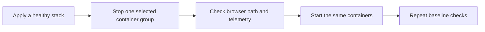

# Phase 2: Manual Failure Exercises

Status: implementation plan. Start this phase only after
[Phase 1](active-active-phase-1.md) passes its completion checks. This phase
adds no fault-injection framework, Kubernetes component, or automatic recovery
feature.

## Goal

Exercise the active-active local stack with manual Docker failures. Record what
continues to work and what remains undefined.

Use current Terraform outputs and `docker ps -a` to identify containers. Do not
put generated container names or host URLs into this document.

## Shared Rules

- Check the browser only through the HAProxy application URL from Terraform
  outputs. Do not call an API container directly.
- Use the site collectors and Prometheus to observe metrics. The app metrics
  port has no host publication.
- Stop selected containers with Docker. Restore them with Docker or reapply
  Terraform. Use the same method consistently for one exercise.
- Do not stop PostgreSQL, Redis, HAProxy, Grafana, Prometheus, Tempo, Loki,
  Alloy, cAdvisor, node-exporter, postgres-exporter, or pgAdmin.
- Record the target, start time, request result, telemetry result, and recovery
  result for every exercise.
- Wait for HAProxy health checks before declaring a routing result.

## Baseline Gate

1. Apply the local stack with `infra/environments/local/terraform.sh`.
2. Check that the setup container exited successfully and long-running
   containers are healthy.
3. Get the application URL from Terraform output. Check its `/readyz` response
   through HAProxy.
4. Check that both API servers are healthy in HAProxy.
5. Check that each site collector can scrape its API and worker metrics.
6. Start a harmless workload only when an exercise needs a running job. Record
   its identifier before you inject the failure.

## Exercises

| Exercise | Stop target | Expected result | Recovery gate |
|---|---|---|---|
| API loss | Replica `0` in one site | HAProxy removes the failed API after its readiness check. New browser connections use the other API. Existing LiveViews close and reconnect. | The restored API becomes healthy in HAProxy and returns through the edge. |
| Worker loss | One replica with index greater than `0` while it runs a workload | The worker stops. Other workers can claim new available work. This plan makes no claim for an interrupted job. | The worker is healthy again. Queue depth and later work return to baseline behavior. |
| Whole-site loss | The selected site's API, workers, analysis service, and collector | HAProxy sends new browser connections to the other site. The surviving site's workers continue to claim new available work. The failed site's local analysis and telemetry disappear. | All selected containers return. HAProxy and the site's collector show healthy targets. |
| Analysis loss | One site's analysis service | A request served by that site's API fails at analysis. The API stays ready. Requests served by the other site can still succeed. | A new request through the restored local analysis service succeeds. |

For analysis loss, correlate the request with the selected API's application log
or trace. HAProxy can choose either API, so one browser request is not a
deterministic test of a one-site analysis failure.

## Observation Gates

| Signal | Check | Meaning |
|---|---|---|
| Browser path | Request the HAProxy application URL and reload the dashboard. | New user traffic still has a ready API path. |
| HAProxy health | Inspect the API backend state after the health-check interval. | The edge removes only the unavailable API. |
| API readiness | Request `/readyz` through HAProxy. | PostgreSQL-backed API availability remains. |
| Queue depth | Query `oban_queue_depth` in Grafana or Prometheus. Use `max` across API emitters. | Global queue state is not double-counted. |
| App membership | Query the existing BEAM membership metric with site labels. | The stopped app containers no longer report. |
| Analysis errors | Inspect the analysis failure log and trace for the correlated request. | A local analysis failure remains local to its API request. |
| Collector targets | Inspect the site collector target status. | Site telemetry loss is visible without a host metrics port. |

## Boundaries

- A PostgreSQL failure stops readiness, durable state, and Oban. It is outside
  these exercises.
- A Redis failure can lose progress events. The system does not replay them.
- HAProxy failure stops browser traffic in this one-host model.
- This phase does not define the recovery state of a job interrupted by worker
  or site loss. Record the result. Do not treat it as a pass or fail criterion.

## Sources

- [Phase 1 edge-routing plan](active-active-phase-1.md)
- [Load balancing and proxy decisions](load-balancing-primer.md)
- `infra/modules/local/app/main.tf`
- `infra/modules/local/observability/config/site-collector.yaml.tftpl`
- `src/lib/network_defense_web/controllers/health_controller.ex`
- `src/lib/network_defense/evaluation/analysis_client.ex`
- `src/lib/network_defense_web/telemetry.ex`
