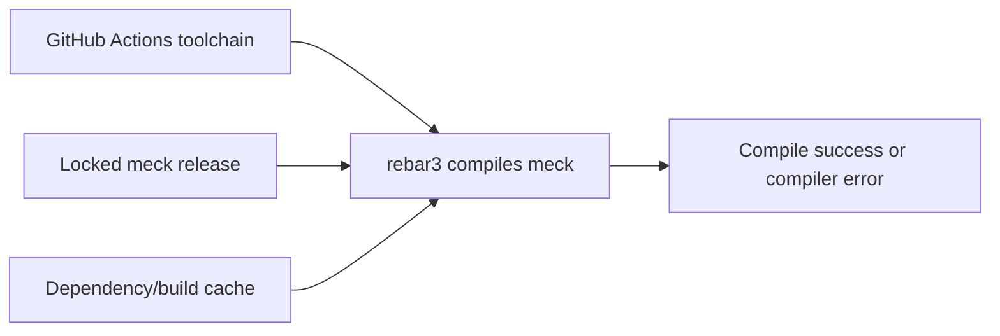

# CI meck compilation failure

## Issue

GitHub Actions cannot compile the `:meck` test dependency under its selected Elixir/OTP toolchain. Local checks pass.

## Hypothesis evaluation

```text
CI dependency compile failure
├─ H1 Cached build artifact is incompatible
├─ H2 Locked meck version does not support OTP 29
├─ H3 CI selects an unintended Elixir/OTP version
└─ H4 Rebar compilation lacks a required CI package or flag
```

## Causal path



## Evidence

### Facts

- CI run `36248472857` used Elixir 1.20.2 with OTP 29.0.3.
- The Format job compiled dependencies before `mix format`.
- `meck` 0.9.2 failed in `src/meck_matcher.erl` because OTP 29 reports bare `catch` as a deprecated compiler warning.
- The dependency treats that warning as a compile failure.
- The project locks `meck` 0.9.2 through the `~> 0.9` constraint.
- Local verification uses OTP 27, so it does not reproduce the OTP 29 warning.
- `meck` 1.1.1 replaced the bare catch for OTP 29. `meck` 1.2.0 adds official OTP 29 support.

### H1: incompatible cache artifact

**Prediction:** A cache problem would fail before or without a deterministic source compiler diagnostic.

**Observation:** Rebar compiled `src/meck_matcher.erl` and emitted the same OTP 29 deprecation diagnostic from locked source.

**Conclusion:** Contradicted. Cleaning or force-compiling 0.9.2 would reproduce the failure.

### H2: locked meck version does not support OTP 29

**Prediction:** The locked source contains bare `catch`, and a later release documents an OTP 29 fix.

**Observation:** Version 0.9.2 failed on bare `catch`. The 1.1.1 changelog records its replacement, and 1.2.0 declares OTP 29 support.

**Conclusion:** Supported. Update the direct test dependency to `~> 1.2`.

### H3: CI selects an unintended toolchain

**Prediction:** If CI drifted, the workflow would specify a different OTP version.

**Observation:** The workflow explicitly pins OTP 29.0.3 and Elixir 1.20.2.

**Conclusion:** Contradicted. The dependency must match the intentional CI toolchain.

### H4: missing package or compiler flag

**Prediction:** Missing system input would produce a missing-header, missing-command, or link error.

**Observation:** Rebar reached Erlang source compilation and failed only on the deprecated syntax warning.

**Conclusion:** Contradicted.

## Conclusion

`meck` 0.9.2 is incompatible with the repository's pinned OTP 29 CI toolchain. Upgrade to `meck` 1.2.x. Do not clean caches or suppress the compiler warning.

## Resolution

- Changed the test dependency constraint from `~> 0.9` to `~> 1.2`.
- Updated only the `meck` lock entry, from 0.9.2 to 1.2.0.
- Cleaned and force-compiled `meck` successfully.
- Confirmed 1.2.0 uses `try/catch` at the failing matcher location.

## Verification

- Focused tests that use `:meck`: passed.
- Full backend suite: 600 passed, 2 excluded.
- Elixir format: passed.
- Compile with warnings as errors: passed.
- Credo: 395 files, 92 checks, no issues.
- Unused dependency unlock check: lock remained unchanged.
- Diff whitespace check: passed.

The exact OTP 29 result requires the GitHub runner. Local Erlang is OTP 27, but the upgraded source removes the failing syntax and upstream declares official OTP 29 support.
