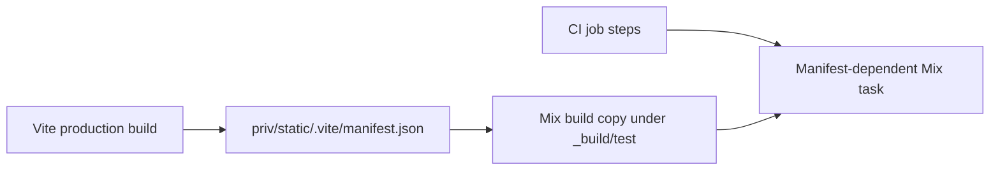

# CI missing Vite manifest

## Issue

A GitHub Actions job reads `_build/test/lib/network_defense/priv/static/.vite/manifest.json` before that file exists.

## Hypothesis evaluation

```text
Missing test-build Vite manifest
├─ H1 Asset build step is absent or ordered too late
├─ H2 Mix task should not require the manifest
├─ H3 Cache restored an inconsistent build tree
└─ H4 Manifest output path differs from the application lookup path
```

## Causal path



## Evidence

### Facts

- CI run `36251715243` passed Format and Type Check, then failed in the Test job.
- Dashboard LiveView tests render `root.html.heex`.
- The root layout calls `PhoenixVite.Components.assets/1` with the application manifest path.
- In test, no Vite watcher is configured, so PhoenixVite reads the static manifest.
- The Test job restored Mix caches and ran `mix test` without Node setup, `npm ci`, or an asset build.
- The Type Check job ran `mix assets.build`, but GitHub jobs do not share workspaces. Its generated manifest was not available to Test.
- The manifest is ignored build output and must not be committed.

### H1: asset build is absent or ordered too late

**Prediction:** The Test job has no step that creates the manifest before `mix test`.

**Observation:** The job ran only checkout, BEAM setup, cache restore, `mix deps.get`, and `mix test`.

**Conclusion:** Supported. Build assets explicitly in the Test job.

### H2: Mix tests should not require a manifest

**Prediction:** If tests bypass assets, the root layout would use the dev-server branch or omit asset tags.

**Observation:** Tests exercise full LiveView rendering. The root layout selects the manifest branch when no Vite watcher exists.

**Conclusion:** Contradicted for the current integration-test design. A real manifest keeps test rendering aligned with production HTML.

### H3: cache restored an inconsistent build tree

**Prediction:** A cache hit can contain compiled application files without ignored Vite output.

**Observation:** The Mix cache does not guarantee generated frontend files, and the first cache-writing job does not build assets.

**Conclusion:** Supported as the trigger, but not the root fix. Tests must not depend on cached generated assets.

### H4: output path differs from lookup path

**Prediction:** A local `mix assets.build` would write elsewhere.

**Observation:** Local builds create `priv/static/.vite/manifest.json`, and the `_build/test` application path resolves to that private directory.

**Conclusion:** Contradicted.

## Conclusion

The Test job must install Node dependencies and run `mix assets.build` before `mix test`. Do not commit generated manifests and do not rely on cross-job caches.

## Resolution

Added Node 22 setup, `npm ci`, and `mix assets.build` to the Test job before `mix test`.

## Verification

- Removed the local generated manifest.
- `npm ci`: passed.
- `mix assets.build`: passed and recreated `priv/static/.vite/manifest.json`.
- Full backend suite: 600 passed, 2 excluded.
- Workflow YAML parse: passed.
- Elixir format: passed.
- Diff whitespace check: passed.

The generated manifest remains ignored and uncommitted.
