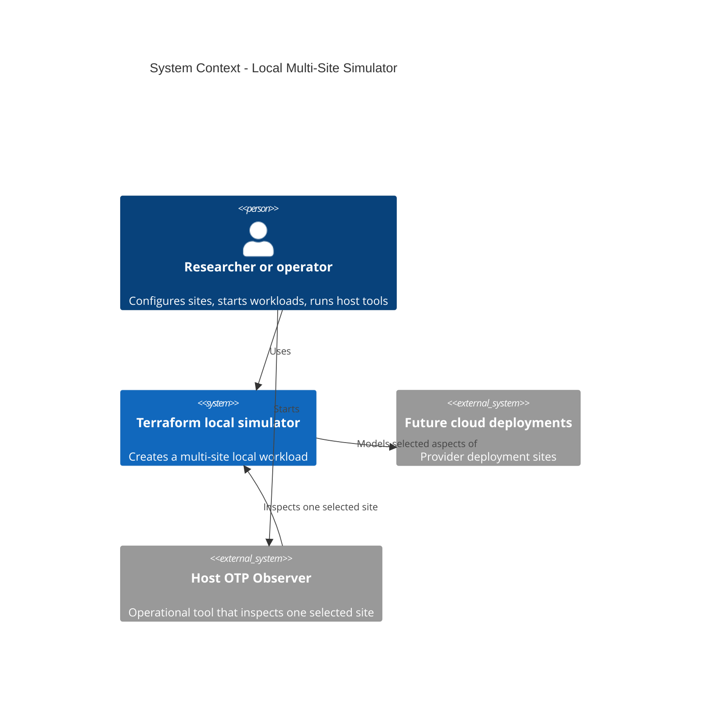
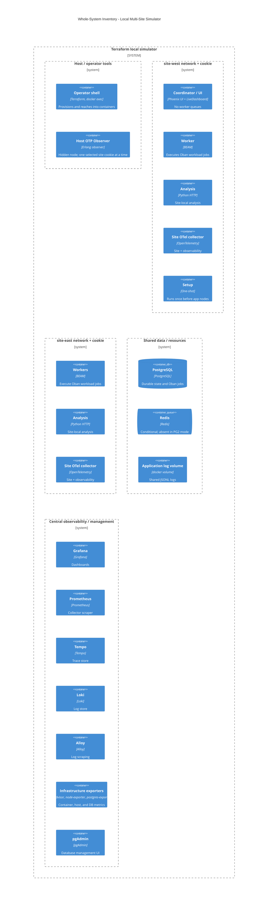
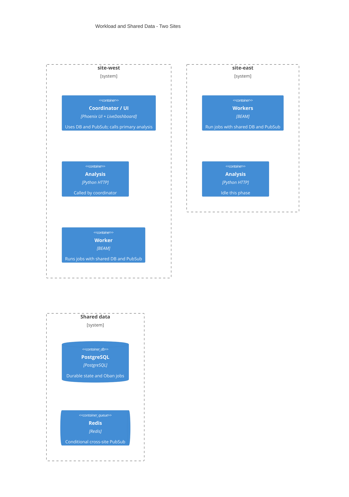
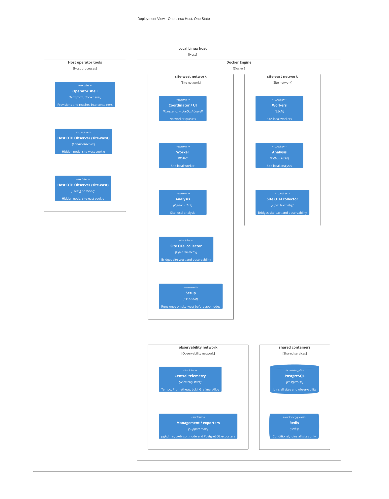
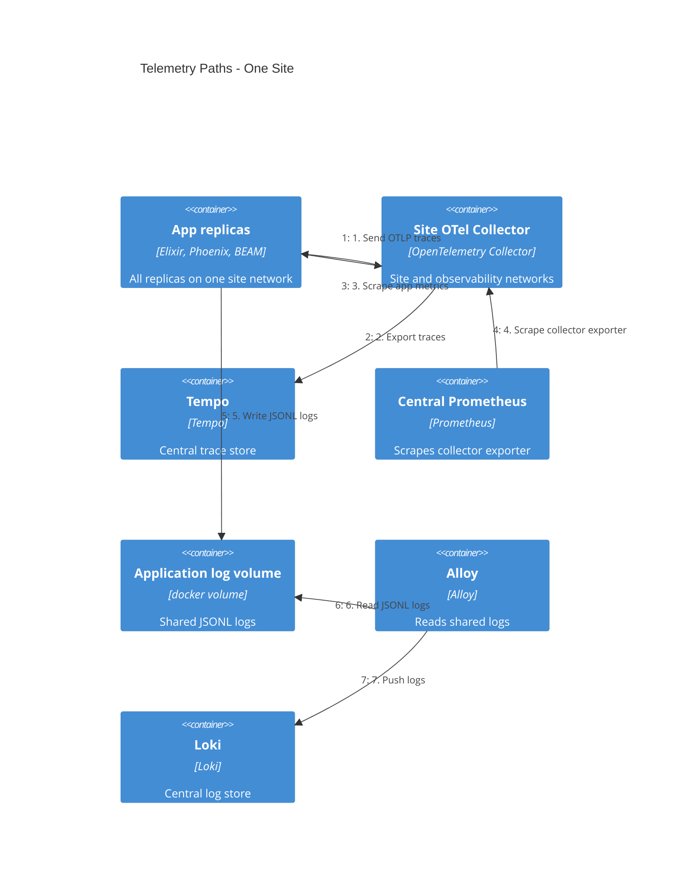
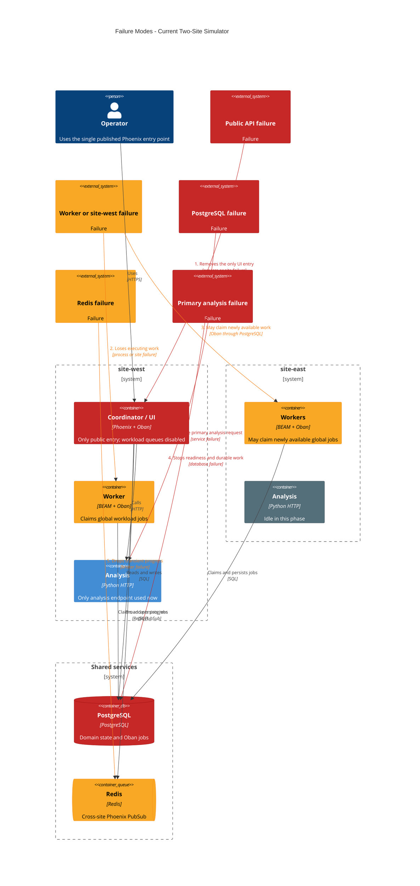

# Local multi-site BEAM design draft

Status: historical design draft. Phase 1 implements the active-active model in
`active-active-phase-1.md`. The remaining coordinator-specific sections record
the design that Phase 1 replaced.

Execution states: [`erlang-multisite-tasks/README.md`](erlang-multisite-tasks/README.md).

## Purpose

This design uses a local Docker environment to exercise and simulate selected
aspects of a multi-cloud, multi-site deployment. It lets a developer run
isolated BEAM sites, shared services, distributed workload coordination, and
central observability on one machine. This makes it possible to test the
system's distributed behavior before cloud infrastructure exists.

The simulator approximates site boundaries, identities, network attachment,
clustering, and failure blast radius. It does not reproduce cloud control
planes, managed-service behavior, IAM, quotas, WAN behavior, or every
provider-specific failure. It is a practical starting point, not a replacement
for tests on real multi-cloud infrastructure.

The design also defines provider-neutral deployment configuration and maps it
to local Docker resources. This reduces configuration drift, keeps secret
values out of Terraform state, and preserves a usable local development
workflow.

## Current Phase 1 Design

HAProxy is the only loopback browser entry. It joins both site networks and
routes Phoenix, Vite assets, and Vite HMR connections to either ready API node.
Replica `0` in each site is an API node. All other replicas are workers. The
primary site selects the one-shot setup network only.

API nodes do not run workload queues. Workers have no browser route. API
readiness checks PostgreSQL only. Redis and analysis failures can fail their
own work, but do not remove an API from HAProxy. Vite servers use common client
state so the edge can route without affinity.

Each collector keeps its internal site-local app scrape. Each API reports the
same global Oban queue depth. Grafana uses `max` for that replicated gauge.

## Historical Design

One local Terraform state creates isolated site networks, shared data services,
and one central observability network. The app and analysis aggregate modules
build their images once. The app module creates all site nodes. The analysis
module creates one internal-only analysis container per site. Each analysis
container has the alias `analysis` on its site network.

## Analysis service runtime behavior

Each site has one health-checked analysis container. Only the primary UI and
coordinator initiates analysis in this phase. The dashboard LiveView runs only
on the primary site's replica 0, which is the only node with a published port
and the only web entry point. That node POSTs the archive to its configured
`ANALYSIS_SERVICE_URL`. That URL uses the site-local `analysis` alias, so the
call always reaches the primary site's analysis container. Non-primary analysis
containers receive no application traffic in this phase. They exist to rehearse
per-site deployment and the local DNS contract; their health checks are the only
current acceptance.

The `ANALYSIS_SERVICE_URL` is derived: `http://analysis:8080`. The app module
never exposes a URL output for it. The analysis module instead outputs one
response-size value. The root maps that value to the app input
`ANALYSIS_SERVICE_MAX_ZIP_BYTES` and the service container gets the same value
as `NETWORK_DEFENSE_ANALYSIS_MAX_RESPONSE_BYTES`. This keeps the response-size
contract in sync. Request and extraction limits stay separate module-owned
constants.

No analysis Oban job, cross-site proxy, second UI, routing metadata, or result
workflow exists now. Routed and distributed analysis moves to the later
workload-routing and map-reduce phase. That future phase chooses the execution
site, has the chosen worker call its site-local `analysis` alias, persists the
result in PostgreSQL, and broadcasts progress through Redis.

This local simulator intentionally supports dev mode only, per the user's
decision. The design removes the local module's production-image and migrate
branch. It uses one setup container with the current dev command:
`mix deps.get && mix ecto.migrate && mix run priv/repo/seeds.exs`. The setup
container joins only the primary site network and runs once, and all app nodes
wait for it. The setup environment does not require the analysis service because
the setup command does not call it. The setup container is a one-shot
`attach=true`, `must_run=false` container; it has no `wait=true`. A lifecycle
postcondition checks `self.exit_code == 0`. The app nodes depend on the setup
container and therefore start only after it exits successfully. No
`local-exec` resource and no `terraform_data` resource orchestrates setup.

Each app node has one site-network attachment. `app` is an alias on that site
network only. DNSCluster therefore forms one BEAM mesh per site. Redis, when
selected, bridges Phoenix PubSub between sites. PostgreSQL and Oban remain the
durable work path.

## Architecture views

The C4 views below describe the local multi-site simulator from four angles:
system context, whole-system inventory, workload and shared data, and
deployment placement. A fifth dynamic view shows the telemetry paths. The
whole-system, workload, and deployment views are relationship-free inventories.
They show what exists and where it attaches. The context and telemetry views
carry relationships. This simulator models
selected aspects of a multi-cloud deployment on one Docker host; it does not
reproduce cloud control planes, managed-service behavior, IAM, quotas, or WAN
behavior.

### System context

The context view shows the researcher or operator, the future cloud deployments
the simulator models, and the host operational tool.



### Whole-system view

This view is the accepted inventory of every component, grouped by placement.
It draws no relationship arrows. It shows the complete set and its groupings;
the workload, deployment, and telemetry views describe behavior and placement.



### Workload and shared data

This relationship-free view focuses on application roles and shared data. It
omits the OTel collectors, observability stack, and setup container; the
whole-system and deployment views carry those. The coordinator uses PostgreSQL
and Redis and calls the site-west analysis service. Workers use PostgreSQL and
Redis. The site-east analysis service is intentionally idle in this phase.



### Deployment placement

This view shows one local Linux host, the host operator tools, and the Docker
Engine with its networks and shared containers. It is relationship-free: it
shows placement only, and the telemetry view carries the flow paths. The two
host Observer processes are separate and optional; each uses only its site
cookie, and they can run concurrently.



### Telemetry paths

This dynamic view shows one site's telemetry flow. App replicas push traces to
their site collector, the collector scrapes app metrics, and the central
Prometheus scrapes the collector exporter. The app writes JSONL logs to the
shared volume, Alloy reads them, and Alloy pushes them to Loki.



### Failure-mode overlay

This C4 overlay shows the current simulator's failure behavior. Red marks a
service-stopping single point of failure. Amber marks degraded behavior or
lost transient progress. Gray marks a component that receives no application
traffic in this phase.



## Network contract

| Container group | Attachments |
|---|---|
| App replica and analysis container | Exactly one site network. Each analysis container has the alias `analysis` on that site network. No analysis host ports. Only the primary site's replica 0 publishes the dev browser and debug ports on loopback. |
| Setup container | Exactly one primary site network. Runs once before all app nodes. |
| Site collector | Exactly its site network and the root observability network. It publishes no host ports. |
| PostgreSQL | Root observability network and every site network. |
| Redis | Every site network only. It has no host ports, does not join observability, and mounts `/data` as tmpfs so no persistent volume exists. |
| Tempo, Prometheus, Loki, Grafana, Alloy, cAdvisor, node-exporter, postgres-exporter | Root observability network only. |
| postgres-exporter init container | Root observability network only. |
| pgAdmin | Root observability network only. |

The root owns `docker_volume.application_logs`. It passes that volume name to
the app and observability modules. The analysis module does not receive it. No
module output named `module.app.logs` exists or is introduced.

### Collector decision

Per-site collectors replace the current single central `otel_collector`
container. The observability module removes that container and its loopback host
ports 4317, 4318, 8888, and 8889. Site collectors publish no host ports.

Apps reach their site collector through the site-local alias `otel-collector`.
The central Prometheus reaches each site collector through the observability
alias `otel-collector-<site>`.

Why: each site collector stays close to its replicas, reads only its own site
network, and needs no shared host ports. This removes the central collector's
four host-port collisions and keeps one collector per site. The central
`otel-collector-config.yaml` is deleted and replaced by the per-site template
`site-collector.yaml.tftpl`, not edited.

## Terraform shape

```text
infra/
├── deployments/
│   └── thesis-lab.tfvars                # provider-neutral common config; checked in; no defaults
├── environments/local/
│   ├── main.tf                         # root networks, application_logs, aggregate modules, root check
│   ├── locals.tf                       # deployment-derived site/node maps, environment, required secret names
│   ├── variables.tf                    # common deployment variable plus one object variable per component; no defaults
│   ├── local.auto.tfvars               # provider-specific local config; checked in; no defaults
│   ├── outputs.tf                      # per-site node-name map and derived host-URL outputs
│   ├── terraform.sh                    # supplies the absolute -var-file path; no .env handling
│   └── secrets/
│       ├── postgres-password           # existing; app, PostgreSQL, and pgAdmin
│       ├── secret-key-base              # existing; app
│       ├── live-view-signing-salt       # existing; app
│       ├── grafana-admin-password       # existing; Grafana
│       ├── pgadmin-password             # existing; pgAdmin
│       ├── postgres-exporter-password   # existing; postgres-exporter
│       ├── redis-password               # Redis mode only; Redis and app
│       └── erlang-cookies/
│           ├── site-west/
│           │   └── .erlang.cookie       # app nodes and host Observer for site-west only
│           └── site-east/
│               └── .erlang.cookie       # app nodes and host Observer for site-east only
├── modules/common/
│   └── deployment_config/               # provider-free; object type, validations, normalized config, site and node maps
└── modules/local/
    ├── app/                             # one image build; setup; all app nodes
    ├── analysis/                        # one image build; one internal container per site
    ├── database/                        # PostgreSQL and pgAdmin attached to all required networks
    ├── redis/                           # conditional Redis attached only to site networks
    └── observability/                   # central stack and one collector per site
```

Terraform does not auto-load the sibling `infra/deployments/thesis-lab.tfvars`
file. The local wrapper `terraform.sh` explicitly supplies its absolute
`-var-file` path for every variable-consuming command. `local.auto.tfvars`
auto-loads because Terraform loads `*.auto.tfvars` from the working directory.
The plan removes `.env` and `.env.example` from the planned local flow. The
wrapper has no `.env` check and no `--env-file` argument. No manifest selector
and no environment-variable validation or allowlist is added.

### Common manifest

The provider-neutral common config is one checked-in fixed manifest. It defines
one `deployment` object and has no defaults. It uses the deployment object's own
variable name, so no root variables file declares `sites`, `primary_site`, or
`pubsub_adapter`.

```hcl
# infra/deployments/thesis-lab.tfvars
deployment = {
  name = "network-defense-local"
  network = { sites = {
    site-west = { provider = "provider-a", region = "region-west", instance = "class-medium" }
    site-east = { provider = "provider-b", region = "region-east", instance = "class-medium" }
  }}
  application = {
    service_name = "network-defense"
    primary_site = "site-west"
    replicas = { site-west = 2, site-east = 2 }
  }
  pubsub = { adapter = "redis" }
  database = { name = "network_defense_dev", user = "postgres" }
}
```

The `provider`, `region`, and `instance` values are example labels. They
illustrate shape. The plan retains the selected default two-site and two-node
topology and the existing labels. `network` is reusable and provider-neutral.
It owns site identity and the required fixed label fields `provider`,
`region`, and `instance`. These fields are labels only. They never drive
provider placement. `application` owns the primary site and the replica
counts. The replica keys must exactly equal the network site keys.

Changing `deployment.name` causes an accepted clean resource rename and rebuild.
Terraform drops and recreates the resources whose names embed the prefix, such
as networks, volumes, and containers. The plan keeps clean rebuilds and does not
migrate Terraform state.

Provider-specific config cannot override common fields. A different common
intent requires another deployment manifest. The wrapper loads one fixed
manifest; add a selector only if a second deployment exists.

### Deployment config module

`infra/modules/common/deployment_config` is a provider-free module. It creates
no resources. It owns the shared object type, the validations, the normalized
config, the site map, and the node map. Provider roots pass `var.deployment` and
consume named outputs. No consumer receives a bare module object. The named
outputs are `config`, `sites`, `nodes`, `application`, `pubsub`, and `database`.
This prevents schema and validation duplication.

The module validates the deployment and site keys as DNS-label-safe names where
relevant. It validates the application service name the same way. The database
identity fields get nonempty and PostgreSQL-identifier checks. The label fields
get nonempty checks. The module validates at least one site, 1-5 replicas per
site, at least two replicas total, that the primary site exists, that the
application replica keys exactly equal the network site keys, and that the
pubsub adapter is exactly `redis` or `pg2`.

```hcl
# infra/modules/common/deployment_config/main.tf pseudocode
variable "deployment" {
  type = object({
    name        = string
    network     = object({ sites = map(object({
      provider = string
      region   = string
      instance = string
    })) })
    application = object({
      service_name = string
      primary_site = string
      replicas     = map(number)
    })
    pubsub   = object({ adapter = string })
    database = object({ name = string, user = string })
  })
}

locals {
  sites = var.deployment.network.sites
  nodes = merge([
    for site_key, site in var.deployment.network.sites : {
      for idx in range(var.deployment.application.replicas[site_key]) :
      "node-${site_key}-${idx}" => { site = site_key, index = idx }
    }
  ]...)
}

variable "check" {
  # Repeated DNS-label-safe-name, nonempty, and numeric-range validations.
  # See the validation list below.
}

output "config"       { value = var.deployment }
output "sites"        { value = local.sites }
output "nodes"        { value = local.nodes }
output "application"  { value = var.deployment.application }
output "pubsub"       { value = var.deployment.pubsub }
output "database"     { value = var.deployment.database }
```

The full validation set, expressed as Terraform `validation` blocks on
`var.deployment`:

- `deployment.name` is a valid DNS-label-safe name and nonempty.
- Each site key is a valid DNS-label-safe name.
- `application.service_name` is a valid DNS-label-safe name and nonempty.
- `length(keys(network.sites)) >= 1`.
- Each site's `provider`, `region`, and `instance` is nonempty.
- Each `replicas` value is between 1 and 5.
- `sum(values(application.replicas)) >= 2`.
- `primary_site` is a key of `network.sites`.
- `keys(application.replicas)` exactly equals `keys(network.sites)`.
- `pubsub.adapter` is exactly `redis` or `pg2`.
- `database.name` and `database.user` are nonempty and valid PostgreSQL
  identifiers (start with a letter or underscore, then letters, digits, or
  underscores).

### Provider-specific local config

Provider-specific config lives in one checked-in file,
`infra/environments/local/local.auto.tfvars`. It uses one top-level Terraform
object variable per component. It has no defaults. It cannot override common
fields.

```hcl
# infra/environments/local/local.auto.tfvars
application = { host = "localhost", log_level = "debug", host_ports = { http=4000, metrics=4001, assets=5173, debugger=9229 } }
database = { host_port=5433 }
grafana = { host_port=3000, admin_user="admin" }
pgadmin = { host_port=5050, admin_email="admin@example.test" }
prometheus = { host_port=9090 }
secrets = { directory="./secrets" }
```

These values are examples and current-equivalent. All host ports must be
1-65535 and pairwise unique. The bind address stays fixed to loopback. Only
app, PostgreSQL, Grafana, pgAdmin, and Prometheus are host entry points. The
`application` object exposes all four primary-node host ports (`http`,
`metrics`, `assets`, `debugger`). Analysis, Redis, Loki, Tempo, Alloy,
exporters, cAdvisor, node-exporter, and per-site collectors have no host port.

The root `variables.tf` declares one object variable per component with no
defaults. The root validates every host port range and pairwise uniqueness.
The root uses a `check` block for host-port validation, because a `validation`
block cannot compare values across separate variables. The `application.host_ports`
object has the exact fields `http`, `metrics`, `assets`, and `debugger`, each a
number.

```hcl
# environments/local/variables.tf pseudocode
variable "application" {
  type = object({
    host       = string
    log_level  = string
    host_ports = object({
      http     = number
      metrics  = number
      assets   = number
      debugger = number
    })
  })
}
variable "database"   { type = object({ host_port = number }) }
variable "grafana"    { type = object({ host_port = number, admin_user = string }) }
variable "pgadmin"    { type = object({ host_port = number, admin_email = string }) }
variable "prometheus" { type = object({ host_port = number }) }
variable "secrets"    { type = object({ directory = string }) }

locals {
  all_host_ports = [
    var.application.host_ports.http,
    var.application.host_ports.metrics,
    var.application.host_ports.assets,
    var.application.host_ports.debugger,
    var.database.host_port,
    var.grafana.host_port,
    var.pgadmin.host_port,
    var.prometheus.host_port
  ]
}

check "host_ports_valid" {
  assert {
    condition     = alltrue([for p in local.all_host_ports : p >= 1 && p <= 65535])
    error_message = "Every host entry port must be between 1 and 65535."
  }
  assert {
    condition     = length(local.all_host_ports) == length(distinct(local.all_host_ports))
    error_message = "All eight host entry ports must be pairwise unique."
  }
}
```

The eight host ports are the four `application.host_ports` values (`http`,
`metrics`, `assets`, `debugger`) plus the `database`, `grafana`, `pgadmin`,
and `prometheus` host ports. Every one must be 1-65535, and all eight must be
pairwise unique.

State 01 declares and validates all eight fields but keeps each value equal to
the unchanged legacy module binding. This makes its derived outputs truthful
without moving module changes forward. State 04 activates the database and
pgAdmin fields, State 05 activates the app fields, and State 07 activates the
Grafana and Prometheus fields. State 02 removes the remaining legacy
observability host ports before State 07 restores only the final approved
entries.

### Environment and secret handling

Terraform maps tfvars through variables and locals to app-specific container
environment variables and secret file mounts. Terraform passes paths, never
secret contents. Provider-specific wrappers own process settings and
credentials. No environment-variable validation or allowlist is added. Secret
values remain files.

The root computes `local.secret_mount_path = abspath(var.secrets.directory)`
before any precondition and before any mount. The secrets path is therefore an
absolute host path for the `docker_volume` host mounts and the
`fileexists` preconditions.

Terraform outputs derive from component host ports. It does not hardcode URLs.
For example, the Grafana and pgAdmin host URLs derive from
`var.grafana.host_port` and `var.pgadmin.host_port`.

### Root wiring

The root `main.tf` instantiates the `deployment_config` module and every child
module. Each child module receives narrow typed slices from the named outputs,
never the full deployment object.

```hcl
# environments/local/main.tf pseudocode
module "deployment_config" {
  source     = "../../modules/common/deployment_config"
  deployment = var.deployment
}

locals {
  sites             = module.deployment_config.sites
  nodes             = module.deployment_config.nodes
  application       = module.deployment_config.application
  pubsub            = module.deployment_config.pubsub
  database_cfg      = module.deployment_config.database
  adapter           = module.deployment_config.pubsub.adapter
  primary_site      = module.deployment_config.application.primary_site
  name_prefix       = module.deployment_config.config.name
  service_name      = module.deployment_config.application.service_name
  secret_mount_path = abspath(var.secrets.directory)
  host_ports        = var.application.host_ports
}

resource "docker_network" "site" { for_each = local.sites }
resource "docker_network" "observability" { name = "${local.name_prefix}-observability" }
resource "docker_volume" "application_logs" { name = "${local.name_prefix}-logs" }

module "database" {
  source = "../../modules/local/database"
  name_prefix         = local.name_prefix
  site_networks       = docker_network.site
  observability_network = docker_network.observability
  database            = local.database_cfg
  database_host_port  = var.database.host_port
  pgadmin_host_port   = var.pgadmin.host_port
  pgadmin_email       = var.pgadmin.admin_email
  secret_mount_path   = local.secret_mount_path
  wait = true
}

module "redis" {
  count = local.adapter == "redis" ? 1 : 0
  source = "../../modules/local/redis"
  name_prefix       = local.name_prefix
  site_networks     = docker_network.site
  password_file     = "${local.secret_mount_path}/redis-password"
  wait = true
}

module "analysis" {
  source = "../../modules/local/analysis"
  name_prefix   = local.name_prefix
  sites         = local.sites
  service_name  = local.service_name
  site_networks = docker_network.site
  wait = true
}

module "app" {
  source = "../../modules/local/app"
  name_prefix       = local.name_prefix
  sites             = local.sites
  nodes             = local.nodes
  application       = local.application
  service_name      = local.service_name
  site_networks     = docker_network.site
  log_volume_name   = docker_volume.application_logs.name
  secret_mount_path = local.secret_mount_path
  adapter           = local.adapter
  host_ports        = var.application.host_ports
  log_level         = var.application.log_level
  analysis_max_zip_bytes = module.analysis.max_response_size
  database_cfg      = local.database_cfg
  database_host     = module.database.postgres_host
  database_port     = module.database.postgres_port
  depends_on = [module.database, module.analysis, module.redis]
}

module "observability" {
  source = "../../modules/local/observability"
  name_prefix          = local.name_prefix
  sites                = local.sites
  application          = local.application
  service_name         = local.service_name
  site_networks        = docker_network.site
  observability_network = docker_network.observability
  log_volume_name      = docker_volume.application_logs.name
  database_cfg         = local.database_cfg
  postgres_host        = module.database.postgres_host
  postgres_port        = module.database.postgres_port
  postgres_image       = module.database.postgres_image
  grafana_host_port    = var.grafana.host_port
  grafana_admin_user   = var.grafana.admin_user
  prometheus_host_port = var.prometheus.host_port
  secret_mount_path    = local.secret_mount_path
  depends_on = [module.database, module.app]
}
```

The root wires every approved common and local component value. The database
module receives its own database identity, the database and pgAdmin host
ports, and the secret mount path. It outputs the internal PostgreSQL host,
internal port, and image as named outputs. The conditional Redis module
receives the site networks and the password file path. The analysis module
receives the sites and the service name. The app module receives the sites,
nodes, application slice, service name, adapter, host ports, log level, the
analysis response-size output, the database identity, and the internal database
host and port from the named outputs. The observability module receives the
sites, application slice, service name, database identity, the internal
PostgreSQL host, port, and image from the named outputs, the Grafana and
Prometheus host ports, and the shared log volume.

No consumer receives a bare database module object. The observability module
uses only the named `postgres_host`, `postgres_port`, and `postgres_image`
outputs. The app and setup containers connect to PostgreSQL through the Docker
networks, so they use the named internal `postgres_host` and `postgres_port`
outputs, never `var.database.host_port`. The `var.database.host_port` value is
the database module's loopback publication input only.

The `ANALYSIS_SERVICE_URL` stays derived inside the app module:
`http://analysis:8080`. The app does not use a URL output. The analysis module
outputs `max_response_size`; the root maps it to the app input
`analysis_max_zip_bytes`, and the app emits it as
`ANALYSIS_SERVICE_MAX_ZIP_BYTES`. The analysis service container receives the
same value as `NETWORK_DEFENSE_ANALYSIS_MAX_RESPONSE_BYTES`. Request and
extraction limits stay component-owned constants.

The app module orders itself after `module.redis` through its `depends_on`
list. The `redis` module has no output used for ordering. No app module input
carries the `redis` module result; the app gates all Redis behavior on the
`adapter` value. The `depends_on` entry is valid in both modes. In PG2 mode
`module.redis` has count zero; Terraform accepts the empty dependency and the
app waits for nothing. In Redis mode the app waits for `module.redis`, whose
`wait = true` resolves only after the authenticated healthcheck reports
healthy. This ordering is a Terraform dependency, not an app input.

The dependency graph remains acyclic. The database becomes healthy before the
single setup container runs. Each app node depends on the setup container. The
setup container joins only the primary site network and runs once.

Only one app replica publishes host ports. It is replica 0 of the configured
primary site. It publishes the four configured dev browser and debug host
ports (`http`, `metrics`, `assets`, `debugger`) on loopback. Every other app
replica publishes no host port. This one publish is the single browser and
coordinator entry point, and it keeps two sites from colliding on the same
loopback ports. This matches the current module, which publishes host ports on
replica 0 only and on `127.0.0.1`. The browser and coordinator talk to this one
published port. The internal ports stay fixed module constants (4000, 4001,
5173, 9229); only the external host ports come from `var.application.host_ports`.

```hcl
# modules/local/app/main.tf pseudocode
resource "docker_container" "setup" {
  count       = 1
  command     = ["sh", "-c", "mix deps.get && mix ecto.migrate && mix run priv/repo/seeds.exs"]
  networks_advanced { name = var.site_networks[var.application.primary_site].name }
  env         = local.setup_environment
  volumes     = local.setup_secret_mounts
  attach      = true
  must_run    = false
  wait        = false
  lifecycle {
    postcondition {
      condition     = self.exit_code == 0
      error_message = "The setup container must exit 0."
    }
  }
}

resource "docker_container" "node" {
  for_each   = var.nodes
  depends_on = [docker_container.setup]
  networks_advanced {
    name     = var.site_networks[each.value.site].name
    aliases  = ["app", "app-${each.value.index}", var.service_name]
  }
  dynamic "ports" {
    for_each = each.value.site == var.application.primary_site && each.value.index == 0 ? local.dev_host_ports : []
    content {
      external = port.value.external
      internal = port.value.internal
      ip       = "127.0.0.1"
    }
  }
  env = concat(local.base_environment[each.key], local.node_environment[each.key])
  volumes = local.node_mounts[each.key]
  wait = true
}
```

`local.setup_environment` is the minimum database configuration. It uses the
existing app runtime environment names `REPO_HOSTNAME`, `REPO_PORT`,
`REPO_USERNAME`, `REPO_DATABASE`, and `REPO_PASSWORD_FILE`. `REPO_HOSTNAME`
and `REPO_PORT` take the named internal database host and port outputs.
`REPO_USERNAME` and `REPO_DATABASE` take the common database user and name.
`REPO_PASSWORD_FILE` points to the mounted password file:

```hcl
# modules/local/app/locals.tf pseudocode
local.setup_environment = [
  "REPO_HOSTNAME=${var.database_host}",
  "REPO_PORT=${var.database_port}",
  "REPO_USERNAME=${var.database_cfg.user}",
  "REPO_DATABASE=${var.database_cfg.name}",
  "REPO_PASSWORD_FILE=/run/secrets/postgres-password"
]
```

The setup environment excludes analysis, PubSub, OTel, role, and node identity
settings. The setup command does not call the analysis service, does not join
the BEAM mesh, and does not need telemetry or node identity. The setup
container keeps its individual secret mounts and the exit-code postcondition.

The app module does not create a production image or a migrate container. It
removes the production mode input and branch. The one setup container uses the
current dev setup command. It runs with `attach=true`, `must_run=false`, and no
`wait=true`. The lifecycle postcondition fails the apply if the exit code is not
zero. All app nodes depend on that container and therefore start only after it
exits successfully. No `local-exec` resource and no `terraform_data` resource
orchestrates the setup.

## App environment, identity, and secrets

Every app node sets `DNS_CLUSTER_QUERY=app`. The `app` alias exists only on the
node's one site network. Each app node sets
`ANALYSIS_SERVICE_URL=http://analysis:8080`. The site-local `analysis` alias
routes this URL to that site's analysis container. No per-site analysis output or
app input is needed for the URL. In this phase only the primary UI node makes an
analysis call, so the request uses the primary site's `analysis` alias.
Non-primary analysis containers receive no application traffic. Each node sets
`PUBSUB_NODE_NAME` to a site-qualified, replica-qualified value. Redis-only
variables and its mount exist only in Redis mode. PG2 mode creates no Redis
resource and does not require or mount its password file.

The app sets `ANALYSIS_SERVICE_MAX_ZIP_BYTES` from the analysis module's
`max_response_size` output. The analysis service container sets
`NETWORK_DEFENSE_ANALYSIS_MAX_RESPONSE_BYTES` to the same module-owned value.

The primary site's replica 0 is the coordinator. Every other node is a worker.
The new `ROLE` environment value selects the Oban runtime override. The
coordinator keeps the Oban supervisor available for enqueueing, but disables
all workload queues.

All workers form one global Oban worker pool. They poll the existing
`simulations`, `optimizations`, and `evaluations` queue names from shared
PostgreSQL. No site-specific queue name or routing metadata is added. Any
worker in any site may claim any available whole job. One job is never split
across nodes in this phase. The default two-sites/two-replicas topology gives
one worker in the primary site and two workers in the other site. Claim share
is per worker and is not balanced by site; the plan promises no round-robin
and no equal site allocation. This phase does not revisit global worker-pool
semantics.

```elixir
# src/config/runtime.exs pseudocode
if System.get_env("ROLE") == "coordinator" do
  config :network_defense, Oban, queues: false
end
```

```elixir
# src/lib/network_defense/application.ex pseudocode
{Phoenix.PubSub,
 [name: NetworkDefense.PubSub] ++ Application.get_env(:network_defense, :pubsub, [])},
{Oban, Application.fetch_env!(:network_defense, Oban)}
```

The `Oban` child remains on every node. `queues: false` prevents the
coordinator from executing workload queues without removing Oban enqueueing.

```hcl
# modules/local/app/locals.tf pseudocode
local.nodes = {
  for key, node in var.nodes : key => merge(node, {
    role     = node.site == var.application.primary_site && node.index == 0 ? "coordinator" : "worker"
    provider = var.sites[node.site].provider
    region   = var.sites[node.site].region
    instance = var.sites[node.site].instance
  })
}

local.dev_host_ports = [
  { external = var.host_ports.http,     internal = 4000 },
  { external = var.host_ports.metrics,  internal = 4001 },
  { external = var.host_ports.assets,   internal = 5173 },
  { external = var.host_ports.debugger, internal = 9229 }
]

local.base_environment = {
  for key, node in local.nodes : key => [
    "REPO_HOSTNAME=${var.database_host}",
    "REPO_PORT=${var.database_port}",
    "REPO_USERNAME=${var.database_cfg.user}",
    "REPO_DATABASE=${var.database_cfg.name}",
    "REPO_PASSWORD_FILE=/run/secrets/postgres-password",
    "LOG_FILE_LEVEL=${var.log_level}"
  ]
}

local.node_environment = {
  for key, node in local.nodes : key => concat([
    "SITE=${node.site}",
    "PROVIDER=${node.provider}",
    "REGION=${node.region}",
    "INSTANCE=${node.instance}",
    "ROLE=${node.role}",
    "LOG_FILE_PATH=/var/log/${var.service_name}/app.${node.site}.${node.index}.jsonl",
    "PUBSUB_ADAPTER=${var.adapter}",
    "DNS_CLUSTER_QUERY=app",
    "ANALYSIS_SERVICE_URL=http://analysis:8080",
    "ANALYSIS_SERVICE_MAX_ZIP_BYTES=${var.analysis_max_zip_bytes}",
    "OTEL_EXPORTER_OTLP_ENDPOINT=http://otel-collector:4318",
    "OTEL_RESOURCE_ATTRIBUTES=provider=${node.provider},region=${node.region},instance=${node.instance},site=${node.site},replica=app-${node.site}-${node.index},role=${node.role},service.instance.id=app-${node.site}-${node.index}"
  ], var.adapter == "redis" ? [
    "REDIS_HOST=redis",
    "REDIS_PORT=6379",
    "REDIS_PASSWORD_FILE=/run/secrets/redis-password",
    "PUBSUB_NODE_NAME=${var.service_name}-${node.site}-app-${node.index}"
  ] : [])
}

local.node_mounts = {
  for key, node in local.nodes : key => concat(local.app_mounts, [
    { host_path = "${var.secret_mount_path}/postgres-password", container_path = "/run/secrets/postgres-password", read_only = true },
    { host_path = "${var.secret_mount_path}/secret-key-base", container_path = "/run/secrets/secret-key-base", read_only = true },
    { host_path = "${var.secret_mount_path}/live-view-signing-salt", container_path = "/run/secrets/live-view-signing-salt", read_only = true },
    { host_path = "${var.secret_mount_path}/erlang-cookies/${node.site}/.erlang.cookie", container_path = "/run/secrets/erlang-cookie", read_only = true }
  ], var.adapter == "redis" ? [
    { host_path = "${var.secret_mount_path}/redis-password", container_path = "/run/secrets/redis-password", read_only = true }
  ] : [])
}
```

Per-file app-secret mounts deliberately replace the current whole-directory
`/run/secrets` mount. They apply equally to the setup container and to every
app node. Each secret mounts at its own path and read-only. The implementation
passes paths to Docker only. It does not call `file()` or put a secret value
in Terraform state.

```hcl
# environments/local/main.tf precondition pseudocode
locals {
  app_secret_files = [
    "postgres-password",
    "secret-key-base",
    "live-view-signing-salt"
  ]
  required_secret_files = concat([
    "postgres-password",
    "secret-key-base",
    "live-view-signing-salt",
    "grafana-admin-password",
    "pgadmin-password",
    "postgres-exporter-password"
  ], [for site in keys(local.sites) : "erlang-cookies/${site}/.erlang.cookie"],
  local.adapter == "redis" ? ["redis-password"] : [])
}

resource "terraform_data" "preconditions" {
  lifecycle {
    precondition {
      condition = alltrue([for name in local.required_secret_files : fileexists("${local.secret_mount_path}/${name}")])
      error_message = "Create every required secret file for the selected adapter and sites."
    }
  }
}
```

The DNS-label-safe-name and topology validations live in the provider-free
`deployment_config` module, not in the root. The root checks only that every
required secret file exists. The common module checks the deployment name, the
site-key names, the app service name, the minimum site count, the replica range
and total, the primary-site membership, the replica-key-to-site-key equality,
the required identity and label strings, the database identifiers, and the
pubsub adapter.

Before Terraform runs, the operator creates each
`secrets/erlang-cookies/<site>/` directory with mode `0700`. The operator
creates its `.erlang.cookie` file with mode `0600`. Terraform checks that the
file exists. Terraform cannot safely enforce host file modes with the current
provider contract. The app mounts that exact file read-only at
`/run/secrets/erlang-cookie`.

## Observer and operations contract

Central Grafana is the only all-site view. It uses the existing central
Prometheus, Loki, and Tempo data paths. LiveDashboard and OTP Observer remain
per-site tools. Redis PubSub carries application broadcasts only. It does not
extend LiveDashboard node visibility across isolated BEAM meshes.

### Plain Erlang distribution decision

The user selected plain Erlang distribution on private per-site Docker bridges
for this local dev-only phase. Cookie authentication plus site-network
isolation is accepted only for this local simulator. No cookie value travels
over a public or routed path. The site network contains only trusted containers.
Do not claim cookies encrypt traffic; a cookie authenticates, it does not
encrypt.

This phase publishes no EPMD or distribution ports. Distinct per-site cookies
and networks remain mandatory. Do not add TLS certificates, trust stores,
`inet_tls` flags, secret files, or Terraform resources now.

Host Observer uses the same plain distribution path. It therefore has
full-control access to one selected site at a time, exactly as any node with
that site's cookie does.

This exception does not carry over to production. Any real multi-host, routed,
VPN, cloud, or cross-site distribution design must use TLS distribution with
peer verification and must not reuse this local exception.

### Host OTP Observer

One hidden host Observer process connects to one site at a time. Separate
Observer processes can inspect sites concurrently. Each process uses only that
site's cookie. No Observer process connects to nodes in both meshes. A
distribution cookie is a full-control credential, not a read-only credential.

On a Linux Docker host, the host routes directly to each Docker bridge IP. Do
not publish EPMD or Erlang distribution ports. Do not configure a fixed
distribution-port range. This access method is Linux-host-specific. Docker
Desktop needs a later access method.

Use a hidden long-name node. For site `<site>`, launch Observer manually:

```text
HOME=<absolute-site-cookie-directory> erl -name observer_<safe-site-token>@$(hostname -f) -hidden -run observer
```

Replace hyphens in `<site>` with underscores to create `<safe-site-token>`.
Use the absolute path to that site's cookie directory for
`<absolute-site-cookie-directory>`. The `$(hostname -f)` host form is covered
by the successful probe.

Then connect in Observer to the Terraform output for that site:
`app@<single-network-container-IP>`. The command reads
`$HOME/.erlang.cookie`. Do not use `-setcookie`. Do not put a cookie in an
environment variable.

The current host OTP 27 frontend to app OTP 29 target path was probed
successfully. The target loads and runs its own matching `observer_backend`.
Use a matching OTP major if GUI panels show compatibility problems.

Keep in-container access with `docker exec`. Do not add scripts, images,
dependencies, host packages, or acceptance checks for Observer. Docker health
checks and Terraform `wait` remain the only acceptance mechanism.

### Site-primary node-name outputs

The app module outputs one runtime node name for replica 0 of each site. This
map supplies the per-site Observer target. It does not change roles: only the
primary site's replica 0 remains the coordinator. Each target container has one
site-network attachment. The output uses the `network_data` address that
matches the site network and never exposes a cookie value.

```hcl
# modules/local/app/outputs.tf pseudocode
output "container_ids" {
  value = {
    for key in keys(local.nodes) : key => docker_container.node[key].id
  }
}

output "site_primary_node_names" {
  value = {
    for site in keys(var.sites) :
    site => "app@${one([for network in docker_container.node["node-${site}-0"].network_data : network.ip_address if network.network_name == var.site_networks[site].name])}"
  }
}

# environments/local/outputs.tf pseudocode
output "site_primary_node_names" {
  value = module.app.site_primary_node_names
}

output "grafana_url" {
  value = "http://localhost:${var.grafana.host_port}"
}

output "pgadmin_url" {
  value = "http://localhost:${var.pgadmin.host_port}"
}
```

The existing deprecated `container_id` output is removed. No repository
consumer uses it. The `container_ids` output becomes a map keyed like
`local.nodes`, with values from `docker_container.node`. The separate
`site_primary_node_names` map remains the per-site Observer target output.
The affected output files are `infra/modules/local/app/outputs.tf` and
`infra/environments/local/outputs.tf`. Terraform derives the Grafana and
pgAdmin host URLs from their component host ports.

### Future suggestions only

- Consider observer_cli 2.0 later for headless JSON diagnostics.
- Consider WombatOAM later for a time-limited commercial comparison.
- Consider PromEx only when packaged dashboards outweigh its overlap with the
  current metrics path.

These are not implementation steps. They add no dependency or service now.

## Redis contract

The user selected two decisions for Redis:

- Credential mechanism: one mounted plain password file. The container
  startup wrapper generates the ephemeral config from that file. Terraform
  passes only the wrapper script text or path and the mount path, never the
  secret value. No value enters Terraform state, static container Config.Env,
  or argv. The health probe necessarily places the value in the transient
  `redis-cli` process environment, and the wrapper writes it to the 0600
  config.
- Image policy: pin `redis:8.2` (Debian-based, current stable 8.x line).

The Redis module runs one `redis:8.2` container. The container attaches to
every site network with the alias `redis`. It has no observability
attachment and no host port. It mounts `/data` as tmpfs so no persistent
volume exists. Redis Pub/Sub keeps no history, so a restart loses nothing;
clients reconnect per the adapter summary.

The module accepts the secret mount path only. It never calls `file()` and
never embeds the secret value in Terraform state, static container Config.Env,
or process arguments.

```hcl
# modules/local/redis/main.tf pseudocode
resource "docker_image" "redis" {
  name = "redis:8.2"
}

locals {
  # The wrapper runs as root because the image entrypoint does not drop
  # privileges for a non-redis-server command. It writes and chowns the config,
  # then execs the official entrypoint with redis-server. That entrypoint then
  # drops to the image's unprivileged redis user. The verified redis:8.2 tag
  # entrypoint uses setpriv; the upstream implementation may change. The
  # wrapper calls the official entrypoint, so the stable contract is that Redis
  # runs as the image's unprivileged redis user, not a specific drop mechanism.
  entrypoint_script = <<-EOT
    set -eu
    password_file=/run/secrets/redis-password
    password="$(cat "$password_file")"
    case "$password" in
      '') echo "redis-password must not be empty" >&2; exit 1 ;;
      *[!0-9a-fA-F]*) echo "redis-password must be hexadecimal" >&2; exit 1 ;;
    esac
    [ "$${#password}" -eq 64 ] || { echo "redis-password must be 64 hex characters" >&2; exit 1; }
    umask 077
    printf 'requirepass %s\nsave ""\nappendonly no\n' "$password" > /tmp/redis.conf
    chown redis:redis /tmp/redis.conf
    exec /usr/local/bin/docker-entrypoint.sh redis-server /tmp/redis.conf
  EOT
}

resource "docker_container" "redis" {
  count = 1
  image = docker_image.redis.image_id
  name  = "${var.name_prefix}-redis"
  # Keep the image's entrypoint. Pass the wrapper as the command; the shell
  # ends by exec-ing the official entrypoint.
  command = ["sh", "-c", local.entrypoint_script]

  dynamic "networks_advanced" {
    for_each = var.site_networks
    content {
      name    = networks_advanced.value.name
      aliases = ["redis"]
    }
  }

  volumes {
    host_path      = var.password_file
    container_path = "/run/secrets/redis-password"
    read_only      = true
  }

  # The verified redis:8.2 image declares VOLUME /data. Without this block,
  # Docker creates an anonymous persistent volume for /data. The tmpfs block
  # suppresses that volume and keeps storage volatile only.
  tmpfs {
    path = "/data"
  }

  healthcheck {
    interval     = "10s"
    timeout      = "3s"
    retries      = 10
    start_period = "10s"
    test         = ["CMD-SHELL", "REDISCLI_AUTH=\"$$(cat /run/secrets/redis-password)\" redis-cli ping 2>/dev/null | grep -qx PONG"]
  }

  restart = "unless-stopped"
  wait    = true
  wait_timeout = 90
}
```

Terraform passes only the mount path to Docker. It does not read the file.

### Entrypoint

The container startup wrapper reads the mounted file, validates the password,
writes an ephemeral config with restrictive permissions, then execs the
official image entrypoint with `redis-server`. The official
`/usr/local/bin/docker-entrypoint.sh` drops to the image's unprivileged
`redis` user and execs `redis-server /tmp/redis.conf`, so PID 1 becomes that
unprivileged redis user.

Docker keeps the image's entrypoint and passes `sh -c` as its command. The
image entrypoint does not drop privileges for a non-`redis-server` command,
so the wrapper runs as root. The wrapper ends by exec-ing the official
entrypoint with `redis-server`; that entrypoint then drops privileges. The
plan does not duplicate the drop flags or a specific user ID.

The verified `redis:8.2` tag entrypoint drops privileges with `setpriv`. The
upstream implementation may change and may use a different mechanism, such
as `gosu`. The wrapper calls the official entrypoint, so the stable contract
is that Redis runs as the image's unprivileged `redis` user. The contract
depends on the image's own drop, not on a mechanism the plan re-implements.

```sh
# wrapper pseudocode; passed as the container command, image entrypoint kept
set -eu

password_file=/run/secrets/redis-password
password="$(cat "$password_file")"

case "$password" in
  '') echo "redis-password must not be empty" >&2; exit 1 ;;
  *[!0-9a-fA-F]*) echo "redis-password must be hexadecimal" >&2; exit 1 ;;
esac

[ "${#password}" -eq 64 ] || { echo "redis-password must be 64 hex characters" >&2; exit 1; }

umask 077
printf 'requirepass %s\nsave ""\nappendonly no\n' "$password" > /tmp/redis.conf

chown redis:redis /tmp/redis.conf

exec /usr/local/bin/docker-entrypoint.sh redis-server /tmp/redis.conf
```

Shell semantics:

- The script is an indented Terraform heredoc (`<<-EOT`). Terraform removes
  the common indentation from the body, so the shell receives the lines
  unindented. The `<<-EOT` form is kept as written.
- `"$(cat "$password_file")"` strips the trailing newline. Command
  substitution removes trailing newlines, so the password has no stray
  newline. The outer quotes prevent word splitting and glob expansion.
- The `case` pattern rejects an empty value and any non-hex character. The
  negated class `[!0-9a-fA-F]` matches any non-hex byte. The `case` word is
  quoted, so the password never undergoes glob expansion.
- `${#password}` checks the exact length. The generated password is 64 hex
  characters. The check rejects a shorter or longer value.
- `printf` writes the config with `requirepass <password>`, `save ""`, and
  `appendonly no`. The `%s` expansion inserts the password; the `case` guard
  already proved the value is pure hex, so the expansion is safe. `save ""`
  disables RDB persistence, and `appendonly no` disables AOF. A shell heredoc
  would also work, but `printf` avoids nested-heredoc escaping in the HCL
  string.
- `umask 077` makes the config file 0600. `chown redis:redis` makes it owned
  by the redis user. `/tmp` is world-writable, so the file mode plus a random
  64-char hex password is the intended guard.
- The wrapper never uses `gosu`. The verified `redis:8.2` image ships no
  `gosu`; its official entrypoint drops privileges with `setpriv`. This is a
  verification note for that tag, not part of the contract. The plan relies on
  the image entrypoint's own drop instead of duplicating it.

### Healthcheck

The healthcheck reads the same mounted file into `REDISCLI_AUTH`, runs
`redis-cli ping`, and requires an exact `PONG` from `grep`. The password value
never appears in `docker inspect` output as a plain argument:

```hcl
healthcheck {
  test = ["CMD-SHELL", "REDISCLI_AUTH=\"$$(cat /run/secrets/redis-password)\" redis-cli ping 2>/dev/null | grep -qx PONG"]
}
```

`$$` escapes the `$` for Terraform; the container shell sees
`REDISCLI_AUTH="$(cat /run/secrets/redis-password)" redis-cli ping 2>/dev/null
| grep -qx PONG`. The health probe necessarily places the value in the
transient `redis-cli` process environment; it never becomes a fixed argument.

`redis-cli ping` returns exit code 0 even for `NOAUTH` and for a wrong auth,
so its exit code alone cannot detect an auth failure. The `grep -qx PONG`
matches the exact line `PONG`; only an authenticated `redis-cli ping` returns
it. `grep` fails on `NOAUTH` or any other reply, so the check treats the
container as unhealthy. The check therefore proves authenticated Redis
readiness, not merely that a Redis process listens. `2>/dev/null` suppresses
diagnostics on stderr; `grep` rejects the `NOAUTH` reply on stdout.

`wait = true` waits for this check.

### Mode dependence

- Redis mode (`adapter == "redis"`): the module creates the Redis
  container and requires the `redis-password` file. The precondition in the
  root `main.tf` includes the file only in this mode. `adapter` derives from
  `deployment.pubsub.adapter` in the common manifest.
- PG2 mode (`adapter == "pg2"`): the module creates no Redis resource
  and requires no Redis file. The app mounts no Redis secret and sets no Redis
  environment variable.

The password file's generation is documented, not Terraform-managed. The
documentation instructs the operator to generate a one-line hexadecimal
password with restrictive permissions:

```sh
# documentation pseudocode, operator-run, not Terraform
umask 077
od -An -N32 -tx1 /dev/urandom | tr -d ' \n' > secrets/redis-password
chmod 600 secrets/redis-password
```

The output is a single line of 64 hex characters, non-empty, hex-only, owned
by the operator. It is git-ignored with the other secrets.

### Metrics

State no Redis exporter now. cAdvisor already scrapes per-container CPU,
memory, and network metrics for every container (see
`prometheus.yaml` cadvisor job). Redis-specific counters, such as pubsub
clients or dropped messages, would need the redis-exporter; add it only when
such counters are required. The `redis` row in the observability scrape list
stays absent.

## Database and pgAdmin contract

The database module owns PostgreSQL and pgAdmin. PostgreSQL attaches to the
root observability network and every site network. pgAdmin attaches only to
the root observability network. PostgreSQL and pgAdmin publish their host
ports on loopback.

pgAdmin uses one mounted plain password file for the admin login and a mounted
PostgreSQL password file for server registration. Terraform passes paths, never
secret contents.

- Terraform mounts the `pgadmin-password` file read-only at
  `/run/secrets/pgadmin-password`. pgAdmin reads it through the
  `PGADMIN_PASSWORD_FILE` environment variable (the `_FILE` form).
- Terraform mounts the `postgres-password` file read-only at
  `/run/secrets/postgres-password`. pgAdmin does not call Terraform `file()`.
  A container startup wrapper reads the file, escapes colon and backslash
  characters for the pgpass format, writes `/var/lib/pgadmin/.pgpass` with mode
  `0600` and pgAdmin ownership, and then execs the official pgAdmin entrypoint.
- The static, secret-free `servers.json` upload remains allowed. It carries the
  server host, port, and user, and no password.

```hcl
# modules/local/database/main.tf pseudocode
resource "docker_container" "postgres" {
  image = docker_image.postgres.image_id
  name  = "${var.name_prefix}-postgres"
  dynamic "networks_advanced" {
    for_each = concat([var.observability_network], values(var.site_networks))
    content {
      name = networks_advanced.value.name
    }
  }
  ports {
    external = var.database_host_port
    internal = 5432
    ip       = "127.0.0.1"
  }
  env = [
    "POSTGRES_DB=${var.database.name}",
    "POSTGRES_USER=${var.database.user}",
    "POSTGRES_PASSWORD_FILE=/run/secrets/postgres-password"
  ]
  volumes {
    host_path      = "${var.secret_mount_path}/postgres-password"
    container_path = "/run/secrets/postgres-password"
    read_only      = true
  }
  wait = true
}

resource "docker_container" "pgadmin" {
  image = docker_image.pgadmin.image_id
  name  = "${var.name_prefix}-pgadmin"
  networks_advanced { name = var.observability_network.name }
  ports {
    external = var.pgadmin_host_port
    internal = 80
    ip       = "127.0.0.1"
  }
  env = [
    "PGADMIN_DEFAULT_EMAIL=${var.pgadmin_email}",
    "PGADMIN_DEFAULT_PASSWORD_FILE=/run/secrets/pgadmin-password",
    "PGADMIN_SERVER_JSON_FILE=/pgadmin4/servers.json",
    "PGHOST=${local.postgres_host}",
    "PGPORT=${local.postgres_port}",
    "PGDATABASE=${var.database.name}",
    "PGUSER=${var.database.user}"
  ]
  command = ["sh", "-c", local.pgadmin_entrypoint_script]
  volumes {
    host_path      = "${var.secret_mount_path}/postgres-password"
    container_path = "/run/secrets/postgres-password"
    read_only      = true
  }
  volumes {
    host_path      = "${var.secret_mount_path}/pgadmin-password"
    container_path = "/run/secrets/pgadmin-password"
    read_only      = true
  }
  upload {
    file    = "/pgadmin4/servers.json"
    content = jsonencode(local.pgadmin_servers)
  }
  wait = true
}
```

The pgAdmin container env sets the non-secret `PGHOST`, `PGPORT`, `PGDATABASE`,
and `PGUSER` values from the module locals and the common database identity.
`PGHOST` and `PGPORT` come from the module locals `local.postgres_host` and
`local.postgres_port`, which name the PostgreSQL container alias on the Docker
network and the internal port 5432. `PGDATABASE` and `PGUSER` come from
`var.database.name` and `var.database.user`. None of these values are secrets.

The pgAdmin startup wrapper:

```sh
# pgadmin entrypoint wrapper pseudocode; passed as the container command
set -eu
pgpass=/var/lib/pgadmin/.pgpass
password="$(cat /run/secrets/postgres-password)"
escaped=$(printf '%s' "$password" | sed 's/[\\:]/\\&/g')
umask 077
printf '%s:%s:%s:%s:%s\n' "$PGHOST" "$PGPORT" "$PGDATABASE" "$PGUSER" "$escaped" > "$pgpass"
chown pgadmin:pgadmin "$pgpass"
exec /entrypoint.sh
```

The wrapper uses the required `PGHOST`, `PGPORT`, `PGDATABASE`, and `PGUSER`
values directly. It has no literal defaults. It escapes colon and backslash
characters because the pgpass format uses them as delimiters and escape
characters. It writes the file with mode `0600` and pgAdmin ownership, then
execs the official entrypoint. Terraform passes only the wrapper text and the
mount paths. It never calls `file()` and never embeds a secret value in
Terraform state.

The database module exposes named outputs for other modules to consume. It
never exposes a bare module object:

```hcl
# modules/local/database/outputs.tf pseudocode
locals {
  postgres_host  = "${var.name_prefix}-postgres"
  postgres_port  = 5432
  postgres_image = docker_image.postgres.image_id
}

output "postgres_host"  { value = local.postgres_host }
output "postgres_port"  { value = local.postgres_port }
output "postgres_image" { value = local.postgres_image }
```

`postgres_host` and `postgres_port` are the internal Docker-network host and
port. They are the values the app, setup, and observability modules use to
reach PostgreSQL over the Docker networks. `postgres_image` is the built
PostgreSQL image. The `var.database.host_port` value remains the database
module's loopback publication input only.

## Observability contract

The observability module creates the central stack and one collector per site.
The central Prometheus configuration contains one target per collector exporter,
not app targets. Each generated collector configuration has static Prometheus
receiver targets for every replica alias on its own site network. It never uses
the round-robin `app` alias.

```hcl
# central Prometheus configuration pseudocode
scrape_configs = [
  {
    job_name       = "otel-collectors"
    honor_labels   = true
    static_configs = [{ targets = [for site in keys(var.sites) : "otel-collector-${site}:8889"] }]
  }
]
```

Central Prometheus scrapes each site collector exporter. The exporter emits the
metric labels, including the receiver `job="site-apps"` label, and the
`site`-qualified replica labels. With `honor_labels: true`, Prometheus retains
the target's `job="site-apps"` label instead of replacing it with its own
`job="otel-collectors"` scrape job name. App-metric queries therefore match
`job="site-apps"`, not the central scrape job name. The central collector
target identity remains available through the site label and the target
configuration (`otel-collector-<site>:8889`); it is not needed in app-metric
selectors.

```hcl
# modules/local/observability/main.tf pseudocode
resource "docker_container" "site_collector" {
  for_each = var.sites
  networks_advanced {
    name = var.site_networks[each.key].name
    aliases = ["otel-collector"]
  }
  networks_advanced {
    name = var.observability_network.name
    aliases = ["otel-collector-${each.key}"]
  }
  upload {
    file = "/etc/otelcol/config.yaml"
    content = templatefile("${path.module}/config/site-collector.yaml.tftpl", {
      targets = [for idx in range(var.application.replicas[each.key]) : {
        endpoint = "app-${idx}:4001"
        site = each.key
        provider = each.value.provider
        region = each.value.region
        instance = each.value.instance
        replica = "app-${each.key}-${idx}"
      }]
    })
  }
  healthcheck { test = ["CMD", "/otelcol-contrib", "validate", "--config=file:/etc/otelcol/config.yaml"] }
  wait = true
}
```

The generated receiver static targets attach `site`, `provider`, `region`,
`instance`, and `replica` labels to every replica target. The labels come from
the prometheus receiver `static_configs` on each site collector; they are
applied at scrape time to the scraped app metrics. The OTel `resource`
processor applies to OTLP data only, not to scraped app metrics, so it is not
the source of these labels. The app already emits the same site-qualified
identity, including `service.instance.id` and `role`, for OTLP traces.

Site collector and central Prometheus configuration is generated from the
normalized sites and nodes through `templatefile`. There is no fixed
two-replica target list. The app, analysis, observability, and database
modules derive service identity from `application.service_name` for app
environment variables and generated telemetry configurations.

Each collector config enables the `health_check` extension on port 13133. The
extension is an externally reachable diagnostic for tools inside the network. The
Docker healthcheck does not use it.

Docker attempts the check only while PID 1 keeps the container running. The
check is the one-shot `validate` subprocess of the
distroless-compatible image:
`CMD /otelcol-contrib validate --config=file:/etc/otelcol/config.yaml`. Docker
starts `validate` as a new process. It reads the mounted config file and exits.
It does not probe the `health_check` extension, a receiver, a processor, an
exporter, Tempo, or Prometheus. It proves only that the mounted configuration
is valid.

`wait = true` waits for this check while PID 1 keeps the container running.
Health-only acceptance means that Docker attempted the config-validity check.
The check does not prove collector liveness or exporter reachability. The
`health_check` extension is an in-network diagnostic only. It is not part of
Docker's health acceptance; Docker does not call it. The `validate` check is the
Docker health check, and it proves config validity only while the container is
running.

```yaml
# modules/local/observability/config/site-collector.yaml.tftpl pseudocode
extensions:
  health_check:
    endpoint: 0.0.0.0:13133
receivers:
  otlp:
    protocols:
      grpc:
        endpoint: 0.0.0.0:4317
      http:
        endpoint: 0.0.0.0:4318
  prometheus:
    config:
      scrape_configs:
         - job_name: site-apps
           static_configs: ${generated_replica_target_list}
processors:
  memory_limiter:
    check_interval: 1s
    limit_percentage: 80
    spike_limit_percentage: 20
  resource:
    attributes:
      - key: service.name
        value: network_defense
        action: insert
  batch:
    timeout: 5s
    send_batch_size: 1000
exporters:
  otlp/tempo:
    endpoint: tempo:4317
    tls:
      insecure: true
  prometheus:
    endpoint: 0.0.0.0:8889
  debug:
    verbosity: normal
    sampling_initial: 5
    sampling_thereafter: 200
service:
  extensions: [health_check]
  pipelines:
    traces:
      receivers: [otlp]
      processors: [memory_limiter, resource, batch]
      exporters: [otlp/tempo, debug]
    metrics:
      receivers: [otlp, prometheus]
      processors: [memory_limiter, resource, batch]
      exporters: [prometheus]
```

```elixir
# src/config/runtime.exs pseudocode
pubsub_opts =
  case System.get_env("PUBSUB_ADAPTER") do
    "redis" ->
      [
        adapter: Phoenix.PubSub.Redis,
        redis_opts: [
          host: System.get_env("REDIS_HOST", "redis"),
          port: String.to_integer(System.get_env("REDIS_PORT", "6379")),
          password: RuntimeConfig.read_secret("REDIS_PASSWORD")
        ],
        node_name: System.get_env("PUBSUB_NODE_NAME") || node()
      ]

    "pg2" ->
      []

    nil ->
      []

    other ->
      raise "Unknown PUBSUB_ADAPTER #{inspect(other)}. Use redis or pg2."
  end

config :network_defense, :pubsub, pubsub_opts
```

The `pubsub.adapter` value in the common manifest permits exactly `redis` or
`pg2`. The `deployment_config` module validates it. Terraform always emits one
of those two values; it does not leave the adapter unset. The runtime handles
`redis`, `pg2`, and nil (host dev) explicitly. A nil value, which occurs only
in host dev where no env var is set, keeps the dependency-free PG2 default. Any
other value raises. The runtime does not silently map an arbitrary value to
PG2. Redis is the manifest default. No second child or abstraction is added.

Each app node writes `app.<site>.<index>.jsonl`. Alloy parses the full log
path with `.*app\.(?P<site>[a-z0-9-]+)\.(?P<replica>[0-9]+)\.jsonl` and
publishes both `site` and `replica` labels. The leading `.*` tolerates the
`/var/log/<service_name>/` prefix in the Alloy `filename` source field. The dot
delimiters never appear in a site key, so the regex parses hyphenated keys such
as `app.site-west.0.jsonl`. This prevents shared-volume collisions.

## Implementation constants and analysis response size

Implementation constants stay module-owned. Image pins, internal ports, health
timings, retention, analysis request and extraction limits, concurrency limits,
and client timeouts are fixed in the modules. No tfvars carry these values.
The `deployment_config` module and provider-specific objects carry only the
values the approved schema owns.

The analysis module owns one fixed response-size value. It outputs that value
as `max_response_size`. The root maps it to the app input
`analysis_max_zip_bytes` and the app emits it as
`ANALYSIS_SERVICE_MAX_ZIP_BYTES`. The analysis service container receives the
same value as `NETWORK_DEFENSE_ANALYSIS_MAX_RESPONSE_BYTES`. The value does not
appear in tfvars. Request and extraction limits remain separate
implementation constants. This prevents response-size drift between the
analysis service and the app client.

## BEAM and Oban safeguard metrics

This section records the accepted BEAM and Oban metrics decisions. The full
validated detail lives in `focused-beam-metrics-validated-design.md`. These
metrics run in `NetworkDefenseWeb.Telemetry` on every app replica. The only
added state is one named public ETS set owned by the existing
`NetworkDefenseWeb.Telemetry` supervisor. There is no new module, process, or
dependency.

Accepted metrics:

- Process-count gauge from the default `[:vm, :system_counts]` poller.
  Prometheus name `vm_system_counts_process_count`.
- Per-regular-scheduler utilization gauge. The app enables
  `scheduler_wall_time` once at boot. The first scheduler sample stores the
  baseline only; later samples compute the active and total deltas and emit
  the ratio gauge tagged `scheduler`. Prometheus name
  `beam_scheduler_utilization_ratio`. The existing `vm.cpu.per_core` metric
  stays and reports OS CPU from `cpu_sup`; it is distinct from scheduler
  utilization.
- Prometheus counters for GC count, GC words reclaimed, reductions, and
  context switches. Each uses the cumulative source, an ETS previous value,
  a non-negative delta, and `Telemetry.Metrics` `sum` with
  `prometheus_type: :counter`. The first sample emits the current cumulative
  value as the baseline; a reset re-applies the first-sample rule. Prometheus
  names `beam_gc_collections_total`, `beam_gc_words_reclaimed_total`,
  `beam_reductions_total`, `beam_context_switches_total`. Grafana always uses
  `rate`, never a raw `sum`.
- Site-cluster node-count gauge. It equals `1 + length(Node.list())`. The `+1`
  counts self; `Node.list()` already excludes hidden observers, so diagnostic
  tooling is excluded. This is the node-count-only distribution safeguard; we
  do not measure distribution traffic. Prometheus name `beam_cluster_nodes`.
  Grafana aggregates with `min by (site)`.
- Oban queue-depth gauges. Only the `ROLE=coordinator` node queries
  `oban_jobs`. Workers never query. The poller emits the full configured
  `queue x state` product, including zeros, for the states `available`,
  `scheduled`, `retryable`, and `executing`. Tags are `queue`, `state`, and a
  constant `scope=global`. The emit function first checks that
  `NetworkDefense.Repo` is available, handles error tuples, rescues
  exceptions, catches exits, and returns `:ok` with no emission on any
  failure; `telemetry_poller` permanently removes a measurement that raises,
  so containment is required. An early repo-unavailable poll emits nothing.
  Prometheus name `oban_queue_depth`. Grafana uses `max by (queue, state)`,
  never `sum`.

The Oban queue-depth gauge needs the configured queue names after the
coordinator's `queues: false` override. `runtime.exs` captures the queue names
from the default Oban config into `:network_defense, :oban_queue_names` before
the `ROLE=coordinator` override applies. The telemetry module reads the
captured names to emit the full product, including zeros.

### Executable plan detail

Implementation chunk (all under `src/` and the observability dashboard):

1. `src/config/runtime.exs`: before the `ROLE=coordinator` `queues: false`
   override, read the default Oban queue list and store it under
   `:network_defense, :oban_queue_names`.
2. `src/lib/network_defense_web/telemetry.ex`:
   - In `init/1`, create a `:set` ETS table with `:named_table` and `:public`,
     owned by the supervisor. This is the only added state.
   - In `metrics/0`, add the seven metrics and `vm_system_counts_process_count`
     listed above.
   - In `periodic_measurements/0`, add `emit_beam_stats/0` (GC, reductions,
     context switches), `emit_scheduler/0`, `emit_site_cluster/0`, and
     `emit_oban_queue_depth/0`.
   - Enable `scheduler_wall_time` once at boot.
   - Gate `emit_oban_queue_depth/0` on `System.get_env("ROLE") ==
     "coordinator"`. The function first checks that `NetworkDefense.Repo` is
     available, handles error tuples, rescues exceptions, catches exits, and
     returns `:ok` with no emission on any failure. `telemetry_poller` removes
     a measurement that raises, so an exception must never escape.
   - Keep `emit_cpu/0` and `vm.cpu.per_core` unchanged (OS CPU).
3. `infra/modules/local/observability/config/grafana-dashboards/resource-utilization.json`:
   - Add `site` and `replica` templating variables.
   - Update every existing and new app-metric panel to filter
     `job="site-apps"`, not `job="network_defense"`. Include `site` and
     `replica` variables in those panels.
   - Add panels for the seven metrics plus process count.
   - Counters use `rate`; Oban uses `max by (queue, state)`; cluster uses
     `min by (site)`.
   - Label the existing per-core panel as OS CPU, distinct from scheduler.

No unit tests and no smoke scripts. Acceptance is health-check-only, via Docker
health checks and Terraform `wait`.

## Decisions and verification

- The provider-neutral common config is one checked-in fixed manifest at
  `infra/deployments/thesis-lab.tfvars`. It defines one `deployment` object and
  has no defaults. `terraform.sh` supplies its absolute `-var-file` path.
  `local.auto.tfvars` auto-loads. A different common intent requires another
  deployment manifest. Add a manifest selector only if a second deployment
  exists.
- The common manifest is vertical-sliced. `network` owns site identity and the
  required label fields `provider`, `region`, and `instance`. These fields are
  labels only and never drive provider placement. `application` owns the
  primary site and the replica counts; its replica keys must exactly equal the
  network site keys. `pubsub` and `database` carry their object fields.
- `infra/modules/common/deployment_config` is provider-free and creates no
  resources. It owns the shared object type, validations, normalized config,
  site map, and node map. Provider roots pass `var.deployment` and consume
  named outputs (`config`, `sites`, `nodes`, `application`, `pubsub`,
  `database`). No consumer receives a bare module object. This prevents schema
  and validation duplication.
- Child modules receive narrow typed slices from the named outputs, not the
  full deployment object. The root fully wires the common and local component
  values to the database, conditional Redis, analysis, app, and observability
  modules.
- The database module emits named outputs `postgres_host`, `postgres_port`,
  and `postgres_image`. No consumer receives a bare database module object.
  The app, setup, and observability containers connect to PostgreSQL through
  the Docker networks using the named internal host and port outputs, never
  `var.database.host_port`. `var.database.host_port` is only the database
  module's loopback publication input.
- The app and setup containers receive `database_host` and `database_port`
  from `module.database.postgres_host` and `module.database.postgres_port`.
  Their `base_environment` and `setup_environment` set the database host,
  port, user, name, and password-file path. The setup environment excludes
  analysis, PubSub, OTel, role, and node identity settings.
- The observability module receives `postgres_host`, `postgres_port`, and
  `postgres_image` from the named database outputs for its exporters.
- Provider-specific local config is one checked-in
  `infra/environments/local/local.auto.tfvars`. It uses one top-level object
  variable per component with no defaults. It cannot override common fields.
  All host ports are 1-65535 and pairwise unique; the bind address stays fixed
  to loopback. Only app, PostgreSQL, Grafana, pgAdmin, and Prometheus are host
  entry points. The `application` object exposes all four primary-node host
  ports. Analysis, Redis, Loki, Tempo, Alloy, exporters, cAdvisor,
  node-exporter, and per-site collectors have no host port.
- The root validates the range and pairwise uniqueness of all eight host ports
  and uses a root `check` block for cross-component uniqueness.
- `.env` and `.env.example` are removed from the planned local flow. Terraform
  maps tfvars through variables and locals to app-specific container
  environment variables and secret file mounts. Terraform passes paths, never
  secret contents. Provider-specific wrappers own process settings and
  credentials. No environment-variable validation or allowlist is added. Secret
  values remain files. `terraform.sh` has no `.env` check and no `--env-file`.
- The root computes `abspath(var.secrets.directory)` before preconditions and
  mounts.
- The setup container is a one-shot `attach=true`, `must_run=false` container
  with no `wait=true`. A lifecycle postcondition checks `self.exit_code == 0`.
  App nodes depend on it. No `local-exec` or `terraform_data` orchestrates it.
- Changing `deployment.name` causes an accepted clean resource rename and
  rebuild with no state migration.
- Implementation constants stay module-owned: image pins, internal ports,
  health timings, retention, analysis request and extraction limits,
  concurrency limits, and client timeouts. No tfvars carry these values.
- The analysis module owns one fixed response-size value and outputs it as
  `max_response_size`. The root maps it to the app input
  `analysis_max_zip_bytes`; the app emits `ANALYSIS_SERVICE_MAX_ZIP_BYTES` and
  the service emits `NETWORK_DEFENSE_ANALYSIS_MAX_RESPONSE_BYTES`. The value
  does not appear in tfvars. `ANALYSIS_SERVICE_URL` stays derived
  (`http://analysis:8080`) with no URL output. Request and extraction limits
  remain separate implementation constants.
- Terraform selects Redis as the default adapter. The `pubsub.adapter` value in
  the common manifest permits exactly `redis` or `pg2` and always emits one
  value. Redis mode creates the Redis resource and secret; PG2 mode creates
  neither. A nil `PUBSUB_ADAPTER` occurs only in host dev and keeps PG2.
- Per-site collectors replace the central `otel_collector` container. The
  central collector and its loopback host ports 4317, 4318, 8888, and 8889 are
  removed. Site collectors publish no host ports.
- The local simulator supports dev mode only. It removes the production-image
  and migrate branch.
- The coordinator has `ROLE=coordinator`, keeps Oban available for enqueueing,
  and runs no Oban workload queue.
- All workers form one global Oban worker pool. They poll the existing
  `simulations`, `optimizations`, and `evaluations` queue names from shared
  PostgreSQL. No site-specific queue name or routing metadata is added. Any
  worker may claim any available whole job; one job is never split across nodes
  in this phase. Claim share is per worker, not balanced by site. This phase
  does not revisit global worker-pool semantics.
- Redis has no host ports. Analysis containers have no host ports. Only the
  primary site's replica 0 publishes app browser and debug ports on loopback.
- Every app node sets `ANALYSIS_SERVICE_URL=http://analysis:8080`. Each site's
  analysis container has the site-local alias `analysis`; no per-site analysis
  output or app input is needed for the URL.
- Redis uses one mounted plain password file. Terraform passes only the wrapper
  script text or path and the mount path. The container startup wrapper
  generates the ephemeral config from the file. No Redis secret value enters
  Terraform state, static container Config.Env, or argv. The health probe
  necessarily places the value in the transient `redis-cli` process
  environment, and the wrapper writes it to the 0600 config.
- Redis image policy pins `redis:8.2` (Debian-based).
- State no Redis exporter now; cAdvisor covers basic container metrics. Add
  redis-exporter only when Redis-specific counters are required.
- pgAdmin mounts the `postgres-password` file read-only. Terraform does not
  call `file()`. A container startup wrapper reads it, escapes colon and
  backslash for pgpass, writes `/var/lib/pgadmin/.pgpass` with mode `0600` and
  pgAdmin ownership, and runs the official entrypoint. The static secret-free
  `servers.json` upload stays. The admin password uses the `_FILE` form.
- Keep clean rebuilds. Do not migrate Terraform state.
- Health checks and Terraform `wait` are the only acceptance mechanism.
- Do not add smoke scripts.
- Central Grafana is the only all-site view. LiveDashboard and OTP Observer
  remain per-site. Redis PubSub does not join LiveDashboard node visibility.
- Host Observer runs as one hidden, long-name process per site cookie. It has
  full distribution control. On Linux hosts it reaches bridge IPs directly,
  without published EPMD or distribution ports or a fixed port range.
- Plain Erlang distribution on private per-site Docker bridges is accepted for
  this local dev-only phase only. Cookie authentication plus site-network
  isolation is the accepted mechanism for this simulator. No EPMD or
  distribution port is published. Distinct per-site cookies and networks remain
  mandatory. Do not add TLS certificates, trust stores, `inet_tls` flags,
  secret files, or Terraform resources now. A cookie authenticates; it does not
  encrypt traffic. Any real multi-host, routed, VPN, cloud, or cross-site
  distribution must use TLS distribution with peer verification and must not
  reuse this local exception.
- Apps mount `secrets/erlang-cookies/<site>/.erlang.cookie` read-only at
  `/run/secrets/erlang-cookie`. Cookie directories use mode `0700`; cookie
  files use mode `0600`. Host Observer uses the site's absolute cookie directory
  as `HOME` and does not receive a cookie flag or cookie environment variable.
- The app output removes deprecated `container_id` and exposes `container_ids`
  as a map keyed like `local.nodes`. The separate root and app
  `site_primary_node_names` maps expose each site replica-0 runtime node name.
  No output exposes a cookie value.
- Terraform outputs derive from component host ports. It does not hardcode
  URLs.
- Keep `docker exec` for in-container access. Do not add Observer scripts,
  images, dependencies, host packages, or acceptance checks.
- observer_cli 2.0, WombatOAM, and PromEx are future suggestions only.
- Independent Terraform states and workload map/reduce remain documented
  follow-up work.
- Balanced site queues, persisted target-site routing, and a primary/failover
  policy are deferred to the later workload-routing and map-reduce phase. This
  phase adds no site-specific queue name, no routing metadata, and no site or
  target selection.
- Routed and distributed analysis is deferred with the workload-routing and
  map-reduce phase. This phase adds no analysis Oban job, cross-site proxy,
  second UI, routing metadata, or result workflow. Only the primary UI node
  initiates analysis, and it uses the primary site's `analysis` alias.
- A surviving site may claim a newly available job. The plan claims no
  automatic recovery for jobs already executing; the current `max_attempts: 1`
  and the domain-row status behavior are a separate next decision and risk.
- Health checks and Terraform `wait` are the only current acceptance for every
  analysis container. Non-primary analysis containers receive no application
  traffic in this phase.

The following EARS cases verify the retained contracts:

- When Terraform runs a variable-consuming command, `terraform.sh` shall supply
  the absolute `-var-file` path to `infra/deployments/thesis-lab.tfvars` and
  shall require no `.env` or `.env.example` file and no `--env-file` argument.
- When the common manifest defines the `deployment` object, the
  `application.replicas` keys shall exactly equal the `network.sites` keys, the
  `primary_site` shall be a site key, and the deployment shall define at least
  two replicas total.
- When the common manifest defines `network.sites`, each site key and the
  deployment name and app service name shall be valid DNS-label-safe names,
  and `provider`, `region`, and `instance` shall be nonempty label strings that
  never drive provider placement.
- When the `deployment_config` module validates the `deployment` object, it
  shall enforce the site count, the DNS-label-safe names, the replica range and
  total, the primary-site membership, the replica-key-to-site-key equality, the
  required identity and label strings, the database identifiers, and the pubsub
  adapter; it shall create no resources, shall be provider-free, and shall
  expose only named outputs.
- When the local wrapper applies, provider-specific `local.auto.tfvars` shall
  load automatically and shall not override any common field.
- When the local wrapper applies, every one of the eight host ports in the
  component objects shall be between 1 and 65535 and pairwise unique, and only
  app, PostgreSQL, Grafana, pgAdmin, and Prometheus shall publish host entry
  points on loopback.
- When the root evaluates host-port uniqueness, it shall use a `check` block to
  assert cross-component pairwise uniqueness of the eight host ports.
- When the root computes the secrets directory, it shall use
  `abspath(var.secrets.directory)` before preconditions and mounts.
- When Terraform maps tfvars to container configuration, it shall pass paths and
  derived values, never secret contents, and shall add no environment-variable
  validation or allowlist; secret values shall remain files.
- When the analysis module deploys its service, it shall own one fixed
  response-size value, output it as `max_response_size`, pass it to its service
  container as `NETWORK_DEFENSE_ANALYSIS_MAX_RESPONSE_BYTES`, and the root shall
  map it to the app input `analysis_max_zip_bytes`; the value shall not appear
  in tfvars, and request and extraction limits shall remain separate
  module-owned constants.
- When the app node starts, it shall set `ANALYSIS_SERVICE_URL` to the derived
  `http://analysis:8080` and `ANALYSIS_SERVICE_MAX_ZIP_BYTES` to the analysis
  response-size value; the plan shall add no analysis URL output.
- When Terraform generates collector or central Prometheus configuration, it
  shall derive the targets and service identity from the normalized sites and
  nodes and from `application.service_name`; it shall not hardcode a fixed
  two-replica target list or the site URLs.
- When pgAdmin starts, Terraform shall mount the `postgres-password` file
  read-only, shall not call `file()`, and the container wrapper shall escape
  colon and backslash, write `/var/lib/pgadmin/.pgpass` with mode `0600` and
  pgAdmin ownership, and exec the official entrypoint; the admin password shall
  use the `_FILE` form. The pgAdmin env shall set non-secret `PGHOST`,
  `PGPORT`, `PGDATABASE`, and `PGUSER` from module locals and `var.database`,
  and the wrapper shall use those values directly with no literal defaults.
- When the setup container runs, it shall use `attach=true`, `must_run=false`,
  and no `wait=true`, and a lifecycle postcondition shall require `self.exit_code
  == 0`; app nodes shall start only after the setup container exits
  successfully, with no `local-exec` or `terraform_data` orchestrator. The setup
  environment shall set the database host, port, user, name, and password-file
  path using the app runtime names `REPO_HOSTNAME`, `REPO_PORT`,
  `REPO_USERNAME`, `REPO_DATABASE`, and `REPO_PASSWORD_FILE`, and shall exclude
  analysis, PubSub, OTel, role, and node identity settings.
- When the database module emits its outputs, it shall expose `postgres_host`,
  `postgres_port`, and `postgres_image` as named outputs and shall expose no
  bare module object.
- When the app, setup, or observability modules reach PostgreSQL, they shall
  use the named internal `postgres_host` and `postgres_port` outputs over the
  Docker networks, and shall not use `var.database.host_port`, which remains the
  database module's loopback publication input only.
- When `deployment.name` changes, Terraform shall accept a clean resource
  rename and rebuild and shall not migrate state.
- When `ROLE=coordinator`, the runtime shall set Oban `queues` to `false` and
  shall still start the Oban supervisor.
- When `ROLE` is a worker value, the runtime shall retain the configured
  `simulations`, `optimizations`, and `evaluations` queues.
- When any worker runs, it shall poll the same `simulations`, `optimizations`,
  and `evaluations` queue names from shared PostgreSQL, and the plan shall add
  no site-specific queue name or routing metadata.
- When any worker runs, it may claim any available whole job; one job shall
  never be split across nodes in this phase.
- When a site becomes the only surviving claimant of newly available jobs, its
  workers may claim and execute those jobs; the plan shall claim no automatic
  recovery for jobs already executing.
- When `PUBSUB_ADAPTER=redis`, the runtime shall configure Redis with the host,
  port, password-file value, and unique node name.
- When `PUBSUB_ADAPTER=pg2`, the runtime shall configure no Redis adapter or
  Redis resource.
- When `PUBSUB_ADAPTER` is nil (host dev), the runtime shall keep the PG2
  default and shall configure no Redis adapter.
- When `PUBSUB_ADAPTER` is any other value, the runtime shall raise an error.
- When Terraform applies the dev simulator, one setup container shall run the
  current setup command on the primary site network before every app node
  starts.
- When Terraform creates app nodes, each node shall set
  `ANALYSIS_SERVICE_URL=http://analysis:8080`; the site-local `analysis` alias
  shall resolve it to that site's analysis container. No per-site app input or
  analysis output shall be needed for this URL.
- When the primary UI node initiates analysis, it shall call its own site-local
  `analysis` alias; non-primary analysis containers shall receive no
  application traffic in this phase.
- When this phase deploys an analysis container, a Docker health check and
  Terraform `wait` shall be the only acceptance; the plan shall add no analysis
  Oban job, cross-site proxy, second UI, routing metadata, or result workflow.
- When Docker runs the collector healthcheck, it shall validate the mounted
  configuration only while PID 1 keeps the container running.
- When Terraform applies in Redis mode, the Redis module shall run one
  `redis:8.2` container on every site network, with no host port, no
  observability attachment, RDB and AOF disabled, and `/data` mounted as tmpfs
  so no persistent volume exists.
- When Terraform applies in Redis mode, the Redis container shall mount only
  `/run/secrets/redis-password` read-only and shall receive the mount path,
  never the secret value, in Terraform state, static container Config.Env, or
  argv.
- When the container startup wrapper reads the password file, it shall reject
  an empty, non-hexadecimal, or not-exactly-64-character value, set `umask 077`,
  write `/tmp/redis.conf` with `requirepass`, `save ""`, and `appendonly no`,
  chown it to the redis user, and exec the official image entrypoint with
  `redis-server` so that Redis runs as the image's unprivileged `redis` user.
- When Docker runs the Redis healthcheck, it shall read the mounted password
  file into `REDISCLI_AUTH` and require an exact `PONG` from `grep -qx PONG`
  on `redis-cli ping` output, because `redis-cli` returns exit code 0 even
  without authentication.
- When `PUBSUB_ADAPTER=pg2`, Terraform shall create no Redis module and shall
  require no `redis-password` file.
- When an operator starts host Observer for a site, the process shall use that
  site's absolute cookie directory as `HOME`, replace site-key hyphens with
  underscores in the safe token, use `$(hostname -f)` as the host part, and
  use no cookie command-line flag or cookie environment variable.
- When host Observer connects on a Linux Docker host, it shall connect only to
  the selected site's bridge-IP node and shall not require published EPMD or
  distribution ports.
- When this phase deploys site networks, it shall publish no EPMD or
  distribution port, shall keep per-site cookies and networks distinct, and
  shall add no TLS certificate, trust store, `inet_tls` flag, secret file, or
  Terraform resource for distribution.
- When host Observer connects to one selected site, it shall use the plain
  distribution path and shall thereby have full-control access to that site
  only; no cookie shall be claimed to encrypt traffic.
- When a future design targets multi-host, routed, VPN, cloud, or cross-site
  distribution, it shall use TLS distribution with peer verification and shall
  not reuse this local plain-distribution exception.
- When Terraform creates the app outputs, it shall remove deprecated
  `container_id`, expose `container_ids` as a map keyed like `local.nodes`, and
  expose `app@` plus the `network_data` address matching the site network for
  replica 0 of each site. It shall expose no cookie value.
- When the app emits `[:vm, :system_counts]`, it shall export the
  `process_count` measurement as a `last_value` gauge.
- When the app boots, it shall enable `scheduler_wall_time` once; when the
  first scheduler sample arrives, it shall store the active and total baseline
  and emit no scheduler gauge; when a later scheduler sample arrives, it shall
  emit the ratio of the active delta to the total delta for each regular
  scheduler as a `last_value` gauge tagged with the scheduler id.
- When the app polls GC, reductions, or context-switch statistics, it shall
  read the cumulative total, emit the non-negative delta from the previous
  sample as a `Sum` counter with `prometheus_type: :counter`, and emit the raw
  cumulative value when no previous sample exists.
- When `ROLE` is `coordinator`, the app shall emit `beam_cluster_nodes` equal to
  `1 + length(Node.list())`, which excludes hidden observers; when `ROLE` is a
  worker value, it shall emit the same value.
- When `ROLE` is `coordinator`, the app shall query `oban_jobs` for the states
  `"available"`, `"scheduled"`, `"retryable"`, and `"executing"` as string
  literals grouped by `queue` and `state`, and shall emit the full configured
  `queue x state` product, including zeros, with tags `queue`, `state`, and
  `scope=global`; when `ROLE` is a worker value, the app shall not query
  `oban_jobs`.
- When the Oban queue-depth poll runs, the emit function shall first check that
  `NetworkDefense.Repo` is available, shall handle error tuples, shall rescue
  exceptions, shall catch exits, and shall return `:ok` with no emission on any
  failure, so that the poller does not permanently remove the measurement; when
  the poll fails, the app shall emit no Oban event and shall keep the previous
  gauge value.
- When `runtime.exs` reads the default Oban config, it shall capture the
  configured queue names under `:network_defense, :oban_queue_names` before it
  applies the `ROLE=coordinator` `queues: false` override.
- When Grafana renders the resource-utilization dashboard, it shall show `site`
  and `replica` variables, filter every app-metric panel on `job="site-apps"`,
  use `rate` for the four `beam.*_total` counters, use `max by (queue, state)`
  for `oban_queue_depth`, use `min by (site)` for `beam_cluster_nodes`, and
  label `vm_cpu_per_core` as OS CPU.

### Affected implementation files

| Path | Planned change |
|---|---|
| `infra/deployments/thesis-lab.tfvars` | New. Provider-neutral fixed common manifest defining one `deployment` object. No defaults. |
| `infra/modules/common/deployment_config/` | New. Provider-free module that owns the shared object type, validations, normalized config, site map, and node map. Creates no resources. Exposes named outputs `config`, `sites`, `nodes`, `application`, `pubsub`, `database`. |
| `infra/environments/local/local.auto.tfvars` | New. Provider-specific checked-in config with one object variable per component. No defaults. |
| `infra/environments/local/terraform.sh` | Supplies the absolute `-var-file` path to `infra/deployments/thesis-lab.tfvars` for every variable-consuming command. No `.env` check, no `--env-file`. |
| `infra/environments/local/.env` and `.env.example` | Removed from the planned local flow. Terraform maps tfvars to container environment variables and secret file mounts. |
| `infra/environments/local/{main.tf,locals.tf,variables.tf}` | Root networks, root-owned log volume, deployment-derived site and node maps, component object variables with no defaults, eight-host-port range and uniqueness checks, and secret preconditions. `variables.tf` declares the common `deployment` variable plus one object variable per component. |
| `infra/environments/local/outputs.tf` | Re-export the per-site replica-0 runtime node-name map. No cookie output. Derive Terraform outputs from component host ports; do not hardcode URLs. |
| `infra/modules/local/app/{main.tf,locals.tf,variables.tf}` | Dev-only image and one setup container (one-shot `attach=true`, `must_run=false`, exit-code postcondition, minimum database environment), site nodes, primary-site replica-0 host ports, individual mounts, identity, site-qualified log path, `ROLE`, `ANALYSIS_SERVICE_URL`, `ANALYSIS_SERVICE_MAX_ZIP_BYTES`, and adapter environment. App and setup containers use the named internal database host and port outputs, never `var.database.host_port`. Mount each site's exact cookie file. The setup environment does not require analysis. Required typed inputs without duplicate defaults or a dead `secret_files` input. |
| `infra/modules/local/app/outputs.tf` | Remove deprecated `container_id`; emit `container_ids` keyed like `local.nodes` from `docker_container.node`, and emit each site replica-0 runtime node name from the `network_data` address matching its site network. No cookie output. |
| `infra/modules/local/analysis/{main.tf,variables.tf,outputs.tf}` | One image build and internal-only site containers. The module gains site-network inputs and internal-only per-site containers. It owns one fixed response-size value and outputs it as `max_response_size`. The app does not use a URL output. Required typed inputs without duplicate defaults or a dead `secret_files` input. |
| `infra/modules/local/database/{main.tf,variables.tf,locals.tf,outputs.tf}` | PostgreSQL on observability and every site network; pgAdmin on the observability network with per-file secret mounts, the `_FILE` admin password, non-secret `PGHOST`/`PGPORT`/`PGDATABASE`/`PGUSER` from module locals and `var.database`, and a pgpass startup wrapper with no literal defaults. Emits named outputs `postgres_host`, `postgres_port`, `postgres_image`. No bare module output. Required typed inputs without duplicate defaults or a dead `secret_files` input. |
| `infra/modules/local/redis/{main.tf,variables.tf,locals.tf,outputs.tf,versions.tf}` | Conditional, site-only Redis pinned to `redis:8.2`, password-file handling, startup wrapper for the ephemeral config, `/data` tmpfs, `wait_timeout`, and authenticated `redis-cli ping` healthcheck. |
| `infra/modules/local/observability/{main.tf,locals.tf,variables.tf}` | Remove the central `otel_collector` container and its host ports; central stack, collector-per-site with no host ports, and collector health checks. Generate collector targets from normalized sites and nodes. Uses the named `postgres_host`, `postgres_port`, and `postgres_image` outputs for its exporters. |
| `infra/modules/local/observability/config/{site-collector.yaml.tftpl,prometheus.yaml,alloy-config.alloy,prometheus.yaml.tftpl}` | Delete `otel-collector-config.yaml` and replace it with `site-collector.yaml.tftpl`; per-replica collector targets, collector-only central scrape targets, and site log label regex. |
| `src/{mix.exs,mix.lock,config/runtime.exs,lib/network_defense/application.ex}` | Redis adapter dependency, `PUBSUB_ADAPTER` and `ROLE` runtime configuration, and existing PubSub/Oban child options. `runtime.exs` captures the configured Oban queue names before the `ROLE=coordinator` `queues: false` override. |
| `src/lib/network_defense_web/telemetry.ex` | Add the BEAM and Oban safeguard metrics: process count, scheduler utilization from `scheduler_wall_time`, the four cumulative counters, cluster node count, and coordinator-only Oban queue depth. Add one named public ETS set owned by the existing supervisor. |
| `infra/modules/local/observability/config/grafana-dashboards/resource-utilization.json` | Add `site` and `replica` variables; change app-metric panels from `job="network_defense"` to `job="site-apps"`; add panels for the BEAM and Oban metrics. Counters use `rate`; Oban uses `max by (queue, state)`; cluster uses `min by (site)`. Keep `vm.cpu.per_core` as OS CPU. |
| `docs/infrastructure.md` | Local multi-site layout and conditional secret requirement. |

### Residual risks

- `infra/deployments/thesis-lab.tfvars` and
  `infra/environments/local/local.auto.tfvars` are checked in and must contain
  no secret values. Terraform maps only paths and derived values to containers;
  a secret committed to either file would enter version control. Keep every
  secret in the `secrets/` directory and git-ignore it.
- `network.sites` labels (`provider`, `region`, `instance`) are metadata only.
  The current local simulator never drives provider placement from them. Future
  cloud placement is a separate provider config keyed by site; no such config
  exists now.
- The `deployment_config` module must remain provider-free. It validates the
  shared object type and creates no resources. A provider-specific validation
  added there would couple a reusable module to one provider and break future
  provider roots.
- The local wrapper loads one fixed manifest and one `local.auto.tfvars`. A
  second deployment needs a manifest selector. The plan adds no selector now;
  add one only when a second deployment exists.
- A second manifest or a changed common intent must pass the shared
  `deployment_config` validations. The application replica keys must exactly
  equal the network site keys; a drift between the two maps fails validation
  rather than silently scaling.
- Component host-port objects must remain pairwise unique. A second host entry
  point or a duplicate port fails the root validation. Analysis, Redis, Loki,
  Tempo, Alloy, exporters, cAdvisor, node-exporter, and per-site collectors
  must stay host-port-free.
- Terraform does not auto-load the sibling `infra/deployments/thesis-lab.tfvars`
  file. The wrapper must supply the absolute `-var-file` path on every
  variable-consuming command; a missing path fails the apply with an unset
  `deployment` variable.
- pgAdmin writes `/var/lib/pgadmin/.pgpass` from the mounted password file. The
  value exists in the container's writable layer, and the wrapper places it in
  the pgpass file. It never enters Terraform state or static container
  Config.Env. A host process that can read the container filesystem could read
  the file, but the secrets policy already treats the host file as trusted. The
  wrapper must escape colon and backslash or the pgpass parser misreads the
  password.
- The setup container exit-code postcondition proves the dev setup command
  finished with exit 0. It does not prove that PostgreSQL accepted every seed
  row. PostgreSQL health is proven separately by the database module `wait`.
- A changed `deployment.name` rebuilds the named resources. This is accepted;
  it is a clean rebuild with no state migration.
- Non-primary analysis containers receive no application traffic in this phase.
  Their Docker health checks prove the process starts, not that they serve a
  request. The per-site DNS contract and request path are exercised only on the
  primary site. Routed and distributed analysis, which would use the other
  containers, is deferred.
- The global worker pool balances claim share per worker, not per site. The
  default two-sites/two-replicas topology gives three workers total: one in the
  primary site and two in the other site. The plan makes no guarantee of equal
  or round-robin site allocation. Balanced site queues are deferred.
- The plan claims no automatic recovery for jobs already executing when a
  worker dies. The current `max_attempts: 1` discards such a job and leaves the
  domain row `running` until a user resumes or cancels it. This behavior is a
  separate next decision and risk, not handled here.
- The reporter `Registry` resets all counter totals on restart. This is an
  inherent limitation of the in-memory reporter. It does not affect `rate()`.
- `scheduler_wall_time` adds per-scheduler accounting overhead. This is
  accepted; the `vm.cpu.per_core` OS CPU metric remains unaffected.
- The collector `validate` healthcheck proves only config validity. It does not
  prove that the collector exports traces or metrics to Tempo or Prometheus.
- Redis PubSub remains at-most-once during Redis outages; PostgreSQL remains the
  recovery source.
- The Redis adapter has no upstream OTP 29 CI evidence. The selected
  health-only scope does not prove end-to-end delivery.
- The `PUBSUB_ADAPTER` runtime selection branch (redis, pg2, nil, and the
  reject path) has no automated unit test. The health-check-only test scope
  leaves this branch covered by manual and container startup checks, not by a
  test. A unit-test abstraction was not added.
- The Redis wrapper writes `/tmp/redis.conf` from the mounted password file. The
  value exists in the container's writable layer, and the health probe places
  it in the transient `redis-cli` process environment. It never enters
  Terraform state, static container Config.Env, or argv. A host process that
  can read the container filesystem could read the config, but the secrets
  policy already treats the host file as trusted.
- The `/data` tmpfs is volatile, and RDB and AOF stay disabled. A Redis
  container restart loses all data. PubSub keeps no history and clients
  reconnect, so this loss matches the no-persistence contract.
- cAdvisor covers basic Redis container metrics. Redis-specific counters (pubsub
  clients, dropped messages) are absent until a redis-exporter is added; its
  static-config scrape job would need a Prometheus config reload or restart (the
  config-restart gotcha in the adapter summary).
- An Erlang distribution cookie gives full node control. A host account that can
  read a site cookie can control that site's mesh. Keep cookie directories at
  `0700`, files at `0600`, and do not reuse cookies between sites.
- Plain distribution authenticates only; it does not encrypt or protect against
  a host that can capture traffic on the site bridge. This is accepted because
  the site bridge is private and trusted in this local simulator. The same
  path is not acceptable for any routed, VPN, cloud, or cross-site deployment,
  which must use TLS distribution with peer verification.
- Direct host access to Docker bridge IPs applies to Linux Docker hosts. Docker
  Desktop needs a later access mechanism.
- Cross-major Observer operation was probed for host OTP 27 and app OTP 29.
  Some GUI panels can still show compatibility problems. Use matching OTP
  majors if this occurs.
