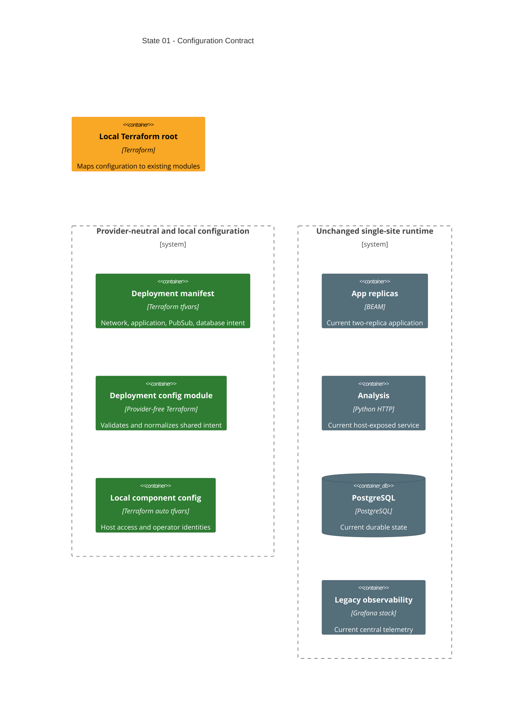

# State 01: Establish the Configuration Contract

Duration: 1-2 hours.

Depends on: current local stack.

## Outcome

Replace the scattered scalar input surface with the approved provider-neutral
deployment manifest and vertical local component objects. Keep the current
single-site runtime and legacy observability behavior. This state changes how
Terraform receives and maps configuration, not the deployed topology.

Use one explicit site with two application replicas in the first manifest. Use
`pg2` until State 03 adds the Redis runtime. Keep the current resource prefix in
this first manifest to avoid an unrelated full rebuild. A later explicit name
change can use the accepted clean-rebuild policy.

## Incremental C4



## Terraform delta

```text
infra/
├── + deployments/thesis-lab.tfvars
├── + modules/common/deployment_config/
│   ├── + variables.tf
│   ├── + locals.tf
│   └── + outputs.tf
└── environments/local/
    ├── + local.auto.tfvars
    ├── ~ variables.tf
    ├── ~ locals.tf
    ├── ~ main.tf
    ├── ~ outputs.tf
    ├── ~ terraform.sh
    └── - .env.example

infra/modules/local/{app,analysis,database,observability}/ = existing runtime contracts
```

## Changes

1. Add the shared `deployment` object and its provider-free validation module.
2. Add one explicit site, primary-site placement, service identity, PG2 policy,
   and database identity to the fixed common manifest.
3. Add no-default local objects for application, database, Grafana, pgAdmin,
   Prometheus, and the secrets directory.
4. Map the new objects to the existing module inputs in root locals. Do not make
   child modules consume the full deployment object.
5. Derive URL outputs from configured host ports.
6. Make `terraform.sh` pass the fixed common manifest with an absolute
   `-var-file` path. Let `local.auto.tfvars` load normally.
7. Remove `.env` loading and the old scalar `TF_VAR_*` examples.
8. Keep secret values in files. Terraform receives only the absolute secrets
   directory and file paths.
9. Keep the legacy analysis host port as a temporary module-owned constant until
   State 04 removes that publication. Do not expose it in the new input schema.
10. Pin the legacy app module to dev mode in a compatibility local. Remove the
    production branch itself in State 05; do not expose mode or image variables.

## Review gate

Check that the shared module has no provider or resources. Check that common
fields have no defaults, local component objects have no defaults, and provider
configuration cannot override common fields. Confirm that the runtime still has
one site and two replicas.

## Working-state gate

- Terraform formatting and validation pass.
- The plan contains only the intended configuration refactor and output fixes.
- Terraform apply completes without requiring `.env`.
- Existing app, analysis, PostgreSQL, pgAdmin, and observability containers are
  healthy.
- Existing project checks pass for any touched application configuration.

## Deferred

Redis, site-network generalization, role separation, and all multi-site resources
remain unchanged until later states.
