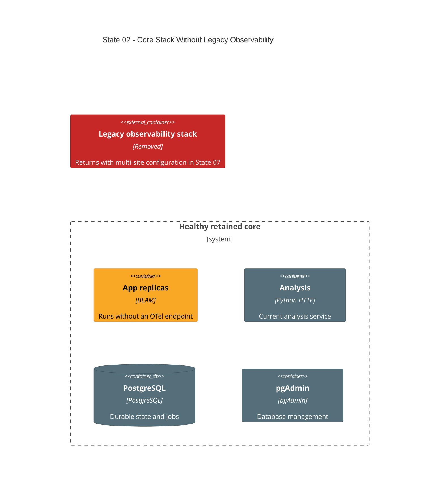

# State 02: Remove Legacy Observability Temporarily

Duration: 1-2 hours.

Depends on: State 01.

## Outcome

Remove the current central observability implementation before changing network
topology. Keep the application, analysis service, PostgreSQL, and pgAdmin
healthy. Observability is intentionally unavailable through State 06 and returns
in States 07-09.

This destructive step avoids carrying the single-network collector, static
two-replica scrape targets, and broad host-port surface through the multi-site
rewrite.

## Incremental C4



## Terraform delta

```text
infra/environments/local/
├── ~ main.tf                         # remove observability module call
├── ~ locals.tf                       # omit OTel endpoint while collector is absent
├── ~ outputs.tf                      # remove unavailable Grafana/Prometheus URLs
└── = application_logs volume         # keep for later Alloy ingestion

infra/modules/local/
└── - observability/                   # remove legacy implementation and static configs

src/
└── = runtime OTel support             # remains dormant without endpoint
```

## Changes

1. Remove the legacy observability module call and its resources.
2. Remove the app's OTel endpoint from Terraform-generated environment values so
   the app does not retry an intentionally absent collector.
3. Remove host outputs for unavailable observability services.
4. Keep the root-owned application log volume. App JSONL files can accumulate
   while Alloy is absent.
5. Keep pgAdmin in the database module and keep its loopback entry point.

## Destructive effects

Terraform destroys the legacy collector, Grafana, Prometheus, Tempo, Loki,
Alloy, exporters, and their managed volumes. Historical local telemetry is not
preserved. This data loss is accepted for the local simulator.

## Review gate

Confirm that no retained resource references the removed module, no output names
an unavailable service, and app startup does not depend on an OTel collector.

## Working-state gate

- Terraform formatting and validation pass.
- The destroy-and-apply plan contains only the declared observability teardown
  and app environment change.
- Terraform apply completes.
- App, analysis, PostgreSQL, and pgAdmin are healthy.
- No Grafana, Prometheus, Tempo, Loki, Alloy, collector, or exporter container
  remains.

## Deferred

Do not add replacement telemetry in this state. State 07 restores the central
stack after multi-site core topology is healthy.
