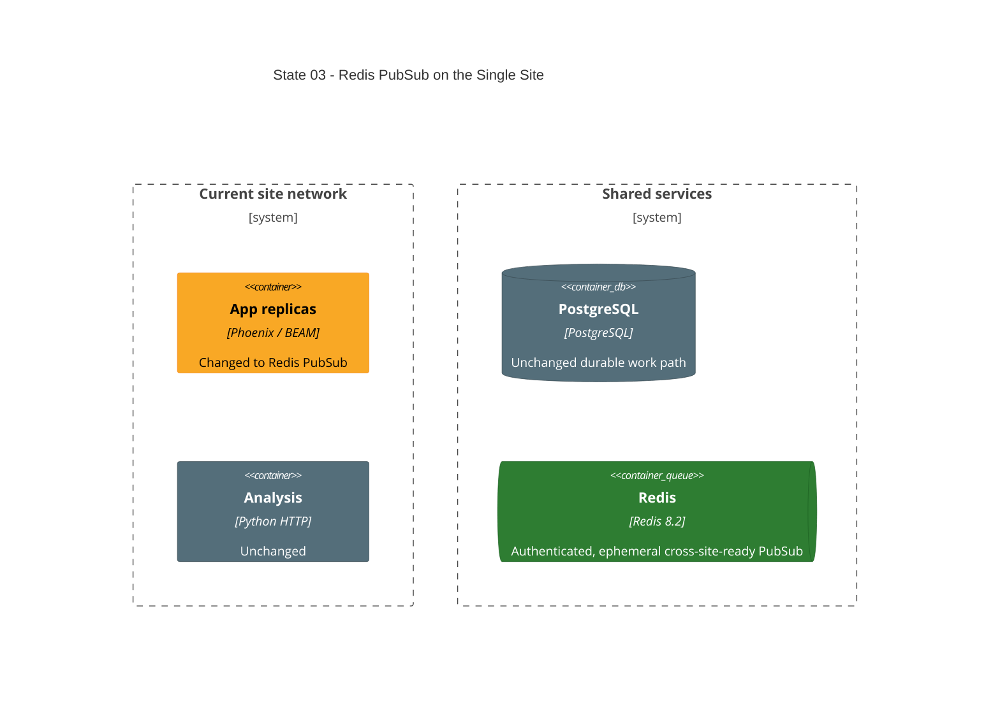

# State 03: Add Redis PubSub

Duration: 1-2 hours.

Depends on: State 02.

## Outcome

Add the final Redis-backed Phoenix PubSub path while the runtime still has one
site. This isolates Redis authentication, health, dependency, and adapter work
from the later application-cluster rewrite.

## Incremental C4



## Terraform delta

```text
infra/deployments/
└── ~ thesis-lab.tfvars                       # pubsub.adapter: pg2 -> redis

infra/environments/local/
├── ~ main.tf                                 # conditional Redis module + dependency
├── ~ locals.tf                               # conditional secret precondition
└── secrets/
    └── + redis-password                      # operator-created, mode 0600

infra/modules/local/redis/
├── + main.tf
├── + variables.tf
├── + locals.tf
├── + outputs.tf
└── + versions.tf

src/
├── ~ mix.exs
├── ~ mix.lock
├── ~ config/runtime.exs
└── ~ lib/network_defense/application.ex
```

## Changes

1. Add the supported Phoenix Redis PubSub adapter dependency.
2. Keep PG2 as a valid manifest choice, but set this deployment to Redis.
3. Add one `redis:8.2` container attached to the current site network with alias
   `redis`.
4. Mount only the password file and generate the mode-0600 Redis config inside
   the container before calling the official entrypoint.
5. Disable RDB and AOF and mount `/data` as tmpfs. Publish no Redis host port.
6. Use an authenticated exact-`PONG` healthcheck and a finite provider wait.
7. Emit Redis app environment and mount its password only in Redis mode.
8. Give each app node a unique PubSub node name.
9. Make app creation depend on healthy Redis without passing a fake Redis output.

## Review gate

Check that Terraform never reads the password value, PG2 mode creates no Redis
resource or secret requirement, Redis joins no observability network, and the
healthcheck rejects authentication errors even when `redis-cli` exits zero.

## Working-state gate

- Terraform formatting and validation pass in Redis and PG2 plans.
- Existing application project checks pass.
- Terraform apply in Redis mode completes.
- Redis, app, analysis, PostgreSQL, and pgAdmin are healthy.
- Redis has no host port or persistent volume.

## Deferred

Redis attaches to multiple site networks only after State 04 generalizes site
network inputs and State 06 creates the second site.
