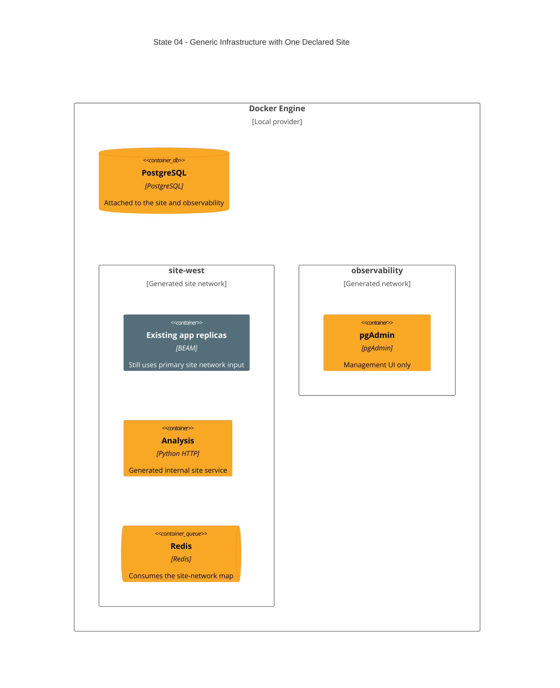

# State 04: Generalize Site, Data, and Analysis Infrastructure

Duration: 1-2 hours.

Depends on: State 03.

## Outcome

Make site networks, PostgreSQL attachments, Redis attachments, and analysis
containers map-driven while the manifest still declares one site. Keep the
existing app module on that site's network. This proves the generic
infrastructure contracts before the app-cluster rewrite.

Analysis becomes internal-only in this state. The root also creates the empty
observability network needed by PostgreSQL and pgAdmin; the central telemetry
stack remains intentionally absent.

## Incremental C4



## Terraform delta

```text
infra/environments/local/
├── ~ main.tf                         # site for_each + observability network
├── ~ locals.tf                       # release database and pgAdmin port compatibility
└── ~ outputs.tf                      # available app, PostgreSQL, and pgAdmin URLs

infra/modules/local/analysis/
├── ~ main.tf                         # for_each sites; no host port
├── ~ variables.tf                    # sites + site_networks
└── ~ outputs.tf                      # response-size contract only

infra/modules/local/database/
├── ~ main.tf                         # PostgreSQL all sites + obs; pgAdmin obs only
├── ~ variables.tf                    # narrow common/local slices
├── ~ locals.tf
└── ~ outputs.tf                      # named internal host, port, image

infra/modules/local/redis/
├── ~ main.tf                         # attach values(site_networks)
└── ~ variables.tf

infra/modules/local/app/
└── ~ root call only                  # receives primary generated network through old interface
```

## Changes

1. Replace the single root Docker network with `docker_network.site` keyed by
   normalized sites. Keep one site in the manifest.
2. Create the root observability network without adding telemetry containers.
3. Attach PostgreSQL to every site network and observability. Keep its loopback
   database host port.
4. Attach pgAdmin only to observability and keep its loopback host port.
5. Pass `database.host_port` and `pgadmin.host_port` into the database module,
   then remove only their State 01 fixed-value compatibility requirement. Keep
   the compatibility requirement for app, Grafana, and Prometheus ports until
   their modules consume those values.
6. Replace pgAdmin's Terraform `file()` password handling with individual
   read-only mounts and runtime pgpass generation. Escape backslashes and colons
   in the password before writing the pgpass entry.
7. Build the analysis image once and create one internal-only analysis container
   per declared site with alias `analysis`.
8. Make the analysis module own and output `max_response_size`. Set the same
   value as `NETWORK_DEFENSE_ANALYSIS_MAX_RESPONSE_BYTES` in each analysis
   container. Do not output an analysis URL.
9. Set the existing app environment's analysis URL to the derived
   `http://analysis:8080`. Map `max_response_size` to
   `ANALYSIS_SERVICE_MAX_ZIP_BYTES`.
10. Make Redis consume all declared site networks. With one site, behavior stays
   unchanged.
11. Feed the generated primary-site network into the existing app module as a
   compatibility step. Do not add a second site yet.

## Destructive effects

The single network, analysis container, PostgreSQL, pgAdmin, and Redis can be
replaced because their network attachments and resource addresses change.
Persistent PostgreSQL and pgAdmin volumes remain unless the Terraform plan shows
an unapproved volume destroy.

## Review gate

Check that analysis has no host port or URL output, PostgreSQL is the only data
container on both generated networks, Redis joins site networks only, and
pgAdmin reads no secret through Terraform. Confirm that analysis and the app
use the same response-size value, pgpass escapes its password, and the app
still uses exactly one site network.

## Working-state gate

- Terraform formatting and validation pass.
- Terraform apply completes from State 03.
- App replicas, internal analysis, Redis, PostgreSQL, and pgAdmin are healthy.
- The only host entries are app, PostgreSQL, and pgAdmin.
- The observability network exists without telemetry containers.

## Deferred

The app module remains count-based and single-site until State 05. The manifest
remains one-site until State 06.
