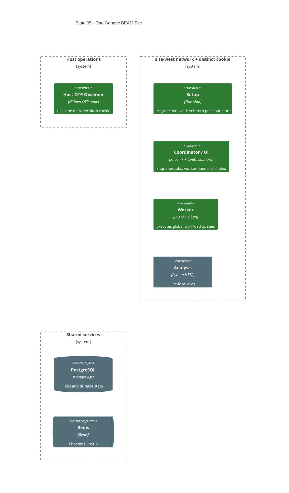

# State 05: Generalize the App Cluster on One Site

Duration: 1-2 hours.

Depends on: State 04.

## Outcome

Replace the count-based app module with the final map-driven node model while
the manifest still declares one site and two nodes. Establish coordinator and
worker roles, per-site cookies, one-shot setup, narrow secret mounts, stable
identity, and Host Observer outputs before adding another site.

## Incremental C4



## Terraform delta

```text
infra/environments/local/
├── ~ main.tf                                  # pass sites, nodes, roles, named outputs
├── ~ locals.tf                                # per-file secret preconditions
└── ~ outputs.tf                               # site coordinator node names

infra/modules/local/app/
├── ! main.tf                                  # count resources -> for_each node map
├── ! locals.tf                                # node roles, env, ports, mounts, identities
├── ~ variables.tf                             # narrow typed slices; no duplicate defaults
└── ~ outputs.tf                               # network_data-derived node names/IPs

infra/environments/local/secrets/
└── + erlang-cookies/site-west/.erlang.cookie  # operator-created, untracked, mode 0600

src/
├── ~ config/runtime.exs                       # ROLE and coordinator queues:false
└── ~ lib/network_defense/application.ex       # PubSub options + Oban child config
```

## Changes

1. Consume the normalized node map from `deployment_config`; child modules do
   not redeclare the full deployment schema.
2. Remove the local production-image and migrate branches. Build one dev image.
3. Create one setup container on the primary site. Use `attach=true`,
   `must_run=false`, and an exit-code postcondition. Give it only database env
   and required secret mounts.
4. Create app nodes with `for_each`. Single-home each node on its site network
   with aliases `app`, replica alias, and service name.
5. Make primary-site replica 0 the coordinator/UI. Keep Oban for enqueueing but
   set `queues: false`. Make every other node a worker.
6. Preserve the configured queue-name list before the coordinator override.
7. Mount each required secret file separately. Mount only the selected site's
   cookie and the conditional Redis password.
8. Derive site, replica, role, provider, region, instance, service instance,
   PubSub node name, and site-qualified log path.
9. Publish all four configured app host ports only from the coordinator.
10. Output each site's coordinator long node name from runtime network data.
11. Keep plain Erlang distribution on the private bridge. Publish no EPMD or
    distribution ports.

## Destructive effects

Terraform replaces the existing count-indexed app and setup resources with
map-keyed resources. This is an accepted clean rebuild. PostgreSQL data remains
the durable state.

## Review gate

Check every node caller, role branch, secret mount, queue configuration, and
network attachment. Confirm the setup container cannot silently succeed after a
non-zero exit and workers publish no host ports.

## Working-state gate

- Terraform formatting and validation pass.
- Existing application project checks pass.
- Terraform apply completes from State 04.
- Setup exits zero; coordinator, worker, analysis, Redis, PostgreSQL, and
  pgAdmin are healthy.
- Terraform outputs one coordinator node name for the declared site.
- No distribution, Redis, or analysis host port exists.

## Deferred

The second site is a manifest-only expansion after this generic one-site model
is healthy. Automatic recovery of already executing jobs remains out of scope.
