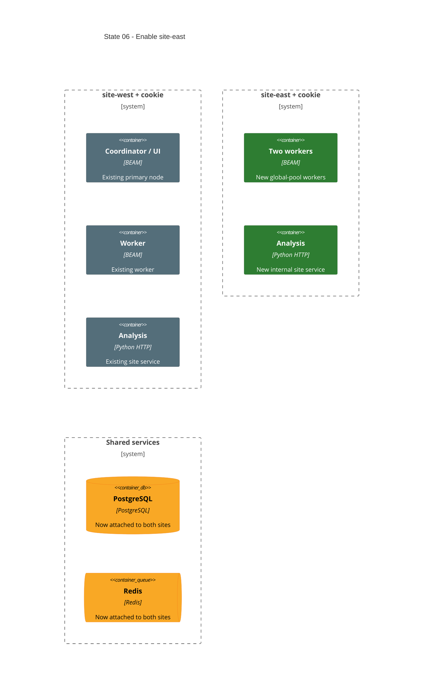

# State 06: Enable the Second Site

Duration: about 1 hour, including apply and health review.

Depends on: State 05.

## Outcome

Expand the approved manifest from one site to two sites with two app nodes per
site. Exercise the generic modules without another structural refactor. The
primary site keeps the coordinator and one worker; the second site adds two
workers. Each site gets its own BEAM mesh, cookie, analysis service, and network.

## Incremental C4



## Terraform delta

```text
infra/deployments/
└── ~ thesis-lab.tfvars
    ├── + network.sites.site-east
    └── + application.replicas.site-east

infra/environments/local/secrets/
└── + erlang-cookies/site-east/.erlang.cookie  # operator-created, untracked, mode 0600

Computed resource delta:
├── + docker_network.site["site-east"]
├── + app nodes for site-east
├── + analysis container for site-east
├── ~ PostgreSQL network attachments
└── ~ Redis network attachments
```

## Changes

1. Add the second required-label site to `deployment.network.sites`.
2. Add the matching replica entry to `deployment.application.replicas`.
3. Add the second site cookie file with directory mode `0700` and file mode
   `0600`.
4. Let normalized maps create the second network, app nodes, and analysis
   service. Do not add site-specific Terraform branches.
5. Attach shared PostgreSQL and Redis to the new site network.
6. Keep the primary site, coordinator placement, host ports, and shared service
   identities unchanged.

## Destructive effects

Docker can replace PostgreSQL or Redis containers when it changes network
attachments. Their approved persistent/ephemeral storage policies remain:
PostgreSQL keeps its named volume; Redis remains ephemeral.

## Review gate

Check exact key equality between sites and replica maps, unique node/resource
names, one-network app attachments, separate cookie mounts, and the absence of
cross-site BEAM names or aliases.

## Working-state gate

- Terraform formatting and validation pass.
- Terraform plan shows only the second-site expansion and required shared
  network-attachment changes.
- Terraform apply completes.
- Four app nodes, two analysis services, Redis, PostgreSQL, and pgAdmin are
  healthy.
- Only primary-site replica 0 publishes app ports.
- Terraform outputs coordinator node names for both sites.

## Deferred

Central observability is still intentionally absent. State 07 restores it for
the now-stable two-site core.
