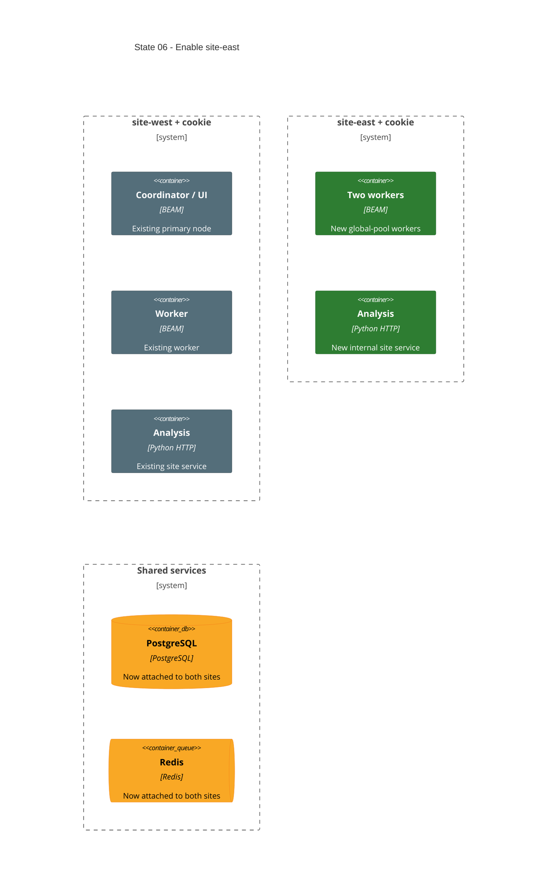

# State 06: Enable the Second Site

Duration: about 1 hour, including apply and health review.

Depends on: State 05.

## Outcome

Expand the approved manifest from one site to two sites with two app nodes per
site. Exercise the generic modules without another structural refactor. The
primary site keeps the coordinator and one worker; the second site adds two
workers. Each site gets its own BEAM mesh, cookie, analysis service, and network.

## Incremental C4



## Terraform delta

```text
infra/deployments/
└── ~ thesis-lab.tfvars
    ├── + network.sites.site-east
    └── + application.replicas.site-east

infra/environments/local/secrets/
└── + erlang-cookies/site-east/.erlang.cookie  # operator-created, untracked, mode 0600

Computed resource delta:
├── + docker_network.site["site-east"]
├── + app nodes for site-east
├── + analysis container for site-east
├── ~ PostgreSQL network attachments
└── ~ Redis network attachments
```

## Changes

1. Add the second required-label site to `deployment.network.sites`.
2. Add the matching replica entry to `deployment.application.replicas`.
3. Add the second site cookie file with directory mode `0700` and file mode
   `0600`.
4. Let normalized maps create the second network, app nodes, and analysis
   service. Do not add site-specific Terraform branches.
5. Attach shared PostgreSQL and Redis to the new site network.
6. Keep the primary site, coordinator placement, host ports, and shared service
   identities unchanged.

## Execution Plan

1. Check that State 05 is healthy. The generic app, analysis, database, and
   Redis modules already iterate site or node maps. This state must not change
   those modules. See `05-generic-app-cluster.md:67-88`.
2. Create `secrets/erlang-cookies/site-east/` with mode `0700`. Create its
   `.erlang.cookie` with mode `0600`. Generate a new value that differs from
   the site-west cookie. Keep the file untracked. Terraform checks only its
   presence. See `../erlang-multisite-design-draft.md:941-946`.
3. Add `site-east` to `deployment.network.sites` and add `site-east = 2` to
   `deployment.application.replicas`. Keep the site keys equal. Keep the
   site-west entry and `primary_site` unchanged. See
   `../erlang-multisite-design-draft.md:361-367`.
4. Run `terraform.sh fmt`, `terraform.sh validate`, and `terraform.sh plan`.
   The plan must add the east network, two east app nodes, and one east
   analysis container. It may update PostgreSQL and Redis network attachments.
5. Apply the approved plan. Check that the setup container still has exit code
   zero, each long-running core container is healthy, only site-west replica 0
   has app host ports, and `site_primary_node_names` has both site keys.

## Consistency And Gaps

- The State 06 outcome is consistent with State 05. State 05 makes modules
  map-driven, so the implementation change is limited to the manifest and the
  new operator-managed cookie. See `05-generic-app-cluster.md:67-87`.
- Use `site_primary_node_names`, not "coordinator node names", for the output
  gate. Site-east replica 0 is a worker. Only site-west replica 0 is the
  coordinator. See `../erlang-multisite-design-draft.md:803-815` and
  `../erlang-multisite-design-draft.md:1012-1052`.
- The state did not require a distinct east cookie explicitly. A separate
  cookie is mandatory for separate BEAM meshes. Terraform cannot compare
  cookie contents without reading a secret, so the operator must generate it
  separately. See `../erlang-cluster-plan-context.md:123-126`.
- The state does not specify the `provider`, `region`, and `instance` labels
  for site-east. The current site-west labels are placeholders. These labels
  do not affect local placement, but they must be nonempty. Keep the existing
  west labels unchanged. Record selected non-placeholder labels before a
  provider-identity simulation needs them. See
  `../erlang-multisite-design-draft.md:361-367`.
- State 07 depends on this state and restores observability only after the
  two-site core is healthy. Do not add observability resources, collector
  aliases, telemetry endpoints, or host ports here. See
  `07-restore-central-observability.md:7-12`.
- The planning context says to modify planning files only. The current user
  request explicitly supersedes that limit after the requested delay. See
  `../erlang-cluster-plan-context.md:1-5`.

## Destructive effects

Docker can replace PostgreSQL or Redis containers when it changes network
attachments. Their approved persistent/ephemeral storage policies remain:
PostgreSQL keeps its named volume; Redis remains ephemeral.

## Review gate

Check exact key equality between sites and replica maps, unique node/resource
names, one-network app attachments, separate cookie mounts, and the absence of
cross-site BEAM names or aliases. Check the east cookie file is separate from
the west cookie file.

## Working-state gate

- Terraform formatting and validation pass.
- Terraform plan shows only the second-site expansion and required shared
  network-attachment changes.
- Terraform apply completes.
- Four app nodes, two analysis services, Redis, PostgreSQL, and pgAdmin are
  healthy.
- Only primary-site replica 0 publishes app ports.
- Terraform outputs `site_primary_node_names` for both sites. The east value
  identifies a worker, not a coordinator.

## Deferred

Central observability is still intentionally absent. State 07 restores it for
the now-stable two-site core.
