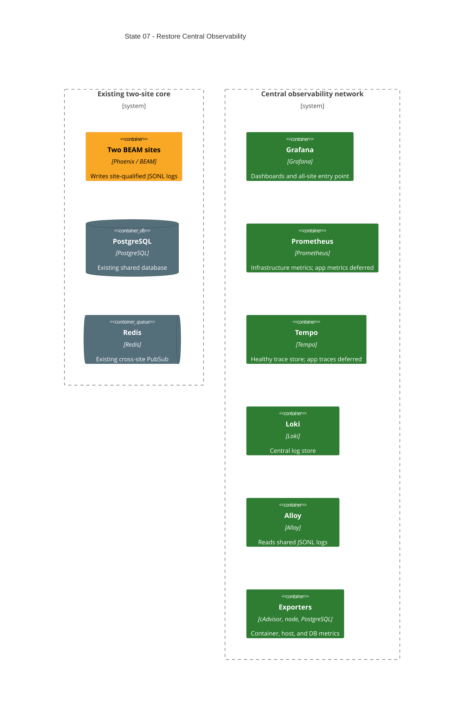

# State 07: Restore Central Observability

Duration: 1-2 hours.

Depends on: State 06.

## Outcome

Reintroduce the central observability and management services on the dedicated
observability network. Restore infrastructure metrics and the JSONL log path.
Do not add site collectors or app traces/metrics yet. Tempo and the app-metric
portion of Prometheus can be healthy but idle until State 08.

## Incremental C4



## Terraform delta

```text
infra/environments/local/
├── ~ main.tf                              # restore observability module call
└── ~ outputs.tf                           # restore Grafana and Prometheus URLs

infra/modules/local/observability/
├── + main.tf                              # central services only
├── + variables.tf
├── + locals.tf
├── + versions.tf
└── + config/
    ├── + alloy-config.alloy               # site-qualified JSONL regex
    ├── + prometheus.yaml.tftpl            # infra jobs; no site collectors yet
    ├── + tempo.yaml
    ├── + loki-config.yaml
    ├── + postgres-exporter.yaml
    ├── + postgres-exporter-init.sh
    └── + grafana-provisioning/
```

## Changes

1. Recreate Grafana, Prometheus, Tempo, Loki, Alloy, cAdvisor, node-exporter,
   postgres-exporter, and its init container on observability.
2. Keep pgAdmin in the database module. Do not duplicate it.
3. Publish only Grafana and Prometheus loopback ports from this module.
4. Keep Loki, Tempo, Alloy, and exporters internal.
5. Mount the root application log volume into Alloy read-only. Parse
   `app.<site>.<replica>.jsonl` into site and replica labels and push to Loki.
6. Provision Grafana datasources for available central services.
7. Configure Prometheus for itself and infrastructure exporters only. Do not add
   app or collector targets before collectors exist.
8. Keep Tempo healthy with no app trace producer.
9. Read exporter secrets from mounted files at runtime; do not place values in
   Terraform state.

## Destructive effects

This state creates new observability volumes after the State 02 teardown.
Historical telemetry remains lost. The new host-port policy intentionally does
not restore direct Loki, Tempo, Alloy, or collector ports.

## Review gate

Check network membership, host ports, volume ownership, secret paths, and
Prometheus targets. Reject any app OTel endpoint or site-collector target in
this state.

## Working-state gate

- Terraform formatting and validation pass.
- Terraform apply completes from State 06.
- All two-site core containers remain healthy.
- Grafana, Prometheus, Tempo, Loki, Alloy, cAdvisor, node-exporter,
  postgres-exporter, and its init step are healthy or exit zero as designed.
- Available outputs list app, PostgreSQL, Grafana, pgAdmin, and Prometheus only.

## Deferred

State 08 adds per-site collectors, app trace export, and site app metrics.
