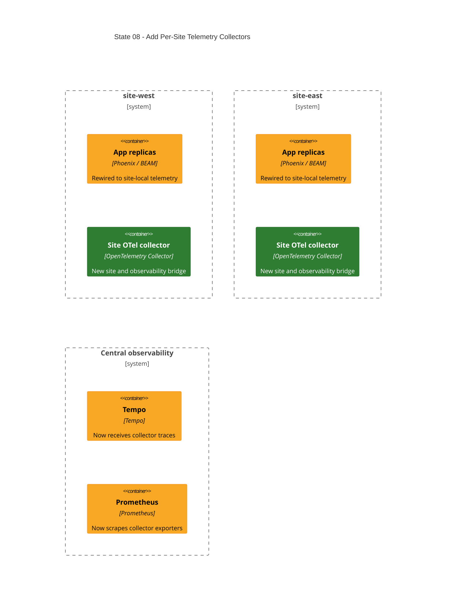

# State 08: Add Per-Site Telemetry Collectors

Duration: 1-2 hours.

Depends on: State 07.

## Outcome

Add one collector per site and complete trace and application-metric paths.
Collectors bridge exactly one site network and observability. They expose no
host port. Central Prometheus scrapes collector exporters instead of app
containers directly.

## Incremental C4



The new path is: each app exports traces to its site collector; each collector
scrapes only its site's app metrics and exports traces to Tempo; central
Prometheus scrapes each collector exporter through observability.

## Terraform delta

```text
infra/environments/local/
└── ~ main.tf                                   # pass normalized sites/nodes

infra/modules/local/app/
└── ~ locals.tf                                 # site-local OTel endpoint; retain node attributes

infra/modules/local/observability/
├── ~ main.tf                                   # collector for_each sites
├── ~ locals.tf                                 # rendered configs and aliases
├── ~ variables.tf                              # narrow site/node inputs
└── config/
    ├── + site-collector.yaml.tftpl
    ├── ~ prometheus.yaml.tftpl                 # collector targets + honor_labels
    └── - otel-collector-config.yaml             # legacy central config stays absent
```

## Changes

1. Create one collector per normalized site.
2. Attach each collector to exactly its site network and observability.
3. Give it site alias `otel-collector` and observability alias
   `otel-collector-<site>`.
4. Render explicit app-replica scrape targets from the normalized node map. Do
   not use round-robin alias `app` for metrics.
5. Add provider, region, instance, site, and replica labels to receiver static
   configs.
6. Export traces to Tempo and app metrics through the collector Prometheus
   exporter.
7. Configure central Prometheus with one `otel-collector-<site>:8889` target
   per site in the `otel-collectors` scrape job and `honor_labels: true`, so
   the receiver's `site-apps` job label survives.
8. Restore `OTEL_EXPORTER_OTLP_ENDPOINT` to every app node and retain each
   node's site-qualified OTel resource attributes.
9. Include the network-only `health_check` extension on port 13133. Use
   `/otelcol-contrib validate` as the collector Docker healthcheck. State
   clearly that it proves config validity while PID 1 runs, not pipeline
   readiness or backend reachability; it does not call the extension.
10. Publish no collector host ports and restore none of the removed central
    collector ports.

## Review gate

Check generated aliases and target lists for every node. Check that labels come
from Prometheus receiver static configs; the receiver job is `site-apps`; the
central scrape job is `otel-collectors` with `honor_labels: true`; and no
collector can attach to a second site network.

## Working-state gate

- Terraform formatting and validation pass.
- Terraform apply completes from State 07.
- Every app, analysis, collector, shared-data, and central-observability
  container is healthy.
- Collector config validation passes for both sites.
- No collector host port exists.
- Runtime acceptance remains health-only; do not claim backend delivery from
  the collector health result.

## Deferred

State 09 adds the focused BEAM and Oban safeguards and dashboard panels. The
general telemetry paths are complete at this state.
