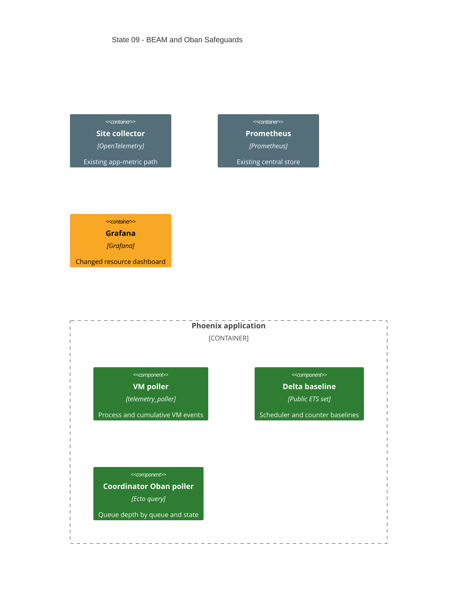

# State 09: Add BEAM and Oban Safeguard Metrics

Duration: 1-2 hours.

Depends on: State 08.

## Outcome

Add the approved focused metrics without a new dependency or process. Extend
the existing telemetry supervisor, collector pipeline, Prometheus labels, and
Grafana resource dashboard. Preserve the existing OS CPU metric and distinguish
it from scheduler utilization.

## Incremental C4



## Terraform delta

```text
infra/modules/local/observability/config/
├── ~ site-collector.yaml.tftpl
└── ~ grafana-dashboards/resource-utilization.json

src/
├── ~ config/runtime.exs                         # preserve configured Oban queues
└── ~ lib/network_defense_web/telemetry.ex       # ETS deltas + coordinator query

Dependencies:
└── = mix.exs / mix.lock                         # no PromEx or new metrics dependency
```

## Changes

1. Use the existing `NetworkDefenseWeb.Telemetry` supervisor as owner of one
   named public ETS set.
2. Emit process count from `[:vm, :system_counts]`.
3. Enable scheduler wall time and emit regular-scheduler utilization from
   interval deltas. The first sample stores a baseline.
4. Emit GC collections, reclaimed words, reductions, and context switches as
   non-negative cumulative-counter deltas. Treat resets as a new baseline.
5. Emit site-cluster visible-node count as `1 + length(Node.list())`; hidden
   Observer nodes remain excluded.
6. Poll Oban only on the coordinator every configured interval. Emit every
   configured queue by active state, including zero values.
7. Contain repository absence, error tuples, exceptions, and exits so the
   telemetry poller does not remove the measurement.
8. Keep workers free from Oban metric queries.
9. Add Grafana site and replica variables and the approved BEAM/Oban panels.
10. Use `rate` for cumulative counters, `min by(site)` for cluster nodes, and
    `max by(queue,state,scope)` for queue depth.
11. Keep `vm.cpu.per_core` labeled as OS CPU.

## Review gate

Review every metric source, reset rule, tag, Prometheus type, query state, and
Grafana aggregation. Check that cardinality is bounded by sites, replicas,
schedulers, queues, and the fixed state list.

## Working-state gate

- Existing application project checks, including `mix precommit`, pass.
- Terraform formatting and validation pass for changed mounted configuration.
- Terraform apply completes from State 08.
- All runtime containers remain healthy.
- No new dependency, process, host port, or worker-side Oban query exists.
- Per the accepted scope, add no metric-specific test suite or smoke script.

## Deferred

Distribution traffic metrics, Redis-specific metrics, and additional cluster
tools remain deferred until a measured need exists.
